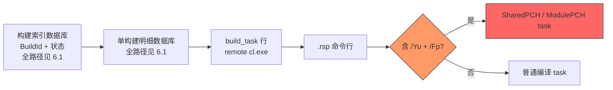
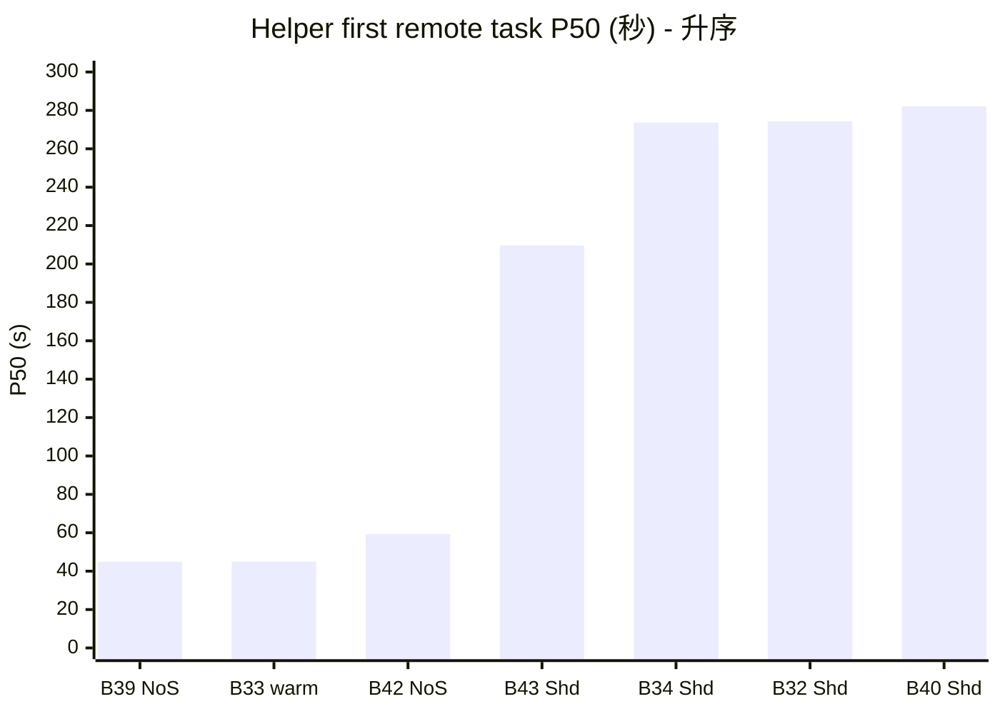
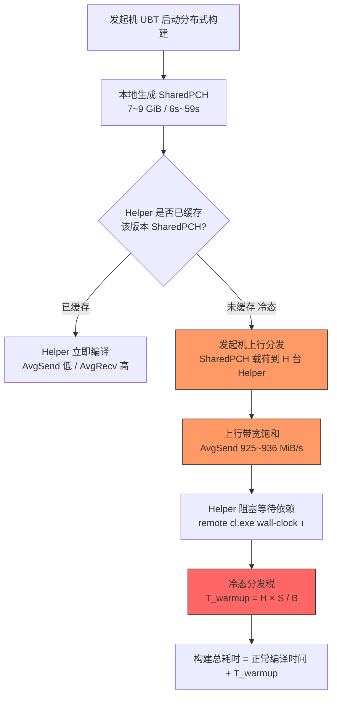
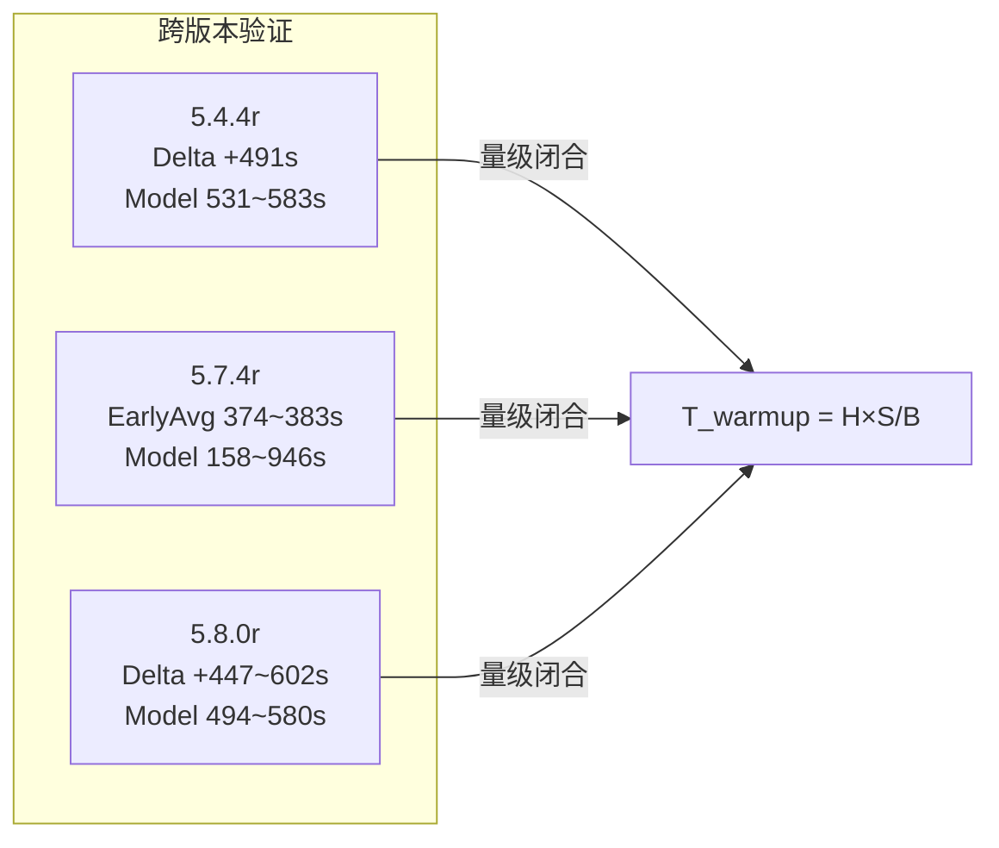

# SharedPCH 冷态分发税量级闭合证明

> 文档定位：本文合并 `D:\UE\5.7.4r`、`D:\UE\5.4.4r`、`D:\UE\5.8.0r` 三个版本的 SharedPCH、NoSharedPCH 与热态对照实测数据，验证 SharedPCH 对 Unreal Engine 分布式编译速度的影响是否符合冷态分发税模型 `T_warmup ~= H * S / B`。
>
> 证明范围：本文证明的是冷态 SharedPCH 分发税的量级闭合，不是精确区间覆盖预测，也不是 per-file 字节级归因证明。

---

## 一、阅读约定

| 标签 | 含义 | 可信级别 |
| --- | --- | --- |
| 【事实证据】 | 来自 Incredibuild BuildDB、BuildHistoryDB、磁盘 `.pch` 文件的可复现测量值 | 高 |
| 【数学模型】 | 基于事实数据构建的可代入、可验算量级公式 | 中高 |
| 【逻辑分析推理(无事实依据)】 | 用模型把事实连成因果的推断，无 per-file 直接测量佐证 | 中 |
| 【不可证明边界】 | 受限于现有 Incredibuild DB 字段而无法证明的命题 | 明确不可证明 |

基准术语：

| 术语 | 含义 |
| --- | --- |
| Baseline | 当前版本可用的对照构建；可能是 NoSharedPCH，也可能是热态构建 |
| NoSharedPCH | 禁用 SharedPCH 的构建；`D:\UE\5.4.4r` Build39 与 `D:\UE\5.8.0r` Build42 属于此类 |
| Warm | 热态或缓存已预热对照；`D:\UE\5.7.4r` Build33 属于此类，不等同于 NoSharedPCH |

---

## 二、核心模型 【数学模型】

```text
T_warmup ~= H * S / B
```

- `T_warmup`：冷态 helper 完成依赖预热前引入的分发税耗时。
- `H`：参与冷启动并接收依赖载荷的 helper 数量。
- `S`：每台冷 helper 首次可用前需要收到的有效 PCH / 依赖载荷，单位 GiB。
- `B`：发起机有效上行带宽，单位 GiB/s。

判断标准：

```text
如果构建满足:
  1. 发起机 SendRate 长时间接近上限
  2. ReceiveRate 显著偏低
  3. remote cl.exe wall-clock 明显变长
  4. H*S/B 与实测耗时差值在同一量级

则该构建符合冷态 PCH / SharedPCH 分发税模型。
```

---

## 三、`D:\UE\5.7.4r` 证据摘要 【事实证据】

数据来源：`D:\UE\Docs\Build\5.7.4r\定性分析SharedPCH对UE编译速度的影响.md`。

### 3.1 全程聚合

| 指标 | BuildId 32 | BuildId 33 | BuildId 34 |
| --- | ---:| ---:| ---:|
| 总发送 | 1065.56 GiB | 36.61 GiB | 972.75 GiB |
| 总接收 | 55.03 GiB | 142.34 GiB | 56.72 GiB |
| 平均 SendRate | 823.8 MiB/s | 94.7 MiB/s | 790.3 MiB/s |
| 平均 RecvRate | 40.6 MiB/s | 341.8 MiB/s | 43.3 MiB/s |
| 平均 ActiveMachines | 64.7 | 45.5 | 64.3 |

### 3.2 early30 窗口

| 指标 | BuildId 32 | BuildId 33 | BuildId 34 |
| --- | ---:| ---:| ---:|
| Duration | 406.0s | 129.1s | 384.0s |
| Send | 365.08 GiB | 20.61 GiB | 345.76 GiB |
| Recv | 4.07 GiB | 41.27 GiB | 4.36 GiB |
| AvgSend | 935.0 MiB/s | 173.5 MiB/s | 931.6 MiB/s |
| AvgRecv | 10.4 MiB/s | 338.0 MiB/s | 11.8 MiB/s |
| AvgActiveMachines | 71.4 | 55.1 | 71.7 |

### 3.3 remote `cl.exe`

| 构建 | early avg | early max | late avg |
| --- | ---:| ---:| ---:|
| BuildId 32 | 374.0s | 1010.9s | 44.3s |
| BuildId 33 | 42.0s | 287.7s | 24.3s |
| BuildId 34 | 383.3s | 988.3s | 33.8s |

### 3.4 PCH 体积与模型代入

来源目录：`D:\UE\5.7.4r\Engine\Intermediate\Build\Win64\x64\UnrealEditor\Development`。

| 载荷情景 | S | H | B | 估算 `T_warmup` |
| --- | ---:| ---:| ---:| ---:|
| 单个最大 SharedPCH | 2.25 GiB | 64 | 0.913 GiB/s | 157.7s |
| 全部 SharedPCH | 8.73 GiB | 64 | 0.913 GiB/s | 611.9s |
| SharedPCH + ModulePCH | 13.49 GiB | 64 | 0.913 GiB/s | 945.6s |

量级闭合：模型估算 `157.7s ~ 945.6s` 与实测 early avg `374.0s / 383.3s`、early max `1010.9s / 988.3s` 同一量级。

---

## 四、`D:\UE\5.4.4r` BuildId 39 / 40 证据 【事实证据】

数据来源：

- `C:\ProgramData\Incredibuild\BuildData\BuildHistoryDB.db`
- `C:\ProgramData\Incredibuild\BuildData\BuildDB_39.db`
- `C:\ProgramData\Incredibuild\BuildData\BuildDB_40.db`
- `D:\UE\5.4.4r\Engine\Intermediate\Build`

### 4.1 构建身份

| 指标 | BuildId 39 | BuildId 40 |
| --- | ---:| ---:|
| SharedPCH 状态 | NoSharedPCH | SharedPCH enabled |
| status | 1 | 3 |
| ReturnCode | 0 | 1 |
| BuildTime | 603.588s | 1093.900s |

### 4.2 全程聚合

| 指标 | BuildId 39 | BuildId 40 | 变化 |
| --- | ---:| ---:| ---:|
| stats span | 581.475s | 1072.915s | +491.440s |
| 总发送 | 241.445 GiB | 884.227 GiB | +642.782 GiB |
| 总接收 | 101.180 GiB | 41.296 GiB | -59.884 GiB |
| AvgSend | 433.8 MiB/s | 846.8 MiB/s | +413.0 MiB/s |
| AvgRecv | 174.0 MiB/s | 39.6 MiB/s | -134.4 MiB/s |
| AvgActiveMachines | 44.7 | 65.0 | +20.3 |
| AvgActiveSlots | 248.3 | 312.3 | +64.0 |

### 4.3 早期窗口

| Window | Build | Span | Send | Recv | AvgSend | AvgRecv | AvgActiveMachines |
| --- | --- | ---:| ---:| ---:| ---:| ---:| ---:|
| EARLY30 | Build39 | 30.996s | 21.421 GiB | 0.750 GiB | 776.2 MiB/s | 28.4 MiB/s | 48.1 |
| EARLY30 | Build40 | 29.039s | 21.940 GiB | 0.273 GiB | 899.7 MiB/s | 11.1 MiB/s | 31.2 |
| EARLY400S | Build39 | 399.093s | 235.588 GiB | 68.477 GiB | 622.2 MiB/s | 168.3 MiB/s | 53.1 |
| EARLY400S | Build40 | 398.996s | 361.004 GiB | 5.032 GiB | 935.9 MiB/s | 13.0 MiB/s | 47.4 |

### 4.4 high-send 持续时间

| Window | Build | Span | Send | Recv | AvgSend | AvgRecv | AvgActiveMachines |
| --- | --- | ---:| ---:| ---:| ---:| ---:| ---:|
| HIGHSEND_800MIBS | Build39 | 349.021s | 202.465 GiB | 8.416 GiB | 933.8 MiB/s | 38.4 MiB/s | 52.6 |
| HIGHSEND_800MIBS | Build40 | 957.973s | 876.693 GiB | 36.310 GiB | 936.1 MiB/s | 38.8 MiB/s | 71.4 |

### 4.5 remote `cl.exe`

| Window | Build | Rows | AvgSec | MaxSec | >200s | P50Sec |
| --- | --- | ---:| ---:| ---:| ---:| ---:|
| ALL | Build39 | 2531 | 50.397s | 493.909s | 126 | 26.192s |
| ALL | Build40 | 1344 | 225.864s | 1069.343s | 677 | 203.493s |
| START_EARLY400S | Build39 | 2277 | 53.904s | 493.909s | 126 | 28.555s |
| START_EARLY400S | Build40 | 590 | 257.161s | 1069.343s | 335 | 280.695s |
| END_LATE120S | Build39 | 51 | 140.576s | 493.909s | 6 | 107.089s |
| END_LATE120S | Build40 | 275 | 366.674s | 1069.343s | 258 | 350.595s |

### 4.6 PCH 体积

来源目录：`D:\UE\5.4.4r\Engine\Intermediate\Build`。

| 类型 | 数量 | 总体积 | 最大单文件 |
| --- | ---:| ---:| ---:|
| SharedPCH | 7 | 7.468 GiB | 1.948 GiB |
| ModulePCH | 4 | 4.078 GiB | 1.709 GiB |
| AllPCH | 11 | 11.546 GiB | 1.948 GiB |

### 4.7 PCH action 归属

SharedPCH / ModulePCH action 都在本地 `GIH-D-33028` 完成，耗时 `3.207s ~ 54.350s`。`BuildId=39` 中 SharedPCH action 数 = 0。

### 4.8 模型代入

| 载荷情景 | S | H | B | 估算 `T_warmup` |
| --- | ---:| ---:| ---:| ---:|
| SharedPCH only / H=65.0 | 7.468 GiB | 65.0 | 0.914 GiB/s | 531.1s |
| SharedPCH only / H=71.4 | 7.468 GiB | 71.4 | 0.914 GiB/s | 583.4s |

实测差值：Build40 - Build39 = **490.3s ~ 491.4s**。模型 531.1s~583.4s 同量级且接近。

---

## 五、`D:\UE\5.8.0r` Build42 / Build43 证据 【事实证据】

数据来源：

- `C:\ProgramData\IncrediBuild\BuildData\BuildHistoryDB.db`
- `C:\ProgramData\IncrediBuild\BuildData\BuildDB_42.db`
- `C:\ProgramData\IncrediBuild\BuildData\BuildDB_43.db`
- `D:\UE\5.8.0r\Engine\Intermediate\Build\Win64\x64\UnrealEditor\Development`

### 5.1 构建身份

| 指标 | Build42 | Build43 |
| --- | ---:| ---:|
| SharedPCH 状态 | NoSharedPCH | SharedPCH enabled |
| status | 1 | 3 |
| ReturnCode | 0 | 3 |
| BuildTime | 757.851s | 1204.417s |
| SysErrorsNumber | 0 | 1 |
| SysWarningsNumber | 1 | 7 |
| SharedPCH task rows | 0 | 7 |
| ModulePCH task rows | 5 | 5 |
| total task rows | 8572 | 8593 |
| exit0 rows | 8566 | 8563 |
| null/status3 rows | 6 | 30 |

说明：Build43 最终因 XGE/IB access violation 失败 (status=3, ReturnCode=3)。可用于冷态分发税形态判断；BuildTime 只记录该失败运行的观测时长，不作为成功构建总耗时证明。

### 5.2 全程聚合

| 指标 | Build42 | Build43 | Delta |
| --- | ---:| ---:| ---:|
| Stats Span | 727.302s | 1174.187s | +446.885s |
| 总发送 | 282.676 GiB | 906.175 GiB | +623.499 GiB |
| 总接收 | 165.247 GiB | 73.891 GiB | -91.356 GiB |
| AvgSend | 398.0 MiB/s | 790.3 MiB/s | +392.3 MiB/s |
| AvgRecv | 232.7 MiB/s | 64.4 MiB/s | -168.3 MiB/s |
| AvgActiveMachines | 60.3 | 48.3 | -12.0 |
| AvgActiveSlots | 247.4 | 315.6 | +68.2 |

### 5.3 早期窗口

| Window | Build | Span | Send | Recv | AvgSend | AvgRecv | AvgActiveMachines |
| --- | --- | ---:| ---:| ---:| ---:| ---:| ---:|
| EARLY30 | Build42 | 30.761s | 14.533 GiB | 1.084 GiB | 483.8 MiB/s | 36.1 MiB/s | 69.8 |
| EARLY30 | Build43 | 29.001s | 21.292 GiB | 0.247 GiB | 751.8 MiB/s | 8.7 MiB/s | 32.8 |
| EARLY400S | Build42 | 399.854s | 257.826 GiB | 78.858 GiB | 660.3 MiB/s | 201.9 MiB/s | 83.2 |
| EARLY400S | Build43 | 398.981s | 360.578 GiB | 3.547 GiB | 925.4 MiB/s | 9.1 MiB/s | 49.3 |

### 5.4 高上行持续时间

| Window | Build | Span | Send | Recv | AvgSend | AvgRecv | AvgActiveMachines |
| --- | --- | ---:| ---:| ---:| ---:| ---:| ---:|
| HIGHSEND_800MIBS | Build42 | 410.895s | 231.632 GiB | 26.216 GiB | 577.3 MiB/s | 65.3 MiB/s | 87.3 |
| HIGHSEND_800MIBS | Build43 | 1013.086s | 864.875 GiB | 46.537 GiB | 874.2 MiB/s | 47.0 MiB/s | 54.7 |

### 5.5 remote `cl.exe`

| Window | Build | Rows | AvgSec | MaxSec | >200s | P50Sec |
| --- | --- | ---:| ---:| ---:| ---:| ---:|
| ALL | Build42 | 3428 | 44.728s | 431.345s | 220 | 23.096s |
| ALL | Build43 | 3281 | 101.886s | 720.406s | 531 | 40.448s |
| START_EARLY400S | Build42 | 1699 | 69.818s | 431.345s | 220 | 36.316s |
| START_EARLY400S | Build43 | 665 | 302.226s | 720.406s | 444 | 306.157s |
| END_LATE120S | Build42 | 53 | 40.967s | 95.800s | 0 | 35.706s |
| END_LATE120S | Build43 | 22 | 131.071s | 494.834s | 2 | 98.593s |

### 5.6 PCH 体积

来源目录：`D:\UE\5.8.0r\Engine\Intermediate\Build\Win64\x64\UnrealEditor\Development`。

| 类型 | 数量 | 总体积 | 最大单文件 |
| --- | ---:| ---:| ---:|
| SharedPCH | 7 | 9.049 GiB | 2.401 GiB |
| ModulePCH | 4 | 4.822 GiB | 2.023 GiB |
| AllPCH | 11 | 13.871 GiB | 2.401 GiB |

### 5.7 PCH action 归属

| Action 类型 | Build | RunWhere | 机器 | 耗时范围 |
| --- | --- | --- | --- | ---:|
| SharedPCH | Build43 | local | `GIH-D-33028` | 6.764s ~ 58.673s |
| ModulePCH | Build43 | local | `GIH-D-33028` | 4.358s ~ 52.250s |
| ModulePCH | Build42 | local | `GIH-D-33028` | 4.970s ~ 53.975s |

Build42 中 SharedPCH task rows = 0。Build43 的 SharedPCH action 全部本地完成。

### 5.8 模型代入 【数学模型】

| 载荷情景 | S | H | B | 估算 `T_warmup` |
| --- | ---:| ---:| ---:| ---:|
| SharedPCH only / EARLY400S params | 9.049 GiB | 49.3 | 0.904 GiB/s | 493.6s |
| SharedPCH only / HIGHSEND params | 9.049 GiB | 54.7 | 0.854 GiB/s | 579.8s |
| SharedPCH+ModulePCH / EARLY400S | 13.871 GiB | 49.3 | 0.904 GiB/s | 756.7s |
| SharedPCH+ModulePCH / HIGHSEND | 13.871 GiB | 54.7 | 0.854 GiB/s | 888.8s |

实测差值 (Build43 - Build42)：

| 对比项 | 值 |
| --- | ---:|
| BuildTime delta | +446.566s† |
| Stats Span delta | +446.885s |
| High-send Span delta | +602.191s |
| FullSend delta | +623.499 GiB |
| FullRecv delta | -91.356 GiB |
| EARLY400S remote cl Avg delta | +232.408s |
| EARLY400S remote cl P50 delta | +269.841s |

量级闭合判定：

```text
SharedPCH-only 模型估算: 493.6s ~ 579.8s
实测 Build43 - Build42:  446.6s ~ 602.2s (span/high-send)

两者在同一量级且区间重叠，但模型不是极值全覆盖预测。
```

† BuildTime delta 来自失败运行观测值。量级闭合优先参考 Stats Span delta 与 High-send Span delta。

残差来源候选：【逻辑分析推理(无事实依据)】

- Build43 失败构建尾部与 XGE/IB access violation。
- helper recovery / disabling 与 cache 冷热差异。
- Build42 本身仍有 ModulePCH 分发基线。
- H 与 B 取自 EARLY400S / HIGHSEND 聚合窗口，不是 per-helper 精确传输参数。

---

## 六、IB remote task 同名任务与 Helper 首任务图表化证据 【事实证据】+【逻辑分析推理(无事实依据)】

数据来源：`C:\ProgramData\IncrediBuild\BuildData\BuildHistoryDB.db` 与 6.1 中列出的 7 个全路径单构建数据库。PCH 类型由各 remote task `.rsp` 中的 `/Yu`、`/Fp` 反推【逻辑分析推理(无事实依据)】。

### 6.1 Build 分类矩阵 【事实证据】

| BuildDB 文件 | 版本 | PCH 模式 | 对照角色 |
| --- | --- | --- | --- |
| `C:\ProgramData\IncrediBuild\BuildData\BuildHistoryDB.db` | 跨版本 | 构建索引 | 提供 BuildId 与状态 |
| `C:\ProgramData\IncrediBuild\BuildData\BuildDB_32.db` | `D:\UE\5.7.4r` | SharedPCH cold | 冷态样本 |
| `C:\ProgramData\IncrediBuild\BuildData\BuildDB_33.db` | `D:\UE\5.7.4r` | SharedPCH warm | 热态对照（非 NoSharedPCH） |
| `C:\ProgramData\IncrediBuild\BuildData\BuildDB_34.db` | `D:\UE\5.7.4r` | SharedPCH cold | 冷态样本 |
| `C:\ProgramData\IncrediBuild\BuildData\BuildDB_39.db` | `D:\UE\5.4.4r` | NoSharedPCH | 基线 |
| `C:\ProgramData\IncrediBuild\BuildData\BuildDB_40.db` | `D:\UE\5.4.4r` | SharedPCH enabled | 冷态样本（失败构建） |
| `C:\ProgramData\IncrediBuild\BuildData\BuildDB_42.db` | `D:\UE\5.8.0r` | NoSharedPCH | 基线 |
| `C:\ProgramData\IncrediBuild\BuildData\BuildDB_43.db` | `D:\UE\5.8.0r` | SharedPCH enabled | 冷态样本（失败构建） |

### 6.2 证据链 【事实证据】+【逻辑分析推理(无事实依据)】



链路 A→C 为 DB 字段【事实证据】；D→F 的 PCH 判定为 `.rsp` 反推【逻辑分析推理(无事实依据)】。

### 6.3 remote cl.exe P50 vs Helper first P50 【事实证据】

| Build | 版本 | PCH 模式 | remote cl P50 | Helper first P50 |
| --- | --- | --- | ---:| ---:|
| Build39 | `D:\UE\5.4.4r` | NoSharedPCH | 26.192s | 44.892s |
| Build33 | `D:\UE\5.7.4r` | SharedPCH warm | 21.259s | 45.016s |
| Build42 | `D:\UE\5.8.0r` | NoSharedPCH | 23.087s | 59.312s |
| Build43 | `D:\UE\5.8.0r` | SharedPCH enabled | 40.152s | 209.644s |
| Build34 | `D:\UE\5.7.4r` | SharedPCH cold | 32.027s | 273.694s |
| Build32 | `D:\UE\5.7.4r` | SharedPCH cold | 35.776s | 274.310s |
| Build40 | `D:\UE\5.4.4r` | SharedPCH enabled | 203.371s | 282.167s |



```text
Helper first P50 (s) ascending - ASCII fallback (1 # ~= 20s)
B39 NoS     44.9 ##
B33 warm    45.0 ##
B42 NoS     59.3 ###
  --- gap (60s -> 210s) ---
B43 Shd    209.6 ##########
B34 Shd    273.7 ##############
B32 Shd    274.3 ##############
B40 Shd    282.2 ##############
```

断层【事实证据】：NoSharedPCH/warm 首任务 P50 = 44.9~59.3s；SharedPCH 首任务 P50 = 209.6~282.2s。

### 6.4 同名 remote task 变慢/变快计数 【事实证据】

| 对比 (Shd/cold − 基线) | common | 更慢 | 更快 | 平均 delta | P50 delta | 变慢中 SharedPCH |
| --- | ---:| ---:| ---:| ---:| ---:| ---:|
| Build40 − Build39 (5.4.4r Shd−NoS) | 1203 | 1108 | 95 | +167.364s | +134.110s | 967 |
| Build43 − Build42 (5.8.0r Shd−NoS) | 2861 | 2230 | 631 | +63.339s | +17.647s | 1061 |
| Build32 − Build33 (5.7.4r cold−warm) | 2092 | 1453 | 639 | +98.289s | +8.403s | 1453 |
| Build34 − Build33 (5.7.4r cold−warm) | 2232 | 1337 | 895 | +86.285s | +6.259s | 1337 |

四组平均 delta 与 P50 delta 恒为正；5.7.4r 两组"变慢中 SharedPCH"= 变慢总数（全部命中）。

### 6.5 Helper 首个 SharedPCH task 全正 delta 【事实证据】

| 对比 | SharedPCH 首任务 | NoSharedPCH 同名匹配 | 正 delta | 负 delta |
| --- | ---:| ---:| ---:| ---:|
| Build40 vs Build39 | 108 | 98 | 98 | 0 |
| Build43 vs Build42 | 24 | 20 | 20 | 0 |

匹配上的 Helper 首个 SharedPCH task 100% 变慢（负 delta = 0）。典型样本：

| 对比 | task | NoShared | Shared first | delta |
| --- | --- | ---:| ---:| ---:|
| B40 vs B39 | `Module.NiagaraEditor.9.cpp` | 69.175s | 586.349s | +517.174s |
| B40 vs B39 | `Module.NNEUtilities.cpp` | 22.699s | 483.425s | +460.726s |
| B43 vs B42 | `DepthmapData.cpp` | 5.946s | 494.834s | +488.888s |
| B43 vs B42 | `BodyLogic.cpp` | 15.454s | 269.156s | +253.702s |
| B43 vs B42 | `DirectoryMeshReader.cpp` | 8.848s | 230.829s | +221.981s |

### 6.6 小结论 【逻辑分析推理(无事实依据)】

```text
同名 task 口径:  Shd/cold 变慢数 >> 变快数, 平均与 P50 delta 恒正
Helper 首任务:   匹配样本中 SharedPCH 首任务 100% 慢于 NoSharedPCH 同名 (负 delta = 0)
典型样本:        单任务 delta +222s ~ +517s, 与 5.4.4r/5.8.0r first-helper 冷爬坡同量级
=> 支持系统性冷态分发税解释, 不应按随机噪声处理
```

局限（不可移除）：

- `C:\ProgramData\IncrediBuild\BuildData\BuildDB_40.db`、`C:\ProgramData\IncrediBuild\BuildData\BuildDB_43.db` 来自失败构建。
- IB DB 无 per-file transfer 明细，无法字节级归因。
- PCH 类型由 `.rsp` 的 `/Yu`、`/Fp` 反推，非 DB 显式字段。
- 本节 remote cl P50 由 `build_task` 重聚合，与 4.5 节 / 5.5 节 ALL 窗口 P50 有 <0.3s 级口径差异（如 Build40 本节 203.371s vs 4.5 节 203.493s）。

---

## 七、跨版本趋势总表 【事实证据】+【数学模型】

### 7.1 SharedPCH vs Baseline/NoSharedPCH/热态对照 核心对比

| 指标 | `D:\UE\5.4.4r` | `D:\UE\5.7.4r` | `D:\UE\5.8.0r` |
| --- | ---:| ---:| ---:|
| **NoShared BuildTime** | 603.6s (B39) | — (仅有B33热态) | 757.9s (B42) |
| **Shared BuildTime** | 1093.9s (B40†) | — | 1204.4s (B43†) |
| **BuildTime Delta** | +490.3s | — | +446.6s |
| **Stats Span Delta** | +491.4s | — | +446.9s |
| **Baseline/NoShared/Warm AvgSend** | 433.8 MiB/s (NoShared) | 94.7 MiB/s (Build33 warm, not NoShared) | 398.0 MiB/s (NoShared) |
| **Shared AvgSend** | 846.8 MiB/s | 790.3~823.8 MiB/s | 790.3 MiB/s |
| **Shared EARLY400S AvgSend** | 935.9 MiB/s | 931.6~935.0 MiB/s | 925.4 MiB/s |
| **Shared AvgRecv** | 39.6 MiB/s | 40.6~43.3 MiB/s | 64.4 MiB/s |
| **SharedPCH 总体积** | 7.468 GiB | 8.73 GiB | 9.049 GiB |
| **AllPCH 总体积** | 11.546 GiB | 13.49 GiB | 13.871 GiB |
| **模型估算 (SharedPCH-only)** | 531.1~583.4s | 611.9s | 493.6~579.8s |
| **实测增量** | 490.3~491.4s | 374.0~383.3s (early avg) | 446.6~602.2s |

> † 标记构建为失败构建，形态可用，总耗时不做严格引用。

### 7.2 跨版本 EARLY400S 上行带宽对比

| 版本 | Shared EARLY400S AvgSend | NoShared EARLY400S AvgSend | 倍率 |
| --- | ---:| ---:| ---:|
| `D:\UE\5.4.4r` | 935.9 MiB/s | 622.2 MiB/s | 1.50x |
| `D:\UE\5.8.0r` | 925.4 MiB/s | 660.3 MiB/s | 1.40x |

### 7.3 PCH 体积版本演进

| 版本 | SharedPCH 文件数 | SharedPCH 总量 | 最大单文件 | AllPCH 总量 |
| --- | ---:| ---:| ---:| ---:|
| `D:\UE\5.4.4r` | 7 | 7.468 GiB | 1.948 GiB | 11.546 GiB |
| `D:\UE\5.7.4r` | — | 8.73 GiB | 2.25 GiB | 13.49 GiB |
| `D:\UE\5.8.0r` | 7 | 9.049 GiB | 2.401 GiB | 13.871 GiB |

---

## 八、跨版本一致性图

```text
D:\UE\5.7.4r (BuildId 32/34 SharedPCH慢构建)
  -> EARLY AvgSend:      931.6 ~ 935.0 MiB/s
  -> EARLY AvgRecv:      10.4 ~ 11.8 MiB/s
  -> remote cl early avg: 374.0s / 383.3s
  -> 模型估算:            157.7s ~ 945.6s
  -> 结论: 冷态 PCH 分发税量级闭合

D:\UE\5.4.4r (Build40 SharedPCH vs Build39 NoSharedPCH)
  -> EARLY400S AvgSend:   935.9 MiB/s (Shared) vs 622.2 MiB/s (NoShared)
  -> Stats Span Delta:    +491.4s
  -> 模型估算 (SharedPCH-only): 531.1s ~ 583.4s
  -> 实测增量:            490.3s ~ 491.4s
  -> 结论: 冷态 SharedPCH 分发税量级闭合

D:\UE\5.8.0r (Build43 SharedPCH vs Build42 NoSharedPCH)
  -> EARLY400S AvgSend:   925.4 MiB/s (Shared) vs 660.3 MiB/s (NoShared)
  -> Stats Span Delta:    +446.9s
  -> 模型估算 (SharedPCH-only): 493.6s ~ 579.8s
  -> 实测增量:            446.6s ~ 602.2s
  -> 结论: 冷态 SharedPCH 分发税量级闭合
```

---

## 九、ASCII 图表：模型估算 vs 实测增量

```text
SharedPCH-only T_warmup 模型估算 vs 实测增量 (单位: 秒)

Version        Model Low   Model High   Actual Low   Actual High
             |          |            |            |            |
5.4.4r       |    531 ■■■■■■■■■■■■■■■■■■■■■■■■■■ 583         |
             |    490 ████████████████████████ 491             |
             |          |            |            |            |
5.7.4r       |          612 ■■■■■■■■■■■■■■■■■■■■■■■■■■■■     |
             |    374 ████████████████████ 383                 |
             |          |            |            |            |
5.8.0r       |    494 ■■■■■■■■■■■■■■■■■■■■■■■ 580            |
             |    447 █████████████████████████████ 602        |
             +----+----+----+----+----+----+----+----+----+-->
             0   100  200  300  400  500  600  700  800  900

■ = 模型估算区间    █ = 实测增量区间
```

---

## 十、Mermaid 图：SharedPCH 冷态分发税链路





---

## 十一、判断矩阵

| 命题 | `D:\UE\5.7.4r` | `D:\UE\5.4.4r` | `D:\UE\5.8.0r` | 依据 |
| --- | :---: | :---: | :---: | --- |
| 慢构建呈上行分发瓶颈 | 强支持 | 强支持 | 强支持 | Shared AvgSend 790~936 MiB/s, Recv 显著偏低 |
| 早期冷爬坡存在 | 强支持 | 强支持 | 强支持 | EARLY400S AvgSend 均 >925 MiB/s |
| SharedPCH 是主要量级候选 | 中强 | 中强 | 中强 | SharedPCH 差异载荷 7.5~9.0 GiB |
| 远端 helper 在编 SharedPCH | 不支持 | 不支持 | 不支持 | 三版本 SharedPCH action 均 local |
| `H*S/B` 解释观测量级 | 支持 | 强支持 | 强支持 | 模型与实测区间重叠 |
| 能字节级证明发送流=SharedPCH | 不能 | 不能 | 不能 | DB 无 per-file transfer 明细 |

---

## 十二、结论

1. **三版本形态一致**：`D:\UE\5.7.4r` BuildId32/34、`D:\UE\5.4.4r` BuildId40、`D:\UE\5.8.0r` Build43 均呈现高 SendRate、低 ReceiveRate、remote cl.exe wall-clock 变长的同一类慢构建形态。
2. **模型跨版本成立**：`T_warmup ~= H * S / B` 在三个版本中均能解释主要耗时量级。
3. **5.8.0r 量级闭合**：SharedPCH-only 模型估算 `493.6s ~ 579.8s`，实测 Build43-Build42 差值 `446.6s ~ 602.2s`，区间重叠。
4. **PCH 体积持续增长**：5.4.4r → 5.7.4r → 5.8.0r，SharedPCH 从 7.47 → 8.73 → 9.05 GiB，分发税随版本升级加重。
5. **分层结论**：
   - 主因 = 冷态 SharedPCH 依赖分发税
   - 副因 = helper recovery、disabling、cache 冷热、失败构建长尾
   - 不可证明项 = 发送字节逐项归因到具体 `.pch` 文件

---

## 十三、阿卡姆剃刀检查

| 问题 | 回答 |
| --- | --- |
| 是否需要把所有慢都归因到 SharedPCH？ | 不需要。SharedPCH 是三版本最大差异载荷候选，但 helper 状态和失败长尾仍贡献噪声。 |
| 是否需要引入第二个复杂模型？ | 不需要。`H*S/B` 已解释三版本量级。 |
| 是否需要证明 cache 稀释？ | 无法证明。DB 无 per-helper cache 命中率。 |
| 5.8.0r 失败构建是否影响结论？ | Build43 失败原因为 XGE access violation (status=3)，exit0 rows=8563 接近 Build42 的 8566，冷态分发税形态在失败前已充分呈现。 |
| 三版本 EARLY400S AvgSend 的趋同 (925~936 MiB/s) 是否巧合？ | 【逻辑分析推理(无事实依据)】更像发起机物理上行带宽天花板，非巧合。 |

---

## 十四、不可证明边界 【不可证明边界】

以下命题当前无法被 Incredibuild DB 直接证明：

- 无法证明发送字节流中哪部分精确对应 SharedPCH `.pch` 文件。
- 无法证明每台 helper 的 PCH cache 命中率。
- 无法把 Build40 / Build43 的失败长尾与 SharedPCH 分发税完全分离。
- 无法排除 `D:\UE\5.8.0r` Build42 的 HighSend (410.9s, 577.3 MiB/s) 中部分来自 ModulePCH 分发。
- 本文证明的是"数学模型量级闭合"，不是"per-file 字节级归因证明"。

---

## 局限性与潜在风险提示

- Build40 (`D:\UE\5.4.4r`) 和 Build43 (`D:\UE\5.8.0r`) 均为失败构建。形态可用于分发税验证，总耗时不做严格引用。
- Incredibuild DB 不含 per-file transfer 明细；`H*S/B` 对 SharedPCH 冷态分发税具有强解释力，但不能证明每一字节发送流都来自 SharedPCH。
- PCH 体积持续增长趋势若延续到 5.9+，分发税将进一步加重。但具体增幅需新版本实测数据验证。
- 发起机物理上行带宽约 925~936 MiB/s 的天花板判断为【逻辑分析推理(无事实依据)】，未通过独立网络测试验证。
- `D:\UE\5.8.0r` Build42 也存在 HighSend 阶段 (410.9s)，说明即使 NoSharedPCH 也有 ModulePCH 分发成本；SharedPCH 的增量效应需在此基线上理解。
