# UBA SharedPCH 性能测试总结

## 1. 文档定位

本文总结本次 session 围绕 Unreal Build Accelerator 的 SharedPCH 单 action 测试。核心问题是：当远端 Agent 编译依赖 `D:\UE\5.8.0r\Engine\Intermediate\Build\Win64\x64\UnrealEditor\Development\UnrealEd\SharedPCH.UnrealEd.Cpp20.h.pch` 的 action 时，cold 与 warm 的传输、CAS、内存映射和整体 remote run 耗时分别是多少。

路径说明：本文中的绝对路径用于实验溯源，不作为可复用脚本中的硬编码配置。

## 2. 测试目标

1. 验证 UBA 是否会把大 PCH 作为压缩 CAS 数据传给远端 Agent。
2. 验证 cold 与 warm 下同一个 SharedPCH action 的耗时差异。
3. 验证远端 Agent 在 `cl.exe` 读取 `.pch` 时，是通过 UBA 的 PCH memory map 机制把 CAS 内容展开成完整 PCH 内存视图。
4. 对照一个 NoSharedPCH 的 CADKernel 单 action，观察没有 SharedPCH 输入时的 remote run 量级。

## 3. 测试环境

| 项目 | 值 |
| --- | --- |
| Engine 根目录 | `D:\UE\5.8.0r` |
| Host 工作目录 | `D:\UE\5.8.0r\Engine\Source` |
| Host UbaCli | `D:\UE\5.8.0r\Engine\Binaries\Win64\UnrealBuildAccelerator\x64\UbaCli.exe` |
| 远端 Agent | `phoen@10.226.143.38` |
| Host 地址 | `10.226.142.72` |
| 远端 UBA store | `C:\ProgramData\Epic\UbaAgent\Codex\ColdWarm\uba_sharedpch_coldwarm_20260706_100004\store` |
| 编译器 | `C:\Program Files\Microsoft Visual Studio\2022\Community\VC\Tools\MSVC\14.44.35207\bin\Hostx64\x64\cl.exe` |
| CAS 大文件日志阈值 | `104857600` bytes |

## 4. 测试用到的文件与脚本

| 类型 | 路径 |
| --- | --- |
| UBA cold/warm 脚本 | `D:\UEProject\Docs\XGE_PCH_Probe\Run-UbaSharedPchColdWarm.ps1` |
| SharedPCH action rsp | `D:\UEProject\Docs\XGE_PCH_Probe\uba_pch_sampling_full_20260706_01\samples\SharedPCH.UnrealEd_CADKernel_1\baseline\SharedPCH.UnrealEd_CADKernel_1.baseline.rsp` |
| SharedPCH cold 输出目录 | `D:\UEProject\Docs\XGE_PCH_Probe\uba_sharedpch_coldwarm_20260706_100004\cold` |
| SharedPCH warm 输出目录 | `D:\UEProject\Docs\XGE_PCH_Probe\uba_sharedpch_coldwarm_20260706_100004\warm` |
| SharedPCH cold Host 日志 | `D:\UEProject\Docs\XGE_PCH_Probe\uba_sharedpch_coldwarm_20260706_100004\cold\UbaCli.out.log` |
| SharedPCH cold Agent 日志 | `D:\UEProject\Docs\XGE_PCH_Probe\uba_sharedpch_coldwarm_20260706_100004\cold\agent.out.log` |
| SharedPCH warm Host 日志 | `D:\UEProject\Docs\XGE_PCH_Probe\uba_sharedpch_coldwarm_20260706_100004\warm\UbaCli.out.log` |
| SharedPCH warm Agent 日志 | `D:\UEProject\Docs\XGE_PCH_Probe\uba_sharedpch_coldwarm_20260706_100004\warm\agent.out.log` |
| SharedPCH 自动报告 | `D:\UEProject\Docs\XGE_PCH_Probe\uba_sharedpch_coldwarm_20260706_100004\ColdWarmReport.md` |
| SharedPCH 时序图 | `D:\UEProject\Docs\XGE_PCH_Probe\uba_sharedpch_coldwarm_20260706_100004\ColdWarmSequence.mmd` |
| NoSharedPCH rsp | `D:\UEProject\Docs\XGE_PCH_Probe\uba_cadkernel_compile_probe_nosharedpch\Module.CADKernel.1.cpp.nosharedpch.rsp` |
| NoSharedPCH cold 日志 | `D:\UEProject\Docs\XGE_PCH_Probe\uba_cadkernel_compile_probe_nosharedpch\uba_cadkernel_nosharedpch_cold_20260706_035559.log` |
| NoSharedPCH warm 日志 | `D:\UEProject\Docs\XGE_PCH_Probe\uba_cadkernel_compile_probe_nosharedpch\uba_cadkernel_nosharedpch_warm_20260706_035630.log` |
| 手动 gzip 样本 | `D:\UEProject\Docs\XGE_PCH_Probe\manual_compression\SharedPCH.UnrealEd.Cpp20.h.pch.gzip-1.gz` |
| 手动 xz 样本 | `D:\UEProject\Docs\XGE_PCH_Probe\manual_compression\SharedPCH.UnrealEd.Cpp20.h.pch.xz-1-T0.xz` |

## 5. SharedPCH action 输入

`D:\UEProject\Docs\XGE_PCH_Probe\uba_pch_sampling_full_20260706_01\samples\SharedPCH.UnrealEd_CADKernel_1\baseline\SharedPCH.UnrealEd_CADKernel_1.baseline.rsp` 的关键 PCH 参数如下：

```text
"../Intermediate/Build/Win64/x64/UnrealEditor/Development/CADKernel/Module.CADKernel.1.cpp"
:@"../Intermediate/Build/Win64/x64/UnrealEditor/Development/CADKernel/CADKernel.Shared.rsp"
/FI"../Intermediate/Build/Win64/x64/UnrealEditor/Development/UnrealEd/SharedPCH.UnrealEd.Cpp20.h"
/Yu"../Intermediate/Build/Win64/x64/UnrealEditor/Development/UnrealEd/SharedPCH.UnrealEd.Cpp20.h"
/Fp"../Intermediate/Build/Win64/x64/UnrealEditor/Development/UnrealEd/SharedPCH.UnrealEd.Cpp20.h.pch"
```

这说明测试 action 是 `Module.CADKernel.1.cpp`，并且通过 `/Yu` 和 `/Fp` 使用 `D:\UE\5.8.0r\Engine\Intermediate\Build\Win64\x64\UnrealEditor\Development\UnrealEd\SharedPCH.UnrealEd.Cpp20.h.pch`。

## 6. 执行方式

cold 与 warm 使用相同 `.rsp`，并复用同一个远端 UBA store。cold 先运行，warm 后运行。

cold Host 命令记录在 `D:\UEProject\Docs\XGE_PCH_Probe\uba_sharedpch_coldwarm_20260706_100004\cold\UbaCli.command.txt`：

```text
D:\UE\5.8.0r\Engine\Binaries\Win64\UnrealBuildAccelerator\x64\UbaCli.exe "-dir=D:\UEProject\Docs\XGE_PCH_Probe\uba_sharedpch_coldwarm_20260706_100004\cold\session" "-port=31390" "-summary" "-detailedtrace" "-workdir=D:\UE\5.8.0r\Engine\Source" "remote" "C:\Program Files\Microsoft Visual Studio\2022\Community\VC\Tools\MSVC\14.44.35207\bin\Hostx64\x64\cl.exe" "@D:\UEProject\Docs\XGE_PCH_Probe\uba_pch_sampling_full_20260706_01\samples\SharedPCH.UnrealEd_CADKernel_1\baseline\SharedPCH.UnrealEd_CADKernel_1.baseline.rsp"
```

cold 远端 Agent 启动记录在 `D:\UEProject\Docs\XGE_PCH_Probe\uba_sharedpch_coldwarm_20260706_100004\cold\remote_start.txt`：

```text
ARGS=-host=10.226.142.72:31390 -dir=C:\ProgramData\Epic\UbaAgent\Codex\ColdWarm\uba_sharedpch_coldwarm_20260706_100004\store -nopoll -maxidle=60 -summary -logcas=104857600
```

warm Host 命令记录在 `D:\UEProject\Docs\XGE_PCH_Probe\uba_sharedpch_coldwarm_20260706_100004\warm\UbaCli.command.txt`，端口为 `31391`。warm 远端 Agent 启动记录在 `D:\UEProject\Docs\XGE_PCH_Probe\uba_sharedpch_coldwarm_20260706_100004\warm\remote_start.txt`。

## 7. 关键数据

### 7.1 PCH 与压缩体积

| 文件 | Bytes | MiB | GiB |
| --- | ---: | ---: | ---: |
| `D:\UE\5.8.0r\Engine\Intermediate\Build\Win64\x64\UnrealEditor\Development\UnrealEd\SharedPCH.UnrealEd.Cpp20.h.pch` | `2574778360` | `2455.500` | `2.397949` |
| `D:\UEProject\Docs\XGE_PCH_Probe\manual_compression\SharedPCH.UnrealEd.Cpp20.h.pch.gzip-1.gz` | `556425471` | `530.649` | `0.518212` |
| `D:\UEProject\Docs\XGE_PCH_Probe\manual_compression\SharedPCH.UnrealEd.Cpp20.h.pch.xz-1-T0.xz` | `316291380` | `301.639` | `0.294569` |

### 7.2 SharedPCH cold

| 采集点 | 数据 |
| --- | --- |
| Host remote run | `11.8s` |
| Agent wall time | `10.6s` |
| Host SendCas | `241 files, 2.4s` |
| Host SendCas Raw/Comp | `2.6gb / 349.8mb` |
| Agent ReceiveCas | `241 files, 14.1s` |
| Agent ReceiveCas Raw/Comp | `2.6gb / 349.8mb` |
| Agent ReceiveCas Decompress | `111 calls, 65ms` |
| Large PCH CAS raw | `2574778360 bytes` |
| Large PCH CAS compressed | `337029231 bytes` |
| Large PCH recv | `3533ms` |
| PCH memory map allocMap | `10ms` |
| PCH memory map fillMemory | `540ms` |
| PCH memory map total | `556ms` |
| MappingBuffer | `1, 2.6gb` |
| DecompressToMem summary | `132 calls, 514ms` |
| MapViewOfFile summary | `94 calls, 17ms` |
| MapViewOfFile3 summary | `30 calls, <1ms` |

### 7.3 SharedPCH warm

| 采集点 | 数据 |
| --- | --- |
| Host remote run | `7.6s` |
| Agent wall time | `6.4s` |
| Large PCH RecvCas | 未出现新的 `RecvCasLarge`，可解释为 CAS hit 或无大 PCH CAS 传输日志 |
| PCH memory map allocMap | `9ms` |
| PCH memory map fillMemory | `314ms` |
| PCH memory map total | `323ms` |
| MappingBuffer | `1, 2.6gb` |
| DecompressToMem summary | `132 calls, 289ms` |
| MapViewOfFile summary | `94 calls, 18ms` |
| MapViewOfFile3 summary | `30 calls, <1ms` |

### 7.4 NoSharedPCH CADKernel 单 action 对照

`D:\UEProject\Docs\XGE_PCH_Probe\uba_cadkernel_compile_probe_nosharedpch\Module.CADKernel.1.cpp.nosharedpch.rsp` 没有 `/Yu`、`/Fp` 或 `SharedPCH` 参数，仅保留 `Module.CADKernel.1.cpp`、`CADKernel.Shared.rsp` 和 `Definitions.CADKernel.h`。

| 样本 | 日志 | 数据 |
| --- | --- | --- |
| cold | `D:\UEProject\Docs\XGE_PCH_Probe\uba_cadkernel_compile_probe_nosharedpch\uba_cadkernel_nosharedpch_cold_20260706_035559.log` | `Remote run took 6.5s`; `SendCas 807 calls, 4.0s`; `RecvTotal 2.8mb` |
| warm | `D:\UEProject\Docs\XGE_PCH_Probe\uba_cadkernel_compile_probe_nosharedpch\uba_cadkernel_nosharedpch_warm_20260706_035630.log` | `Remote run took 6.1s`; 未见 Host `SendCas` 大项；`RecvTotal 2.6mb` |

## 8. 时序图

```mermaid
sequenceDiagram
    participant Host as "Host UbaCli"
    participant Agent as "Remote UbaAgent"
    participant CAS as "Agent CAS Store"
    participant Map as "PCH Memory Map"
    participant CL as "Remote cl.exe"

    rect rgb(35,50,70)
    Note over Host,CL: "Cold SharedPCH"
    Host->>Agent: "SendCas: 241 files, 2.4s, raw 2.6gb, comp 349.8mb"
    Agent->>CAS: "ReceiveCas: 241 files, 14.1s"
    Agent->>CAS: "RecvCasLarge PCH: raw 2574778360 bytes, comp 337029231 bytes, recv 3533ms"
    CL->>Agent: "Read SharedPCH.UnrealEd.Cpp20.h.pch"
    Agent->>Map: "Allocate 64KB aligned view: allocMap 10ms"
    Agent->>Map: "Fill full PCH memory view: 540ms"
    Map-->>CL: "MapViewOfFile / MapViewOfFile3 sees PCH mapping"
    CL-->>Host: "Remote run took 11.8s"
    end

    rect rgb(35,70,45)
    Note over Host,CL: "Warm SharedPCH"
    Host->>Agent: "No new large PCH RecvCasLarge logged"
    CL->>Agent: "Read SharedPCH.UnrealEd.Cpp20.h.pch"
    Agent->>Map: "Reuse CAS object and map compressed store content"
    Agent->>Map: "Fill full PCH memory view: 314ms"
    Map-->>CL: "MapViewOfFile / MapViewOfFile3 sees PCH mapping"
    CL-->>Host: "Remote run took 7.6s"
    end
```



## 9. 结论

1. UBA cold 时没有向远端 Agent 发送原始 `2.397949 GiB` 的 `.pch` 文件，而是以 CAS 形式发送压缩数据。日志中 `RecvCasLarge` 显示原始 `2574778360 bytes`，压缩后 `337029231 bytes`。
2. UBA 的压缩传输比约为 `2574778360 / 337029231 = 7.64x`。该结果与手动 `xz-1-T0` 样本 `316291380 bytes` 接近，比手动 `gzip-1` 样本 `556425471 bytes` 更小。
3. cold 下 SharedPCH 单 action 的 `Remote run took 11.8s`，warm 下为 `7.6s`，差异约 `4.2s`。主要差异来自 cold 的 CAS 传输和 PCH memory map fill 成本。
4. Agent 不是把压缩 CAS 文件直接暴露给 `cl.exe`。日志显示 UBA 在 Agent 侧对 `.pch` 做 `PchMemoryMapDecision` 和 `PchMemoryMapLarge`，以 `content_bytes=2574778360` 构造完整 PCH 内存视图，再通过 `MapViewOfFile` / `MapViewOfFile3` 让 `cl.exe` 看到映射后的 PCH。
5. warm 下没有新的大 PCH `RecvCasLarge` 日志，说明远端 CAS store 已经具备该 PCH 的 CAS 内容，后续主要成本变为内存映射和编译本身。
6. NoSharedPCH 对照样本没有 `/Yu` 和 `/Fp`，remote run 为 `6.5s` cold、`6.1s` warm，说明单 action 层面去掉 SharedPCH 后，UBA 不再需要处理 `2.397949 GiB` 的 PCH memory map。

## 10. 对 IB/UBA 对比的含义

逻辑分析推理(无事实依据)：如果 Incredibuild 在 cold helper 上按原始 `.pch` 文件传输，则 SharedPCH 会形成中心化上传瓶颈；如果它具备类似 UBA 的 CAS 压缩与远端缓存机制，则 cold 成本会显著降低。

本次 UBA 实测能够证明：

```text
Host
  |
  +--> CAS compressed payload
        |
        +--> Remote Agent CAS store
              |
              +--> Decompress / fill memory
                    |
                    +--> 64KB aligned PCH memory map
                          |
                          +--> cl.exe reads full logical PCH
```

本次 UBA 实测不能证明：

```text
Incredibuild
  |
  +--> 是否同样用 CAS 压缩 PCH
  +--> 是否同样以 memory map 方式暴露完整 PCH
  +--> 是否能在 cold helper 上避免原始 PCH fanout
```

## 11. 后续建议

1. 对 Incredibuild 历史 DB 继续构建 `action -> PCH -> helper -> duration` 矩阵，确认 SharedPCH 慢任务是否集中在 helper cold cache。
2. 对 UBA 增加多 Agent 并发测试，验证单 Agent 结论在 N 个 Agent 并发时是否线性受 host 上传带宽限制。
3. 对 UBA 增加 NoSharedPCH 多 action 批量测试，确认 NoSharedPCH 的收益来自“输入体积降低”，还是来自“PCH memory map 避免”。
4. 如需解释 IB 机制，优先查 IB 官方文档和本地详细日志；不能把 UBA CAS 机制直接迁移为 IB 事实。

## 12. 阿卡姆剃刀检查

- 这份报告是否需要列出全部 CAS blob？不需要，列出 store 根目录和关键日志即可复查。
- 这份报告是否需要重新解释 UBA 源码？不需要，本报告只总结本次实验事实。
- 这份报告是否需要把 IB 推断写成结论？不需要，IB 机制需要独立证据。
- 这份报告是否需要保留 NoSharedPCH 对照？需要，它是理解 SharedPCH 单 action 额外成本的最小对照。

局限性与潜在风险提示：本报告只覆盖 `10.226.143.38` 单 Agent、一个 `CADKernel` SharedPCH action 和一个 NoSharedPCH 对照 action；多 Agent 并发、不同 SharedPCH、IB Helper Cache 状态和全量 UE cold build 仍需独立验证。
