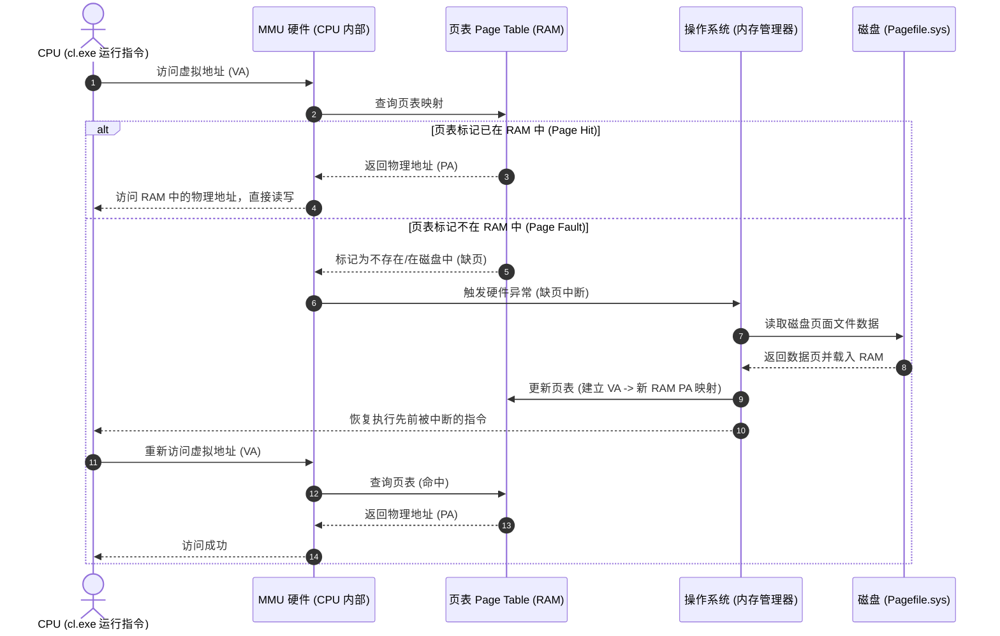

# PCH 生成 (/Yc) 中的虚拟内存分配与序列化 (VirtualAlloc)

在 C++ 编译器（如 cl.exe）解析头文件时，会在自己的进程空间中构建巨大的 AST（抽象语法树）内存结构。随后，它将这块连续的**虚拟内存数据及其使用的基地址（Base Address）**直接写入 `.pch` 文件。

那么，这个**进程空间**到底是在物理内存中，还是虚拟内存中，或者两者都有可能？

---

## 结论

**进程空间（进程地址空间）在概念上是 100% 的虚拟内存，但在物理承载上是两者都有可能。**

这是一个非常经典且重要的计算机系统概念，我们可以从**“逻辑概念”**和**“物理载体”**两个维度来理解：

### 1. 逻辑概念上：它 100% 是虚拟内存 (Virtual Memory)

对于运行在操作系统之上的编译器进程（如 `cl.exe`）来说，它所看到的、能操作的“进程空间”全部是虚拟内存。

* **隔离与保护**：每个进程都有自己独立的虚拟地址空间（在 64 位系统上理论上非常巨大）。一个进程无法直接看到或修改另一个进程的地址空间。
* **编译器看到的地址**：编译器在进程空间中构建 AST 时，使用的指针（如 `0x00007ff712345678`）全都是虚拟地址。编译器完全不知道、也无需关心这个地址对应物理内存的哪一个物理插槽（Page Frame）。

### 2. 物理载体上：两者都有，甚至包含磁盘

进程空间里存放的那些数据（比如 AST 节点），在物理上会根据系统的运行状态，动态分布在以下三个地方：

```text
┌────────────────────────────────────────────────────────┐
│ 逻辑层 (Compiler 视角)                                 │
│ ┌────────────────────────────────────────────────────┐ │
│ │ 进程虚拟地址空间 (Process Space)                   │ │
│ │ [ 虚拟内存页 1 ]  [ 虚拟内存页 2 ]  [ 虚拟内存页 3 ] │ │
│ └───────┬───────────────┬───────────────┬────────────┘ │
└─────────┼───────────────┼───────────────┼──────────────┘
          │ (OS & MMU 映射)│               │
┌─────────▼───────────────▼───────────────▼──────────────┐
│ 物理层 (硬件 视角)                                     │
│ ┌───────────────┐ ┌───────────────┐ ┌────────────────┐ │
│ │ 物理内存 (RAM) │ │ CPU L1-L3缓存 │ │ 磁盘页面文件   │ │
│ │ (活跃使用中)   │ │ (极度活跃中)  │ │ (Swap/Pagefile)│ │
│ └───────────────┘ └───────────────┘ └────────────────┘ │
└────────────────────────────────────────────────────────┘
```

* **物理内存 (RAM - 此时活跃)**：当编译器正在解析代码、创建新的 AST 节点时，这些数据必须存放在**物理内存（RAM）**中，因为 CPU 只能直接读写 RAM 和自身的缓存。
* **CPU 缓存 (L1/L2/L3 Cache - 极度活跃)**：正在被 CPU 核心计算和频繁访问的那一小部分 AST 节点，会被硬件自动拉入更快的 CPU 缓存中。
* **磁盘页面文件 (Swap / Pagefile.sys - 不活跃被挂起)**：如果物理内存已满，或者编译器的某些数据很久没被访问，操作系统的虚拟内存管理器（VMM）会执行“换出 (Page Out)”操作，把这部分进程空间的数据暂时写到磁盘的虚拟内存交换文件（Windows 的 `pagefile.sys`）中，腾出物理内存给其他进程。

### 3. OS 与 MMU 的协同映射机制

在上述架构中，**`(OS & MMU 映射)`** 并不是单一实体的行为，而是操作系统（软件）与内存管理单元（硬件）的深度协同：

* **页表 (Page Table)**：它是两者的契约。OS 在内存中维护页表，记录虚拟页与物理页的对应关系。MMU 则读取此页表来进行翻译。
* **MMU (硬件，内存管理单元)**：位于 CPU 内部。每一次内存访问，MMU 都会极速将虚拟地址（VA）翻译为物理地址（PA）。
* **OS (软件，操作系统)**：负责页表的创建、销毁、以及处理 MMU 抛出的“缺页中断”异常，执行耗时较长的磁盘 I/O。

#### 协同工作流程 (Mermaid 序列图)



### 4. PCH 生成 (/Yc) 场景下的具体流程

当 `cl.exe` 执行 `/Yc` 准备生成 `.pch` 文件时：

1. **申请空间**：`cl.exe` 调用 `VirtualAlloc`，向操作系统申请了一段虚拟地址范围（例如从 `0x20000000` 到 `0x30000000`）。
2. **物理写入**：随着解析的进行，OS 在后台为这些地址分配物理内存（RAM），AST 树结构在 RAM 中逐渐成型。
3. **序列化存盘**：当头文件解析完毕，`cl.exe` 收到“写入 .pch 文件”的指令。它会把 `0x20000000` 到 `0x30000000` 这段虚拟地址对应的数据（此时物理上大部分在物理内存 RAM 中，少部分可能在磁盘交换区中）通过 OS 写入到硬盘上的 `.pch` 文件里。

---

## 总结

**进程空间**本身是一个**虚拟概念**；但它所装载的数据，在运行期间会动态分布在**物理内存（RAM）**和**磁盘虚拟内存交换区（Pagefile）**中。
