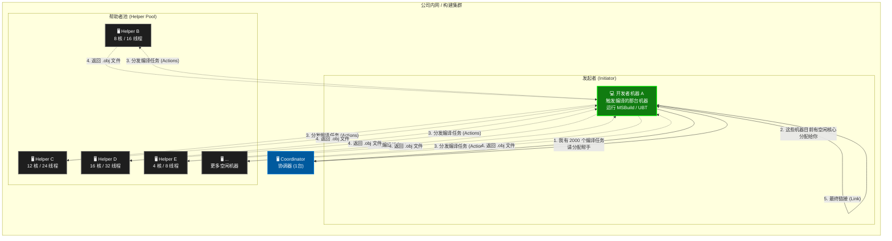
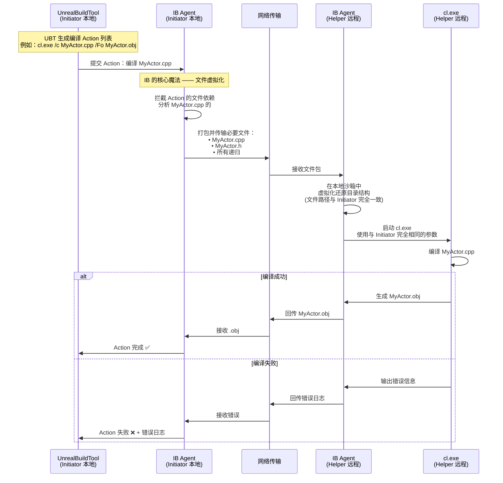
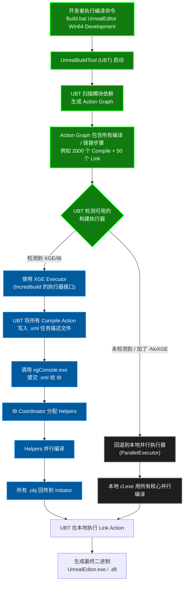
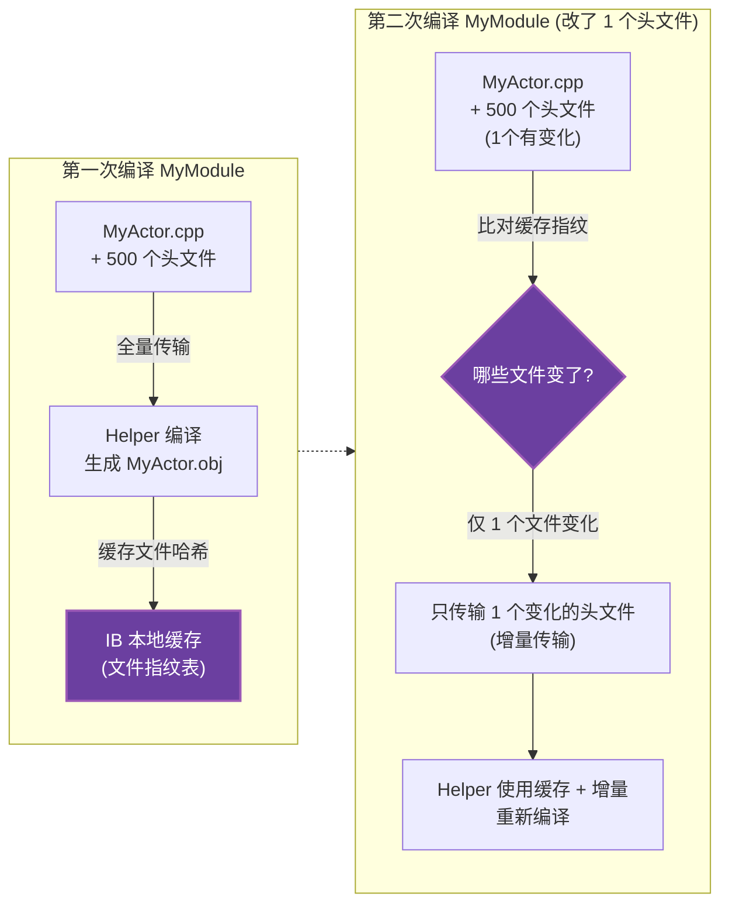

# Incredibuild (IB) 工作原理与机制图解

Incredibuild 的核心思想是：**把你公司/团队里所有闲置的电脑 CPU 核心，虚拟化成一台超级计算机来并行编译你的代码。**

---

## 1. 整体架构概览

Incredibuild 由三个核心角色组成：**Coordinator（协调器）**、**Initiator（发起者）** 和 **Helper（帮助者）**。

> [!IMPORTANT]
> **关键限制**：链接 (Link) 步骤**不能**被分布式执行，必须在 Initiator 本地完成。因此 UE 大型项目的链接阶段仍然可能很慢（尤其是启用 LTO 的 Shipping 构建）。

---

## 2. 单个编译任务的分发与执行细节

下面这张序列图展示了一个 `.cpp` 文件是如何被发送到远程 Helper 机器上编译，然后将结果返回的。

---

## 3. 文件虚拟化机制 (核心技术)

Incredibuild 最核心的技术是 **文件系统虚拟化**，它让远程 Helper 机器"以为"自己就是 Initiator。

> [!NOTE]
> **为什么不需要在 Helper 上安装 UE 源码？** 因为 IB 的内核驱动会拦截 `cl.exe` 的所有文件 I/O 系统调用（如 `CreateFile`、`ReadFile`）。当 `cl.exe` 试图读取一个文件时，IB Agent 会先检查本地虚拟缓存，如果没有就实时从 Initiator 拉取。对 `cl.exe` 来说，它完全感知不到自己在远程机器上运行。

---

## 4. 并行度对比：本地 vs Incredibuild

```mermaid
gantt
    title 编译 2000 个 .cpp 文件 (示意)
    dateFormat X
    axisFormat %s

    section 本地编译 (16核)
    cpp_1 ~ cpp_16  并行     :a1, 0, 10
    cpp_17 ~ cpp_32 并行     :a2, 10, 20
    cpp_33 ~ cpp_48 并行     :a3, 20, 30
    ...  漫长等待 ...        :a4, 30, 120
    最终链接 Link            :a5, 120, 130

    section IB 分布式 (16核 x 10台 = 160核)
    cpp_1 ~ cpp_160 并行分发  :b1, 0, 10
    cpp_161 ~ cpp_320 并行    :b2, 10, 20
    剩余全部完成              :b3, 20, 25
    最终链接 Link             :b4, 25, 35
```

> [!TIP]
> **典型加速比**：对于 UE5 全量编译（约 5000+ 编译单元），一台 16 核机器可能需要 **40-60 分钟**。接入 10 台 Helper 后，编译阶段可以压缩到 **5-8 分钟**，但链接阶段时间不变。

---

## 5. 与 UE Build System (UBT) 的集成方式

> [!IMPORTANT]
> 在你的 `AGENTS.md` 中，编译命令使用了 `-NoUBA -NoFASTBuild -NoSNDBS` 但**没有** `-NoXGE`，这正是为了保留 Incredibuild 作为分布式执行器。UBT 日志中出现 `Distributing ... actions to XGE` 就说明 IB 已经在工作了。

---

## 6. IB 缓存与增量编译优化

---

## 总结：IB 的关键机制一览

| 机制 | 说明 |
|------|------|
| **分布式编译** | 将独立的编译单元 (.cpp → .obj) 分发到网络中的空闲机器并行执行 |
| **文件虚拟化** | 通过内核驱动拦截文件 I/O，让远程 cl.exe 以为自己在 Initiator 上运行 |
| **Coordinator 调度** | 中央协调器管理所有 Agent 的可用核心数，按需分配给 Initiator |
| **增量缓存** | 基于文件哈希的缓存机制，避免重复传输未变化的文件 |
| **透明集成** | 对 UBT/MSBuild 等构建系统透明，不需要修改项目配置 |
| **仅编译可分布** | 链接 (Link) 阶段**不能**分布式执行，仍在本地完成 |
