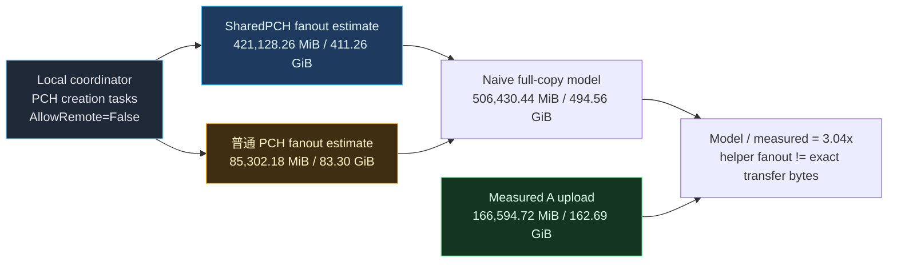

# A group PCH / SharedPCH helper fanout

Source: `D:\UE\tutorial\ProjectTitan\Saved\Logs\XGE_CenterUpload_Helper_AB_20260702_233133\analysis\remote_task_pch_dependency_summary_A.csv`.

Formula: `EstimatedFanoutMiB = PCHSizeMiB * HelperCount`.

```mermaid
flowchart TB
  A["A SharedPCH + XGE<br/>Remote helpers total: 187<br/>Max active machines: 129"]
  N1["S UEEd<br/>2,455.50 MiB x 128 helpers<br/>= 306.94 GiB<br/>501 remote tasks"]
  A --> N1
  N2["P Eng<br/>1,968.06 MiB x 20 helpers<br/>= 38.44 GiB<br/>34 remote tasks"]
  A --> N2
  N3["P UEEd<br/>2,071.44 MiB x 15 helpers<br/>= 30.34 GiB<br/>32 remote tasks"]
  A --> N3
  N4["S Slate<br/>874.44 MiB x 26 helpers<br/>= 22.20 GiB<br/>48 remote tasks"]
  A --> N4
  N5["S UEEd Project<br/>2,455.69 MiB x 9 helpers<br/>= 21.58 GiB<br/>25 remote tasks"]
  A --> N5
  N6["S Core<br/>370.81 MiB x 50 helpers<br/>= 18.11 GiB<br/>170 remote tasks"]
  A --> N6
  N7["S CUObj<br/>512.12 MiB x 32 helpers<br/>= 16.00 GiB<br/>64 remote tasks"]
  A --> N7
  N8["S Eng<br/>2,224.19 MiB x 7 helpers<br/>= 15.20 GiB<br/>11 remote tasks"]
  A --> N8
  N9["S Core<br/>358.31 MiB x 16 helpers<br/>= 5.60 GiB<br/>22 remote tasks"]
  A --> N9
  N10["S CUObj<br/>491.31 MiB x 10 helpers<br/>= 4.80 GiB<br/>13 remote tasks"]
  A --> N10
  classDef shared fill:#1e3a5f,stroke:#38bdf8,color:#e0f2fe
  classDef pch fill:#3f2e12,stroke:#fbbf24,color:#fef3c7
  classDef root fill:#111827,stroke:#c4b5fd,color:#f5f3ff
  class A root
  class N1 shared
  class N2 pch
  class N3 pch
  class N4 shared
  class N5 shared
  class N6 shared
  class N7 shared
  class N8 shared
  class N9 shared
  class N10 shared
```

## Fanout Table

| Family | PCH file | Size MiB | Helpers | Remote tasks | Estimated fanout MiB | Estimated fanout GiB |
|---|---|---:|---:|---:|---:|---:|
| SharedPCH | `SharedPCH.UnrealEd.Cpp20.h.pch` | 2,455.50 | 128 | 501 | 314,304.00 | 306.94 |
| PCH | `PCH.Engine.h.pch` | 1,968.06 | 20 | 34 | 39,361.20 | 38.44 |
| PCH | `PCH.UnrealEd.h.pch` | 2,071.44 | 15 | 32 | 31,071.60 | 30.34 |
| SharedPCH | `SharedPCH.Slate.Cpp20.h.pch` | 874.44 | 26 | 48 | 22,735.44 | 22.20 |
| SharedPCH | `SharedPCH.UnrealEd.Project.ValApi.ValExpApi.Cpp20.h.pch` | 2,455.69 | 9 | 25 | 22,101.21 | 21.58 |
| SharedPCH | `SharedPCH.Core.Cpp20.h.pch` | 370.81 | 50 | 170 | 18,540.50 | 18.11 |
| SharedPCH | `SharedPCH.CoreUObject.Cpp20.h.pch` | 512.12 | 32 | 64 | 16,387.84 | 16.00 |
| SharedPCH | `SharedPCH.Engine.Cpp20.h.pch` | 2,224.19 | 7 | 11 | 15,569.33 | 15.20 |
| SharedPCH | `SharedPCH.Core.Cpp20.h.pch` | 358.31 | 16 | 22 | 5,732.96 | 5.60 |
| SharedPCH | `SharedPCH.CoreUObject.Cpp20.h.pch` | 491.31 | 10 | 13 | 4,913.10 | 4.80 |
| PCH | `PCH.CoreUObject.h.pch` | 508.31 | 8 | 9 | 4,066.48 | 3.97 |
| PCH | `PCH.ResonanceAudio.h.pch` | 230.69 | 14 | 35 | 3,229.66 | 3.15 |
| PCH | `PCH.Core.h.pch` | 358.50 | 8 | 10 | 2,868.00 | 2.80 |
| PCH | `PCH.Core.h.pch` | 371.00 | 7 | 7 | 2,597.00 | 2.54 |
| PCH | `PCH.CoreUObject.h.pch` | 527.06 | 4 | 6 | 2,108.24 | 2.06 |
| SharedPCH | `SharedPCH.Slate.Cpp20.h.pch` | 843.88 | 1 | 1 | 843.88 | 0.82 |

## Interpretation

- SharedPCH estimated fanout: `421,128.26 MiB / 411.26 GiB`.
- 普通 PCH estimated fanout: `85,302.18 MiB / 83.30 GiB`.
- Naive full-copy model total: `506,430.44 MiB / 494.56 GiB`.
- Measured A upload from network sampling: `166,594.72 MiB / 162.69 GiB`.

逻辑分析推理(无事实依据)：如果每台 helper 都完整冷取用一次对应 PCH，则上表 fanout 可以作为中心分发压力的上限模型；但它高于实测上传量，说明 IncrediBuild 可能存在缓存、压缩、分块复用、非完整文件同步，或部分依赖没有转化为完整上传。
