# UBA SharedPCH CAS Wall Time 说明

> 面向老板/团队的一页结论：解释 SharedPCH 在 UBA 远端编译里的 CAS 传输为什么**不能**和 `cl.exe` 编译时间串行相加，以及 cold/warm 的实测差异来自哪里。

## 1. 一句话结论

SharedPCH 的 CAS 传输（cold：Host `SendCas` 2.6s / Agent `RecvCasLarge` 3.6s）和 PCH 内存映射（0.78s）都发生在 `cl.exe` 的 **13.0s wall 之内**，属于"编译过程中惰性按需拉取"，不是排在编译之前的独立串行阶段；**严禁**把这些子项与 `cl.exe` wall 或 Remote run 相加。CAS 的价值是 warm 命中时省掉大文件的重复传输与重复压缩，使 Remote run 从 **14.5s 降到 9.5s**。

## 2. 数据矩阵（cold vs warm）

| 指标 | cold | warm | 证据 |
| --- | --- | --- | --- |
| Remote run（Host 端总 wall 容器） | 14.5s | 9.5s | E1 / E10 |
| `cl.exe` wall（嵌套在 Remote run 内） | 13.0s | 8.3s | E4 / E11 |
| Agent Wall Time | 13.0s | 8.3s | E5 / E12 |
| Host `SendCas`（发送端聚合） | 2.6s，241 files，2.6gb → 349.8mb | 无大传输 | E2 / E3 |
| Agent `RecvCasLarge`（主体大 PCH，接收端） | 3.6s，comp 337029231 B | 无此行（远端 CAS 命中） | E6 / E13 |
| PCH memory map total | 783ms（alloc 18 + fill 757） | 563ms | E7 / E13 |
| Agent `ReceiveCas`（**aggregate accounting，非 wall**） | 15.2s，241 | — | E8 |

> 关键读法：`ReceiveCas` 15.2s 是 241 次 CAS 接收的**累计记账口径**，比整个 `cl.exe` wall（13.0s）还大，物理上不可能是墙钟时间，**不画成 duration bar、不参与任何相加**。

## 3. 为什么 2.6s + 13.0s 不能相加

时间轴嵌套关系（仅表达"谁包含谁 / 谁与谁重叠"，不代表精确起止时刻——日志只给时长，不给时间戳）：

```
Host Remote run = 14.5s  [E1]                        ← Host 观测的总容器
|<------------------------- 14.5s ------------------------->|
   ├─ 调度/连接/回收等非 cl.exe 开销 ≈ 1.5s (= 14.5 - 13.0)
   └─ cl.exe wall = 13.0s  [E4]                      ← 嵌套在 Remote run 内
      |<--------------------- 13.0s --------------------->|
      内部为并发/重叠(非首尾相接的串行链)：
        · Detours 等待 Host 返回字节  = 4.8s  [E9]
        · SendCas   (发送端口径) 2.6s [E2] ┐ 同一次传输的
        · RecvCasLarge(接收端口径)3.6s [E6] ┘ 两个视角, 不可相加
        · PCH memory map        0.78s [E7]
```

**反证 1 —— 重叠必然存在【逻辑分析推理(有事实支撑)】。** Remote run 中"非 `cl.exe`"部分只有 `14.5s - 13.0s = 1.5s`（E1、E4）。而 Host `SendCas` = 2.6s（E2），`2.6s > 1.5s`，因此 `SendCas` 不可能完全落在 `cl.exe` wall 之外的 1.5s 窗口里，**必然有一部分与 `cl.exe` wall 重叠**。

**反证 2 —— 相加会溢出【逻辑分析推理(有事实支撑)】。** 若串行相加，`13.0s + 2.6s = 15.6s > 14.5s`（Remote run 实测上限，E1）。子项之和超过实测总容器，自相矛盾，故不能串行相加。

**反证 3 —— 两端口径不同【逻辑分析推理(有事实支撑)】。** Host `SendCas` 2.6s（发送端，E2）与 Agent `RecvCasLarge` 3.6s（接收端，E6）度量的是**同一次传输的两个视角**；接收端 3.6s > 发送端 2.6s，是因为两侧统计边界不同（接收端含等待、落盘与解压准备），二者**不能相加**。

**事实补强 —— wall 内部确有等待窗口【事实】。** `cl.exe` 的 13.0s wall 内部，Detours `WaitOnResponse` 等待 Host 返回字节达 **4.8s**（E9）。这段等待正是 CAS 字节传输发生的时间窗口，且明确嵌套在 wall 内，直接证明 CAS 传输与编译重叠、而非前置串行阶段。

**两处口径校正说明【事实 + 逻辑分析推理(有事实支撑)】：**
- `RecvCasLarge` 是 `SendCas` 这一批 241 个文件里的**主体大 PCH**（`SharedPCH.UnrealEd.Cpp20.h.pch`）：其 `comp_bytes=337029231`（E6）相对 `SendCas` 总压缩量 349.8mb（E3）**约占 96%**。注：349.8mb 为 UBA 日志显示单位，此处为量级近似而非精确进制换算；无论按何种口径，它都是该批次的主体，而不是"另一份 payload"。
- PCH 映射：`alloc 18ms + fill 757ms = 775ms`，日志 `total=783ms`（E7），差 8ms 为未单独拆分的余量（决策/记账开销），不影响"映射约 0.78s"的结论。

## 4. Mermaid 时序图（惰性按需拉取，深色）

```mermaid
%%{init: {"theme":"base","themeVariables":{"background":"#0d1117","primaryColor":"#161b22","primaryTextColor":"#e6edf3","primaryBorderColor":"#8b949e","lineColor":"#c9d1d9","actorBkg":"#161b22","actorBorder":"#8b949e","actorTextColor":"#e6edf3","signalColor":"#e6edf3","signalTextColor":"#e6edf3","noteBkgColor":"#21262d","noteTextColor":"#e6edf3","noteBorderColor":"#8b949e","activationBkgColor":"#1f6feb","activationBorderColor":"#58a6ff"}}}%%
sequenceDiagram
    participant H as Host UbaCli
    participant A as Remote UbaAgent
    participant S as Agent CAS Store
    participant M as PCH Memory Map
    participant C as Remote cl.exe

    Note over H,C: cold total Remote run = 14.5s
    H->>A: Dispatch remote compile action
    A->>C: Launch cl.exe
    Note over A,C: cl.exe wall = 13.0s, includes file-request waits and compile work

    rect rgba(31, 111, 235, 0.24)
        Note over H,C: lazy SharedPCH access inside cl.exe wall; not a pre-cl.exe serial phase
        C-->>A: Open SharedPCH.UnrealEd.Cpp20.h.pch
        A-->>H: Request missing CAS/input bytes
        H->>A: SendCas aggregate 2.6s, 241 files, 2.6gb -> 349.8mb
        A->>S: Receive/store large PCH CAS 3.6s, comp 337029231 bytes
        Note over H,S: RecvCasLarge is the dominant PCH in SendCas batch, about 96% of compressed bytes; endpoint views are not additive
        A->>M: Build mapped PCH view 783ms, alloc 18ms + fill 757ms
        M-->>C: Expose logical 2.6gb PCH view
    end

    C-->>A: Compile completes
    A-->>H: Remote action complete
```

## 5. Mermaid 时长条形图（duration bars，深色）

> 横轴为**时长**（从 0 起画，仅表达长度），**不是绝对时间戳**；`cl.exe` wall 内各子项左对齐即为"共处一个 wall、彼此重叠"，不是首尾相接。`ReceiveCas` 15.2s 已按第 2 节说明剔除，不出现在图中。

```mermaid
%%{init: {"theme":"base","themeVariables":{"background":"#0d1117","titleColor":"#e6edf3","textColor":"#e6edf3","gridColor":"#30363d","sectionBkgColor":"#161b22","altSectionBkgColor":"#0d1117","taskBkgColor":"#3d444d","taskBorderColor":"#8b949e","taskTextColor":"#e6edf3","taskTextOutsideColor":"#e6edf3","activeTaskBkgColor":"#1f6feb","activeTaskBorderColor":"#58a6ff","critBkgColor":"#be123c","critBorderColor":"#ff7b72","doneTaskBkgColor":"#8957e5","doneTaskBorderColor":"#a371f7"}}}%%
gantt
    title UBA cold/warm SharedPCH duration bars - measured durations only, not absolute timestamps
    dateFormat x
    axisFormat %Ss
    todayMarker off

    section Wall-clock containment
    Cold remote run 14.5s host wall container :crit,total,0,14500
    Cold cl.exe wall 13.0s nested inside remote run :active,clexe,0,13000

    section Cold PCH/CAS work observed inside cl.exe wall
    Host SendCas 2.6s 241 files total comp 349.8mb :send,0,2600
    Agent RecvCasLarge 3.6s dominant PCH comp 337029231 bytes :recv,0,3562
    PCH memory map 0.783s alloc 18ms plus fill 757ms :map,0,783

    section Warm comparison
    Warm remote run 9.5s no large PCH transfer :warmtotal,0,9500
    Warm cl.exe wall 8.3s CAS hit :warmcl,0,8300
    Warm PCH memory map 0.563s :warmmap,0,563
```



## 6. UBA CAS 原理（为什么 warm 更快）

- **CAS = Content-Addressed Storage**：按内容哈希寻址的文件复用机制。它**规避的是重复传输与重复压缩大文件**，不是让 UBT/MSVC"不重建 SharedPCH"的机制。
- **cold（远端无该 PCH 的 CAS）**：UBA 需把 2.6gb 原始 / 349.8mb 压缩（E3）的 SharedPCH 内容压缩后传到远端；其中主体大 PCH 的压缩量 `comp_bytes=337029231`（E6）。远端接收落盘后，映射成逻辑 2.6gb 视图供 `cl.exe` 使用（E7）。
- **warm（远端已有 CAS）**：日志中**没有 `RecvCasLarge`**（E13），说明远端命中 CAS、跳过大文件重传；仍需把 PCH 映射进内存（`total=563ms`，E13）。Remote run 由此从 14.5s 降到 9.5s（E1 → E10）。
- **CAS 不承诺的事**：不规避 PCH action 本身失效，也**不保证 MSVC 重新生成的 PCH 字节完全相同**——它只在"内容一致"时复用；内容变了就是新的 CAS key，需要重新传输。

## 7. 局限性与潜在风险提示

- **无精确时间戳**：本文所有时长均取自 UBA 汇总统计（duration），日志**未提供各子项的精确起止时间戳**；第 3-5 节的嵌套/重叠关系为"容器与时长"的合理表达，不代表精确排布。
- **口径不可混用**：`SendCas`（发送端）、`RecvCasLarge`（接收端）、`ReceiveCas`（累计记账）分属不同统计口径；文中已避免相加，引用时也不应跨口径合并。
- **约 96% 为量级近似**：`337029231 B / 349.8mb` 的占比受进制口径影响（约 92%–96%），仅用于说明"它是主体大 PCH"，不作精确结论。
- **样本单点**：数据来自单次 cold/warm 各一次运行（同一 `SharedPCH.UnrealEd_CADKernel_1` action），未做多次重复取均值，绝对秒数会随机器/网络波动。
- **Mermaid 校验范围**：两图已做静态语法审查并规范 `init` 为标准 JSON 以确保深色主题生效，但**未在浏览器端做渲染验证**；如目标渲染器对 gantt 任务名中的标点敏感，可微调文字。

---

### 附录 A：日志证据索引（完整绝对路径 + 行号 + 原文摘录）

- **E1** `D:\UEProject\Docs\XGE_PCH_Probe\uba_sharedpch_coldwarm_20260706_151339\cold\UbaCli.out.log:11` — `Remote run took 14.5s` — [打开](<D:/UEProject/Docs/XGE_PCH_Probe/uba_sharedpch_coldwarm_20260706_151339/cold/UbaCli.out.log>)
- **E2** `D:\UEProject\Docs\XGE_PCH_Probe\uba_sharedpch_coldwarm_20260706_151339\cold\UbaCli.out.log:37` — `SendCas 241 2.6s` — [打开](<D:/UEProject/Docs/XGE_PCH_Probe/uba_sharedpch_coldwarm_20260706_151339/cold/UbaCli.out.log>)
- **E3** `D:\UEProject\Docs\XGE_PCH_Probe\uba_sharedpch_coldwarm_20260706_151339\cold\UbaCli.out.log:38` — `Bytes Raw/Comp 2.6gb 349.8mb` — [打开](<D:/UEProject/Docs/XGE_PCH_Probe/uba_sharedpch_coldwarm_20260706_151339/cold/UbaCli.out.log>)
- **E4** `D:\UEProject\Docs\XGE_PCH_Probe\uba_sharedpch_coldwarm_20260706_151339\cold\agent.out.log:44` — `cl.exe 1 13.0s` — [打开](<D:/UEProject/Docs/XGE_PCH_Probe/uba_sharedpch_coldwarm_20260706_151339/cold/agent.out.log>)
- **E5** `D:\UEProject\Docs\XGE_PCH_Probe\uba_sharedpch_coldwarm_20260706_151339\cold\agent.out.log:42` — `Wall Time 13.0s` — [打开](<D:/UEProject/Docs/XGE_PCH_Probe/uba_sharedpch_coldwarm_20260706_151339/cold/agent.out.log>)
- **E6** `D:\UEProject\Docs\XGE_PCH_Probe\uba_sharedpch_coldwarm_20260706_151339\cold\agent.out.log:11` — `RecvCasLarge raw_bytes=2574778360 comp_bytes=337029231 recv_ms=3562` — [打开](<D:/UEProject/Docs/XGE_PCH_Probe/uba_sharedpch_coldwarm_20260706_151339/cold/agent.out.log>)
- **E7** `D:\UEProject\Docs\XGE_PCH_Probe\uba_sharedpch_coldwarm_20260706_151339\cold\agent.out.log:12` — `PchMemoryMapLarge alloc_map_ms=18 fill_memory_ms=757 total_ms=783` — [打开](<D:/UEProject/Docs/XGE_PCH_Probe/uba_sharedpch_coldwarm_20260706_151339/cold/agent.out.log>)
- **E8** `D:\UEProject\Docs\XGE_PCH_Probe\uba_sharedpch_coldwarm_20260706_151339\cold\agent.out.log:70` — `ReceiveCas 241 15.2s`（aggregate accounting，非 additive wall time） — [打开](<D:/UEProject/Docs/XGE_PCH_Probe/uba_sharedpch_coldwarm_20260706_151339/cold/agent.out.log>)
- **E9** `D:\UEProject\Docs\XGE_PCH_Probe\uba_sharedpch_coldwarm_20260706_151339\cold\agent.out.log:16-18` — `Detours Total 114 4.9s / WaitOnResponse 106 4.8s / Host 4.8s`（本文补强证据：wall 内的 Host 等待窗口） — [打开](<D:/UEProject/Docs/XGE_PCH_Probe/uba_sharedpch_coldwarm_20260706_151339/cold/agent.out.log>)
- **E10** `D:\UEProject\Docs\XGE_PCH_Probe\uba_sharedpch_coldwarm_20260706_151339\warm\UbaCli.out.log:11` — `Remote run took 9.5s` — [打开](<D:/UEProject/Docs/XGE_PCH_Probe/uba_sharedpch_coldwarm_20260706_151339/warm/UbaCli.out.log>)
- **E11** `D:\UEProject\Docs\XGE_PCH_Probe\uba_sharedpch_coldwarm_20260706_151339\warm\agent.out.log:43` — `cl.exe 1 8.3s` — [打开](<D:/UEProject/Docs/XGE_PCH_Probe/uba_sharedpch_coldwarm_20260706_151339/warm/agent.out.log>)
- **E12** `D:\UEProject\Docs\XGE_PCH_Probe\uba_sharedpch_coldwarm_20260706_151339\warm\agent.out.log:41` — `Wall Time 8.3s` — [打开](<D:/UEProject/Docs/XGE_PCH_Probe/uba_sharedpch_coldwarm_20260706_151339/warm/agent.out.log>)
- **E13** `D:\UEProject\Docs\XGE_PCH_Probe\uba_sharedpch_coldwarm_20260706_151339\warm\agent.out.log:11` — `PchMemoryMapLarge total_ms=563`（无 `RecvCasLarge`，表示远端 CAS 命中） — [打开](<D:/UEProject/Docs/XGE_PCH_Probe/uba_sharedpch_coldwarm_20260706_151339/warm/agent.out.log>)
