# UBA SharedPCH Cold/Warm 单 Agent 验证方案

> 本文所有定量数据均来自一次已完成的实验，未重跑、未臆造。
> 注：本次定量数据来自此前对 UBA 临时日志插桩并据此重编后的 `UbaCli.exe` / `UbaAgent.exe` 运行日志；本次仅做文档落盘，未再改源码、未重跑（详见第 11 节）。
> 数据源（已验证事实来源）：
> - 报告：`D:\UEProject\Docs\XGE_PCH_Probe\uba_sharedpch_coldwarm_20260706_100004\ColdWarmReport.md`
> - 时序：`D:\UEProject\Docs\XGE_PCH_Probe\uba_sharedpch_coldwarm_20260706_100004\ColdWarmSequence.mmd`
> - 采集脚本（下文以 `SCRIPT` 指代，完整路径见第 10 节路径映射表）：`D:\UEProject\Docs\XGE_PCH_Probe\Run-UbaSharedPchColdWarm.ps1`
>
> 本文已内嵌 Mermaid 时序图，见第 12 节。原拆分时序文件为：`D:\UE\Docs\Build\UBA_SharedPCH_ColdWarm_Sequence.mmd`

---

## 1. 验证目标

验证 Unreal Build Accelerator（UBA）在**远程编译单个 SharedPCH 编译动作**时，SharedPCH 预编译头在 cold 与 warm 两种缓存状态下的传输与落地路径，并回答三个问题：

1. cold 状态下，网络上真正传输的是 2.57GB 原始 PCH，还是压缩后的 CAS 对象？
2. warm 状态下，是否还会再次传输大型 PCH CAS？如果不传，本地是否还要做 PCH 内存视图重建？
3. UBA summary 中的 `ReceiveCas 14.1s` 与远程动作 wall time `11.8s` 是什么关系，能不能相加？

---

## 2. 实验对象

| 项 | 值（已验证事实） |
| --- | --- |
| 引擎根 | `D:\UE\5.8.0r` |
| 被测编译动作 | 单个 SharedPCH 编译，rsp 见 `RSP`（见第 10 节路径映射表） |
| 目标 PCH | `PCH_HINT`（`SharedPCH.UnrealEd.Cpp20.h.pch`，见路径映射表） |
| PCH CAS 哈希 | `CAS_HASH` = `60ecfcbdaccd3b5e6d30d8b4a3407f645af97901` |
| PCH 原始大小 | `raw_bytes=2574778360`（约 2.6gb，即约 2.57GB） |
| PCH 压缩大小 | `comp_bytes=337029231`（约 337.0mb） |
| 远程机 | `phoen@10.226.143.38`（`REMOTE`） |
| 远程工作根 | `C:\ProgramData\Epic\UbaAgent\Codex\ColdWarm`（`REMOTE_WORKROOT`） |
| CAS 落地路径 | `CAS_STORE`（见路径映射表） |
| `-logcas` 阈值 | `104857600` 字节（100MB），仅超过该阈值的 CAS 才输出大 PCH 明细日志 |

---

## 3. 单 Agent 约束

- **单远程主机、单 Agent**：采集脚本 `SCRIPT` 只连接一个远程 `phoen@10.226.143.38`，每个 pass 通过 `Start-Process` 在远程启动**一个** `UbaAgent`（`REMOTE_AGENT_EXE`，见第 10 节）（脚本 `Run-OnePass` 函数，`SCRIPT:114`）。
- **无并发干扰**：cold、warm 两个 pass 串行执行（`SCRIPT:329-330`），**本次日志实测端口**为 cold `31390`、warm `31391`（实测来源：`COLD_HOST_LOG` / `WARM_HOST_LOG` 的 `Listening on` 行，端口分别为 31390 / 31391），避免端口复用歧义。脚本默认 `PortBase=31360`（`SCRIPT:8`），cold 取 `PortBase`、warm 取 `PortBase+1`（`SCRIPT:329-330`）；结合该规则与实测端口，可判定本次使用的 `PortBase` 等效为 `31390`（31390=PortBase、31391=PortBase+1），而非默认的 31360 / 31361。若表述为“本次命令传入 `-PortBase 31390`”，该记录来源为 Codex 会话执行记录，非 `COLD_HOST_LOG` / `WARM_HOST_LOG` 日志文件直接包含。
- **共享同一远程 CAS store**：两个 pass 共用同一 `RemoteStore`（`store` 子目录，`SCRIPT:327`）。这是 warm 命中缓存的前提。
- **Agent 参数固定**：`-host=<LocalHost>:<Port> -dir=<RemoteStore> -nopoll -maxidle=60 -summary -logcas=104857600`（`SCRIPT:161`）。
- 之所以采用单 Agent，是为了把"传输—解压—内存映射"链路的时间归因到一个确定的 Agent 上，排除多 Agent 负载均衡带来的口径混淆（逻辑分析推理(无事实依据)）。

---

## 4. cold / warm 定义

| 状态 | 定义（基于脚本行为的已验证事实） |
| --- | --- |
| **cold** | 第一次 pass。远程 `RemoteStore` 中尚无本次 PCH 的 CAS 对象，Host 需通过 `SendCas` 把 CAS 推给 Agent，Agent 通过 `ReceiveCas` 落盘。本次实测端口 `31390`。 |
| **warm** | 第二次 pass。复用同一 `RemoteStore`，本次 PCH 的 CAS 已存在（CAS hit），不再重新传输大型 PCH CAS。本次实测端口 `31391`。 |

> cold/warm 的差异**只来自远程 CAS store 是否已有该对象**，编译动作、rsp、PCH 目标三者在两个 pass 中完全一致。

---

## 5. 采集点

采集由 `SCRIPT` 的 `Parse-RunLogs`（`SCRIPT:72`）从两份日志正则提取：

- Host 日志：脚本变量 `runDir` 下的 `UbaCli.out.log`（本次 cold/warm 完整路径见第 10 节 `COLD_HOST_LOG` / `WARM_HOST_LOG`）
- Agent 日志：脚本变量 `runDir` 下的 `agent.out.log`（本次 cold/warm 完整路径见第 10 节 `COLD_AGENT_LOG` / `WARM_AGENT_LOG`）

| 采集点 | 日志来源 | 含义 |
| --- | --- | --- |
| `Remote run took` | Host | 远程动作 wall time |
| `SendCas` / `Bytes Raw/Comp` | Host | Host 侧发送 CAS 的文件数、耗时、原始/压缩字节 |
| `ReceiveCas` / `Bytes Raw/Comp` / `Decompress` | Agent | Agent 侧接收 CAS 的**聚合**文件数、耗时、字节、解压调用 |
| `[RecvCasLarge]` | Agent | 大型 PCH CAS 的单独接收明细（受 `-logcas` 阈值触发） |
| `[PchMemoryMapDecision]` | Agent | 是否走内存映射的决策 |
| `[PchMemoryMapLarge]` | Agent | 大型 PCH 的 AllocAndMapView + 填充明细 |
| `CreateMmapFromFile` / `DecompressToMem` / `MappingBuffer` | Agent | 内存映射与解压汇总 |
| `MapViewOfFile` / `MapViewOfFile3` | Agent | Detours 拦截的视图映射调用汇总 |

---

## 6. 执行方法

> 以下为脚本已固化的执行方式（已验证事实），本文**不重跑**实验。

1. 解析编译器：`Resolve-ClExe` 用 `vswhere` 定位 MSVC 的 `cl.exe`（Host x64 工具链；其完整绝对路径由 `vswhere` 在运行时解析，非固定路径，故不硬编码）（`SCRIPT:29`）。
2. Host 侧启动 `UbaCli.exe`（`UBACLI`，见路径映射表），参数：
   `-dir=<sessionDir> -port=<Port> -summary -detailedtrace -workdir=ENGINE_ROOT\Engine\Source remote <cl.exe> @RSP`（`SCRIPT:136`；`ENGINE_ROOT` / `RSP` 完整路径见第 10 节）。
3. 等待 Host 输出 `Listening on <LocalHost>:<Port>` 后，通过 SSH + Base64 EncodedCommand 在远程启动 `UbaAgent`（`REMOTE_AGENT_EXE`，见第 10 节）（`SCRIPT:155-167`）。
4. Host 进程退出后回收远程 Agent，`scp` 把 Agent 侧脚本变量 `runDir` 下的 `agent.out.log` / `agent.err.log` 拉回本地（本次 `agent.out.log` 完整路径见第 10 节 `COLD_AGENT_LOG` / `WARM_AGENT_LOG`；`agent.err.log` 为同一 `runDir` 下的错误输出文件）（`SCRIPT:185-186`）。
5. `Parse-RunLogs` 提取指标，`Write-Report` 生成 `ColdWarmReport.md` 与 `ColdWarmSequence.mmd`（`SCRIPT:204`、`SCRIPT:332`）。
6. 依次执行 cold（本次实测端口 31390）与 warm（本次实测端口 31391）两个 pass（`SCRIPT:329-330`）；端口 = `PortBase`（cold）/ `PortBase+1`（warm），脚本默认 `PortBase=31360`（`SCRIPT:8`），由本次实测端口反推 `PortBase` 等效为 31390。

---

## 7. 关键数据表（已验证事实）

### 7.1 cold vs warm 对照

| 采集点 | Cold | Warm |
| --- | --- | --- |
| Remote run（wall time） | **11.8s** | **7.6s** |
| Host SendCas | 241 files, 2.4s | （未记录，见 7.3） |
| Host SendCas Raw/Comp | 2.6gb / 349.8mb | （未记录） |
| Agent ReceiveCas | 241 files, **14.1s** | （未记录） |
| Agent ReceiveCas Raw/Comp | 2.6gb / 349.8mb | （未记录） |
| Agent ReceiveCas Decompress | 111 calls, 65ms | （未记录） |
| Large PCH RecvCas | raw=2.6gb(`2574778360`) / comp=337.0mb(`337029231`) / recv=**3.5s**(`3533ms`) / decompressRecv=0ms（ReceiveCas 阶段字段，非 PCH map 阶段，见本表后注） | `CAS hit or no large PCH CAS transfer logged` |
| PCH memory map decision | alignment=65536 useStorage=1 allowMemoryMaps=1 / decision `<1ms`(0ms) | 同 cold（decision `<1ms`） |
| PCH memory map large（AllocAndMapView+fill） | allocMap=**10ms** / fillMemory=**540ms** / total=**556ms** / mapping=`^2-5m1g` | allocMap=**9ms** / fillMemory=**314ms** / total=**323ms** / mapping=`^2` |
| CreateMmapFromFile summary | 132 calls, 821ms | 132 calls, 337ms |
| MappingBuffer summary | 1, 2.6gb | 1, 2.6gb |
| DecompressToMem summary | 132 calls, 514ms | 132 calls, 289ms |
| MapViewOfFile summary | 94 calls, 17ms | 94 calls, 18ms |
| MapViewOfFile3 summary | 30 calls, <1ms | 30 calls, <1ms |

> **关于 `decompressRecv=0ms`（避免误读）**：该字段出现在 cold `[RecvCasLarge]` 行，属于 **ReceiveCas（CAS 接收/落盘）阶段**的解压计时；`0ms` 只说明接收落盘阶段未在该字段计入解压耗时，**不代表 PCH memory map 阶段没有解压/填充**。PCH memory map 阶段仍有实测解压/填充开销：`fillMemory`（cold **540ms** / warm **314ms**）与 `DecompressToMem`（cold **514ms** / warm **289ms**，见上表与第 7.5 节）。二者是**不同阶段的不同字段**，不能用 `decompressRecv=0ms` 推断"PCH 未解压"。

### 7.2 传输的是压缩 CAS，不是 2.57GB 原始 PCH（已验证事实）

- cold 的大型 PCH CAS 明细：`raw_bytes=2574778360`（约 2.57GB 原始）对应 `comp_bytes=337029231`（约 337.0mb 压缩），`recv=3.5s`。
- Host 整体 `SendCas` 的 `Raw/Comp` 为 `2.6gb / 349.8mb`：网络上落地的是**压缩后**的量级（约 350mb），而非 2.6gb 原始。
- **结论**：cold 通过网络传输的是压缩 CAS（约 337mb 的 PCH 对象 / 整体约 350mb），不是 2.57GB 原始 PCH。2.57GB 只是解压/映射后的内容体积。

### 7.3 warm 不再传大型 PCH CAS，但本地仍需 CAS -> full PCH memory view（已验证事实）

- warm 的 `Large PCH RecvCas` 记录为 `CAS hit or no large PCH CAS transfer logged`，且 Host `SendCas` / Agent `ReceiveCas` 均未记录（CAS 命中，无需重传）。
- 但 warm 仍然产生 `[PchMemoryMapLarge]`：`content_bytes=2574778360`、`compressed=1`、`fillMemory=314ms`、`total=323ms`；`DecompressToMem 132 calls, 289ms`；`MappingBuffer 1, 2.6gb`。
- **结论**：warm 省掉的是"网络传输 + 落盘"，**没有省掉**"本地把压缩 CAS 解压并填充为 2.6gb 的 full PCH memory view"这一步。这解释了 warm 仍需约 323ms 完成 PCH 内存映射，且 `Remote run` 仍要 7.6s。

### 7.4 `ReceiveCas 14.1s` 是聚合口径，不能与 wall time 相加（已验证事实 + 内部一致性推理）

- 已验证事实：cold `Agent ReceiveCas = 241 files, 14.1s`；同一 cold pass 的 `Remote run = 11.8s`。
- 内部一致性证据：`14.1s > 11.8s`（ReceiveCas 大于整个远程动作 wall time）。若 14.1s 是串行 wall time 的一部分，不可能超过它所属动作的总 wall time。
- 由此可判定：`ReceiveCas 14.1s` 是 UBA `-summary` 的**聚合统计口径**（对 241 个文件的接收耗时累加，可能跨并发/重叠计时），**不是**一段可与 `Remote run 11.8s`、`SendCas 2.4s`、`Large PCH recv 3.5s` 线性相加的墙钟时段。
- **结论**：分析 cold 链路耗时时，应以 `Remote run 11.8s` 为 wall time 基准，`ReceiveCas 14.1s` 仅用于评估 CAS 接收总工作量，二者不可直接相加。

### 7.5 截图段流程耗时映射（用户截图链路 -> 实测数据）

把用户截图中的"cl.exe 请求 `.pch` -> UBA 内存映射 -> Detours 让 cl.exe 看到映射"链路逐行映射到本次实测字段。数据取自 `COLD_AGENT_LOG` / `WARM_AGENT_LOG`（见第 10 节）的 `[PchMemoryMapDecision]` / `[PchMemoryMapLarge]` 行与汇总段（cold / warm 分列）：

| 截图链路步骤 | 实测字段来源 | Cold | Warm |
| --- | --- | --- | --- |
| cl.exe 读取 `.pch` / request `.pch` | 未单独计时，仅作为链路触发点 | 触发点（未计时） | 触发点（未计时） |
| UBA 判断 `.pch` 需 64KB alignment memory map | `[PchMemoryMapDecision]` alignment=65536 useStorage=1 allowMemoryMaps=1 | <1ms | <1ms |
| AllocAndMapView（contentSize=2574778360） | `[PchMemoryMapLarge]` allocMap | 10ms | 9ms |
| DecompressFileToMemory / compressed CAS -> full PCH memory view | `[PchMemoryMapLarge]` fillMemory / total | fillMemory 540ms（total 556ms） | fillMemory 314ms（total 323ms） |
| Detours / MapViewOfFileEx 让 cl.exe 看到 PCH 映射 | `MapViewOfFile` / `MapViewOfFile3` 汇总 | MapViewOfFile 17ms（94 calls）/ MapViewOfFile3 <1ms（30 calls） | MapViewOfFile 18ms（94 calls）/ MapViewOfFile3 <1ms（30 calls） |

说明与口径提示：

- **触发点未计时**：cl.exe 读取 / request `.pch` 本身在本次日志里没有单独墙钟字段，仅是后续 UBA 内存映射链路的触发点，不计入上表时长。
- **AllocAndMapView = `allocMap` 阶段**：对应 `[PchMemoryMapLarge]` 中对 `contentSize=2574778360`（约 2.57GB）视图的分配与映射（cold 10ms / warm 9ms）。
- **fillMemory/total 内部才是真正的解压填充**：该阶段把压缩 CAS 解压并填充为 full PCH memory view，同段汇总 `DecompressToMem 132 calls`（cold 514ms / warm 289ms）即在此阶段发生；与 `[RecvCasLarge]` 行的 `decompressRecv=0ms`（ReceiveCas 阶段）不是同一字段（见第 7.1 节后注）。
- **MapViewOfFile / MapViewOfFile3 为汇总口径、非 PCH 专属**：这是 Detours 拦截的**全部**视图映射调用汇总（cold 94+30 / warm 94+30 次），包含非 PCH 的映射，故为链路上界口径，不等于 PCH 单独的映射耗时。

---

## 8. 时序图引用

本文内嵌 Mermaid 时序图见第 12 节；原拆分时序文件为：`D:\UE\Docs\Build\UBA_SharedPCH_ColdWarm_Sequence.mmd`。

该图对下列 9 个步骤**分别标注时间**（cold / warm 分列，缺失项标注 n/a）：

1. Host SendCas
2. Agent ReceiveCas（含"聚合口径，不与 wall time 相加"标注）
3. 大型 PCH CAS 接收（Large PCH RecvCas）
4. cl.exe 请求 `.pch`
5. PCH memory map decision
6. AllocAndMapView
7. CAS compressed -> full PCH memory view（fillMemory）
8. Detours / MapViewOfFile 汇总
9. remote action wall time（Remote run）

时序图节点内使用短 ID 代替长路径，ID -> 完整路径见第 10 节。

---

## 9. 结论

1. **cold 传压缩 CAS**：cold 网络传输的是压缩后的 CAS（PCH 对象约 337mb / 整体约 350mb），不是 2.57GB 原始 PCH（第 7.2 节）。
2. **warm 免传但不免映射**：warm 未观察到大型 PCH CAS 传输（CAS hit），但仍需本地把压缩 CAS 解压并构建 2.6gb 的 full PCH memory view（fillMemory 314ms / total 323ms）（第 7.3 节）。
3. **wall time 口径**：cold `Remote run 11.8s` 是墙钟基准；`ReceiveCas 14.1s` 是聚合口径，因 `14.1s > 11.8s` 可证其不可与 wall time 线性相加（第 7.4 节）。
4. **warm 提速来源**：cold 11.8s vs warm 7.6s，差值约 4.2s。逻辑分析推理(无事实依据)：该差值主要来自 cold 独有的 CAS 网络传输 + 落盘（cold `SendCas 2.4s`、`Large PCH recv 3.5s`），而 warm 省去了这部分；PCH 内存映射两者都要做（cold total 556ms / warm total 323ms）。此归因为推理，未逐段计时验证。

---

## 10. 路径映射表（ID -> 完整 Windows 绝对路径 / 值）

| ID | 完整路径 / 值 |
| --- | --- |
| `PCH_HINT` | `D:\UE\5.8.0r\Engine\Intermediate\Build\Win64\x64\UnrealEditor\Development\UnrealEd\SharedPCH.UnrealEd.Cpp20.h.pch` |
| `CAS_STORE` | `C:\ProgramData\Epic\UbaAgent\Codex\ColdWarm\uba_sharedpch_coldwarm_20260706_100004\store\cas\60\60ecfcbdaccd3b5e6d30d8b4a3407f645af97901` |
| `CAS_HASH` | `60ecfcbdaccd3b5e6d30d8b4a3407f645af97901` |
| `RSP` | `D:\UEProject\Docs\XGE_PCH_Probe\uba_pch_sampling_full_20260706_01\samples\SharedPCH.UnrealEd_CADKernel_1\baseline\SharedPCH.UnrealEd_CADKernel_1.baseline.rsp` |
| `UBACLI` | `D:\UE\5.8.0r\Engine\Binaries\Win64\UnrealBuildAccelerator\x64\UbaCli.exe` |
| `REMOTE` | `phoen@10.226.143.38` |
| `REMOTE_WORKROOT` | `C:\ProgramData\Epic\UbaAgent\Codex\ColdWarm` |
| `ENGINE_ROOT` | `D:\UE\5.8.0r` |
| `SCRIPT` | `D:\UEProject\Docs\XGE_PCH_Probe\Run-UbaSharedPchColdWarm.ps1` |
| `COLD_HOST_LOG` | `D:\UEProject\Docs\XGE_PCH_Probe\uba_sharedpch_coldwarm_20260706_100004\cold\UbaCli.out.log` |
| `WARM_HOST_LOG` | `D:\UEProject\Docs\XGE_PCH_Probe\uba_sharedpch_coldwarm_20260706_100004\warm\UbaCli.out.log` |
| `COLD_AGENT_LOG` | `D:\UEProject\Docs\XGE_PCH_Probe\uba_sharedpch_coldwarm_20260706_100004\cold\agent.out.log` |
| `WARM_AGENT_LOG` | `D:\UEProject\Docs\XGE_PCH_Probe\uba_sharedpch_coldwarm_20260706_100004\warm\agent.out.log` |
| `REMOTE_AGENT_EXE` | `C:\ProgramData\Epic\UbaAgent\Codex\x64\UbaAgent.exe` |

---

## 11. 局限性与潜在风险提示

- **单次样本**：本报告仅基于 `uba_sharedpch_coldwarm_20260706_100004` 一次 cold/warm 运行，未做多次重复，数字含单次抖动，不代表统计分布。
- **warm 传输为"未记录"而非"确证为零"**：warm 的 `SendCas`/`ReceiveCas` 为空是"日志未记录/CAS hit"的表现，不能等同于"网络字节严格为 0"；小于 `-logcas`（100MB）阈值的传输本就不会输出大 PCH 明细。
- **聚合口径的内部机理未展开**：`ReceiveCas 14.1s` 判定为聚合口径依据"14.1s > 11.8s wall time"的内部一致性；本次文档修订未进一步阅读 `D:\UE\5.8.0r\Engine\Source\Programs\UnrealBuildAccelerator` 中 `-summary` 聚合实现，因此 `ReceiveCas` 聚合算法仍未源码级确认。
- **warm 提速的分项归因为逻辑推理**：第 9 节第 4 条对约 4.2s 差值的拆解未逐段计时，属逻辑分析推理(无事实依据)。
- **路径与环境相关性**：`CAS_STORE`、`REMOTE` 等与本次实验主机/远程机绑定，换环境需重新采集。
- **本次文档落盘范围与数据来源**：本次修订只做文档落盘，没有修改 `D:\UE\5.8.0r` 源码、没有重跑实验、未读取任何凭据或会话正文。但**本次定量数据依赖此前对 UBA 的临时日志插桩以及据此重编的 `UbaCli.exe` / `UbaAgent.exe`**——`[RecvCasLarge]`、`[PchMemoryMapDecision]`、`[PchMemoryMapLarge]` 等日志字段即由该插桩产生。因此不应把本文理解为"实验全链路未修改源码"；准确表述是"本次文档落盘未改源码、未重跑，数据源自此前插桩重编后的 UBA 运行日志"。

---

## 12. 内嵌 Mermaid 时序图

```mermaid
sequenceDiagram
    autonumber
    participant Host as Host UbaCli
    participant Agent as Agent UbaAgent
    participant CAS as Agent CAS Store
    participant Map as Agent PCH MemoryMap
    participant CL as Remote cl.exe

    Note over Host,CL: Target PCH_HINT CAS raw 2574778360B comp 337029231B compressed CAS transfer

    rect rgb(35, 50, 70)
    Note over Host,CL: COLD port 31390 remote wall 11.8s
    Host->>Agent: Step 1 SendCas cold 241 files 2.4s raw 2.6gb comp 349.8mb
    Agent->>CAS: Step 2 ReceiveCas cold aggregate 14.1s not additive
    Note over Agent,CAS: Step 3 Large PCH RecvCas cold 3.5s comp 337.0mb raw 2.6gb
    CL->>Agent: Step 4 request pch cold trigger no timing
    Note over CL,Map: Cold mapping decision lt1ms alloc 10ms fill 540ms total 556ms mapview 17ms
    Agent->>Agent: Step 5 PCH memory map decision cold lt1ms alignment 65536
    Agent->>Map: Step 6 AllocAndMapView cold 10ms contentSize 2574778360
    Map->>Map: Step 7 CAS to full PCH cold fill 540ms total 556ms
    Map-->>CL: Step 8 MapView cold 17ms MapView3 lt1ms aggregate
    CL-->>Host: Step 9 Remote run cold 11.8s
    end

    rect rgb(35, 70, 45)
    Note over Host,CL: WARM port 31391 remote wall 7.6s
    Host->>Agent: Step 1 SendCas warm no large transfer logged
    Agent->>CAS: Step 2 ReceiveCas warm no large transfer logged
    Note over Agent,CAS: Step 3 Large PCH RecvCas warm CAS hit no large PCH CAS transfer logged
    CL->>Agent: Step 4 request pch warm trigger no timing
    Note over CL,Map: Warm mapping decision lt1ms alloc 9ms fill 314ms total 323ms mapview 18ms
    Agent->>Agent: Step 5 PCH memory map decision warm lt1ms alignment 65536
    Agent->>Map: Step 6 AllocAndMapView warm 9ms contentSize 2574778360
    Map->>Map: Step 7 CAS to full PCH warm fill 314ms total 323ms
    Map-->>CL: Step 8 MapView warm 18ms MapView3 lt1ms aggregate
    CL-->>Host: Step 9 Remote run warm 7.6s
    end
```



---

## 13. UE UBA vs. XGE IB 方案对比与传输逻辑

### 13.1 方案架构与文件分发流程图

```mermaid
graph TD
    %% Define styles
    classDef uba fill:#1b4d3e,stroke:#3c8c72,stroke-width:2px,color:#fff;
    classDef ib fill:#4a2c2c,stroke:#9c5c5c,stroke-width:2px,color:#fff;

    subgraph UBA_Flow [UE UBA (基于 CAS 内容寻址与 Oodle 压缩)]
        direction TB
        UBA_Host[UBA Host] -->|1. 计算 SHA-1 Hash 建立 CAS| UBA_CAS[Host CAS Index]
        UBA_Host -->|2. 同步 CasTable 映射关系| UBA_Agent[UBA Agent]
        UBA_Agent -->|3. 查询 CAS Key 命中情况| UBA_Store[Agent CAS Store]
        
        UBA_Store -->|CAS Miss (Cold)| UBA_Transfer[Host Oodle 压缩传输 SendCas]
        UBA_Store -->|CAS Hit (Warm)| UBA_Zero[网络 0 字节传输 / CAS Hit]
        
        UBA_Transfer --> UBA_Map[Agent 内存映射 AllocAndMapView]
        UBA_Zero --> UBA_Map
        UBA_Map -->|Detours 重定向| UBA_CL[Remote cl.exe / clang-cl.exe]
    end

    subgraph IB_Flow [XGE Incredibuild (基于虚拟化拦截与路径缓存)]
        direction TB
        IB_CL[Remote cl.exe / clang-cl.exe] -->|1. 拦截 NtCreateFile / NtOpenFile| IB_Agent[IB Helper Agent]
        IB_Agent -->|2. 检查本地路径缓存是否存在| IB_Cache[Helper Path Cache]
        
        IB_Cache -->|Cache Miss / Timestamp 改变 (Cold)| IB_Request[按路径向 Host 请求文件]
        IB_Cache -->|Cache Hit & Timestamp 相同 (Warm)| IB_Local[使用本地缓存副本]
        
        IB_Request -->|Host 传输整份物理文件| IB_Write[写入 Helper 临时磁盘路径]
        IB_Local --> IB_Read[读取本地缓存文件]
        IB_Write --> IB_Read
        IB_Read -->|Detours 重定向路径| IB_CL
    end

    class UBA_Host,UBA_CAS,UBA_Agent,UBA_Store,UBA_Transfer,UBA_Zero,UBA_Map,UBA_CL uba;
    class IB_CL,IB_Agent,IB_Cache,IB_Request,IB_Local,IB_Write,IB_Read ib;
```

### 13.2 核心技术维度对比

| 维度 | Unreal Build Accelerator (UBA) | Incredibuild (IB) |
| :--- | :--- | :--- |
| **底层虚拟化实现** | **内容寻址存储 (CAS - Content Addressable Storage)**<br>以 SHA-1 校验和作为文件唯一标识，文件切块、哈希化和按块去重存储。 | **进程虚拟化 (Process Virtualization)**<br>拦截 OS I/O (NtOpenFile/NtCreateFile)，按文件路径及属性请求和缓存文件。 |
| **缓存判定粒度** | **CAS 对象块级**<br>文件内容不变则 Hash 不变，无视文件重命名、物理路径或修改时间变动。 | **路径与时间戳级**<br>基于文件路径和修改时间。若时间戳发生变动，直接判定路径缓存失效并触发重传。 |
| **PCH 变更时的传输表现** | **增量传输（块级去重）**<br>若 PCH 只有微小变化，大部分 Chunk 哈希相同，Helper 仅拉取未命中的少量 Chunk 块，传输量极低。 | **全量传输**<br>若 PCH 内容发生微小变化，因路径对应的文件实体已更新，整个几百 MB 的 PCH 压缩文件必须重新全量发送给所有 Helper 节点。 |
| **网络传输与压缩** | **支持且深度集成**<br>落盘与传输均为 CAS 压缩块，原生集成 **Oodle 压缩 (Kraken/LZ 等)**。 | **支持网络层实时压缩**<br>在自定义 TCP/IP 连接协议上对传输流进行实时压缩，但因缺乏块级 CAS，仍需频繁全量传输大文件。 |
| **PCH 重用与加载** | **内存映射 (Fast Memory Map)**<br>远程 Agent 直接读取 CAS 压缩块，通过 `AllocAndMapView` 在内存中映射给编译器（耗时 <350ms）。 | **常规磁盘加载**<br>网络流解压后必须在 Helper 本地磁盘写入并还原出一份完整的 `.pch` 物理文件，编译器通过常规 I/O 缓慢读取。 |
| **1Gbps 物理带宽下的冷启动表现** | **较好**<br>PCH 压缩比极高（2.57GB -> 337MB），但多 Helper 同时冷启动下载时，依然会短暂压满 Host 1Gbps 的物理上传上限。 | **极差**<br>冷启动时，多个 Helper 同时请求大体积 PCH 物理文件，Initiator 的 1Gbps 上传带宽瞬间饱和，导致 Cold 任务耗时膨胀至 5 分钟以上。 |

---

## 14. "NoSharedPCH" 提速现象的科学解释与带宽数学模型

在 1Gbps 上传带宽限制下，使用 Incredibuild (IB) 编译时，将 `SharedPCH` 切换为 `NoSharedPCH` 反而能大幅提升编译速度。这一反直觉现象的深层科学机理与数学模型推导如下：

### 14.1 带宽饱和的数学模型（SharedPCH 模式）

设参与编译的远程 Helper 数量为 \(N\)，每个 Helper 在启动首个任务时需要冷拉取（Cold Pull）编译环境：
* **编译器工具链与系统头文件大小（压缩后）**：\(S_{tool} \approx 100 \text{ MB}\)
* **共享预编译头 `SharedPCH.UnrealEd.Cpp20.h.pch` 大小（压缩后）**：\(S_{pch} \approx 337 \text{ MB}\)
* **Host（Initiator）的物理上传带宽上限**：\(B = 1 \text{ Gbps} \approx 120 \text{ MB/s}\)

在 **SharedPCH 模式** 下，所有 Helper 都在前几秒被分发了依赖该 SharedPCH 的任务。当 \(N\) 个 Helper 并发冷启动时，Host 需要在极短时间内上传的总数据量为：
\[W_{total} = N \times (S_{tool} + S_{pch})\]

当 \(N = 50\) 时：
\[W_{total} = 50 \times (100 \text{ MB} + 337 \text{ MB}) = 21,850 \text{ MB} \approx 21.85 \text{ GB}\]

在 Host 上传带宽 \(B = 120 \text{ MB/s}\) 被 100% 跑满（Flatline）的情况下，理论上所有 Helper 完成冷拉取的最短时间（Fanout Time）为：
\[T_{fanout} = \frac{W_{total}}{B} = \frac{21,850 \text{ MB}}{120 \text{ MB/s}} \approx 182 \text{ 秒} \quad (约 3 分钟)\]

在实际生产环境中，由于 TCP 拥塞控制、多线程网络 I/O 争抢、辅助头文件多次小包交互等开销，这个时间会被拉长至 **5 分钟以上**（这直接对应了我们在 `BuildDB_94.db` 中分析出的 Helper 首次 Cold 任务平均 150s、最慢超 300s 的数据）。这导致所有 Helper 在最初的几分钟内处于“网络等待卡死”状态，无法贡献算力。

### 14.2 流量降维的数学模型（NoSharedPCH 模式）

在 **NoSharedPCH 模式** 下，各模块不再共享庞大的全局预编译头，而是将预编译头拆分为极小的模块级预编译头（ModulePCH），甚至直接不使用 PCH：
* **模块级 PCH 或头文件依赖大小（压缩后）**：\(S_{mod} \approx 5 \text{ MB} \sim 15 \text{ MB}\)

此时，当同样的 \(N = 50\) 个 Helper 并发冷启动时，Host 需要上传的总数据量变为：
\[W'_{total} = N \times (S_{tool} + S_{mod}) = 50 \times (100 \text{ MB} + 15 \text{ MB}) = 5,750 \text{ MB} \approx 5.75 \text{ GB}\]

此时的理论 Fanout 时间降为：
\[T'_{fanout} = \frac{5,750 \text{ MB}}{120 \text{ MB/s}} \approx 48 \text{ 秒}\]

* **科学解释**：切换为 `NoSharedPCH` 后，虽然整个构建任务的总 CPU 编译工作量（Compute Workload）有所增加，但是**网络传输工作量（I/O Workload）缩减为原来的 1/4**！
* 在 1Gbps 的低带宽“窄管道”环境下，编译瓶颈是 **I/O 传输瓶颈** 或者是 **Initiator 上传带宽瓶颈**，而非 **Helper 的 CPU 计算瓶颈**。通过将单次 Cold Pull 流量从 GiB 级降维到 MiB 级，Helper 可以在 40 秒内快速热身（Warmup）并饱和运行，从而大幅减少了整体构建的 Wall Time。

### 14.3 UBA 在 SharedPCH 冷态下依然表现尚可的原因

相比之下，UE 的 UBA 即使在 SharedPCH 模式下，其冷启动表现也优于 Incredibuild，这主要归功于其底层的两个 CAS 核心优化：
1. **7.64x 超高压缩比**：UBA 深度整合 Oodle 压缩（UBA 将 2.57 GB 原始 PCH 压缩至仅 337 MB，压缩比达 7.64x），显著缩减了网络传输字节数；
2. **块级增量传输（CAS Deduplication）**：若后续构建中 SharedPCH 发生微小变动，UBA 的 CAS 会只传输哈希未命中的增量 Chunk，而 Incredibuild 因为路径寻址，一旦 PCH 实体的 Hash 或修改时间变动，Helper Cache 便会整体失效，导致所有 Helper 必须重新全量下载整份几百 MB 的压缩包。


