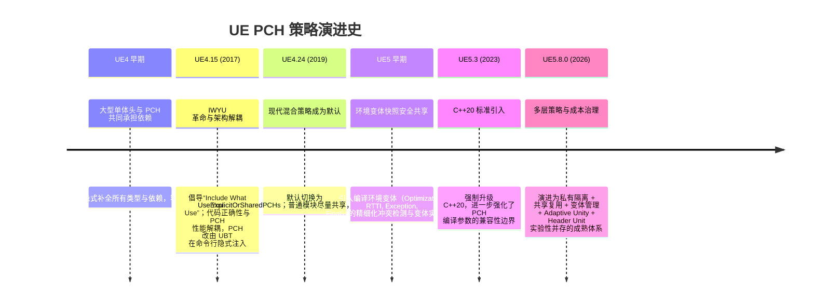
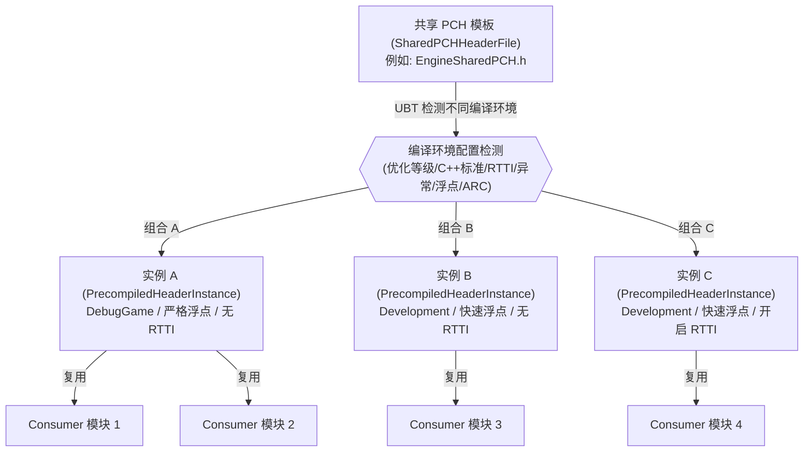

# UE5.8.0 PCH 策略演变与当前最佳实践

> **核验日期**：2026-07-13  
> **源码基线**：`phoenixgou/UnrealEngine5.8` 的 `5.8.0 release` 提交 `7deeb413d3dc1fc034f48d1aacc0861301829d32`  
> **适用范围**：UnrealBuildTool (UBT) 模块级 PCH 策略；物理参数示例以 Windows + MSVC + 传统 `.pch` 路线为主。  
> **不覆盖**：编译器内部 PCH 反序列化实现、UBA 的 CAS 传输细节、所有平台工具链的完整参数差异。

---

## 0. 30秒速查 (TL;DR)

在 UE5.8.0 中，PCH（Precompiled Header，预编译头）的定位已彻底回归其本质：**它只是一项可替换的编译性能优化层，而绝非代码能够正确编译的隐式依赖层**。

### 模块 PCH 快速决策表

| 模块类型 / 编译特征 | 推荐 `PCHUsage` 设置 | 是否声明 `PrivatePCH` | 是否声明 `SharedPCH` | 决策理由与行为特点 |
| :--- | :--- | :---: | :---: | :--- |
| **普通新模块** / **日常业务模块** | `UseExplicitOrSharedPCHs` | ❌ 否 | ❌ 否 | **最佳实践**。强制遵循 IWYU 契约；优先复用引擎现有的共享 PCH，避免产生多余的 PCH 编译动作。 |
| **特殊环境模块** (如需独立优化等级、C++标准、异常、RTTI 或特定宏定义) | `UseExplicitOrSharedPCHs` |  是 | ❌ 否 | 隔离特殊编译环境，防止污染公共共享 PCH 模板，或因环境不兼容产生大量无效变体。 |
| **基础核心/高扇出公共模块** (如 Core, Engine) | `UseExplicitOrSharedPCHs` (或视自身需要) | 视需要 |  是 | 作为共享 PCH 提供者（Provider），暴露最稳定的公共头，通过大量下游消费者（Consumer）均摊编译开销。 |
| **历史遗留非 IWYU 模块** (短时间内无法理清头文件依赖) | `UseSharedPCHs` | ❌ 否 | ❌ 否 | **过渡模式**。允许模块不满足严格的 IWYU 匹配头要求，作为升级过渡期维持可编译性的兼容手段。 |
| **极致排错与依赖核验** | `NoPCHs` | ❌ 否 | ❌ 否 | 强制禁用 PCH，配合非 Unity 编译配置核验代码头文件是否能够完全“自包含”。 |

---

## 一、 PCH 策略演变历史 (Timeline)

Unreal Engine 的 PCH 体系经历了一次深刻的哲学演进：**从“大单体 PCH 乱象”走向“基于 IWYU 的无侵入式环境复用”**。



> [!NOTE]
> **事实与推理边界说明（非官方承诺）**  
> 早期阶段优化的是“单次翻译单元解析速度”，但牺牲了依赖透明度、模块边界和变更隔离。随着引擎规模增长，依赖大型模块头并通过 PCH 加速的方式逐渐成为编译开销爆发的导火索 [S1]。

---

## 二、 PCH 核心工作机制 (PCH Core Mechanism)

### 1. 共享 PCH 的模板 (Template) 与实例 (Instance)

在 UE5.8.0 中，共享 PCH 并非全局唯一的实体文件，而是基于**“模板 - 变体实例”**的一对多关系。

当一个模块声明了 `SharedPCHHeaderFile` 后，它只是定义了一个 **Template**。UBT 在解析消费者模块时，会结合该模块特定的编译上下文（如 RTTI 开关、浮点语义、异常控制等）生成或匹配对应的 **Instance**。



> [!NOTE]
> **事实与推理边界说明（基于构建成本建模）**  
> 共享 PCH 的核心目标不是盲目最大化“共享头文件数量”，而是最大化“兼容消费者数量 / PCH 创建成本”的比值。若变体过多，反而会使 PCH 创建（Create Action）占满关键路径，拉长冷编译时间。

### 2. Engine 模块的“双 PCH”角色图

Unreal Engine 核心模块（例如 `Engine` 模块）在 [Engine.Build.cs](file:///E:/UEWS/5.8.0/Engine/Source/Runtime/Engine/Engine.Build.cs) 中往往同时声明了 `PrivatePCHHeaderFile` 和 `SharedPCHHeaderFile`。它们各司其职，物理边界非常清晰：

```mermaid
graph LR
    subgraph Engine 模块定义 (Engine.Build.cs)
        PrivateH["PrivatePCHHeaderFile<br>(EnginePrivatePCH.h)"]
        SharedH["SharedPCHHeaderFile<br>(EngineSharedPCH.h)"]
    end

    subgraph 内部编译
        EngineSrc[Engine 模块自身源码]
        PrivateH -->|只服务内部| EngineSrc
    end

    subgraph 外部消费
        SubModule1[Renderer 模块]
        SubModule2[Landscape 模块]
        SubModule3[游戏项目模块]
        
        SharedH -->|提供 PCH 模板| SubModule1
        SharedH -->|提供 PCH 模板| SubModule2
        SharedH -->|提供 PCH 模板| SubModule3
    end
    
    style EngineSrc fill:#e6f7ff,stroke:#1890ff,stroke-width:2px
    style PrivateH fill:#fff7e6,stroke:#ffa940,stroke-width:1px
    style SharedH fill:#f6ffed,stroke:#52c41a,stroke-width:1px
```

* **PrivatePCHHeaderFile ([EnginePrivatePCH.h](file:///E:/UEWS/5.8.0/Engine/Source/Runtime/Engine/Private/EnginePrivatePCH.h))**：服务于 Engine 模块内部的大量源文件，包含了大量稳定但高开销的内部私有依赖。
* **SharedPCHHeaderFile ([EngineSharedPCH.h](file:///E:/UEWS/5.8.0/Engine/Source/Runtime/Engine/Public/EngineSharedPCH.h))**：向下游第三方模块暴露的公共基础接口集合。必须保持精简与极其稳定，避免因内部实现重构导致庞大的下游消费者全部重编译。

---

## 三、 UBT PCH 逻辑决策流程 (UBT Decision Engine)

UBT 中控制模块最终是否使用 PCH、使用何种 PCH 的决策链非常精密，主要受 Target 级全局设置与 Module 级局部属性的叠加控制：

```mermaid
flowchart TD
    Start([模块 PCH 决策开始]) --> CheckGlobal{{"Target 级全局启用 PCH?<br>(bUsePCHFiles == true)"}}
    
    CheckGlobal -->|No| ActionNone([PrecompiledHeaderAction.None<br>不使用任何 PCH])
    CheckGlobal -->|Yes| CheckNoPCH{"PCHUsage == NoPCHs?""}
    
    CheckNoPCH -->|Yes| ActionNone
    CheckNoPCH -->|No| CheckPrivate{"是否显式声明私有 PCH 头?<br>(PrivatePCHHeaderFile 且模式允许)"}
    
    CheckPrivate -->|Yes| CheckNoShared{"PCHUsage == NoSharedPCHs?"}
    CheckNoShared -->|Yes| ActionCreatePrivate["创建 / 消费私有 PCH<br>(模块专属 .pch)"]
    CheckNoShared -->|No| CheckExplicitOrShared{"PCHUsage == UseExplicitOrSharedPCHs?"}
    CheckExplicitOrShared -->|Yes| ActionCreatePrivate
    CheckExplicitOrShared -->|No| CheckSharedGlobal
    
    CheckPrivate -->|No| CheckSharedGlobal{"Target 级全局启用共享 PCH?<br>(bUseSharedPCHs == true)"}
    
    CheckSharedGlobal -->|No| ActionNone
    CheckSharedGlobal -->|Yes| CheckSharedAllowed{"PCHUsage 允许共享 PCH?<br>(UseSharedPCHs / UseExplicitOrSharedPCHs)"}
    
    CheckSharedAllowed -->|No| ActionNone
    CheckSharedAllowed -->|Yes| FindTemplate{"在合法依赖项中寻找<br>SharedPCHHeaderFile 模板"}
    
    FindTemplate -->|未找到| ActionNone
    FindTemplate -->|找到模板| FindInstance{"寻找或创建匹配当前<br>编译环境的兼容实例"}
    
    FindInstance -->|已存在兼容实例| ActionInclude["PrecompiledHeaderAction.Include<br>(直接消费现有 .pch)"]
    FindInstance -->|不存在兼容实例| ActionCreateShared["PrecompiledHeaderAction.Create<br>(生成新的共享 .pch 变体)"]
```

> [!NOTE]
> **源码事实**  
> 上述复杂的变体搜索和排序分支核心实现在 UBT 源码中的 [UEBuildModuleCPP.cs:FindOrCreateSharedPCH](file:///E:/UEWS/5.8.0/Engine/Source/Programs/UnrealBuildTool/Configuration/UEBuildModuleCPP.cs) 以及 [UEBuildTarget.cs](file:///E:/UEWS/5.8.0/Engine/Source/Programs/UnrealBuildTool/Configuration/UEBuildTarget.cs) 的编译排队逻辑中。

---

## 四、 物理编译 Action 映射 (Physical Action Mapping)

UBT 最终会把抽象决策（`Create`、`Include`、`None`）映射为物理编译动作。以 Windows MSVC 编译器（`cl.exe`）为例，命令行的映射逻辑如下：

```mermaid
flowchart TD
    subgraph UBT 逻辑决策
        PCHAction{{"PrecompiledHeaderAction 类型"}}
    end
    
    subgraph 物理编译动作映射 (Windows + MSVC)
        PCHAction -->|Create| YcAction["Create Action<br>生成专属创建者源 (*.cpp)"]
        YcAction -->|命令行注入| MSVC_Yc["cl.exe /Yc'包装头'<br>/Fp'PCH文件.pch'<br>/Fo'创建者.obj'"]
        
        PCHAction -->|Include| YuAction["Include Action<br>消费已有 .pch 文件"]
        YuAction -->|命令行注入| MSVC_Yu["cl.exe /Yu'包装头'<br>/FI'包装头'<br>/Fp'PCH文件.pch'"]
        
        PCHAction -->|None| NormalAction["普通编译 Action"]
        NormalAction -->|无命令行注入| MSVC_Normal["cl.exe 正常编译<br>(无 /Yc, /Yu, /FI, /Fp)"]
    end
```

### MSVC 参数原理解析
* **`/Yc"Header"` (Create)**：编译器在此头文件处停止编译，并将之前编译好的 AST 内存状态及其基地址（Base Address）序列化直接写入由 `/Fp` 指定的 `.pch` 文件中 [S4]。
* **`/Yu"Header"` (Use)**：编译器跳过此头文件之前的内容，直接从 `/Fp` 路径反序列化载入 `.pch` 文件中的 AST。
* **`/FI"Header"` (Forced Include)**：由 UBT 强行在每个翻译单元的最开头注入引用此头，从而保证源码层面无需显式包含 PCH。

> [!NOTE]
> **源码事实**  
> 参数物理生成与动作组装的底层逻辑细节，可参见 MSVC 工具链实现 [VCToolChain.cs](file:///E:/UEWS/5.8.0/Engine/Source/Programs/UnrealBuildTool/Platform/Windows/VCToolChain.cs) 与编译动作类 [VCCompileAction.cs](file:///E:/UEWS/5.8.0/Engine/Source/Programs/UnrealBuildTool/Platform/Windows/VCCompileAction.cs)。

---

## 五、 五种 `PCHUsageMode` 深度对比 (Configuration Reference)

在 [ModuleRules.cs](file:///E:/UEWS/5.8.0/Engine/Source/Programs/UnrealBuildTool/Configuration/ModuleRules.cs) 中定义的 `PCHUsageMode` 的准确内涵如下：

| `PCHUsageMode` 枚举值 | 私有 PCH 支持 | 共享 PCH 支持 | 底层设计意图与避坑指南 |
| :--- | :---: | :---: | :--- |
| **`UseExplicitOrSharedPCHs`** | **允许**<br>(优先使用) | **允许**<br>(无私有头时复用) | **现代 IWYU 默认策略**。有显式私有 PCH 时建立私有 PCH，否则自动复用兼容的共享 PCH [S1]。新写的引擎/游戏模块应当无脑首选此设置。 |
| **`UseSharedPCHs`** | ❌ 禁用 | **允许** | **历史兼容过渡模式**。不对当前模块进行“首个包含头必须是匹配接口头”的严格 IWYU 约束。通常用在升级引擎后、尚未完成 IWYU 治理的历史遗留模块 [S1]。 |
| **`NoSharedPCHs`** | **允许**<br>(必须显式声明) | ❌ 禁用 | **环境隔离模式**。强制阻止该模块去寻找或污染任何共享 PCH 实例，必须自建私有 PCH，否则回退为不使用 PCH。 |
| **`NoPCHs`** | ❌ 禁用 | ❌ 禁用 | **彻底禁用 PCH**。该模块下所有翻译单元纯冷编译解析，常用于 CI 验证依赖独立性或应对极特殊的物理编译冲突。 |
| **`Default`** | 视解析而定 | 视解析而定 | **历史存留哨兵**。新版 Build 规则中已非静态策略默认，不应在现代代码中显式配置该枚举。 |

---

## 六、 当前最佳实践与反模式 (Best Practices & Anti-Patterns)

### 1. 经典场景推荐矩阵

| 场景特点 | 最佳实践参数组合 | 源码约束规范 |
| :--- | :--- | :--- |
| **日常模块/普通新模块** | `PCHUsage = UseExplicitOrSharedPCHs;` | 无需配置任何私有头或共享头。保持 IWYU，让 UBT 自动复用。 |
| **特殊定制优化模块**<br>(特殊 FP 模式/异常/RTTI) | `PCHUsage = UseExplicitOrSharedPCHs;`<br>`PrivatePCHHeaderFile = "Private/MyPrivatePCH.h";` | 必须建立并显式声明私有 PCH，防止编译选项冲突污染全局环境。 |
| **基础高复用底层模块** | `PCHUsage = UseExplicitOrSharedPCHs;`<br>`SharedPCHHeaderFile = "Public/MySharedPCH.h";` | 头文件内容必须极其稳定。非核心基础模块切忌随意声明为 Provider。 |
| **大型 CI 依赖校验环境** | `Target.bUsePCHFiles = false;`<br>`Target.bUseUnityBuild = false;` | 在独立校验流水线中全局关闭，强制裸编译暴露隐式 include 遗漏 [S1]。 |

---

### 2. 核心避坑指南 (Anti-Patterns)

> [!CAUTION]
> **反模式 1：每个新建模块都图省事声明 `PrivatePCHHeaderFile`**  
> * **后果**：这会使得 UBT 无法对这些模块进行共享 PCH 复用，导致构建流水线中产生大量的 PCH Create Action。这极大增加了冷编译和分布式编译文件分发的网络负担。

> [!CAUTION]
> **反模式 2：长期在模块中使用 `UseSharedPCHs` 绕过 IWYU 规范**  
> * **后果**：虽然编译能通过，但代码会隐式依赖共享 PCH 内部包含的各类无关头文件。一旦将来基础模块的共享头文件重构，该模块将面临大规模的代码损坏。

> [!IMPORTANT]
> **反模式 3：共享 PCH 模板（Provider）的内容频繁修改**  
> * **后果**：这会导致所有复用该模板的消费者（Consumer）实例全部失效，并在日常开发（增量编译）中引发近乎全局的完全重编译，使得 PCH 的加速效果彻底退化为负收益。

---

## 七、 迁移、度量与验证 (Migration & Metrics)

### 1. 历史非 IWYU 模块迁移路径

对于不符合规范的存量老模块，建议遵循以下五步走策略实现“软着陆”迁移：

```text
【步骤 1：现状摸底】记录模块当前使用的 PCH 模式及其实际产生的变体实例数量。
     │
     ▼
【步骤 2：环境净化】在独立测试分支设置 Target.bUsePCHFiles = false 与 bUseUnityBuild = false 尝试编译。
     │
     ▼
【步骤 3：修复编译】根据报错提示，依次修复各头文件的“自包含性”（缺失 #include）和实现源的“匹配接口头优先”顺序。
     │
     ▼
【步骤 4：切回混合模式】将 ModuleRules 内的 PCHUsage 属性升级为 UseExplicitOrSharedPCHs。
     │
     ▼
【步骤 5：数据回归】重新启用 PCH 与 Unity Build，对比冷热重建时间及 PCH 变体构建开销。
```

---

### 2. 构建效能回归度量指标 (Performance Metrics)

> [!NOTE]
> **事实与推理边界说明（构建效能模型建议）**  
> 调优 PCH 时切勿盲目只测量一次完整冷编译。建议覆盖以下多重日常高频场景以收集效能指标：

* **冷启动开销**：全局完整干净冷重建（冷缓存）所需的编译时长及产生的 PCH Create 数量。
* **极小增量开销**：仅仅修改单个内部源文件（`.cpp`）后，重新增量构建的耗时（应在秒级以内）。
* **接口变更扇出**：修改模块私有接口头文件后，受影响并参与重编译的 Action 范围与规模。
* **公共变更灾难测试**：修改公共共享 PCH 模板（如 `EngineSharedPCH.h`）后，整条构建链的关键路径耗时与重建比例。

---

## 八、 官方与本地源码引用

### 1. 官方文档引用说明
* **[S1] Epic 官方 IWYU 编程规范指南**：  
  [Epic Games IWYU Documentation](https://dev.epicgames.com/documentation/en-us/unreal-engine/include-what-you-use-iwyu-for-unreal-engine-programming)
* **[S2] Epic 官方 UBT TargetRules 属性表**：  
  [Epic Games Target Rules Reference](https://dev.epicgames.com/documentation/en-us/unreal-engine/unreal-engine-build-tool-target-reference)
* **[S3] Epic 官方 ModuleRules 模块定义属性表**：  
  [Epic Games Module Properties Reference](https://dev.epicgames.com/documentation/en-us/unreal-engine/module-properties-in-unreal-engine)
* **[S4] MSVC 预编译头文件机制细节说明**：  
  [Microsoft Learn MSVC Precompiled Header](https://learn.microsoft.com/en-us/cpp/build/creating-precompiled-header-files?view=msvc-170)

---

### 2. 本地工作区 UBT 与引擎源码直达一览
以下源码位置均锚定至本地工作区 `E:\UEWS\5.8.0`（Phoenix 分支最新提交）：

* **[R1] UBT PCH 变体匹配及实例分配算法**：  
  [UEBuildModuleCPP.cs](file:///E:/UEWS/5.8.0/Engine/Source/Programs/UnrealBuildTool/Configuration/UEBuildModuleCPP.cs)
* **[R2] Target 编译管线组装与 PCH 依赖排序引擎**：  
  [UEBuildTarget.cs](file:///E:/UEWS/5.8.0/Engine/Source/Programs/UnrealBuildTool/Configuration/UEBuildTarget.cs)
* **[R3] ModuleRules 暴露给构建配置脚本的 PCH 选项定义**：  
  [ModuleRules.cs](file:///E:/UEWS/5.8.0/Engine/Source/Programs/UnrealBuildTool/Configuration/ModuleRules.cs)
* **[R4] TargetRules BuildSettings 历史版本行为快照**：  
  [TargetRules.cs](file:///E:/UEWS/5.8.0/Engine/Source/Programs/UnrealBuildTool/Configuration/TargetRules.cs)
* **[R5] MSVC 构建命令行注入及平台兼容性编译实现**：  
  [VCToolChain.cs](file:///E:/UEWS/5.8.0/Engine/Source/Programs/UnrealBuildTool/Platform/Windows/VCToolChain.cs)
* **[R6] Windows 物理编译动作及其 prerequisite 建模细节**：  
  [VCCompileAction.cs](file:///E:/UEWS/5.8.0/Engine/Source/Programs/UnrealBuildTool/Platform/Windows/VCCompileAction.cs)
* **[R7] Engine 模块编译选项与双 PCH 规则声明文件**：  
  [Engine.Build.cs](file:///E:/UEWS/5.8.0/Engine/Source/Runtime/Engine/Engine.Build.cs)
* **[R8] Engine 模块私有 PCH（PrivatePCH）具体内容**：  
  [EnginePrivatePCH.h](file:///E:/UEWS/5.8.0/Engine/Source/Runtime/Engine/Private/EnginePrivatePCH.h)
* **[R9] Engine 模块向下游提供的共享 PCH 模板内容**：  
  [EngineSharedPCH.h](file:///E:/UEWS/5.8.0/Engine/Source/Runtime/Engine/Public/EngineSharedPCH.h)
