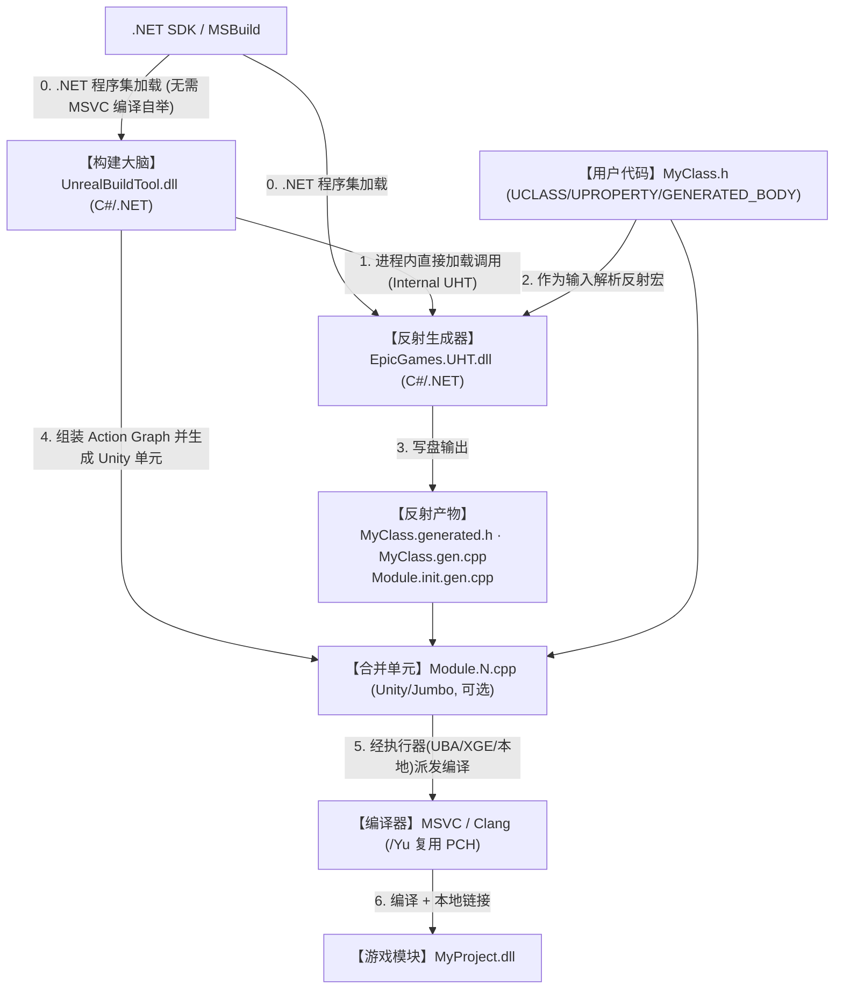
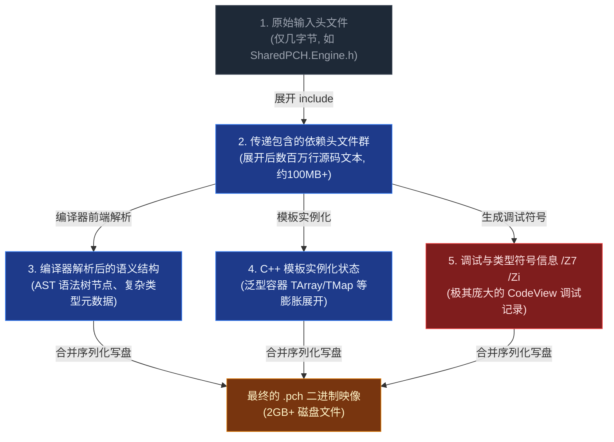

# Unreal Engine 构建管线详解（基于 UE 5.7.4 审校修订版）

本文档详细介绍了虚幻引擎 (Unreal Engine) 在 **5.7.4（当前活动版本）** 下的构建系统核心组件：**UBT**、**UHT**、**Unity Build**、**PCH (Module/Shared)**、**UBA** 和 **XGE**，以及它们之间的依赖关系、协作时序与构建优化建议。

---

## 版本重要适用性说明

对于 UE 5.7.4，很多传统的编译概念（如早期 UE4/UE5 的机制）已发生重大变化，请在开发与调优时注意以下差异：

| 维度 | 旧模型 (原文档) | UE 5.7.4 (当前版本实测) |
| --- | --- | --- |
| **UHT 实现语言** | C++ 可执行程序 `UnrealHeaderTool.exe` | **C# / .NET 程序集 `EpicGames.UHT.dll`** |
| **UHT 启动方式** | UBT fork 一个独立的 UHT 子进程 | **UBT 进程内直接加载并调用**（日志：`Running Internal UnrealHeaderTool`） |
| **自举编译 (Step 0)** | MSVC 编译器先编译出 `UHT.exe` | **不存在此步骤**；UBT 和 UHT 均为 .NET 程序集，直接分发 |
| **分布式/编译加速** | 仅讲 XGE / IncrediBuild | **UBA (引擎自带) 为默认**，XGE/SN-DBS/FASTBuild 为可选，末尾回退本地并行 |
| **Unity/Jumbo 构建** | 未提及 | **Unity Build、自适应 Unity 与 IWYU 默认开启**，是编译时间的主控变量 |

---

## 一、 核心组件角色与职责

### 1. UBT (Unreal Build Tool) —— 构建大脑
* **定位**：C# / .NET 编写的构建编排与管理工具（程序集 `UnrealBuildTool.dll`）。
* **职责**：
  * 解析项目与引擎的 `*.Target.cs` / `*.Build.cs` 文件，构建全局模块依赖树。
  * 识别脏文件，计算需要重新编译的最小 Action 集合，生成 **Action Graph**。
  * **在自身进程内直接加载并调用 UHT** 收集反射代码。
  * 拼装并生成 **Unity（Jumbo）合并编译单元**。
  * 评估并选择最适合的执行器（UBA/XGE/本地并行），派发实际的编译与链接动作。

### 2. UHT (Unreal Header Tool) —— 反射生成器
* **定位**：**C# / .NET 编写的语法解析与反射代码生成程序**（程序集 `EpicGames.UHT.dll`）。它不再是 C++ 编写的可执行程序，不需要本地编译器先将其自举编译出来。
* **调用方式**：由 UBT 在其进程内以异步模式加载调用（`UnrealHeaderToolMode.ExecuteAsync`）。
* **职责**：
  * 在 C++ 实际编译前，扫描带 `UCLASS`、`UPROPERTY`、`UFUNCTION`、`USTRUCT` 等宏的头文件。
  * 解析元数据，输出引擎反射系统、垃圾回收、蓝图通信等所需的 C++ 代码。
* **产物组成**：
  * `MyClass.generated.h`：每个头文件对应一份，要求必须作为源头文件的最后一个 `#include`。
  * `MyClass.gen.cpp`：每个头文件对应一份，用于向引擎注册反射类信息。
  * `<ModuleName>.init.gen.cpp`：每个模块生成一份，用于模块/包级的初始化（注册包反射信息）。

### 3. Unity Build / Jumbo（合并编译单元）
* **定位**：UBT 的编译合并优化策略，默认开启（`bUseUnityBuild = true`）。
* **职责**：
  * 将同一模块下的多个 `.cpp` 文件（包含生成的 `.gen.cpp`）拼接到少量的 `Module.N.cpp` 文件中（通过 `#include` 串联多份源文件）再丢给编译器。
  * 核心目的是**摊薄头文件解析和模板实例化的重复编译成本**。
  * **自适应机制**：5.7.4 默认启用 `bUseAdaptiveUnityBuild = true`，近期修改过的源文件会被自动拆出 Unity 单元单独编译，平衡了全量编译和增量迭代的编译速度。

### 4. ModulePCH (Module Precompiled Header) —— 模块私有预编译头
* **定位**：针对单个模块私有定制的预编译头。通过 `PrivatePCHHeaderFile` 显式指定，或在满足阈值时隐式启用。
* **职责**：缓存本模块特有且不常修改的公共头文件，只在当前模块内共享，防止模块变动影响到外部其他模块。

### 5. SharedPCH (Shared Precompiled Header) —— 共享预编译头
* **定位**：跨模块共享的通用 `.pch`。由核心基础模块（如 `Core`、`CoreUObject`、`Engine`、`Slate`）声明并提供。
* **职责**：
  * 将底层高频引用的基础头文件预先编译成一套共享的二进制模板，任何依赖这些底层模块且没有特化 PCH 的上层模块直接套用（如 `SharedPCH.UnrealEd.Project.ValApi.ValExpApi.Cpp20.h.pch`）。
  * 极大减少了全量构建时生成零碎 PCH 带来的重复编译和磁盘空间浪费。

### 6. IWYU (Include What You Use) —— 头文件清洁策略
* **定位**：引擎默认强制开启（`bEnforceIWYU = true`）。
* **职责**：要求每个源文件显式 `#include` 自己直接使用的头文件，而不是隐式依赖庞大的公共依赖头。这从源头上减小了 PCH 的失效扩散面，有利于减小 PCH 文件的总体积。

### 7. 执行器 (Executors) —— 编译加速分发
UBT 组装完编译 Action 后，会根据环境的优先级选择最优先的执行器（`RemoteExecutorPriority = ["XGE", "SNDBS", "FASTBuild", "UBA"]`）：

* **XGE / IncrediBuild**：第三方分布式系统，优先级最高。仅在本地安装了 IncrediBuild 时可用。
* **UBA (Unreal Build Accelerator) —— 引擎默认**：Epic 自研的构建加速器。在没有安装第三方 IncrediBuild 的机器上，**UBA 是事实上的默认编译执行器**。
* **ParallelExecutor**：本地多进程并行编译（无分布式）。

### 8. UBA (Unreal Build Accelerator) —— 虚幻自带加速核心
* **定位**：引擎自带的编译加速与进程 detour 工具。
* **机制**：
  * **本地模式**：通过 Detour 技术和内容寻址缓存，过滤不必要的本地 I/O，并利用多核并发加速。
  * **分布式模式**：通过 Agent 协调服务，将编译任务分发到远程节点上执行。
  * 它采用流式传输、压缩传输 (`bAllowUbaCompression`) 与内容寻址缓存（Cache 目录位于 `%ProgramData%\Epic\UnrealBuildAccelerator`），只传输缺失的文件块，能够显著缓解分布式编译下的网络流量峰值。

---

## 二、 构建与数据流向关系

### 1. 静态流程与数据流向图 (Static Build & Data Flow)
下图以**“数据与动作的真实流向”**为准，展示了整个编译生命周期：

### 2. 核心关系梳理
* **无自举阶段**：UBT 与 UHT 本身是 .NET 的 DLL 程序集，在引擎分发时就已经就绪，不存在“先用 C++ 编译器编出 UHT.exe”的自举步骤。
* **进程内反射**：UBT 并不派生（fork）独立的 UHT 子进程，而是在自身进程空间内直接调用 `EpicGames.UHT` 的 API 运行反射代码生成。
* **混合编译**：生成的 `.gen.cpp` 文件和包初始化文件 `.init.gen.cpp` 会被 UBT 统一搜集，与项目 `.cpp` 打包合并为 Unity 文件后送往编译器。

---

## 三、 端到端执行时序（全景时序图）

下图展示了从触发编译到最终生成 DLL，反射生成、PCH 生成（强本地）、执行器分发（UBA/XGE）、以及链接的完整生命周期：

```mermaid
sequenceDiagram
    autonumber
    actor Dev as 开发者 / 编辑器
    participant UBT as UBT (.NET 构建大脑)
    participant UHT as UHT (.NET, UBT 进程内)
    participant Local as 本地编译器 (MSVC/Clang)
    participant Accel as 构建加速器 (UBA 默认 / XGE 可选)
    participant Agent as 远程 Agent / Helper
    participant Linker as 本地链接器 (link.exe)

    Dev->>UBT: 发起编译 (Build Target)
    UBT->>UBT: 1. 扫描变更文件, 构建模块依赖树, 生成 Action Graph

    rect rgb(30, 41, 59)
        note over UBT, UHT: 阶段一：反射代码生成 (进程内 UHT)
        UBT->>UHT: 2. 进程内调用 UnrealHeaderToolMode.ExecuteAsync
        activate UHT
        UHT->>UHT: 3. 解析反射宏, 写盘 .generated.h / .gen.cpp / .init.gen.cpp
        UHT-->>UBT: 4. 返回成功信号 (CompilationResult.Succeeded)
        deactivate UHT
        UBT->>UBT: 5. 将生成的 C++ 文件并入编译列表, 生成 Unity 合并单元
    end

    rect rgb(30, 58, 138)
        note over UBT, Local: 阶段二：PCH 本地预编译 (关键路径, 强本地)
        UBT->>UBT: 6. 检查 SharedPCH / 模块 PCH 是否失效
        opt PCH 已失效 (依赖的公共头文件被改动等)
            UBT->>Local: 7. 本地发起 /Yc 编译 PCH (bCanExecuteRemotely=false)
            activate Local
            Local->>Local: 8. 编译公共头 -> 序列化输出大体积 .pch 文件 (2GB+)
            Local-->>UBT: 9. PCH 编译就绪
            deactivate Local
        end
    end

    rect rgb(15, 23, 42)
        note over UBT, Agent: 阶段三：分布式/并行编译 (执行器优先分发)
        UBT->>Accel: 10. 派发编译任务 (带 /Yu "使用 PCH" 指令)
        activate Accel
        Accel->>Agent: 11. 将 .pch、工具链及源文件流式传输至 Agent 本地缓存
        par 多 Agent 节点并发编译
            Accel->>Agent: 12. 派发具体的 Module.N.cpp 编译 Action
            activate Agent
            Agent->>Agent: 13. 直接载入本地缓存中的 .pch 结构，编译生成 .obj
            Agent-->>Accel: 14. 返回编译生成的 .obj 目标文件
            deactivate Agent
        end
        Accel-->>UBT: 15. 汇总所有编译好的 .obj 并传回本地
        deactivate Accel
    end

    rect rgb(20, 35, 20)
        note over UBT, Linker: 阶段四：链接生成产物 (本地单机运行)
        UBT->>Linker: 16. 调用本地链接器 link.exe
        activate Linker
        Linker->>Linker: 17. 解析符号表，生成动态库 / 可执行文件
        Linker-->>UBT: 18. 链接完成
        deactivate Linker
    end

    UBT-->>Dev: 19. 编译成功 -> 输出二进制 (MyProject.dll)
```

---

## 四、 为什么 PCH 文件会达到 2GB+ 这么庞大？

PCH（预编译头）文件在虚幻引擎中体积极其巨大，其本质是编译器将解析后的**内存状态与符号数据库直接序列化写盘**的过程。

### 1. PCH 体积膨胀流向图 (PCH Size Explosion Flow)
下图直观呈现了原本只有几字节的入口头文件，是如何在编译器的处理下逐步膨胀为数吉字节 (GB) 二进制文件的：

### 2. 膨胀核心因素拆解
* **传递依赖爆炸 (Transitive Includes)**：入口文件如 `Engine.h` 内部通过层层包含，几乎拉取了渲染、物理、音频、底层容器等整套引擎头文件，预处理展开后源码行数可达数百万行。
* **C++ 模板实例化 (Template Instantiation)**：UE 大量使用泛型模板（如 `TArray`、`TMap`、`TSharedPtr` 等）。为了让后续编译直接复用，编译器在编译 PCH 时会将这部分实例化相关的符号与状态完整固化。
* **CodeView 调试符号写入 (/Z7 /Zi)**：在非 Shipping 模式（如 Debug、Development）下，编译器会将极其庞大的调试类型符号和调试映射表打包写入 PCH 中，这是文件体积达到 GB 级的最大因素（本机最大 PCH 实测 ~2304 MB）。

---

## 五、 分布式编译中的网络痛点：PCH Fanout (预编译头扇出)

当启用分布式编译加速（UBA 远程模式或 XGE 模式）时，PCH 的大体积会造成严峻的**网络上传带宽瓶颈**：

1. **强本地生成**：PCH 编译由于被设计为编译流的关键路径（Critical Path Task），默认情况下**不允许分布式生成**。
   > 源码证据：`VCToolChain.cs` 中注释明确指出 *"Don't farm out creation of precompiled headers as it is the critical path task"*。参数 `bAllowRemotelyCompiledPCHs` 默认硬编码为 `false`。因此，PCH 必须在主控机本地生成。
2. **高频分发压力**：若任务分发到 $N$ 台 Agent，主控机需把大体积 PCH 送达每台 Agent。
3. **理论网络流量上界**：
   $$\text{理论峰值流量} \approx \text{PCH 体积} \times N_{\text{Agent}} = 2.4\ \text{GiB} \times 100 \text{ 台 Agent} = 240\ \text{GiB}$$
4. **实际网络情况**：虽然 XGE 与 UBA 底层均采用了**切块传输、增量缓存、按需流式拉取**及 UBA 独有的**压缩与内容寻址**，使实际流量低于理论上界。但如果**底层核心头文件发生变动导致 PCH 重新生成**，其签名改变会使得所有 Remote Agent 的缓存全部失效，从而诱发瞬间的上传带宽风暴，打满主控机上行网卡，使分布式集群产生严重的“卡顿”等待现象。

---

## 六、 开发与编译调优建议

1. **坚决不要污染底层公共头**：切勿在 `Core`、`CoreUObject`、`Engine` 等底层基础模块的公共头中添加无关的修改或临时测试宏，防止 SharedPCH 被频繁击穿重建，从而引发分布式网络风暴。这是最省力、效果最明显的编译调优。
2. **为重量级模块设置显式私有 PCH**：若模块引入了庞大且相对独立的第三方 SDK（如物理引擎、复杂算法库等），建议显式通过 **`PrivatePCHHeaderFile`** 指定私有 PCH，让该模块的 SDK 头文件一次性预编译进本模块，从而使其脱离引擎 SharedPCH 的失效链。
3. **合理利用自适应 Unity Build**：迭代阶段保持 `bUseAdaptiveUnityBuild = true` 开启，这样每次只修改少数文件时，它们会被自动剔除出 Unity 单元进行单文件增量编译，大大节约每次的编译响应时间。在排查“头文件缺失”时可临时关闭 Unity 进行严格测试。
4. **坚持 IWYU 规范**：严格执行 include-what-you-use 策略，只包含直接使用的头文件，这样能够从架构上压小 SharedPCH 的覆盖面，避免一处变动导致全局编译失效。
5. **正确调整并行动作数**：在 UE 5.7.4 中限制 UBT 并行构建动作数，命令行参数应当使用 **`-MaxParallelActions`**（原文档中 `-MaxCpuCount` 参数在此版本已不存在）。当主控机网络带宽成为瓶颈时，应当调小此值以减少并发分发的网络挤兑。
6. **按环境选用执行器**：安装了 IncrediBuild 时选用 XGE；未安装时依赖引擎自带的 **UBA**（已默认开启，分单机和分布式两态）。本工作区如需强制指定 XGE，应按照 `AGENTS.md` 所述，追加 `-NoUBA -NoFASTBuild -NoSNDBS` 参数以避开内置的 UBA。
7. **多使用 Live Coding**：在日常 C++ 逻辑迭代中，充分利用 Live Coding（热重载系统）进行小范围 Patch，从而完全绕过 UHT 解析、PCH 校验及大型链接阶段，实现秒级迭代。
