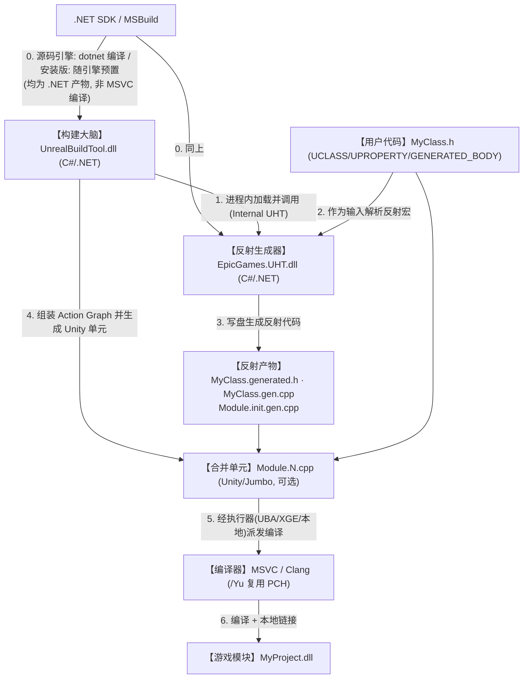

# Unreal Engine 构建管线详解（审校修订版：UBT · UHT · Unity · PCH · UBA/XGE）

> 本文是对 `Docs/UE_Build_Pipeline.md` 的审校与重写版本。
> **基准引擎：本工作区的 `5.7.4`（UE 5.7.4 安装版）**，所有结论均以其 `Engine/Source` 源码与真实构建产物为证据核对。
> 文末「附录 A」给出与原文档的逐项差异及源码依据。

---

## 版本适用性（重要）

原文档对 **UHT 的语言与自举方式**、**分布式编译体系** 的描述属于 **UE4 / 早期 UE5** 的旧模型，与本工作区的 UE 5.7.4 已不符：

| 维度 | UE4 / 旧模型（原文档） | UE5（5.7.4，本工作区实测） |
| --- | --- | --- |
| UHT 实现语言 | C++ 可执行程序 `UnrealHeaderTool.exe` | **C# / .NET 程序集 `EpicGames.UHT.dll`** |
| UHT 启动方式 | UBT fork 一个独立 UHT 进程 | **UBT 进程内直接调用**（日志：`Running Internal UnrealHeaderTool`） |
| “自举 Step 0” | MSVC 先把 UHT 源码编译成 `UHT.exe` | **不存在该步骤**；UBT/UHT 均为 .NET 产物 |
| 分布式编译 | 仅 XGE / IncrediBuild | **UBA（引擎自带）为默认**，XGE/SN-DBS/FASTBuild 为可选，末尾回退本地并行 |
| Unity/IWYU | 未提及 | **Unity（Jumbo）构建、IWYU 默认开启**，是编译耗时的关键变量 |

> 证据：`5.7.4/Engine/Source/Programs/` 下 **已无** `UnrealHeaderTool` 目录；UHT 源码位于 `Engine/Source/Programs/Shared/EpicGames.UHT/`（133 个 `.cs` + 1 个 `.csproj`）。

---

## 一、核心组件角色与职责

### 1. UBT（Unreal Build Tool）—— 构建大脑
* **定位**：C# / .NET 编写的构建编排工具（程序集 `UnrealBuildTool.dll`）。
* **职责**：
  * 解析 `*.Target.cs` / `*.Build.cs`，构建模块依赖树。
  * 识别脏文件，计算需要重编的最小集合，组装 **Action Graph**。
  * **在自身进程内加载并驱动 UHT**（见下）。
  * 生成 **Unity（Jumbo）合并编译单元**。
  * 通过 `SelectExecutor` 选择执行器（UBA/XGE/SN-DBS/FASTBuild/本地并行），派发编译与链接。

### 2. UHT（Unreal Header Tool）—— 反射生成器
* **定位（已变更）**：**C# / .NET 语法解析与代码生成器**，程序集 `EpicGames.UHT.dll`。它 **不是** C++ 可执行程序，也 **不需要** 用 MSVC 先行编译出 `UHT.exe`。
* **启动方式（已变更）**：由 UBT **在同一进程内**调用 `UnrealHeaderToolMode.ExecuteAsync(...)`（内部构造 `UhtSession`），日志打印 `Running Internal UnrealHeaderTool`。不再 fork 独立子进程。
* **职责**：
  * 在 C++ 编译前，扫描带 `UCLASS()` / `USTRUCT()` / `UENUM()` / `UPROPERTY()` / `UFUNCTION()` / `GENERATED_BODY()` 的头文件。
  * 解析反射元数据，生成供反射系统、GC、序列化、蓝图互操作使用的辅助代码。
* **产物命名**（本工作区实测一致）：
  * `MyClass.generated.h`（**每个头文件一份**，需作为该头的最后一个 `#include`）；
  * `MyClass.gen.cpp`（**每个头文件一份**，注册反射体）；
  * `<Module>.init.gen.cpp`（**每个模块一份**，模块/包级初始化——原文档遗漏）。

### 3. Unity Build / Jumbo（合并编译单元）—— 原文档遗漏
* **定位**：UBT 把同一模块的多个 `.cpp`（含 `.gen.cpp`）拼进少量 `Module.N.cpp`（每个用 `#include` 串联多份源文件）后再交给编译器，从而 **摊薄头文件解析与模板实例化成本**。
* **默认值（5.7.4 实测）**：`bUseUnityBuild` 默认开启；`bUseAdaptiveUnityBuild = true`（**自适应 Unity**：把近期改动的文件拆出 Unity 单独编译，改善迭代速度）；`NumIncludedBytesPerUnityCPP = 384 KB`；`MinGameModuleSourceFilesForUnityBuild = 32`。
* **与 PCH 的关系**：Unity 减少了翻译单元数量，PCH 减少了每个翻译单元的头解析量，二者叠加才是 UE “全量快、增量慢”的根因。

### 4. ModulePCH（模块私有/显式预编译头）
* **定位**：针对单个模块生成的私有 `.pch`。通过 `PrivatePCHHeaderFile` 显式指定，或在满足阈值时由引擎隐式生成。
* **职责**：缓存本模块高频引用、极少改动的头，仅供本模块 `.cpp` 复用，加速该模块重复构建。
* **补充**：现代模块默认 `PCHUsage = UseExplicitOrSharedPCHs`，源文件 **不手动 include 模块 PCH**，而是 include 对应头，由构建系统接管 PCH 复用。

### 5. SharedPCH（共享预编译头）
* **定位**：跨模块共享的通用 `.pch`。由基础模块通过 `SharedPCHHeaderFile` 声明为提供者（如 `Core`、`CoreUObject`、`Engine`、`Slate`）。
* **职责**：把底层核心模块的头预编译成一套共享模板，任何依赖它们且未声明私有 PCH 的模块直接套用，减少 PCH 编译总量与磁盘占用。
* **命名更正**：真实文件名含 C++ 标准后缀，例如本机实测的 `SharedPCH.UnrealEd.Project.ValApi.ValExpApi.Cpp20.h.pch`（原文档的 `SharedPCH.Engine.h.pch` 属简化写法）。

### 6. IWYU（Include What You Use）—— 原文档遗漏
* **定位**：UE 的头文件卫生策略，`bEnforceIWYU = true` 默认开启。要求每个文件显式包含自己所需的头，减少对“大而全”公共头的隐式依赖，从而降低 SharedPCH 体积与失效面。

### 7. 执行器（Executors）—— 原文档只写了 XGE
UBT 通过 `SelectExecutor` 按 `RemoteExecutorPriority` 顺序择优，全部不可用时回退本地并行：

| 执行器 | 归属 | 默认开关（5.7.4） | 说明 |
| --- | --- | --- | --- |
| **XGE / IncrediBuild** | 第三方（Xoreax） | `bAllowXGE=true` | 需本机安装 IncrediBuild 才 `IsAvailable`；优先级最高 |
| **SN-DBS** | 第三方（SN Systems） | `bAllowSNDBS` | 主机平台常用 |
| **FASTBuild** | 第三方 | `bAllowFASTBuild` | 实验性 |
| **UBA（Unreal Build Accelerator）** | **引擎自带** | `bAllowUBAExecutor=true` | **本节重点**，见下 |
| **ParallelExecutor** | 引擎自带 | 兜底 | 本机多进程并行，无分布式 |

> 默认优先级：`["XGE","SNDBS","FASTBuild","UBA"]` → 本地 `ParallelExecutor`。
> 关键含义：**未装 IncrediBuild 的机器上，XGE/SN-DBS/FASTBuild 都不可用，UBA 便成为事实默认**（`bAllowUBAExecutor` 默认为真且引擎自带）。

### 8. UBA（Unreal Build Accelerator）—— 原文档缺失的关键组件
* **定位**：Epic 官方的构建加速器，C++ 原生核心（`UbaHost`/`UbaDetours` 等，位于 `Engine/Binaries/Win64/UnrealBuildAccelerator`）+ C# 调度层 `UBAExecutor`。目标是 **取代对第三方 XGE 的依赖**。
* **两种形态**（源码实测）：
  * **本地加速**（`Unreal Build Accelerator local`）：进程 detour + 缓存，加速单机编译；当动作数较少时自动 `bDisableRemote`。
  * **分布式**（`Unreal Build Accelerator`）：接入 Agent 协调器（如 Horde）把编译分发到远程节点。
* **传输机制**：对输入/工具链使用 **压缩**（`bAllowUbaCompression`，编译动作标记 `Compressed`）与 **内容寻址缓存**（`ICacheClient`，缓存根位于 `%ProgramData%\Epic\UnrealBuildAccelerator`），仅传输缺失块，显著缓解（但不消除）PCH 扇出压力。

> 本工作区约定：`AGENTS.md` 的构建命令使用 `-NoUBA -NoFASTBuild -NoSNDBS` 且保留 XGE，即 **本机刻意走 IncrediBuild**。这与“UBA 是引擎默认”的事实并不矛盾——命令显式改变了执行器选择。

---

## 二、构建与数据流向关系

### 1. 静态流程与数据流向图（Static Build & Data Flow）

### 2. 核心关系梳理（更正版）
* **准备阶段（Step 0）**：UBT 与 UHT 都是 **.NET 程序集**。源码版由 `dotnet`/MSBuild 编译；安装版随引擎以预编译程序集分发。**无论哪种，都不是 C++/MSVC 的产物，不存在“先用编译器造出 UHT.exe”的自举**。
* **反射阶段（Step 1–3）**：UBT **在自身进程内**调用 UHT；UHT 读取带反射宏的头文件，写出 `*.generated.h` / `*.gen.cpp` 以及模块级 `*.init.gen.cpp`。
* **组装阶段（Step 4）**：UBT 把用户 `.cpp` 与生成的 `.gen.cpp` 打包为 Unity 合并单元，并组装 Action Graph。
* **编译阶段（Step 5–6）**：编译器以 `/Yu` 复用 PCH 编译各翻译单元；执行器选择 UBA（默认）或 XGE（若装 IncrediBuild）或本地并行；最终 **本地链接** 输出 `MyProject.dll`。

---

## 三、端到端执行时序（全景时序图）

> 下图覆盖：进程内 UHT 生成 → PCH 本地预编译（关键路径，强制本地）→ 执行器择优分发（UBA/XGE）→ Agent 读 PCH 编译 → 本地链接。

```mermaid
sequenceDiagram
    autonumber
    actor Dev as 开发者 / 编辑器
    participant UBT as UBT (.NET 构建大脑)
    participant UHT as UHT (.NET, UBT 进程内)
    participant Local as 本地编译器 (MSVC/Clang)
    participant Accel as 构建加速器 (UBA 默认 / XGE 可选)
    participant Agent as 远程 Agent / Helper
    participant Linker as 本地链接器 (link.exe)

    Dev->>UBT: 发起编译 (Build Target)
    UBT->>UBT: 加载并校验 UBT/UHT 程序集, 扫描变更, 计算 Action Graph

    rect rgb(30, 41, 59)
        note over UBT, UHT: 阶段一 反射代码生成 (进程内 UHT, 非独立 exe)
        UBT->>UHT: 进程内调用 UnrealHeaderToolMode.ExecuteAsync (传入 manifest)
        activate UHT
        UHT->>UHT: 解析 UCLASS/UPROPERTY, 写盘 .generated.h / .gen.cpp / .init.gen.cpp
        UHT-->>UBT: 返回 CompilationResult.Succeeded
        deactivate UHT
        UBT->>UBT: 将新 .gen.cpp 纳入编译列表, 生成 Unity 合并单元
    end

    rect rgb(30, 58, 138)
        note over UBT, Local: 阶段二 PCH 本地预编译 (关键路径, 强制本地)
        UBT->>UBT: 检查 SharedPCH / 私有 PCH 是否失效
        opt PCH 失效 (底层头被改动等)
            UBT->>Local: /Yc 创建 PCH (bCanExecuteRemotely=false)
            activate Local
            Local->>Local: 编译公共头 -> 输出大体积 .pch (数百 MB ~ 2 GB+)
            Local-->>UBT: PCH 就绪
            deactivate Local
        end
    end

    rect rgb(15, 23, 42)
        note over UBT, Agent: 阶段三 分布式/并行编译 (SelectExecutor 择优)
        UBT->>Accel: 提交 C++ 编译 Action (/Yu 复用 PCH)
        activate Accel
        Accel->>Agent: 按需流式传输 PCH + 工具链 + 源文件 (压缩 + 内容寻址缓存)
        par 多 Agent 并行
            Accel->>Agent: 派发 Module.N.cpp
            activate Agent
            Agent->>Agent: 读本地缓存 PCH (跳过头解析) 并编译
            Agent-->>Accel: 返回 .obj
            deactivate Agent
        end
        Accel-->>UBT: 汇总所有 .obj
        deactivate Accel
    end

    rect rgb(20, 35, 20)
        note over UBT, Linker: 阶段四 链接生成产物
        UBT->>Linker: 本地链接所有 .obj
        activate Linker
        Linker->>Linker: 解析符号表, 生成 DLL / EXE
        Linker-->>UBT: 链接完成
        deactivate Linker
    end

    UBT-->>Dev: 构建成功 -> 输出 MyProject.dll
```

> 若本机无任何远程执行器可用，阶段三退化为本地 `ParallelExecutor` 多进程并行；PCH 阶段无论如何都在本地完成。

---

## 四、分布式编译的网络痛点：PCH Fanout（扇出）

**SharedPCH** 与任意分布式执行器（XGE 或 UBA 远程模式）结合时，都存在 **PCH 扇出** 压力：

1. **本地串行生成**：PCH 属编译关键路径，被 **强制本地** 生成，无法分布式并行。
   > 源码证据：`VCToolChain.cs` —「Don't farm out creation of precompiled headers as it is the critical path task」，`bCanExecuteRemotely = PrecompiledHeaderAction != Create || bAllowRemotelyCompiledPCHs`，而 `bAllowRemotelyCompiledPCHs` 默认 `false`。
2. **高频分发压力**：若任务分发到 N 台 Agent，主控机需把大体积 PCH 送达每台 Agent。
   > 体积佐证：本工作区实测最大 PCH 为 `SharedPCH.UnrealEd.Project.ValApi.ValExpApi.Cpp20.h.pch`，约 **2304 MB**。运行时/游戏类 SharedPCH 通常小得多（数百 MB）。
3. **带宽尖峰（理论上界）**：

$$\text{理论峰值流量} \approx \text{PCH 体积} \times N_{\text{Agent}} = 2.4\ \text{GiB} \times 100 = 240\ \text{GiB}$$

4. **实际缓解**：XGE 与 UBA 都用 **切块 + 增量缓存 + 按需流式传输**（UBA 还叠加 **压缩 + 内容寻址缓存**），实际流量远低于理论上界。但当 **底层头频繁改动导致 PCH 签名变化** 时，仍会触发接近全量的重传尖峰，瞬间打满主控机上行带宽，使 Agent 闲置等待。

---

## 五、开发调优建议（更正与扩充）

1. **别污染底层公共头**：勿在 `Core`/`CoreUObject`/`Engine` 等底层模块的公共头做无谓改动，避免 SharedPCH 频繁重建并触发分发风暴。这是收益最高的一条。
2. **为重量级模块设显式私有 PCH**：模块若引入庞大第三方 SDK，**优先用 `PrivatePCHHeaderFile` 指定显式私有 PCH**（把 SDK 头一次性预编译进本模块），使其脱离引擎 SharedPCH 的失效链；`PCHUsage = PCHUsageMode.NoSharedPCHs` 则用于“禁用共享 PCH”这一更粗粒度的场景。二者可按需组合。
3. **善用 Unity / 自适应 Unity**：迭代期保持 `bUseAdaptiveUnityBuild=true`，让改动文件脱离 Unity 单独编译以加快增量；排查“隐式依赖漏包含”问题时，可临时关 Unity 或跑 IWYU（`-IWYU`）暴露缺失的 `#include`。
4. **坚持 IWYU 卫生**：减少对大公共头的隐式依赖，直接压小 SharedPCH 体积与失效面。
5. **正确控制并行度**：限制 UBT 并行动作数请用 **`-MaxParallelActions`**（原文档的 `-MaxCpuCount` 在 5.7.4 中已不存在）；上行带宽紧张时据此或按执行器自身的 Agent 上限设置来缓解拥堵。
6. **按环境选执行器**：装了 IncrediBuild 走 XGE；否则依赖引擎自带 **UBA**（默认开启，含本地/分布式两态）。本工作区若要强制走 IncrediBuild，按 `AGENTS.md` 追加 `-NoUBA -NoFASTBuild -NoSNDBS`（保留 XGE，勿加 `-NoXGE`）。
7. **减少全量重编诱因**：避免频繁改动被广泛包含的头；必要时用 Live Coding 做小范围热补丁，规避整轮 UHT+PCH+链接。

---

## 附录 A：与原文档 `UE_Build_Pipeline.md` 的差异（审校修订记录）

| # | 原文档表述 | 审校结论 | 修订后（基于 5.7.4） | 源码/实测证据 |
| --- | --- | --- | --- | --- |
| 1 | UHT 是「C++ 编写的程序」 | **错误（UE4 旧模型）** | UHT 是 C#/.NET 程序集 `EpicGames.UHT.dll` | `Programs/Shared/EpicGames.UHT`（133 `.cs`+`.csproj`）；`Programs/UnrealHeaderTool` 已不存在 |
| 2 | Step 0：MSVC 先把 UHT 源码编译成 `UHT.exe`（自举） | **错误** | 无此步骤；UBT/UHT 皆 .NET 产物 | 无任何 `*HeaderTool*.Target.cs` 或 UHT 可执行文件 |
| 3 | UBT「启动 UHT 进程」 | **不准确** | UBT **进程内**调用 UHT（Internal UHT） | `ExternalExecution.cs`：`new UnrealHeaderToolMode(); await ExecuteAsync(...)`；日志 `Running Internal UnrealHeaderTool` |
| 4 | 产物仅 `*.gen.cpp` / `*.generated.h` | **不完整** | 补充模块级 `*.init.gen.cpp` | `UhtPackageCodeGeneratorCppFile.cs`：`MakePath(Module, ".init.gen.cpp")` |
| 5 | 仅讲 XGE/IncrediBuild | **重大遗漏** | 增补 UBA（引擎自带默认）、SN-DBS、FASTBuild、本地 ParallelExecutor 与优先级 | `ActionGraph.cs:SelectExecutor`；`RemoteExecutorPriority=["XGE","SNDBS","FASTBuild","UBA"]`；`bAllowUBAExecutor=true` |
| 6 | 未提 Unity / IWYU | **重大遗漏** | 增补 Unity/Jumbo（含自适应）与 IWYU | `TargetRules.cs`：`bUseAdaptiveUnityBuild=true`、`NumIncludedBytesPerUnityCPP=384KB`、`bEnforceIWYU=true` |
| 7 | PCH 强制本地 | **正确（保留）** | 保留并给出源码证据 | `VCToolChain.cs`：「critical path task」，`bAllowRemotelyCompiledPCHs=false` |
| 8 | PCH 体积 2GB+/2.4GiB | **基本可信（保留并加注）** | 保留；说明编辑器类 PCH 可达 ~2.3GB，运行时类通常更小 | 实测最大 PCH `...Cpp20.h.pch` ≈ 2304 MB |
| 9 | 调优用 `-MaxCpuCount` | **过时/无效** | 更正为 `-MaxParallelActions` | `BuildConfiguration.cs`：`[CommandLine("-MaxParallelActions")]`；全树无 `MaxCpuCount` |
| 10 | `SharedPCH.Engine.h.pch` | **简化命名** | 加注真实名含 C++ 标准后缀（`.Cpp20`） | 实测 `SharedPCH.UnrealEd...Cpp20.h.pch` |
| 11 | 时序图 `of` 等英文残留、把 UHT 画成外部进程 | **表述瑕疵** | 重绘时序/流向图，改为进程内 UHT + 执行器择优 | 见本文第二、三节 |

> 核对范围：`5.7.4/Engine/Source/Programs/{UnrealBuildTool, Shared/EpicGames.UHT}` 源码，以及 `VehicleDemo/Intermediate` 与引擎 `Intermediate` 中的真实构建产物。原文档中关于 **UBT 的定位、UHT 的职责、ModulePCH/SharedPCH 的概念、PCH 强制本地、PCH 扇出瓶颈、避免污染底层头** 等结论正确，已予保留。
