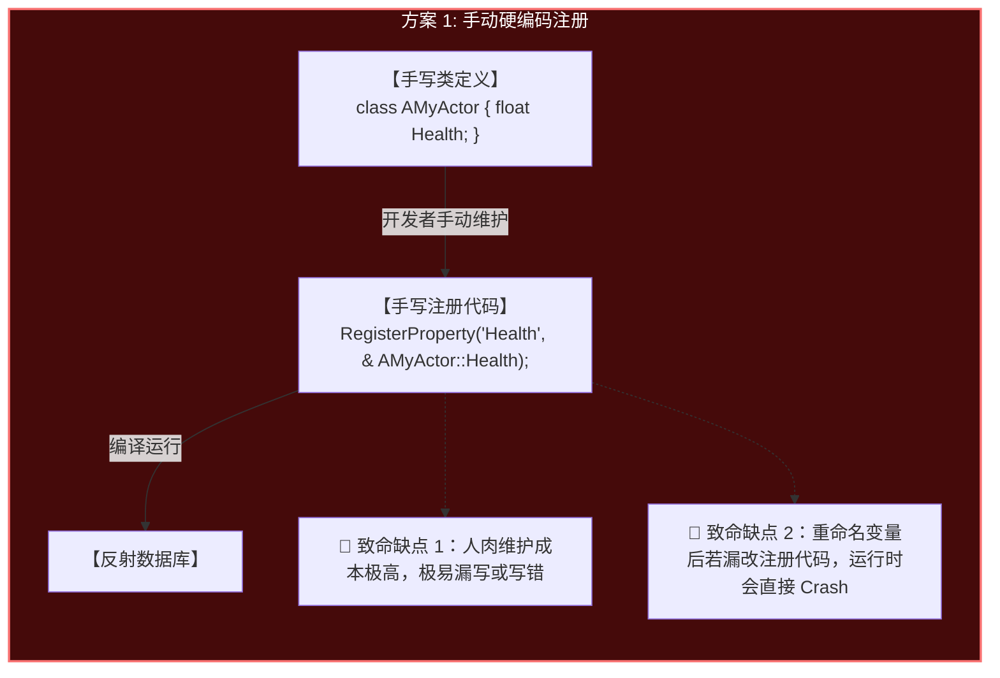
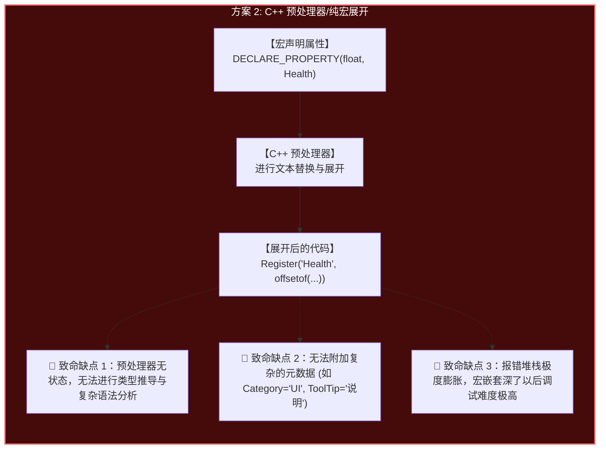
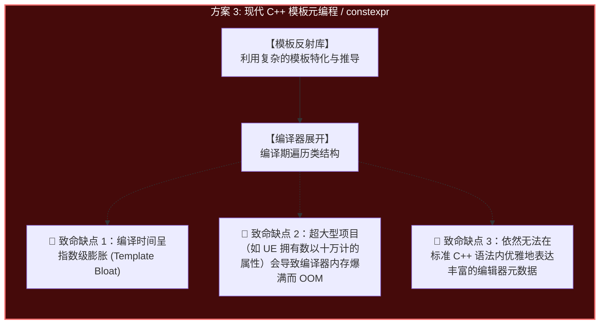
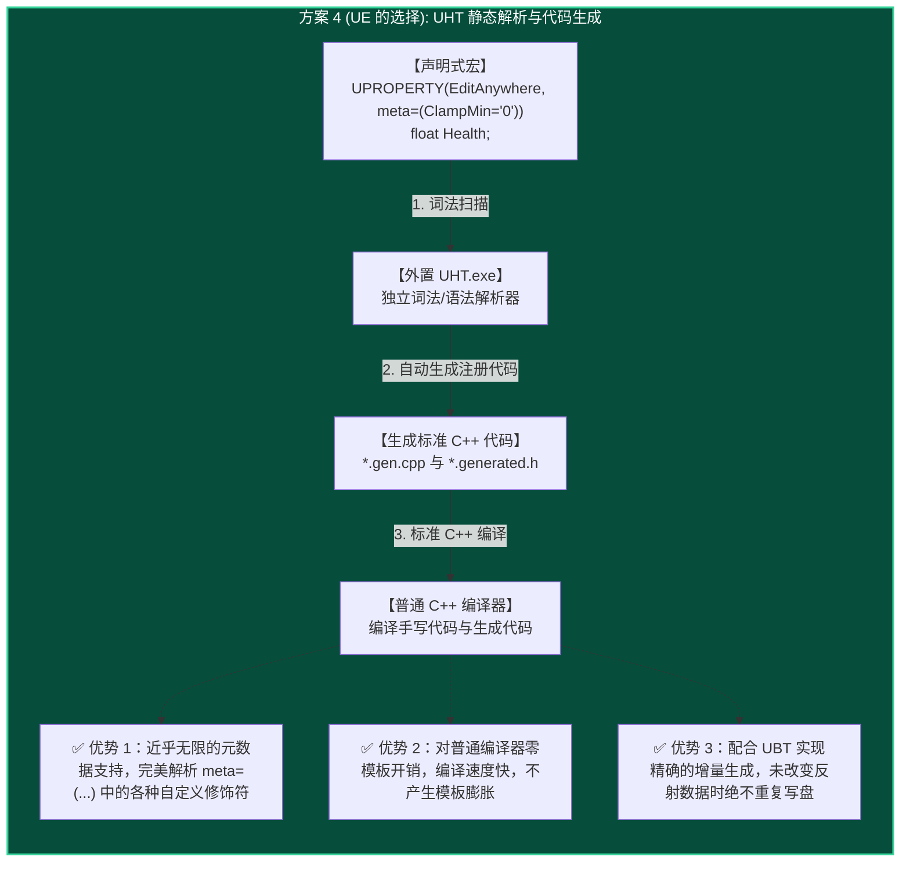
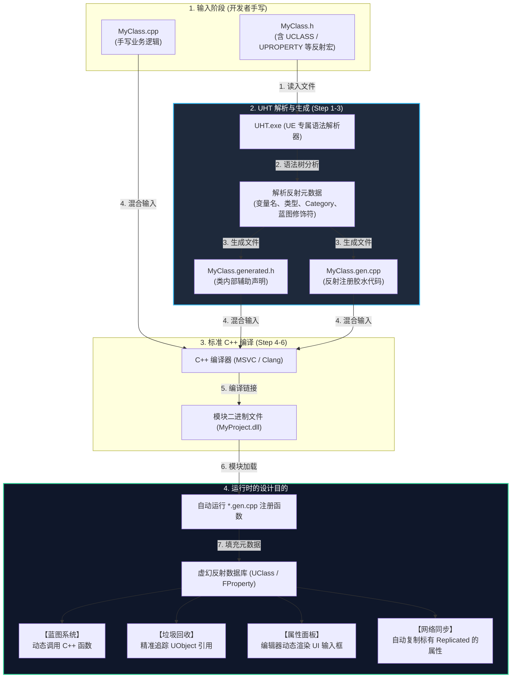
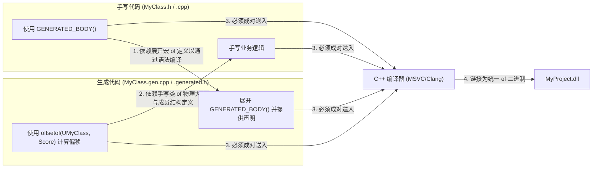

# 虚幻引擎反射系统与 UHT 机制详解

本文件详细剖析了 C++ 缺乏原生反射机制的痛点、业内主流的解决方案、虚幻引擎（Unreal Engine）选择的 **UHT (Unreal Header Tool)** 方案及其底层工作原理，并深入解读了自动生成的反射代码结构。

---

## 一、 背景：C++ 原生反射机制的缺失

游戏引擎在运行时需要高频执行许多“动态”操作，例如：
1. **编辑器属性面板 (Details Panel)**：在编辑器中选中一个 Actor 时，面板需要动态获取其成员变量、类型、Category 标签并生成 UI。
2. **垃圾回收 (Garbage Collection)**：引擎需要自动追踪所有引用了 `UObject` 的指针，以构建引用图谱。
3. **蓝图与 C++ 交互**：蓝图需要在运行时动态调用标记了 `BlueprintCallable` 的 C++ 函数。
4. **网络同步 (Replication)**：网络模块需要知道哪些属性被标记了 `Replicated`，并在其值变化时自动序列化同步。

然而，标准 C++ 是一门静态编译语言，其原生的 `RTTI` (运行时类型信息) 极为简陋，无法在运行时提供“类有哪些成员”、“变量叫什么名字”、“变量属于什么类型”等元数据。

---

## 二、 业内主流反射方案对比与致命缺点

为了在 C++ 中实现反射，业内通常有以下四种方案：

### 1. 手动硬编码注册 (Manual Registration)
开发者在声明完类后，手动编写一段注册逻辑，将变量的物理地址、名字映射到反射数据库中。



### 2. C++ 预处理器/纯宏展开 (Macro-based Reflection)
利用 C++ 的宏（Macro）在编译期把变量声明展开为注册代码（如 `DECLARE_PROPERTY(type, name)`）。



### 3. 现代 C++ 模板元编程 (Template Metaprogramming)
使用现代 C++ 的 `constexpr`、`std::tuple` 或第三方反射库（如 RTTR），在编译期通过模板特化自动提取类成员结构。



### 4. 外置静态解析与代码生成 (UE UHT 方案)
虚幻引擎避开了上述三种纯 C++ 限制，引入了外置的 [UHT](file:///D:/UEProject/Docs/UE_Build_Pipeline.md)（静态 AST 解析器）在 C++ 编译器运行前单独工作。



---

## 三、 UHT 工作流与运行周期

为了实现这一目标，虚幻引擎在构建管线中插入了“解析阶段（Step 1-3）”：



---

## 四、 深入剖析生成的反射文件内容

### 1. `MyClass.generated.h`（声明注入）
UHT 在此文件中定义了你的类体中写入的 `GENERATED_BODY()` 占位符宏。其主要负责将反射系统所需的声明和友元关系“注入”到类中：

```cpp
#undef CURRENT_FILE_ID
#define CURRENT_FILE_ID FID_MyProject_Source_MyClass_h // 本头文件唯一标识

#define FID_MyProject_Source_MyClass_h_GENERATED_BODY \
public: \
    friend struct Z_Construct_UClass_UMyClass_Statics; \
    static UClass* StaticClass(); \
    /* 注入 StaticClass 声明，供代码中通过 UMyClass::StaticClass() 使用 */ \
    \
    FORCEINLINE virtual UObject* GetUObjectRef() const override { return (UObject*)this; } \
    /* 注入强制转换，供垃圾回收系统直接寻址追踪 */ \
    \
    typedef UObject Super; \
    typedef UMyClass ThisClass; \
    /* 注入父类与当前类的 typedef，以便于 UE 模板类（如 Cast<T>）在编译期做类型匹配 */
```

### 2. `MyClass.gen.cpp`（静态注册与元数据）
此文件负责把宏声明中描述的元数据（如 Category、BlueprintReadWrite 等）转换为底层的内存数据，并在模块加载时自动将其注册至引擎核心：

```cpp
#include "MyClass.h"

// 1. 存储你在反射宏中指定的元数据
static const FMetaDataPairParam Z_Construct_UClass_UMyClass_Statics::Class_MetaDataParams[] = {
    { "BlueprintType", "true" },
    { "Category", "Stats" }, 
};

// 2. 描述类成员属性的内存布局（以变量 Score 为例）
static const FUnrealEngineObjectTypes::FPropertyParams Z_Construct_UClass_UMyClass_Statics::Prop_Score = {
    "Score",                                     // 变量名称
    offsetof(UMyClass, Score),                  // 利用标准 C++ 计算属性在内存中的物理偏移量
    EPropertyFlags::CPF_Edit | CPF_BlueprintVisible, // 反射标志位
};

// 3. 构建对应的 UClass* 并与核心绑定
UClass* Z_Construct_UClass_UMyClass()
{
    static UClass* OuterClass = nullptr;
    if (!OuterClass)
    {
        UECodeGen_Private::ConstructUClass(OuterClass, ...);
    }
    return OuterClass;
}

// 4. 程序加载时的自举注册机制（黑魔法入口）
static FCompiledInDefer Z_CompiledInDefer_UClass_UMyClass(
    Z_Construct_UClass_UMyClass, 
    TEXT("UMyClass")
); // 当程序 DLL/EXE 被操作系统载入内存时，该静态对象自动实例化，自动向全局 UObject 数据库报到
```

---

## 五、 为何生成的代码必须与手写代码合并编译？

在编译阶段，**手写代码与生成代码存在着“你中有我，我中有你”的循环依赖**：



1. **头文件语法依赖**：`MyClass.h` 包含了 `MyClass.generated.h` 并且使用了 `GENERATED_BODY()`。如果不同时编译生成的文件，编译器在编译 `MyClass.h` 时就会报 `未定义的宏` 错误。
2. **类结构偏移量依赖**：`MyClass.gen.cpp` 使用了 `offsetof(UMyClass, Score)` 等结构体偏移函数。这要求编译器在编译 `gen.cpp` 时能够看到手写类的完整物理结构。
3. **链接期符号拼装**：手写代码提供行为（函数实现），生成代码提供反射（UClass 注册、GC 元数据）。最终编译器通过链接器（`Link.exe`）将它们拼装成完整的二进制包。
