# `-NoPCH -DisableUnity`：代码健康策略，而非日常提速策略

本文档面向工程团队内部。结论先行：`-NoPCH -DisableUnity` 不是用来"让编译更快"的，恰恰相反，它会让编译更慢。它的价值是**主动关闭编译期的"隐式可见性"，把平时被 PCH 和 Unity Build 掩盖的 include 缺陷暴露出来**，因此属于低频运行的代码健康检查，而不是日常构建配置。

---

## 0. 一句话职责划分

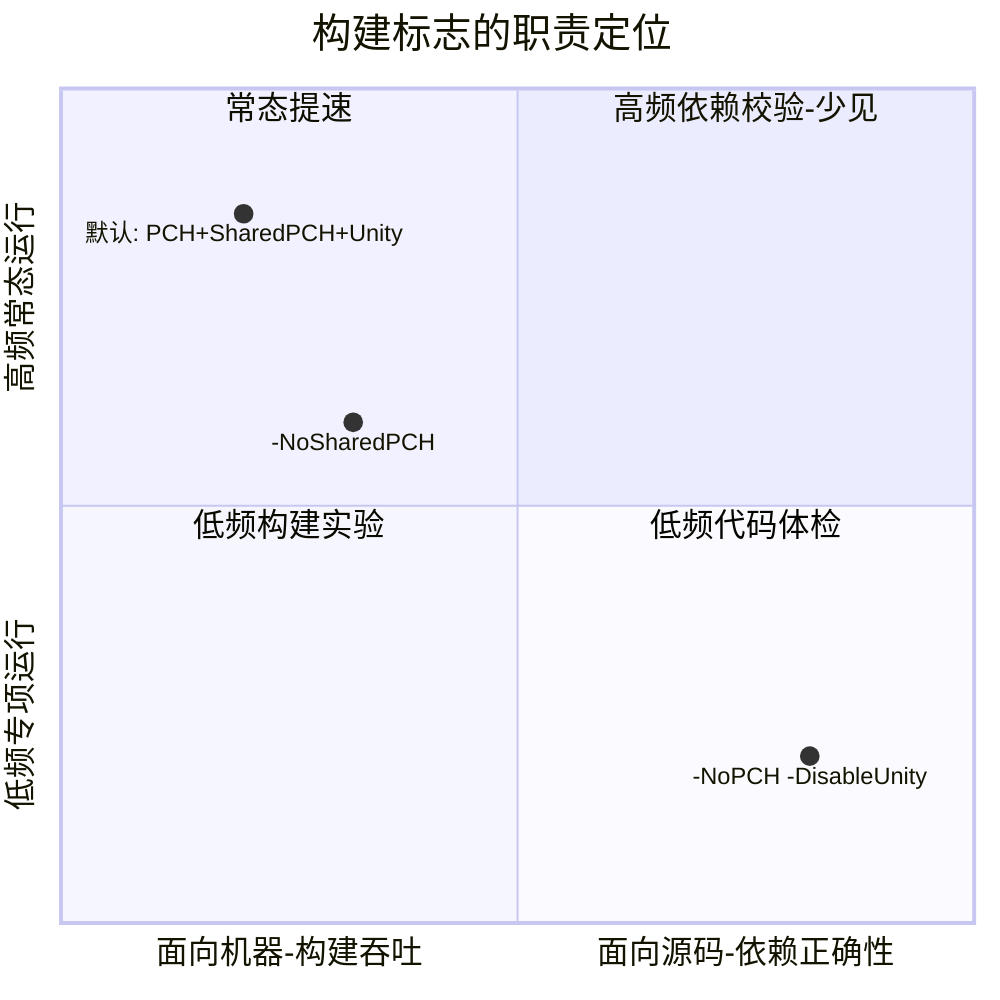

- 右下角是 `-NoPCH -DisableUnity`：**面向源码正确性、低频运行**。
- 左侧是常态构建策略（含 `-NoSharedPCH`）：**面向构建吞吐/稳定性**。
- 二者目标不同，不能互相替代（详见第 8 节）。

---

## 1. 术语与事实依据（UE 5.8.0r / UnrealBuildTool）

| 标志 | 控制开关（默认值） | 源码注释含义 | 源码位置 |
| --- | --- | --- | --- |
| `-NoPCH` | `bUsePCHFiles`（默认 `true`） | "Whether PCH files should be used"，关闭**全部** PCH（含私有/显式 PCH） | `TargetRules.cs:2151` |
| `-NoSharedPCH` | `bUseSharedPCHs`（默认 `true`） | 仅关闭跨模块共享 PCH，其注释明确指出该特性 "significantly speeds up compile times" | `TargetRules.cs:2398` |
| `-DisableUnity` | `bUseUnityBuild`（默认 `true`） | "unify C++ code into larger files for faster compilation"，关闭把多个 `.cpp` 合并成大文件的 Unity 编译 | `TargetDescriptor.cs:138` |

事实要点：三者默认都为"开启提速"。`-NoPCH` 覆盖面比 `-NoSharedPCH` 更大——`-NoSharedPCH` 只关共享 PCH，`-NoPCH` 连模块自己的 PCH 也一并关闭。

> 说明：文中源码行号对应本机 Unreal Engine 5.8.0r 源码目录中的 `Engine/Source/Programs/UnrealBuildTool`。

---

## 2. PCH / SharedPCH / Unity Build 如何让源码"偶然通过"

三种机制的共同副作用：**让一个 `.cpp` 在没有写出对应 `#include` 的情况下，依然能看到它用到的符号。**

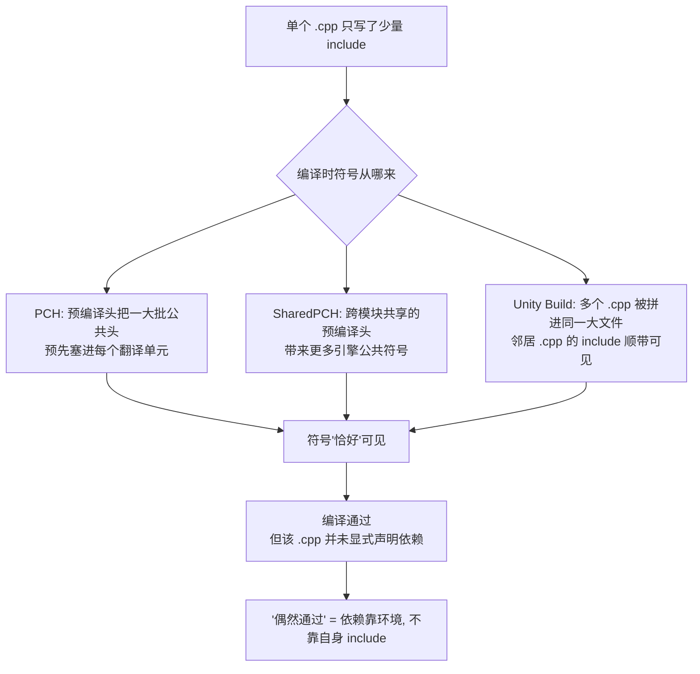

关键区别：

- **PCH / SharedPCH** 让"公共大头文件"对所有翻译单元可见——你没写 `#include`，符号也在。
- **Unity Build** 让"同一批次里邻居 `.cpp`"的 include 顺带可见——依赖谁被合进同一大文件决定了你能看见什么，这个分组是构建工具决定的，不稳定。

---

## 3. "没有独立 include" 的成因

独立 include（self-contained include，每个文件都显式包含自己用到的一切）之所以缺失，是因为提速机制持续"补票"，让缺失的 include 从来不报错。

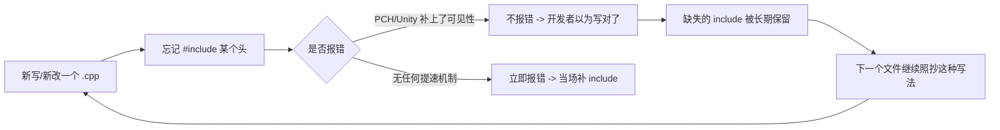

成因链是一个正反馈循环：**提速机制屏蔽了报错 → 缺失被保留 → 习惯被复制 → 缺失规模扩大**。缺陷不是一次写坏的，而是被长期"喂养"出来的。

---

## 4. 会导致哪些让工程团队反感的问题

| 问题 | 机制根因 | 团队感受 |
| --- | --- | --- |
| 编译时间过长 | 公共大头进了每个 TU；改一个公共头触发海量重编 | "改一行等半天" |
| 无关模块突然失败 | A 模块删掉一个传递 include，靠它"蹭"到符号的 B 模块崩了 | "我没碰它，它为什么挂" |
| 错误定位困难 | Unity 把多个 `.cpp` 拼成大文件，报错行号指向合成文件；符号来源不明 | "报错文件我根本没改过" |
| 本地/CI/XGE 行为不一致 | Unity 分组、PCH 命中、并行分发在不同环境下不同，暴露的缺失也不同 | "本地过了，CI 挂了" |
| 引擎升级/模块拆分风险 | 升级后引擎公共头内容变化，或模块被拆分打断了原有传递可见性 | "升个引擎，一片红" |

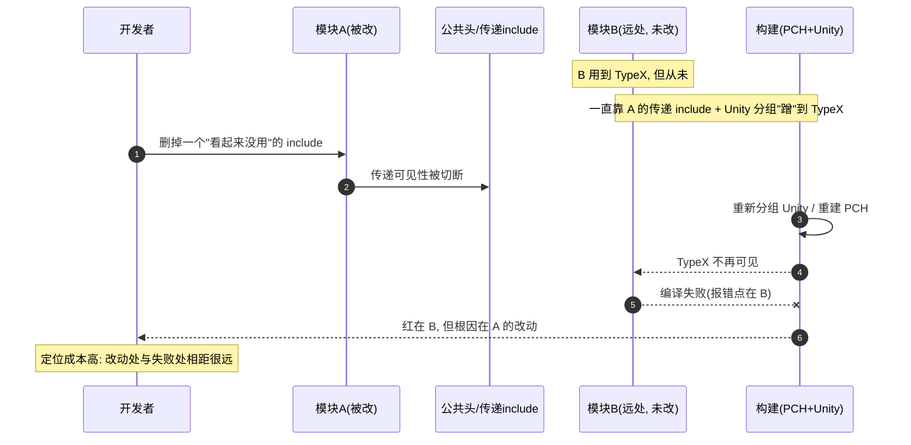

这张时序图就是团队最反感的场景：**改动点与失败点解耦**，责任难归属，排查耗时。

---

## 5. `-NoPCH -DisableUnity` 如何暴露这些问题

原理：把第 2 节里的三条"隐式可见性"来源一次性关掉，每个 `.cpp` 只能看见它自己 `#include` 的内容。凡是"偶然通过"的文件，会在这一刻立即报错——错误点精确落在缺失 include 的那个文件。

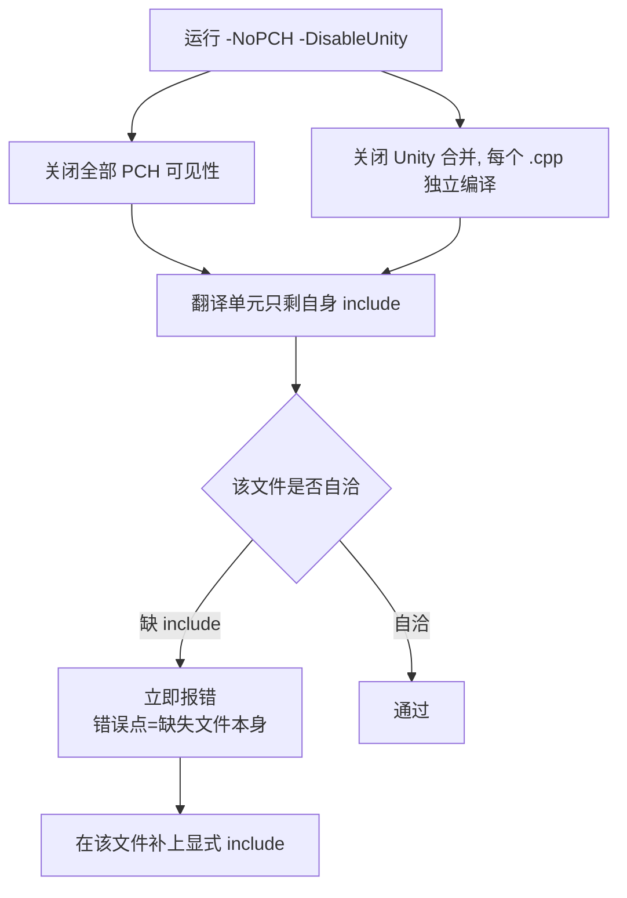

代价与定位对比：

- **代价（预期内）**：编译更慢、失败更多。这是把长期负债一次性显性化，属于诊断成本，不是回归。
- **定位（关键收益）**：错误点 = 缺失 include 的文件本身，不再出现第 4 节那种"改 A 挂 B"的远距离故障。

---

## 6. 修复后的效果：影响范围收敛

补齐显式 include 后，依赖关系从"隐式、发散"变成"显式、收敛"。

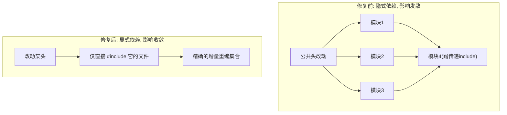

修复带来的四个可度量效果：

| 维度 | 修复前 | 修复后 |
| --- | --- | --- |
| 依赖 | 隐式，靠环境补齐 | **显式**，每个文件自洽 |
| 模块边界 | 模糊，跨模块蹭符号 | **清晰**，越界即报错 |
| 增量编译 | 影响范围高估/漂移 | **影响范围可预测且更小** |
| 迁移/升级 | 引擎升级、模块拆分易一片红 | **更稳**，改动影响可提前评估 |

---

## 7. 策略定位（mindmap）

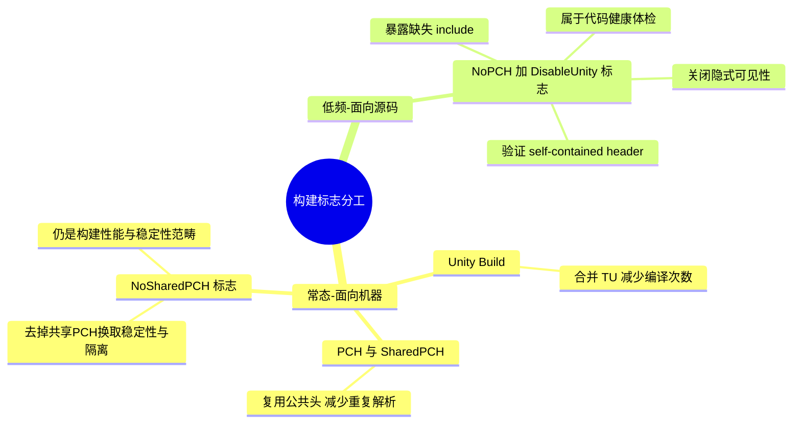

---

## 8. 与 `-NoSharedPCH` 的职责区别

这是本文档最容易被混淆的一点，单独澄清。

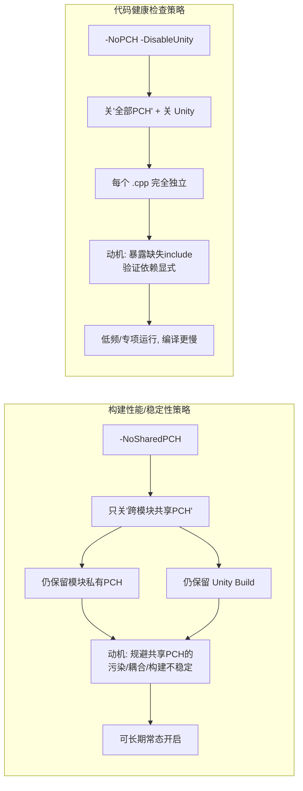

| 维度 | `-NoSharedPCH` | `-NoPCH -DisableUnity` |
| --- | --- | --- |
| 归类 | 构建性能 / 稳定性策略 | 代码健康检查策略 |
| 关闭范围 | 仅共享 PCH（私有 PCH、Unity 仍在） | 全部 PCH + Unity |
| 主要动机 | 规避共享 PCH 的耦合与构建不稳定 | 暴露隐式依赖、验证 include 自洽 |
| 对编译速度 | 影响有限，可接受为常态 | 明显变慢，不适合常态 |
| 运行频率 | 可长期常态开启 | 低频、专项体检 |
| 成功信号 | 构建更稳定、可复现 | 报错集中在缺失 include 的文件 |

一句话：**`-NoSharedPCH` 解决"构建怎样更稳"，`-NoPCH -DisableUnity` 解决"源码是否真的自洽"。前者可以天天用，后者是定期体检。**

### 为什么 `-NoSharedPCH` 是较小代价的 XGE 策略

`-NoSharedPCH` 的关键价值不是"更严格"，而是**用最小源码扰动，保留大部分 PCH 收益，同时拿掉 XGE 下最重的跨机器共享包**。

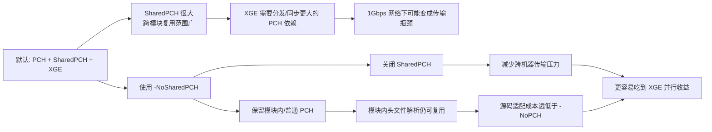

为什么它的源码适配成本通常较小：

- 模块内普通 PCH 仍在，很多模块内部的常用头仍能被局部复用。
- 健康的跨模块依赖本来就应该通过显式 `#include` 和 `.Build.cs` 依赖声明表达，而不是靠 SharedPCH "顺带看见"。
- 因此，关闭 SharedPCH 主要移除的是**跨模块的大范围隐式可见性**；它暴露的问题通常少于 `-NoPCH -DisableUnity`。

为什么它对 XGE 可能收益很大：

- SharedPCH 往往聚合 Engine / Editor 级公共头，体积可能显著大于普通模块 PCH。
- 在本轮 ProjectTitan 观测中，SharedPCH `.pch` 总量约 `13.4 GiB`，普通 PCH `.pch` 总量约 `5.8 GiB`；SharedPCH 不只是"多一点"，而是传输与内存压力的大头。
- 如果瓶颈在 1Gbps 上行、远端同步 PCH、或本地 pagefile/commit 压力，那么禁用 SharedPCH 可能比继续追求共享 PCH 命中更划算。

### UE 5.8.0r + ProjectTitan 的定量样本

样本范围：

- Engine：`D:\UE\5.8.0r`
- Project：`D:\UE\tutorial\ProjectTitan`
- Target：`TitanEditor Win64 Development` + `ShaderCompileWorker Win64 Development`
- 证据：默认 SharedPCH 构建导出的 `XGETasks.export.xml`，以及当时生成的 `.pch` 实物大小。

注意口径：

- `唯一 PCH 体积` 表示磁盘上不同 `.pch` 文件的合计大小。
- `cpp action 引用数` 表示有多少编译 action 通过 `/Yu` 使用这个 PCH。
- `cpp action 引用数 * PCH 大小` 不能直接等同为真实网络字节，因为 XGE 可能有远端缓存和复用；但它能说明哪些 PCH 是潜在同步压力的大头。

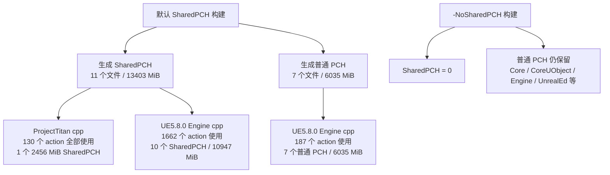

生成端的 PCH 体积：

| 类型 | 生成 action | 唯一文件 | 唯一 PCH 体积 | 最大单文件 | XGE 远端生成 |
| --- | ---: | ---: | ---: | ---: | --- |
| SharedPCH | 11 | 11 | `13403.06 MiB` (`13.09 GiB`) | `2458.19 MiB` | `AllowRemote=False` |
| 普通 PCH | 7 | 7 | `6035.06 MiB` (`5.89 GiB`) | `2071.44 MiB` | `AllowRemote=False` |

解释：

- SharedPCH 的唯一体积约为普通 PCH 的 `2.22x`。
- PCH / SharedPCH 生成 action 都是本地 `AllowRemote=False`，远端 cpp 编译若依赖它们，就需要面对同步/缓存/传输问题。
- 若只统计 `Engine\Intermediate\Build` 下的普通 PCH，不含 Engine plugin PCH，则普通 PCH 为 `5804.37 MiB`；这就是前面观察到的约 `5.8 GiB` 口径。

cpp action 对应的 PCH：

| 源码归属 | 使用 SharedPCH 的 cpp action | 对应 SharedPCH footprint | 使用普通 PCH 的 cpp action | 对应普通 PCH footprint | 结论 |
| --- | ---: | ---: | ---: | ---: | --- |
| ProjectTitan 自己的 cpp | `130` | `1` 个 / `2455.69 MiB` | `0` | `0` | Titan 自己的远端 cpp 编译集中依赖一个 2.4 GiB 级 SharedPCH |
| UE5.8.0 Engine cpp | `1662` | `10` 个 / `10947.37 MiB` | `187` | `7` 个 / `6035.06 MiB` | UE Editor/Engine 编译同时用 SharedPCH 和普通 PCH，但 SharedPCH 覆盖更多 cpp action |

这组数据支持的判断：

- 对 ProjectTitan 自己的 cpp 来说，默认 SharedPCH 模式下不是"很多小 PCH 分散使用"，而是 `130` 个 cpp action 集中依赖同一个 `2455.69 MiB` 的 `SharedPCH.UnrealEd.Project.ValApi.ValExpApi.Cpp20.h.pch`。
- 对 UE5.8.0 Engine cpp 来说，SharedPCH 不仅总量更大，引用它的 cpp action 也远多于普通 PCH（`1662` vs `187`）。
- 因此在 XGE + 1Gbps 网络下，`-NoSharedPCH` 的价值很具体：砍掉最大的跨机器共享 PCH 依赖，同时保留普通 PCH 机制，不等价于 `-NoPCH`。
- B 组 `-NoSharedPCH` 取证窗口中，`SharedPCHCount=0`、`PCHCount=6`，说明 SharedPCH 被移除，但普通 PCH 仍然存在。

### Session 019f22ba 的最终 A/B 证据

这轮数据更接近日常开发体验：A 组默认 SharedPCH cold build 先失败，随后不 clean 增量续编成功；B 组 `-NoSharedPCH` cold build 一次成功。

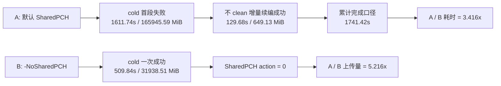

| 指标 | A 默认 SharedPCH | B `-NoSharedPCH` | 结论 |
| --- | ---: | ---: | --- |
| 完成口径 | cold 失败 + 增量成功 | cold 一次成功 | B 更贴近日常开发想要的"一次过" |
| 总耗时 | `1741.42s` | `509.84s` | A 是 B 的 `3.416x` |
| 上传量 | `166594.72 MiB` | `31938.51 MiB` | A 是 B 的 `5.216x` |
| `>=900 Mbps` 上行饱和 | 首段约 `885s` | 显著下降 | A 的中心分发压力更高 |
| SharedPCH action | 存在 | `0` | B 明确移除了 SharedPCH 构建/依赖 |

最大嫌疑项是 `SharedPCH.UnrealEd.Cpp20.h.pch`：

| 指标 | 数值 |
| --- | ---: |
| 文件大小 | `2455.5 MiB` |
| 使用 task | `501` |
| helper fanout | `128` |
| 中心分发理论下限 | `2668.34s` |
| break-even helper | `3.5` |
| A/B matched task 中位耗时差 | A 慢 `30.8s` |
| A/B matched task P95 耗时差 | A 慢 `719.95s` |

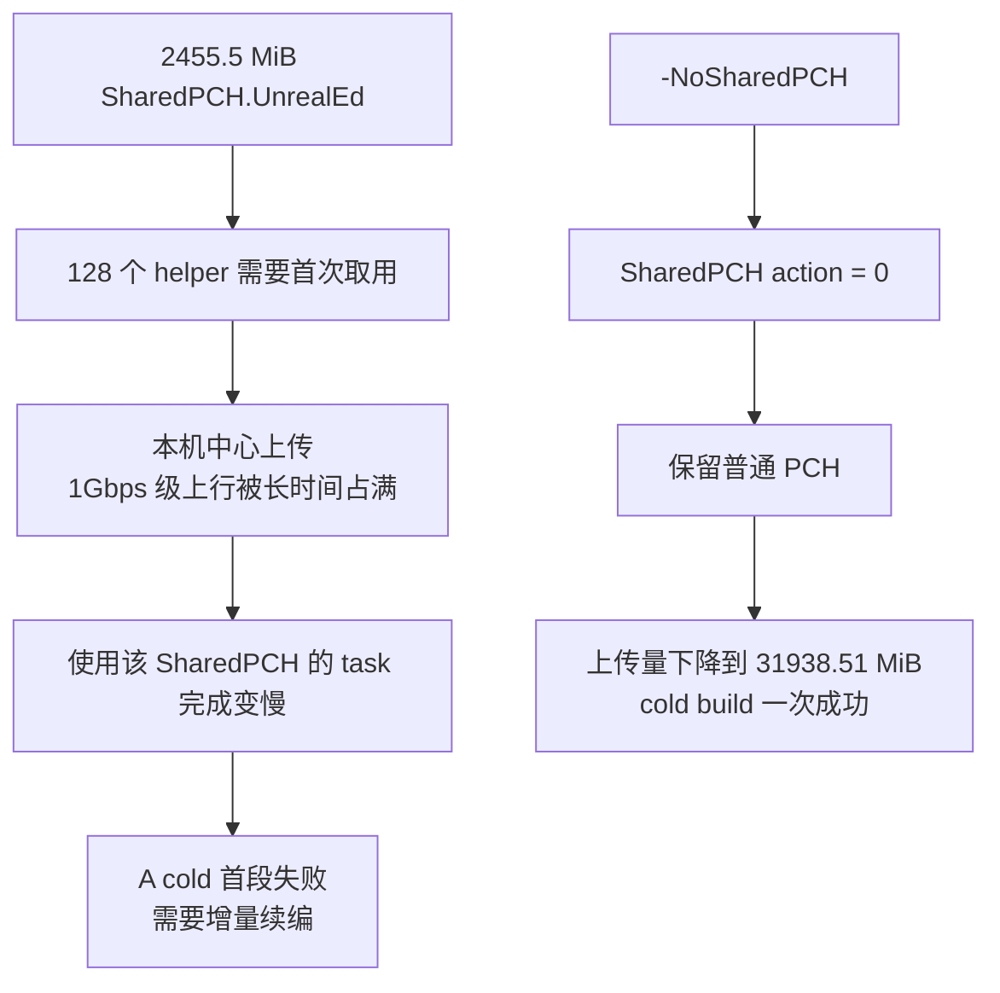

这组数据能支撑的开发期判断：

| 开发期问题 | 默认 SharedPCH 的表现 | `-NoSharedPCH` 的价值 |
| --- | --- | --- |
| 冷启动稳定性 | 大 SharedPCH 触发上行饱和与 PCH/内存压力，A 首段失败 | B 一次 cold 成功 |
| 等待时间 | A 累计 `1741.42s` | B `509.84s` |
| 网络占用 | A 上传约 `162.69 GiB` | B 上传约 `31.19 GiB` |
| XGE 并行收益 | 大文件中心分发抵消 helper 并行 | 减少中心分发包，更容易吃到 helper 算力 |
| 源码扰动 | 不解决 include 健康，只追求 SharedPCH 命中 | 保留普通 PCH，不等价于 `-NoPCH` 的强体检 |

口径限制：

- A 不是单次 cold 成功样本，而是"cold 失败 + 增量续编成功"的实际完成口径。
- 这不能直接证明 IncrediBuild 对每个 helper 的真实上传次数。
- 但 `SharedPCH` 体积、helper fanout、上行饱和、A/B 上传量、A/B task 耗时差和 B 组 `SharedPCH action = 0` 已经形成强证据链。

第一性原理拆解：

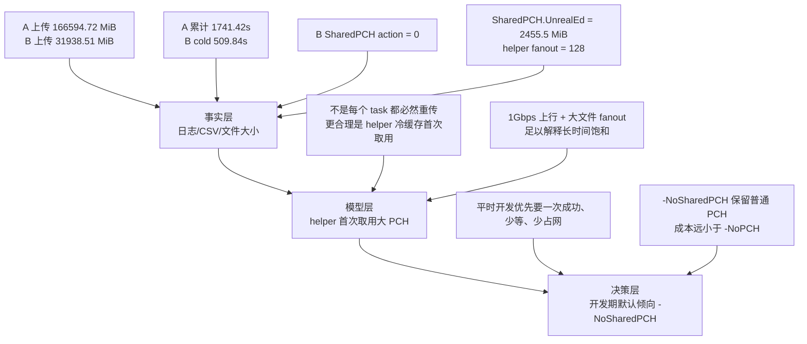

| 层级 | 可以强证明的内容 | 不能过度声称的内容 | 文档结论 |
| --- | --- | --- | --- |
| 事实 | A/B 耗时、上传量、B 无 SharedPCH action、PCH 文件体积、helper fanout、matched task 差异 | 每个 helper 实际传输了几次 `.pch` | 事实足以证明默认 SharedPCH 在本环境下很贵 |
| 模型 | helper 首次取用大 SharedPCH 会造成中心上传压力，且数量级能解释 1Gbps 饱和 | IncrediBuild 内部同步算法的精确行为 | 模型是解释，不是伪装成日志事实 |
| 决策 | B 一次 cold 成功，耗时/上传都显著低于 A 累计口径 | 所有机器、所有网络、所有项目都必然更快 | 对当前 XGE + 1Gbps 开发环境，`-NoSharedPCH` 适合作为常态候选 |

主程可能会挑战的点：

| 挑战 | 回答 |
| --- | --- |
| "A 不是单次 cold 成功样本，能比较吗？" | 可以，但口径是"实际开发完成一次构建"：A 失败后续编才完成，B cold 一次完成；不把它包装成严格统计学的单次 cold 成功 A/B。 |
| "你没有 IncrediBuild per-helper 文件传输日志。" | 对，所以文档只说"强证据链"和"中心分发模型"，不说"已精确证明每个 helper 上传次数"。 |
| "`-NoSharedPCH` 会不会只是这次 farm 状态好？" | 有 farm/cache 噪声风险，但 A/B 差距是 `3.416x` 耗时与 `5.216x` 上传量，且 B 的 SharedPCH action 为 `0`，不是小波动量级。 |
| "为什么不用 `-NoPCH`？" | `-NoSharedPCH` 保留普通 PCH，目标是构建稳定/吞吐；`-NoPCH -DisableUnity` 是低频代码健康检查，成本和目的不同。 |
| "本地非 XGE 也该关 SharedPCH 吗？" | 文档结论限定在当前 XGE + 1Gbps + 大 SharedPCH 环境；纯本地构建可能仍受益于 SharedPCH。 |

---

## 9. 使用建议

| 场景 | 建议 | 原因 |
| --- | --- | --- |
| 日常 Dev Editor + XGE 构建 | 默认候选使用 `-NoSharedPCH` | 当前 ProjectTitan + UE5.8.0r + 1Gbps 环境中，它显著降低上传量与完成时间，并避免 SharedPCH 首段失败 |
| 本地单机或高速内网构建 | 保留复测空间 | SharedPCH 在无中心上传瓶颈时仍可能带来本地编译收益 |
| include/IWYU 健康检查 | 低频运行 `-NoPCH -DisableUnity` | 它是代码健康体检，不是日常提速方案 |
| `-NoPCH -DisableUnity` 报错 | 就地补齐显式 `#include` / `.Build.cs` 依赖 | 不要靠回退提速标志"消除"真实依赖问题 |
| 评估是否回开 SharedPCH | 只在网络、helper、pagefile、PCH 体积明显变化后重测 | 当前证据链支持 `-NoSharedPCH`，但结论绑定当前硬件/网络/项目规模 |
