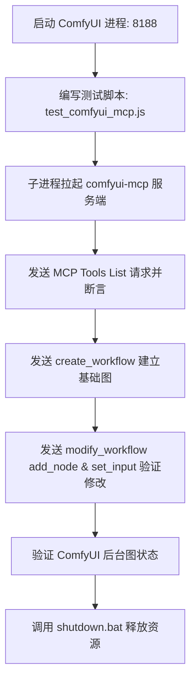

# ComfyUI MCP (Model Context Protocol) 方案与资料整理

本项目录记录了关于 ComfyUI 接入 AI MCP（Model Context Protocol，模型上下文协议）的研究资料、技术方案以及本地化部署建议。通过 MCP，AI 智能体（如 Claude Code, Cursor, Claude Desktop, Codex 等）能够获取直接控制 ComfyUI 的能力，实现自然语言驱动的工作流搭建、节点参数调整及运行。

---

## 1. 概述与背景

### 1.1 什么是 MCP？
MCP 是 Anthropic 推出的一种开放标准协议，用于安全地连接 AI 智能体与外部工具、数据源和 API。
*   **传统方式**：AI 只能通过硬编码的 API 接口或单纯的代码生成来间接使用 ComfyUI，难以感知 ComfyUI 内部实时运行的节点状态和类型。
*   **MCP 方式**：MCP 将 ComfyUI 的底层操作（包括获取可用节点、新增节点、连接节点、修改参数、提交队列等）封装为 AI 能够理解并调用的“工具（Tools）”，实现**智能体原生（Agent-Native）的实时图编辑（Live Graph Editing）**。

---

## 2. 现行主要技术方案对比

当前接入 ComfyUI MCP 主要有三大方案可选：

| 方案维度 | 方案 A：官方 Comfy Cloud MCP | 方案 B：社区本地化方案 (`artokun/comfyui-mcp`) | 方案 C：轻量级触发方案 (`joenorton/...`) |
| :--- | :--- | :--- | :--- |
| **主导方** | Comfy Org 官方 | 社区活跃开发者 (Artokun) | 社区开发者 (Joe Norton) |
| **运行位置** | Comfy Cloud (云端 GPU 托管) | 本地 ComfyUI 实例 / 私有 VPS | 本地 ComfyUI 实例 |
| **主要定位** | 快速在云端运行工作流，免去显卡限制 | 极其强大的本地**控制面板**，支持实时图修改 | 简单的文生图/图生图触发工具 |
| **图编辑支持** | 有限（基于云端模板） | **完全支持（提供 100+ 细粒度控制工具）** | 不支持（仅支持调用已有工作流） |
| **安装方式** | 官方 Connector URL 接入 | `npx comfyui-mcp` / npm 插件 | Git 仓库源码运行 |
| **推荐指数** | ⭐⭐⭐⭐ (适合云端轻量体验) | ⭐⭐⭐⭐⭐ (本工程 MVP 重点验证对象) | ⭐⭐ (功能较局限) |

---

## 3. 方案 B：`artokun/comfyui-mcp` 核心工具与运作机制

该方案是将 AI 智能体与本地 ComfyUI 进行深度绑定的黄金标准。它向 AI 暴露了四大类工具群：

### 3.1 工作流组装 (Workflow Composition)
AI 智能体可以使用以下工具对 ComfyUI 画布进行读取和现场修改，而不需要人类手动连线：
*   **`create_workflow`**：从预设模板（如 `txt2img`, `img2img`, `upscale`, `controlnet` 等）快速生成初始工作流。
*   **`modify_workflow`**：包含一系列原子修改指令：
    *   `add_node`: 在画布上生成新节点。
    *   `remove_node`: 删除节点。
    *   `connect`: 连接两个节点的端口（如将 `Load Image` 的 `IMAGE` 输出连至 `KSampler` 的 `latent_image` 输入）。
    *   `set_input`: **修改节点参数**（如改变 KSampler 的 seed、cfg、denoise、sampler_name 等）。
    *   `insert_between`: 在现有两个已连线的节点之间插入新节点。
*   **`get_node_info`**：查询本地 ComfyUI 所安装的自定义节点（Custom Nodes）以及它们的输入/输出规范。

### 3.2 工作流执行与队列管理 (Execution & Queue)
*   **`enqueue_workflow`**：将当前组装好的 JSON 图提交到 ComfyUI 渲染队列。
*   **`get_job_status`** / **`get_queue`**：查询工作流的渲染进度。
*   **`cancel_job`** / **`clear_queue`**：撤销当前执行的任务。

### 3.3 可视化与逆向 (Visualization)
*   **`visualize_workflow`**：将当前 ComfyUI 画布的 JSON 结构导出为 Mermaid 流程图，方便 AI 智能体自我纠错与直观展现。
*   **`mermaid_to_workflow`**：允许 AI 基于 Mermaid 图反向编译出 ComfyUI JSON 结构。

---

## 4. 本地部署与集成指南

### 4.1 环境准备
1.  **Node.js**：需要安装 Node.js（推荐 v18+，已验证本地存在 v24.15.0）。
2.  **ComfyUI 实例**：确保本地 ComfyUI 在 `127.0.0.1:8188` 运行（若被占用，使用 `shutdown-comfyui-8188.bat` 清理）。

### 4.2 接入客户端配置

#### A. 集成至 Claude Desktop
打开 Claude Desktop 配置文件 `app-flow` 所在的 `%APPDATA%\Claude\claude_desktop_config.json`，在 `mcpServers` 下追加：
```json
{
  "mcpServers": {
    "comfyui-mcp": {
      "command": "npx",
      "args": [
        "-y",
        "comfyui-mcp"
      ],
      "env": {
        "COMFYUI_URL": "http://127.0.0.1:8188"
      }
    }
  }
}
```

#### B. 集成至 Cursor
1. 打开 Cursor 选项：`Settings` -> `Features` -> `MCP`。
2. 点击 `+ Add New MCP Server`。
3. 填入参数：
   * **Name**: `comfyui-mcp`
   * **Type**: `command`
   * **Command**: `npx -y comfyui-mcp`
   * （可选）环境变量：在启动命令所在环境设置 `COMFYUI_URL=http://127.0.0.1:8188`。

---

## 5. MVP 验证方案 (Spec-Driven Workflow)

为了在本工程进行最小可行性验证（MVP），可以参考以下步骤推进：



### 5.1 验证脚本示例 (`scratch/test_comfyui_mcp.js`)
你可以编写一个轻量脚本，利用 `@modelcontextprotocol/sdk` 或者直接通过标准 I/O 管道控制 `npx comfyui-mcp`：

```javascript
// 示例：Node.js 子进程管道集成验证
const { spawn } = require('child_process');

const mcpProcess = spawn('npx', ['-y', 'comfyui-mcp'], {
  env: { ...process.env, COMFYUI_URL: 'http://127.0.0.1:8188' }
});

mcpProcess.stdout.on('data', (data) => {
  // 解析 JSON-RPC 消息，验证初始化和工具列表
  console.log('[MCP Out]', data.toString());
});

mcpProcess.stderr.on('data', (data) => {
  console.error('[MCP Err]', data.toString());
});

// 向 stdin 写入 JSON-RPC 请求列出工具：
// {"jsonrpc":"2.0","method":"tools/list","params":{},"id":1}
```

---

## 6. OpenSpec 验证指令
在测试完成后，根据工作区的 OpenSpec 规范，需要运行以下指令对修改提案进行严格校验，确保符合设计基线：
```powershell
openspec validate try-artokun-comfyui-mcp --strict
```
验证通过后即可归档变更并记录实际验证日志。
