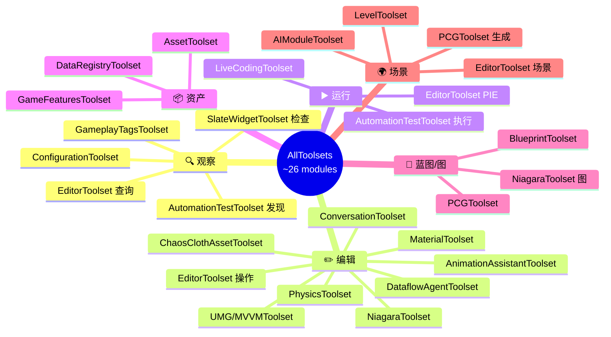

# UE 5.8 Toolsets 分类说明

> **前置说明**：路径 `E:\UEWS\5.8.0` 在当前机器上不可访问，以下 Toolset 列表基于联网查阅 Epic 官方文档、Qiita/Zenn 社区整理、以及 UE 5.8 Release Notes 综合而来。

> **相关文档**：引擎架构认知模型请参阅 [ue58_architecture.md](./ue58_architecture.md)。

---

## 概述：AllToolsets 是什么

`AllToolsets` 是 UE 5.8 引入的 **MCP（Model Context Protocol）** 元插件，聚合了约 **26 个 Toolset 模块**，当前均为 **Experimental（实验性）** 状态。

它的作用是把编辑器内的各类能力（查询、编辑、运行、资产管理、蓝图/图编辑、场景操作）以工具（Tool）的形式统一暴露给 MCP 客户端，从而支持由外部程序或 AI 代理来驱动 Unreal Editor。

| 属性 | 说明 |
|------|------|
| **形态** | MCP 元插件（聚合多个 Toolset 模块） |
| **模块数量** | 约 26 个 Toolset |
| **成熟度** | Experimental（实验性，接口可能变动） |
| **定位** | 把编辑器能力以工具形式暴露给 MCP 客户端 |

---

## 六大分类

下面按 **观察 / 编辑 / 运行 / 资产 / 蓝图 / 场景** 六大类对全部 Toolset 进行归类。

### 🔍 观察（Inspect / Query）

用于查询和读取编辑器、资产、配置等状态，不产生修改。

| Toolset | 功能 | 典型操作 |
|---------|------|----------|
| **EditorToolset**（部分） | 查询编辑器状态、关卡信息 | 获取当前关卡、列举 Actors、查询属性 |
| **GameplayTagsToolset** | 列举和查询 Gameplay Tags | `ListTags`, `GetTagDetails` |
| **AutomationTestToolset** | 发现和查看自动化测试 | `DiscoverTests`, `GetTestResults` |
| **SlateWidgetToolset**（部分） | 检查 Slate UI 控件树 | 控件树遍历、属性读取 |
| **ConfigurationToolset** | 查询项目/引擎配置 | 读取 ini 配置值 |

---

### ✏️ 编辑（Edit / Modify）

用于对资产内容、组件、参数等进行修改，是范围最大的一类。

| Toolset | 功能 | 典型操作 |
|---------|------|----------|
| **EditorToolset**（部分） | 核心编辑器操作 | Spawn Actor、设置属性、配置光照 |
| **AnimationAssistantToolset** | 动画编辑工作流 | Control Rig 编辑、Sequencer 操作、动画烘焙 |
| **NiagaraToolset** | Niagara VFX 编辑 | 创建/修改 System、Emitter、Renderer |
| **PhysicsToolset** | 物理资产编辑 | 编辑碰撞体（Sphere/Capsule/Box）、约束 |
| **DataflowAgentToolset** | Dataflow 图编辑 | 创建/连接 Dataflow 节点 |
| **ChaosClothAssetToolset** | Chaos 布料编辑 | 布料资产属性修改（需单独启用） |
| **MaterialToolset** | 材质实例编辑 | 修改材质参数、创建材质实例 |
| **UMG/MVVMToolset** | UMG 控件 + MVVM 绑定 | UI 布局编辑、数据绑定配置 |
| **ConversationToolset** | NPC 对话系统 | 对话树编辑、条件分支管理 |

---

### ▶️ 运行（Execute / Runtime）

用于触发运行时行为，例如 PIE、测试执行、热编译等。

| Toolset | 功能 | 典型操作 |
|---------|------|----------|
| **EditorToolset**（PIE 部分） | Play In Editor 控制 | `StartPIE`, `StopPIE` |
| **AutomationTestToolset** | 运行自动化测试 | `RunTests`, `GetTestStatus` |
| **LiveCodingToolset** | C++ Live Coding 热编译 | 触发编译、获取编译状态/日志 |

---

### 📦 资产（Asset Management）

用于资产的创建、导入、组织与数据注册等管理操作。

| Toolset | 功能 | 典型操作 |
|---------|------|----------|
| **AssetToolset** | 通用资产操作 | 创建/导入/删除/重命名资产、查询资产引用 |
| **DataRegistryToolset** | 数据注册表管理 | 数据资产注册、查询 |
| **GameFeaturesToolset** | Game Feature 插件管理 | 列举/检查/创建 Game Feature Plugin |

---

### 📐 蓝图（Blueprint / Graph）

用于蓝图及各类节点图（PCG、Niagara 模块图）的可视化脚本编辑。

| Toolset | 功能 | 典型操作 |
|---------|------|----------|
| **BlueprintToolset** | 蓝图图表编辑 | 添加节点/变量/事件、连接引脚、编译蓝图 |
| **PCGToolset** | PCG 程序化内容生成图 | 创建/连接 PCG 节点、管理属性数据 |
| **NiagaraToolset**（图部分） | Niagara 模块图 | 添加/连线模块脚本节点 |

---

### 🌍 场景（Scene / Level）

用于关卡与 Actor 层面的空间操作、程序化填充与 AI 集成。

| Toolset | 功能 | 典型操作 |
|---------|------|----------|
| **EditorToolset**（场景部分） | 关卡中 Actor 操作 | Spawn/Delete Actor、变换操作、组件挂载 |
| **PCGToolset**（生成部分） | 程序化场景填充 | 执行 PCG Graph 生成空间实例 |
| **AIModuleToolset** | AI 系统场景集成 | Behavior Tree 操控、EQS 查询配置 |
| **LevelToolset** | 关卡/子关卡管理 | 关卡流送、子关卡加载/卸载 |

---

## 分类可视化总览

> [!NOTE]
> 部分 Toolset（特别是 `EditorToolset`）横跨多个类别，因为它本身是个"大杂烩"模块，包含查询、编辑、PIE 控制、Actor 操作等多种能力。因此在上表与思维导图中，它会在多个分类下重复出现。

---

## 快速对照表（按分类计数）

| 分类 | 主要 Toolset 数 | 关键代表 |
|------|:---:|------|
| 🔍 观察 | 5 | GameplayTagsToolset, ConfigurationToolset |
| ✏️ 编辑 | 9 | NiagaraToolset, MaterialToolset, PhysicsToolset |
| ▶️ 运行 | 3 | LiveCodingToolset, AutomationTestToolset |
| 📦 资产 | 3 | AssetToolset, GameFeaturesToolset |
| 📐 蓝图 | 3 | BlueprintToolset, PCGToolset |
| 🌍 场景 | 4 | LevelToolset, AIModuleToolset |

> 注：由于 `EditorToolset` 等模块跨类复用，上表按"出现位置"计数，总和大于实际的独立 Toolset 数量（约 26 个）。

---

## 参考链接

- [Epic: MCP in UE 5.8](https://dev.epicgames.com/documentation/en-us/unreal-engine/model-context-protocol-in-unreal-engine)
- [UE 5.8 Release Notes](https://www.unrealengine.com/en-US/blog/unreal-engine-5-8-is-now-available)
- [Qiita: UE 5.8 MCP Toolsets 详解（日文）](https://qiita.com/)
