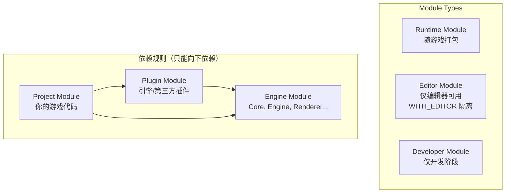

# UE 引擎架构认知地图

> **文档定位**：本文专门讲解如何以"认知模型"的方式理解 Unreal Engine 的代码架构，包含 **三层认知模型** 与 **10 大 Feature Domain（功能域）** 的完整分类。

> **相关文档**：UE 5.8 的 Toolsets 分类请参阅 [ue58_toolsets.md](./ue58_toolsets.md)。

---

## 核心思路：三层认知模型

UE 的知识可以按 **Feature（大类域）→ Module（模块）→ Class/Struct（核心类）** 来组织。这不仅是一种学习方法，也吻合引擎自身的代码架构。

```
┌─────────────────────────────────────────────────┐
│  Layer 1: Feature Domain（功能域/大类）          │
│  "引擎在做什么？"                                │
│  例：Rendering, Gameplay, Animation, PCG, Editor │
├─────────────────────────────────────────────────┤
│  Layer 2: Module（模块）                         │
│  "这块代码在哪里编译，依赖谁？"                   │
│  例：RenderCore, Engine, Slate, PCG, Niagara    │
│  → 对应 .Build.cs，有明确的 Public/Private 边界  │
├─────────────────────────────────────────────────┤
│  Layer 3: Class / Struct（核心类型）              │
│  "具体用哪个类来实现？"                           │
│  例：FScene, UWorld, APawn, FRDGBuilder          │
└─────────────────────────────────────────────────┘
```

| 层级 | 关键问题 | 对应产物 |
|------|----------|----------|
| **Layer 1 · Feature Domain** | 引擎在做什么？ | 功能域划分（Rendering / Gameplay / …） |
| **Layer 2 · Module** | 代码在哪编译、依赖谁？ | `.Build.cs`、Public/Private 边界 |
| **Layer 3 · Class / Struct** | 具体用哪个类实现？ | `UObject` / `AActor` / `FScene` 等类型 |

---

## Layer 1：Feature Domain 完整分类

下面是从引擎代码结构和官方文档中归纳出的 **10 大 Feature Domain**。

---

### 1. 🖥️ 编辑器（Editor）

| 层级 | 内容 |
|------|------|
| **功能** | 开发时的编辑环境，打包后不包含（`WITH_EDITOR`） |
| **核心 Module** | `UnrealEd`, `LevelEditor`, `PropertyEditor`, `ContentBrowser`, `EditorFramework`, `Kismet`（蓝图编辑器） |
| **核心 Class** | `UEditorEngine`, `FLevelEditorModule`, `IDetailsView`, `SLevelViewport` |
| **Module 类型** | `Editor` |

---

### 2. 🎮 运行时核心（Runtime Core）

| 层级 | 内容 |
|------|------|
| **功能** | 基础类型系统、反射、序列化、GC、内存分配 |
| **核心 Module** | `Core`, `CoreUObject`, `Engine` |
| **核心 Class** | `UObject`, `UClass`, `UWorld`, `UGameInstance`, `UEngine`, `FGCObject` |
| **Module 类型** | `Runtime` |

---

### 3. 🎭 Gameplay 框架

| 层级 | 内容 |
|------|------|
| **功能** | 游戏逻辑框架：Actor、Component、GameMode、网络复制 |
| **核心 Module** | `Engine`（GameFramework 部分）, `GameplayAbilities`, `GameplayTags`, `GameplayTasks`, `EnhancedInput` |
| **核心 Class** | `AActor`, `UActorComponent`, `AGameModeBase`, `APlayerController`, `ACharacter`, `UAbilitySystemComponent` |
| **Module 类型** | `Runtime` |

---

### 4. 🖼️ 渲染（Rendering）

| 层级 | 内容 |
|------|------|
| **功能** | GPU 渲染管线、Lumen GI、Nanite 虚拟几何体、材质系统 |
| **核心 Module** | `RenderCore`, `Renderer`, `RHI`, `ShaderCore`, `MeshDescription`, `NaniteCore`, `Lumen` |
| **核心 Class** | `FScene`, `FSceneView`, `FPrimitiveSceneProxy`, `FRDGBuilder`（RDG 渲染依赖图）, `FMaterialRenderProxy`, `FNaniteCommandInfo` |
| **Module 类型** | `Runtime`（独立渲染线程） |
| **线程模型** | Game Thread → Render Thread → RHI Thread（三线程架构） |

---

### 5. 🦴 动画（Animation）

| 层级 | 内容 |
|------|------|
| **功能** | 骨骼动画、蒙太奇、混合空间、IK/Rigging、动画蓝图 |
| **核心 Module** | `AnimationCore`, `AnimGraphRuntime`, `ControlRig`, `IKRig`, `LiveLink` |
| **核心 Class** | `USkeletalMeshComponent`, `UAnimInstance`, `UAnimMontage`, `UBlendSpace`, `UControlRig`, `FAnimNode_*` |
| **Module 类型** | `Runtime` + `Editor`（AnimGraph 编辑器） |

---

### 6. 🌿 PCG（程序化内容生成）

| 层级 | 内容 |
|------|------|
| **功能** | 基于规则图的世界程序化填充 |
| **核心 Module** | `PCG`, `PCGEditor` |
| **核心 Class** | `UPCGGraph`, `UPCGComponent`, `FPCGPoint`, `UPCGSettings`, `UPCGSpatialData` |
| **Module 类型** | `Runtime` + `Editor` |
| **5.8 新增** | Manual Editing、Mesh Terrain、PVE（Procedural Vegetation Editor） |

---

### 7. ✨ 特效（VFX / Niagara）

| 层级 | 内容 |
|------|------|
| **功能** | GPU/CPU 粒子系统、流体模拟 |
| **核心 Module** | `Niagara`, `NiagaraCore`, `NiagaraEditor`, `NiagaraShader` |
| **核心 Class** | `UNiagaraSystem`, `UNiagaraEmitter`, `UNiagaraComponent`, `FNiagaraVariable`, `UNiagaraScript` |
| **Module 类型** | `Runtime` + `Editor` |

---

### 8. 🔊 音频（Audio）

| 层级 | 内容 |
|------|------|
| **功能** | 音频引擎、空间音效、MetaSound |
| **核心 Module** | `AudioMixer`, `AudioExtensions`, `MetasoundEngine`, `MetasoundFrontend` |
| **核心 Class** | `USoundWave`, `USoundCue`, `UAudioComponent`, `UMetaSoundSource` |
| **Module 类型** | `Runtime` + `Editor` |

---

### 9. 🤖 AI

| 层级 | 内容 |
|------|------|
| **功能** | 行为树、EQS、导航网格、感知系统 |
| **核心 Module** | `AIModule`, `NavigationSystem`, `GameplayDebugger` |
| **核心 Class** | `UBehaviorTree`, `UBlackboardData`, `AAIController`, `UBTTask_*`, `ANavigationData`, `UAIPerceptionComponent` |
| **Module 类型** | `Runtime` |

---

### 10. 🌐 网络（Networking）

| 层级 | 内容 |
|------|------|
| **功能** | 网络复制、RPC、Online Subsystem |
| **核心 Module** | `NetCore`, `OnlineSubsystem`, `OnlineSubsystemUtils`, `ReplicationGraph` |
| **核心 Class** | `UNetDriver`, `UNetConnection`, `FRepLayout`, `UReplicationGraph` |
| **Module 类型** | `Runtime` |

---

### Feature Domain 速览表

| # | Feature Domain | Module 类型 | 一句话定位 |
|:--:|------|------|------|
| 1 | 🖥️ 编辑器 | Editor | 开发时环境，打包不含 |
| 2 | 🎮 运行时核心 | Runtime | 类型系统 / 反射 / GC |
| 3 | 🎭 Gameplay 框架 | Runtime | Actor / Component / GameMode |
| 4 | 🖼️ 渲染 | Runtime | GPU 管线 / Lumen / Nanite |
| 5 | 🦴 动画 | Runtime + Editor | 骨骼动画 / IK / AnimGraph |
| 6 | 🌿 PCG | Runtime + Editor | 规则图程序化填充 |
| 7 | ✨ 特效 (Niagara) | Runtime + Editor | 粒子 / 流体模拟 |
| 8 | 🔊 音频 | Runtime + Editor | 音频引擎 / MetaSound |
| 9 | 🤖 AI | Runtime | 行为树 / EQS / 导航 |
| 10 | 🌐 网络 | Runtime | 复制 / RPC / Online |

---

## Layer 2 详解：Module 的三种类型



每个 Module 的边界由 **`ModuleName.Build.cs`** 定义：

```csharp
// 示例：VehicleDemo 的某个模块
public class VehicleDemoRuntime : ModuleRules
{
    public VehicleDemoRuntime(ReadOnlyTargetRules Target) : base(Target)
    {
        // 该模块公开暴露给依赖它的其他模块
        PublicDependencyModuleNames.AddRange(new string[] {
            "Core", "Engine"
        });
        
        // 仅在本模块内部使用
        PrivateDependencyModuleNames.AddRange(new string[] {
            "RenderCore", "Niagara", "PCG"
        });
    }
}
```

| Module 类型 | 是否随游戏打包 | 说明 |
|------|:---:|------|
| **Runtime** | ✅ | 游戏运行所需的核心逻辑 |
| **Editor** | ❌ | 仅编辑器可用，`WITH_EDITOR` 隔离 |
| **Developer** | ❌ | 仅开发阶段（调试/工具） |

> **依赖规则**：Project → Plugin → Engine，只能"向下"依赖，不可反向依赖。

---

## Layer 3 详解：Class/Struct 的命名与继承

这一层回到了 UE C++ 的前缀命名规则，前缀本身即表达了类型的语义与内存/生命周期模型：

```
UObject                    ← U 前缀，GC 托管
├── AActor                 ← A 前缀，可放入关卡
│   ├── APawn
│   │   └── ACharacter
│   └── AGameModeBase
├── UActorComponent        ← U 前缀，挂载到 Actor 上
│   ├── USceneComponent
│   │   ├── UStaticMeshComponent
│   │   ├── USkeletalMeshComponent
│   │   └── UNiagaraComponent
│   └── UAbilitySystemComponent
└── USubsystem             ← U 前缀，引擎/编辑器子系统

FVector, FTransform        ← F 前缀，栈分配结构体
FScene                     ← F 前缀，渲染线程场景表示
FPCGPoint                  ← F 前缀，PCG 空间点数据

TArray<T>, TMap<K,V>       ← T 前缀，模板容器

ECollisionChannel          ← E 前缀，枚举

IAbilitySystemInterface    ← I 前缀，接口
```

| 前缀 | 含义 | 典型示例 |
|:--:|------|------|
| `U` | GC 托管的 UObject | `UObject`, `UActorComponent`, `UWorld` |
| `A` | 可放入关卡的 Actor | `AActor`, `APawn`, `ACharacter` |
| `F` | 栈分配结构体 | `FVector`, `FTransform`, `FScene` |
| `T` | 模板容器 | `TArray<T>`, `TMap<K,V>` |
| `E` | 枚举 | `ECollisionChannel` |
| `I` | 接口 | `IAbilitySystemInterface` |

---

## 推荐的学习路径

如何"分类来理解 UE 架构"，建议按下面的顺序逐层深入：

```
第 1 步：选定一个 Feature Domain（如 Rendering）
         ↓
第 2 步：找到它包含的 Modules（RenderCore, Renderer, RHI）
         → 看 .Build.cs 了解依赖关系
         ↓
第 3 步：进入 Module 的 Public/ 目录
         → 读核心头文件，识别 U/A/F/I/T/E 类型
         ↓
第 4 步：选一条执行路径（如一帧的渲染流程）
         → 从 Game Thread 到 Render Thread 跟调用链
```

> [!TIP]
> 对于安装版引擎（如 `UnrealEngine-5.7.4-release`），没有 `Engine/Source`，但 `Engine/Plugins` 下的源码（如 PCG、Niagara）是完整可读的，是很好的学习入口。

---

## 参考链接

- [Epic: Unreal Engine Modules](https://dev.epicgames.com/documentation/en-us/unreal-engine/unreal-engine-modules)
- [Epic: Gameplay Modules](https://dev.epicgames.com/documentation/en-us/unreal-engine/gameplay-modules-in-unreal-engine)
- [UE 5.8 Release Notes](https://www.unrealengine.com/en-US/blog/unreal-engine-5-8-is-now-available)
