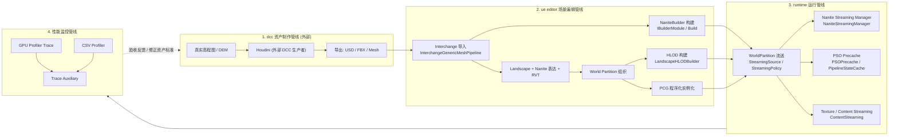

# ue58.0 主机级开放世界预研：dcc 到 runtime 性能闭环

> 本文是研究记录，不是工程配置文档。文中不包含脚本或可直接执行的配置值。
> 所有 Windows 路径均使用完整绝对路径。
> 基于本地源码根目录 `E:\UEWS\5.8.0` 的实测锚点与逻辑分析整理。

---

## 1. 背景与目标

### 1.1 项目背景
- 本地 ue 源码根目录为 `E:\UEWS\5.8.0`，此前已基于该本地源码完成 ue58.0 首轮预研。
- 目标产品形态：主机级 3A 开放世界游戏。
- 关注面：大世界地形、渲染、性能、Nanite 资产制作、Houdini dcc 管线、ue editor 场景编辑、runtime 运行、性能监控闭环。

### 1.2 目标与约束
- **帧率预算区间**：60 ~ 144 FPS（对该区间的拆解见第 5 节核心判断，不能笼统当成同一档画质目标）。
- **地形路线**：真实高程图 / DEM 转 mesh，通过 Houdini 管线导入 UE。
- **待决问题**：nanite 资产应 hero asset 优先，还是环境资产批量生产优先，尚无定论。
- **性能验收核心**：单机场景、穿越流送、战斗压力三条主线；城市密度暂不作为首轮核心。

### 1.3 本轮分析边界
- 本轮**不考虑** ue58 mcp toolsets。
- 分析框架固定为四段管线拆解：
  dcc 资产制作管线 → ue editor 场景编辑管线 → runtime 运行管线 → 性能监控管线。

---

## 2. 已验证源码锚点

以下为在本地 `E:\UEWS\5.8.0` 中已确认存在的“源码锚点”，用于后续验证时快速定位。仅保留高信号锚点，不做全量路径罗列。

| 领域 | 锚点路径（绝对路径） | 关注符号 / 说明 |
| --- | --- | --- |
| 版本确认 | `E:\UEWS\5.8.0\Engine\Build\Build.version` | 确认本地源码为 ue58.0 |
| Houdini（缺失事实） | `E:\UEWS\5.8.0\Engine\Plugins` | 未发现 SideFX Houdini Engine 插件；Houdini 属外部 dcc/插件输入 |
| dcc / 导入 | `E:\UEWS\5.8.0\Engine\Plugins\Interchange\Runtime\Source\Pipelines\Public\InterchangeGenericMeshPipeline.h` | `UInterchangeGenericMeshPipeline`、`bImportStaticMeshes`、`CreateStaticMeshFactoryNode` |
| Nanite 构建 | `E:\UEWS\5.8.0\Engine\Source\Developer\NaniteBuilder\Public\NaniteBuilder.h` | `IBuilderModule`、`BuildAssemblyPart`、`Build`、`BuildMaterialIndices` |
| Nanite 运行 / 流送 | `E:\UEWS\5.8.0\Engine\Source\Runtime\Engine\Private\Rendering\NaniteStreamingManager.cpp`；`E:\UEWS\5.8.0\Engine\Source\Runtime\Engine\Public\Rendering\NaniteStreamingManager.h` | Nanite streaming pool 行为 |
| World Partition | `E:\UEWS\5.8.0\Engine\Source\Runtime\Engine\Public\WorldPartition\RuntimeHashSet\WorldPartitionRuntimeHashSet.h`；`E:\UEWS\5.8.0\Engine\Source\Runtime\Engine\Public\WorldPartition\RuntimeHashSet\RuntimePartitionLHGrid.h`；`E:\UEWS\5.8.0\Engine\Source\Runtime\Engine\Public\WorldPartition\WorldPartitionStreamingSource.h`；`E:\UEWS\5.8.0\Engine\Source\Runtime\Engine\Public\WorldPartition\WorldPartitionStreamingPolicy.h` | 运行时分区、流送源与流送策略 |
| Landscape / Nanite 地形 | `E:\UEWS\5.8.0\Engine\Source\Runtime\Landscape\Classes\LandscapeNaniteComponent.h`；`E:\UEWS\5.8.0\Engine\Source\Runtime\Landscape\Classes\LandscapeProxy.h`；`E:\UEWS\5.8.0\Engine\Source\Runtime\Landscape\Public\LandscapeHLODBuilder.h` | 地形 Nanite 表达与 HLOD 构建 |
| PCG | `E:\UEWS\5.8.0\Engine\Plugins\PCG\Source\PCG\Public\Data\PCGLandscapeData.h`；`E:\UEWS\5.8.0\Engine\Plugins\PCG\Source\PCG\Public\Grid\PCGPartitionActor.h`；`E:\UEWS\5.8.0\Engine\Plugins\PCG\Source\PCG\Public\Subsystems\PCGSubsystem.h`；`E:\UEWS\5.8.0\Engine\Plugins\PCG\Source\PCG\Public\PCGComponent.h`；`E:\UEWS\5.8.0\Engine\Plugins\PCG\Source\PCG\Public\PCGGraph.h` | 程序化生成与实例化 |
| PSO / Shader / 性能监控 | `E:\UEWS\5.8.0\Engine\Source\Runtime\Engine\Public\PSOPrecache.h`；`E:\UEWS\5.8.0\Engine\Source\Runtime\RHI\Public\PipelineStateCache.h`；`E:\UEWS\5.8.0\Engine\Source\Runtime\RHI\Public\PipelineFileCache.h`；`E:\UEWS\5.8.0\Engine\Source\Runtime\Engine\Public\ContentStreaming.h`；`E:\UEWS\5.8.0\Engine\Source\Runtime\RHI\Public\GpuProfilerTrace.h`；`E:\UEWS\5.8.0\Engine\Source\Runtime\Core\Public\ProfilingDebugging\CsvProfiler.h`；`E:\UEWS\5.8.0\Engine\Source\Runtime\Core\Public\ProfilingDebugging\TraceAuxiliary.h` | PSO 预缓存、流送、GPU/CSV/Trace 性能采集 |

### 2.1 需标记为 Experimental 的路线（不作为默认生产基础）
- `E:\UEWS\5.8.0\Engine\Plugins\Experimental\VirtualHeightfieldMesh`
- `E:\UEWS\5.8.0\Engine\Plugins\Experimental\NaniteDisplacedMesh`

> 上述两项位于 `Experimental` 目录，仅作评估路线；在垂直切片验证通过前，不应进入默认生产管线。

---

## 3. 管线总览图

四段管线闭环（dcc → editor → runtime → 性能监控 → 反馈回 dcc）：



ASCII 备用视图（渲染环境不支持 Mermaid 时使用）：

```
[真实DEM]->[Houdini 外部dcc]->[USD/FBX/Mesh]
        |
        v
[Interchange 导入]->[NaniteBuilder 构建 / Landscape+RVT]->[World Partition]->[PCG / HLOD]
        |
        v
[WorldPartition 流送]->[Nanite Streaming / Texture Streaming / PSO Precache]
        |
        v
[GPU Trace / CSV Profiler / Trace Auxiliary]
        |
        +-----------------> (验收反馈, 修正资产与自动化标准) -----------------> [回到 dcc]
```

---

## 4. 核心判断

### 4.1 帧率预算（已形成结论）
- **60 FPS 是主机开放世界“质量模式”的硬基线。**
- **120 / 144 FPS 不应被写成同等画质下的自然目标**，而应作为独立的“性能模式 / 高刷 PC 模式 / 后续裁剪模式”。
- 达到 120 / 144 通常需要下调以下一项或多项：Lumen、VSM（Virtual Shadow Maps）、渲染分辨率、TSR、阴影距离、植被密度、材质复杂度、模拟复杂度。
- 结论：帧率预算必须**按模式拆分**，不能把区间上限当作统一画质目标。

### 4.2 地形路线（已形成结论：默认混合路线）
- **世界基础**：Landscape + Nanite 表达 + RVT（Runtime Virtual Texture）+ World Partition + PCG。
- **补充负空间**：以 Nanite StaticMesh 承担悬崖、洞穴、overhang、大型岩体，以及局部无法由高度场表达的负空间。
- **纯 Nanite Mesh 地形的准入门槛**：只有在碰撞、导航、流送、World Partition 组织、HLOD、VRAM / Nanite streaming pool 已通过垂直切片验证后，才允许进入生产。

### 4.3 Houdini 关系（已形成结论：外部 dcc 生产者）
- 本地 `E:\UEWS\5.8.0\Engine\Plugins` 未内置 SideFX Houdini Engine，因此 **Houdini 应被视为外部 dcc 生产者**。
- ue 侧重点在于承接与验证链路：Interchange / USD / FBX / StaticMesh / NaniteBuilder / DDC / Cook / World Partition / HLOD。
- 不应假定官方源码内置完整 Houdini Engine；集成方式属外部插件依赖。

### 4.4 三个主要矛盾（贯穿全项目的结构性张力）
1. **地形表达与碰撞 / 导航的双轨问题**：可视表达（Nanite/Landscape）与物理碰撞、导航网格通常不共用同一数据，需双轨维护与验证。
2. **主机渲染模式契约**：质量模式与高刷模式是两份不同的“渲染契约”，特性开关、分辨率、上采样策略必须显式约定。
3. **Streaming + PSO precache 闭环**：流送（World Partition / Nanite / Texture）与 PSO 预缓存必须协同，否则出现卡顿（hitch）与首帧编译尖峰。

---

## 5. Nanite 资产优先级分析（Hero vs 环境批量）

### 5.1 重新定义问题
这**不是**“只能二选一”的排期问题，而是“**资产质量标准与自动化标准谁先冻结**”的问题。

| 维度 | Hero Asset 关注点 | 环境批量资产关注点 |
| --- | --- | --- |
| 核心目标 | 近景品质、单体构建质量 | 规模化产能、可预测成本 |
| 关键约束 | 材质复杂度、碰撞代理 | DDC / Cook 扩张、PSO 组合数 |
| 收敛对象 | 单资产精度 | 材质收敛、Texture streaming pool、Nanite streaming pool |
| 组织依赖 | 较少 | HLOD、World Partition、PCG 实例化 |

### 5.2 结论与决策方法
- 若暂时无法判断优先级，推荐先建立 **Tier S / A / B 资产分级标准**（质量、材质预算、碰撞代理、构建规则）。
- 用 **1 ~ 2 km² 垂直切片**实测决定实际优先级：让真实的 Cook 成本、PSO 组合数、streaming pool 占用来裁决，而非主观排期。
- 换言之：**先冻结标准，再由数据定优先级。**

---

## 6. 地形与 World Partition 建议路线

- **默认路线**：Landscape + Nanite 表达 + RVT + World Partition + PCG 作为世界基础；Nanite StaticMesh 补充负空间。
- **DEM 承接**：DEM → Houdini（外部）→ 导出 → `InterchangeGenericMeshPipeline` 承接 → NaniteBuilder 构建 → World Partition 组织。
- **组织与降级**：World Partition 负责运行时分区与流送；HLOD（`LandscapeHLODBuilder` 等）负责远景降级。
- **准入验证顺序**（纯 Nanite Mesh 地形专用）：碰撞 → 导航 → 流送 → World Partition 组织 → HLOD → VRAM / Nanite streaming pool，全部通过后方可生产化。

---

## 7. 性能验收矩阵

首轮核心三主线：**单机场景、穿越流送、战斗压力**。城市密度暂不列入首轮核心。

| 验收场景 | 验证内容 | 关注信号 |
| --- | --- | --- |
| 固定穿越路线 | 沿预设路径重复穿越 | 帧时间稳定性、流送 hitch |
| 多速度层级 | 步行 / 载具 / 极速穿越 | 流送预取是否跟得上速度 |
| Teleport / 快速加载 | 瞬移与快速加载 | 流送峰值、PSO 首帧编译尖峰 |
| 战斗压力 | 战斗中特效 / 单位 / 材质叠加 | GPU 峰值、Draw / PSO 组合 |
| 视角压力 | 极端视角 / 远眺 / 快速转视角 | Nanite 可见性、剔除、VSM 成本 |
| 30 ~ 60 分钟 soak | 长时运行稳定性 | 内存 / VRAM 泄漏、streaming pool 漂移、长尾 hitch |

> 采集工具锚点见第 2 节 PSO / Shader / 性能监控行（GPU Profiler Trace、CSV Profiler、Trace Auxiliary）。

---

## 8. 下一步垂直切片计划（验证建议）

1. **搭建 1 ~ 2 km² 垂直切片**：包含代表性地形起伏、至少一处负空间（悬崖 / 洞穴 / overhang）。
2. **打通 DEM → Houdini → Interchange → NaniteBuilder → World Partition** 端到端承接链路，验证导入与构建是否稳定可重复。
3. **冻结 Tier S / A / B 资产标准**，各 Tier 至少放置 1 个 Hero 与一批环境资产，用于对比 Cook 成本与 streaming 占用。
4. **建立质量模式与高刷模式两份渲染契约**，分别记录特性开关差异。
5. **跑通性能验收矩阵首轮三主线**（单机、穿越、战斗），采集 GPU / CSV / Trace 数据。
6. **验证纯 Nanite Mesh 地形准入链**（碰撞 / 导航 / 流送 / WP / HLOD / streaming pool），判断是否具备扩大使用的条件。
7. **验证 PSO precache 与 streaming 的协同**：在 teleport 与战斗切换场景下观察首帧编译尖峰是否可控。

---

## 9. 逻辑分析推理（无事实依据）

> **以下内容为逻辑推演，尚未经过本地实测，不得当作已验证事实或既定性能预算使用。**

- **推理 A（帧率成本假设）**：从 60 FPS 提到 120 FPS，GPU 单帧预算约减半；据此推测多数高刷方案必须在 Lumen / VSM / 分辨率上做出让步。此为定性推理，具体让步幅度须实测。
- **推理 B（streaming pool 压力假设）**：DEM 转 Nanite Mesh 的负空间资产若密集分布，可能显著抬高 Nanite streaming pool 与 VRAM 峰值；具体数值须由垂直切片测得。
- **推理 C（PSO 组合爆炸假设）**：环境批量资产的材质变体若不收敛，PSO 组合数可能非线性增长，进而放大首帧 / teleport hitch；须以实际 Cook 与运行数据验证。
- **推理 D（双轨成本假设）**：可视表达与碰撞 / 导航双轨维护，推测会带来额外的构建时间与数据一致性风险；须在切片中量化。
- **推理 E（穿越速度与预取假设）**：高速载具穿越可能超出默认流送预取半径，推测需要调整流送源行为；具体阈值须实测。

---

## 10. 局限性与潜在风险提示

- **未实测即结论的风险**：第 9 节所有推理均无实测支撑，任何性能预算数字在垂直切片跑通前都不可写入正式规格。
- **Houdini 外部依赖风险**：Houdini Engine 属外部插件 / dcc，版本兼容性、导入语义（尤其法线 / UV / 材质槽 / 碰撞代理）需单独验证。
- **Experimental 路线风险**：`VirtualHeightfieldMesh`、`NaniteDisplacedMesh` 处于 `Experimental`，接口与行为可能变动，不宜作为默认生产基础。
- **双轨数据一致性风险**：地形可视表达与碰撞 / 导航数据分离，存在“看得到走不通 / 走得通看不到”的一致性缺陷风险。
- **模式契约漂移风险**：若质量模式与高刷模式的特性开关未显式冻结，容易在迭代中互相污染，导致两种模式都不达标。
- **本文档时效性**：结论基于 `E:\UEWS\5.8.0` 当前本地源码状态；源码更新或引擎版本变化后需复核锚点有效性。

---

_文档性质：预研记录。仅包含预研背景、已验证事实、结论与下一步验证建议。_
