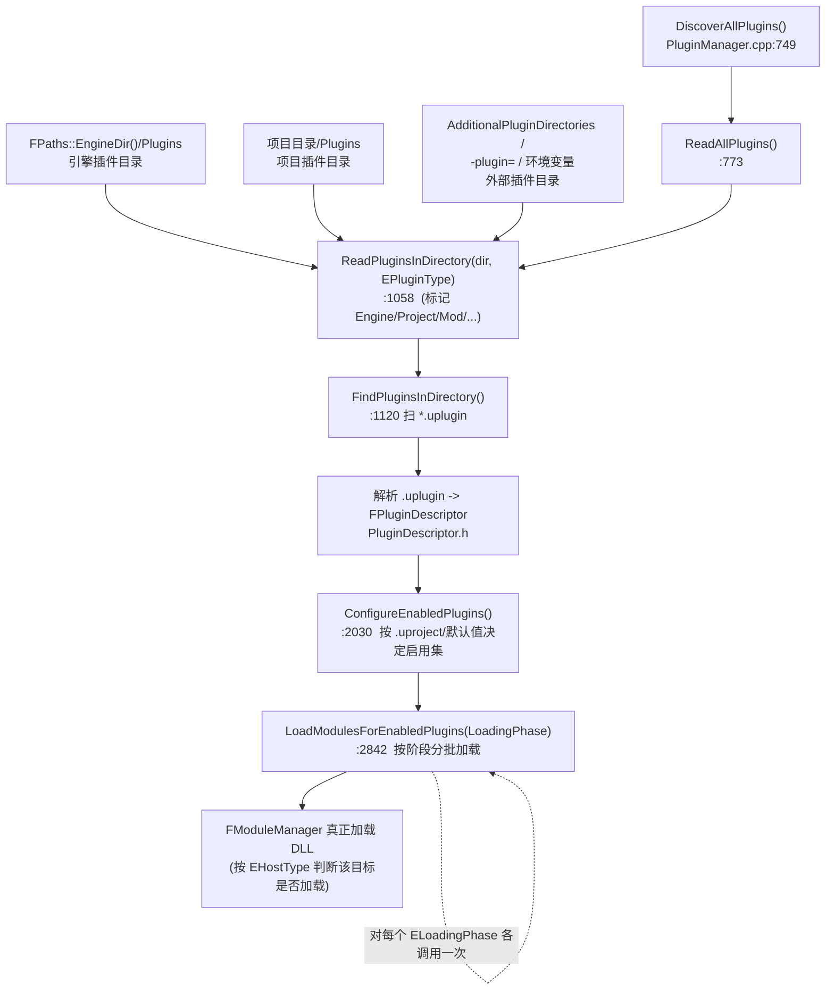
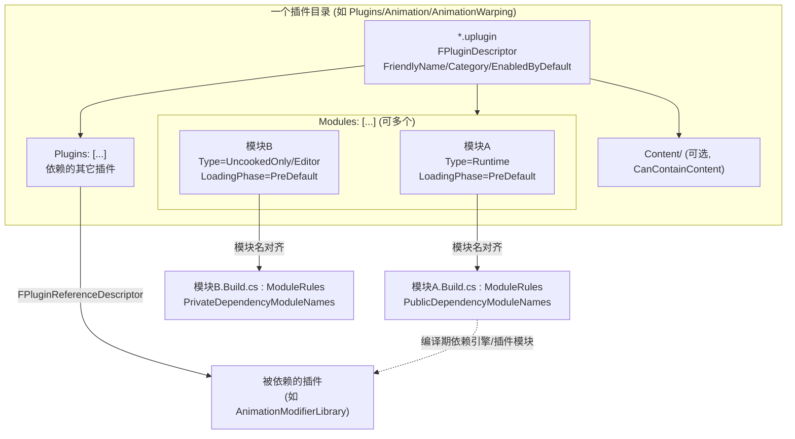
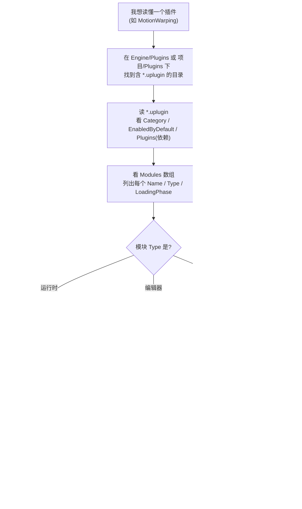

# UE5.8 插件机制源码地图（Plugin Mechanism Orientation）

> 本文档面向 thomas，目标只有一个：让你在 **不通读插件系统全量实现** 的前提下，先看清 Unreal Engine 5.8 的插件机制——**插件如何被发现、描述、加载、编译，以及怎么区分 Runtime / Editor / Developer**，做到「读一个插件不迷路」。本文档 **不** 深入 `FPluginManager` 或 UnrealBuildTool 的实现精读。
>
> 配套规格见 [`UE58_01_Plugin_Mechanism_Orientation_ChangeSpec.md`](<D:/UE/Docs/UE58_01_Plugin_Mechanism_Orientation_ChangeSpec.md>)。
>
> **证据约定**：标 `【事实】` 的内容由本机目录/文件名/`.uplugin`/`.uproject`/`.Build.cs`/头文件 `file:line` 直接验证；标“逻辑分析推理(无事实依据)”的内容基于 UE 通用约定推断，未通读实现，需后续读代码确认。
>
> **路径表述约定**：正文与 ASCII 图中提及目录/文件一律用 **完整绝对路径**（Windows 原生反斜杠形式，反引号包裹）；mermaid 图节点为避免过长，使用 **以 `D:\UE\5.8.0r\Engine` 为根的相对简写**（正斜杠风格），不代表磁盘真实分隔符。

---

## 1. thomas 先读这段：插件机制如何帮助不迷路

UE 的引擎本体（`D:\UE\5.8.0r\Engine\Source`）只是「地基」；**绝大多数可选能力（动画、玩法、相机、移动、源码管理、编辑器工具）都以「插件」形态挂在地基外面**。所以你在排查任何功能时，第一刀就该问：**「它是引擎内置模块，还是某个插件提供的模块？」** 判断对了，方向就不会错。

读插件机制的用法，是 **从外向内四步收敛**，不要一上来就读 `PluginManager.cpp`：

1. **先看 descriptor**：每个插件根目录有一个 `*.uplugin`（JSON）。它是插件的「身份证」，声明插件叫什么、属于什么类别、**包含哪些模块**、依赖哪些别的插件。先读它，就知道这个插件能干什么、由几块组成。
2. **再看模块清单**：`.uplugin` 里的 `Modules` 数组，每个条目有 `Name`（模块名）、`Type`（模块类型，决定它在哪种目标里加载）、`LoadingPhase`（加载阶段，决定它什么时候加载）。这是「Runtime / Editor / Developer 区分」的真正源头。
3. **后看 `.Build.cs`**：每个模块名都对应一个 `<模块名>.Build.cs`，它声明 **这个模块编译时依赖谁**。`.uplugin` 管「运行时怎么加载」，`.Build.cs` 管「编译时怎么链接」，两者是 **两套并行体系**，读哪个取决于你关心运行还是构建。
4. **最后看类型与加载**：用 `Type`（`EHostType`）判断「这块代码会不会进游戏包 / 只在编辑器里」，用 `LoadingPhase`（`ELoadingPhase`）判断「它在启动序列哪一步被加载」。

> 速记：**先问「哪个 `.uplugin`」（身份）→ 再问「有几个 Module、各是什么 Type」（边界）→ 然后问「哪个 `.Build.cs` 管编译」（依赖）→ 最后问「什么 Type、什么 LoadingPhase」（进不进包、何时加载）。** 四问之后你就不会在插件里迷路。（逻辑分析推理(无事实依据)：基于本文给出的结构事实归纳）

---

## 2. 一句话总览 + ASCII 总览图

`D:\UE\5.8.0r\Engine\Plugins` 是 **引擎自带插件的总目录**【事实，79 个顶层条目、共 895 个 `*.uplugin`】；插件机制的 **运行时核心代码** 不在它里面，而在 `D:\UE\5.8.0r\Engine\Source\Runtime\Projects` 模块（负责解析 `.uplugin`/`.uproject` 并加载模块）【事实，`Public\PluginDescriptor.h`/`Private\PluginManager.cpp` 等存在】；插件机制的 **构建期核心代码** 在 `D:\UE\5.8.0r\Engine\Source\Programs\UnrealBuildTool`（负责按 `.Build.cs` 编译插件模块）【事实，`Configuration\UEBuildPlugin.cs`/`Configuration\Rules\ModuleRules.cs` 等存在】。

下图是 thomas 最该先记住的一条主链：**从一个 `.uplugin` 文件，到它最终被加载进进程**。

```text
一个插件 = 一个目录 (如 D:\UE\5.8.0r\Engine\Plugins\Runtime\CableComponent)
   |
   +-- *.uplugin  (JSON)  ============ 插件「身份证」/ Plugin Descriptor
   |        |              解析为 FPluginDescriptor (Runtime\Projects\Public\PluginDescriptor.h)
   |        |
   |        +-- "Modules": [ ... ]   每个元素 = 一个 FModuleDescriptor (ModuleDescriptor.h)
   |        |        |
   |        |        +-- "Name"         : 模块名         (= 对应一个 <Name>.Build.cs)
   |        |        +-- "Type"         : EHostType      (Runtime / Editor / Developer / Program ... 进不进游戏包)
   |        |        +-- "LoadingPhase" : ELoadingPhase  (启动序列里何时加载)
   |        |
   |        +-- "Plugins": [ ... ]   依赖的其它插件 (FPluginReferenceDescriptor)
   |
   +-- Source\<Name>\<Name>.Build.cs  === 模块「编译规则」/ ModuleRules (UBT 读)
   |        |
   |        +-- PublicDependencyModuleNames  / PrivateDependencyModuleNames  (编译时依赖)
   |
   +-- Content\ Resources\ Config\ (可选: 资产/图标/配置)

       发现与加载链 (运行时, 由 Runtime\Projects 的 FPluginManager 驱动):
       扫描目录 -> 读 .uplugin -> 决定启用 -> 按 LoadingPhase 分批 -> 按 Type 决定该目标是否加载该模块
       DiscoverAllPlugins -> ConfigureEnabledPlugins -> LoadModulesForEnabledPlugins(phase)
```

> 读图要点：**`.uplugin` 与 `.Build.cs` 各管一头**——`.uplugin` 是「运行时身份与加载策略」（被 `Runtime\Projects` 读），`.Build.cs` 是「编译期依赖」（被 `UnrealBuildTool` 读）。`Type` 决定「进哪种目标」，`LoadingPhase` 决定「何时加载」。（事实支撑见第 4–6 节 `file:line`；两套体系「各管一头」的归纳为逻辑分析推理(无事实依据)）

---

## 3. 插件目录地图：`D:\UE\5.8.0r\Engine\Plugins`

`D:\UE\5.8.0r\Engine\Plugins` 顶层是 **「分类目录 + 少量插件目录」的混合结构**【事实，79 个顶层条目】。其中一部分顶层条目是 **分类容器**（里面再装一堆插件），常见的有：【事实，目录存在】

| 顶层分类目录（完整绝对路径） | 装什么（代表性子目录，实测存在） | 逻辑分析推理(无事实依据) |
| --- | --- | --- |
| `D:\UE\5.8.0r\Engine\Plugins\Runtime` | `CableComponent`、`GameplayAbilities`、`CommonUI`、`GameFeatures`、`AudioCapture` … | 主要装 **运行时玩法/能力** 插件 |
| `D:\UE\5.8.0r\Engine\Plugins\Editor` | `PluginBrowser`、`ContentBrowser`、`ModelingToolsEditorMode`、`DataValidation` … | 主要装 **编辑器工具** 插件 |
| `D:\UE\5.8.0r\Engine\Plugins\Developer` | `BlankPlugin`(模板)、`UObjectPlugin`、`PerforceSourceControl`、`VisualStudioSourceCodeAccess`、`RenderDocPlugin` … | 主要装 **开发/源码管理/调试** 插件 |
| `D:\UE\5.8.0r\Engine\Plugins\Animation` | `ControlRig`、`IKRig`、`MotionWarping`、`PoseSearch`、`AnimationWarping`、`LiveLink` … | 主要装 **动画** 插件 |
| `D:\UE\5.8.0r\Engine\Plugins\Experimental` | `Chaos*` 系列、`Animation`、`AVCodecs` … | 主要装 **实验性** 插件 |

> 关键澄清（与任务建议路径的差异，事实）：本任务建议调查的 `D:\UE\5.8.0r\Engine\Source\Developer\PluginBrowser` 与 `D:\UE\5.8.0r\Engine\Source\Developer\Plugins` 在本机 **不存在**【事实，`ls` 报 No such file or directory】。**PluginBrowser 本身就是一个插件**，落点是 `D:\UE\5.8.0r\Engine\Plugins\Editor\PluginBrowser`（它提供「插件浏览器」编辑器 UI）；插件机制的 **运行时核心** 在 `D:\UE\5.8.0r\Engine\Source\Runtime\Projects`。本文以本机实测为准。

> 注意「分类目录」≠「插件」：判据是 **该目录下有没有 `*.uplugin`**。有 `*.uplugin` 的目录才是一个插件根；只装子目录、自己没有 `*.uplugin` 的是分类容器。（逻辑分析推理(无事实依据)：基于「插件 = 带 `.uplugin` 的目录」这一事实约定）

---

## 4. `.uplugin` 字段解释：Plugin Descriptor（`FPluginDescriptor`）

`.uplugin` 是 JSON 文件，被解析成 C++ 结构体 `FPluginDescriptor`，定义在 `D:\UE\5.8.0r\Engine\Source\Runtime\Projects\Public\PluginDescriptor.h`【事实】。常见字段（行号实测）：

| 字段（`.uplugin` JSON 键） | 含义 | 证据（`PluginDescriptor.h`） |
| --- | --- | --- |
| `Version` / `VersionName` | 内部版本号 / 展示用版本名 | `PluginDescriptor.h:43` / `:47` |
| `FriendlyName` / `Description` / `Category` | 展示名 / 描述 / 分类 | `:50` / `:53` / `:56` |
| `CreatedBy` / `CreatedByURL` / `DocsURL` / `MarketplaceURL` | 作者与链接（可选） | `:59` / `:62` / `:65` / `:68` |
| `Modules` | **本插件包含的模块列表**（核心，`TArray<FModuleDescriptor>`） | `:90` |
| `Plugins` | **本插件依赖的其它插件**（`TArray<FPluginReferenceDescriptor>`） | `:174` |
| `EnabledByDefault` | 是否默认为所有项目启用（`EPluginEnabledByDefault`） | `:124`（枚举 `:28`） |
| `CanContainContent` | 插件能否包含资产内容 | `:127` |
| `IsBetaVersion` / `IsExperimentalVersion` | UI 上标记 Beta / 实验性 | `:133` / `:136` |
| `Installed` | 标记为「安装在引擎之上」 | `:139` |
| `ExplicitlyLoaded` | 为真时模块不自动加载、内容不自动挂载，需显式请求（忽略 LoadingPhase） | `:154` |

> `FPluginDescriptor` 还有 Verse / SceneGraph / 平台扩展（`bIsPluginExtension`）、`bIsSealed`、`bNoCode` 等较新字段【事实，`:96`-`:163` 多处】，本文不展开（属第 1/5 篇「认知层」，非精读层）。

### 4.1 三个代表性 `.uplugin`（不同类型，实测内容）

**样本 A — 纯 Runtime 单模块**：`D:\UE\5.8.0r\Engine\Plugins\Runtime\CableComponent\CableComponent.uplugin`【事实】

```jsonc
{ "FileVersion": 3, "Version": 1, "VersionName": "1.0",
  "FriendlyName": "Cable Component", "Category": "Rendering",
  "EnabledByDefault": true, "CanContainContent": false,
  "Modules": [ { "Name": "CableComponent", "Type": "Runtime", "LoadingPhase": "PreDefault" } ] }
```

**样本 B — Editor 单模块 + 依赖另一个插件**：`D:\UE\5.8.0r\Engine\Plugins\Editor\PluginBrowser\PluginBrowser.uplugin`【事实】

```jsonc
{ "FriendlyName": "Plugin Browser", "Category": "Editor", "EnabledByDefault": true,
  "Modules": [ { "Name": "PluginBrowser", "Type": "Editor", "LoadingPhase": "Default" } ],
  "Plugins": [ { "Name": "PluginUtils", "Enabled": true } ] }
```

**样本 C — 多模块（Runtime + 编辑器侧）+ 依赖插件**：`D:\UE\5.8.0r\Engine\Plugins\Animation\AnimationWarping\AnimationWarping.uplugin`【事实】

```jsonc
{ "FriendlyName": "Animation Warping", "Category": "Animation",
  "EnabledByDefault": false, "CanContainContent": true,
  "Modules": [
    { "Name": "AnimationWarpingRuntime", "Type": "Runtime",      "LoadingPhase": "PreDefault" },
    { "Name": "AnimationWarpingEditor",  "Type": "UncookedOnly", "LoadingPhase": "PreDefault" } ],
  "Plugins": [ { "Name": "AnimationModifierLibrary", "Enabled": true } ] }
```

> 三个样本要点：(1) **一个插件可含多个模块**，且各模块 `Type` 可不同（样本 C 把运行时与编辑器侧拆成两块）；(2) `EnabledByDefault` 可真可假（样本 A/B 默认开，C 默认关，需项目显式启用）；(3) `Plugins` 字段表达 **插件→插件依赖**（B 依赖 `PluginUtils`，C 依赖 `AnimationModifierLibrary`）。这些都是「读一个插件能干什么」的直接信息。【事实：JSON 内容；归纳为逻辑分析推理(无事实依据)】

---

## 5. Module Type 与 Loading Phase：Runtime / Editor / Developer 的真正源头

`.uplugin` 里每个模块的 `Type` 和 `LoadingPhase`，分别对应两个枚举，都定义在 `D:\UE\5.8.0r\Engine\Source\Runtime\Projects\Public\ModuleDescriptor.h`【事实】。

### 5.1 Module Type（`EHostType`）：决定「在哪种目标里加载」

`EHostType` 枚举（`ModuleDescriptor.h:82`-`:149`）的关键取值与 **源码注释原意**【事实，注释为源码原文】：

| `Type` 值 | 源码注释含义（决定它在哪种 target 加载） | 行号 |
| --- | --- | --- |
| `Runtime` | 在所有 target 加载，**programs 除外** | `:87` |
| `RuntimeNoCommandlet` | 同上，但 **运行 commandlet 的编辑器** 不加载 | `:90` |
| `RuntimeAndProgram` | 在所有 target 加载，**含支持的 programs** | `:93` |
| `CookedOnly` | **只在已 cook 的游戏** 里加载 | `:96` |
| `UncookedOnly` | **只在未 cook 的游戏** 里加载（样本 C 的编辑器侧模块用它） | `:99` |
| `Developer`（已废弃） | 仅编辑器与 program target 加载（注释建议改用 `UncookedOnly` 或 `DeveloperTool`） | `:104` |
| `DeveloperTool` | 在 `bBuildDeveloperTools` 启用的 target 加载（可进 cook 包但不应 ship） | `:107` |
| `Editor` | **只在编辑器启动时** 加载（样本 B 用它） | `:110` |
| `EditorNoCommandlet` | 仅编辑器、但非 commandlet 模式 | `:113` |
| `EditorAndProgram` | 仅 editor 与 program target | `:116` |
| `Program` | **只在 program target** 加载 | `:119` |
| `ServerOnly` / `ClientOnly` / `ClientOnlyNoCommandlet` | 分别排除「专用客户端 / 专用服务器」等 | `:122` / `:125` / `:128` |

> 这就是 thomas 想要的「Runtime / Editor / Developer 区分」的 **事实源头**：它不是目录名约定，而是 **`.uplugin` 里每个模块显式写的 `Type` 字段，由 `EHostType` 定义**。`FModuleDescriptor` 中 `Name`/`Type`/`LoadingPhase` 三个字段在 `ModuleDescriptor.h:157`/`:160`/`:163`【事实】。
>
> 实战判据（逻辑分析推理(无事实依据)，基于上表注释）：**想知道「这块代码会不会进玩家拿到的游戏包」，看模块 `Type`**——`Runtime`/`RuntimeAndProgram`/`CookedOnly` 大概率进；`Editor`/`UncookedOnly`/`DeveloperTool`/`Program` 大概率不进 ship 包。

### 5.2 Loading Phase（`ELoadingPhase`）：决定「启动序列何时加载」

`ELoadingPhase` 枚举（`ModuleDescriptor.h:24`-`:77`）按启动早晚排列【事实】：`EarliestPossible`（`:29`，最早，连 pak 都还没起）→ `PostConfigInit`（`:32`，配置系统初始化后）→ `PostSplashScreen`（`:35`）→ `PreEarlyLoadingScreen`（`:38`）→ `PreLoadingScreen`（`:41`）→ `PreDefault`（`:44`）→ `Default`（`:47`，默认点，游戏模块加载之后）→ `PostDefault`（`:50`）→ `PostEngineInit`（`:53`，引擎初始化后）→ `None`（`:56`，不自动加载）。

> 读法（逻辑分析推理(无事实依据)，基于注释）：`LoadingPhase` 越靠前，模块越早被加载、越「底层」（如压缩格式插件要 `EarliestPossible`）。样本 A/C 的运行时模块用 `PreDefault`（比默认稍早），样本 B 的编辑器模块用 `Default`。`None` 表示「不自动加载，等显式请求」。

---

## 6. 插件与模块 / `.Build.cs` 的关系：两套并行体系

`.uplugin` 里写的 `Modules[].Name`，**每一个都对应一个 `<Name>.Build.cs` 文件**，二者通过「模块名」对齐。以样本 A 为例【事实】：

- `.uplugin` 写 `"Name": "CableComponent"`（`CableComponent.uplugin:20`）。
- 对应模块目录 `D:\UE\5.8.0r\Engine\Plugins\Runtime\CableComponent\Source\CableComponent\`，内含 `CableComponent.Build.cs`、`Classes`、`Private`【事实】。
- `CableComponent.Build.cs` 内容【事实】：`public class CableComponent : ModuleRules`，其 `PublicDependencyModuleNames.AddRange(new string[]{ "Core", "CoreUObject", "Engine", "RenderCore", "RHI" })`。

`.Build.cs` 是 C# 类，基类 `ModuleRules` 定义在 `D:\UE\5.8.0r\Engine\Source\Programs\UnrealBuildTool\Configuration\Rules\ModuleRules.cs`【事实】：`ModuleType` 枚举在 `:110`，`PublicDependencyModuleNames` 列表在 `:1259`，`PrivateDependencyModuleNames` 在 `:1270`，构造函数 `ModuleRules(ReadOnlyTargetRules target)` 在 `:1581`。

**两套并行 descriptor 体系**（关键认知）：

| 维度 | 运行时 C++ 侧 | 构建期 C# 侧 |
| --- | --- | --- |
| 谁读 | `Runtime\Projects` 的 `FPluginManager`【事实】 | `UnrealBuildTool`（UBT）【事实】 |
| 读什么 | `.uplugin` / `.uproject` 的 JSON | `.uplugin` JSON（`Configuration\Descriptors\PluginDescriptor.cs`）+ `.Build.cs`（`ModuleRules`） |
| 解决什么 | 运行时 **发现、启用、按阶段加载模块** | 编译期 **决定编译哪些模块、链接哪些依赖** |
| 关键文件 | `Public\PluginDescriptor.h` / `Public\ModuleDescriptor.h` / `Private\PluginManager.cpp` | `Configuration\UEBuildPlugin.cs` / `Configuration\Rules\ModuleRules.cs` / `System\Plugins.cs` |

> 一句话：**`.uplugin` 的 `Modules[].Type/LoadingPhase` 管「运行时谁加载、何时加载」；`<Name>.Build.cs` 的 `*DependencyModuleNames` 管「编译时谁链接谁」。** 同一个模块名把这两套体系缝在一起。（事实支撑见上述 `file:line`；「两套并行」为逻辑分析推理(无事实依据)）
>
> 衔接已有文档：`.Build.cs` 的 `PublicDependencyModuleNames` / `PrivateDependencyModuleNames` 语义，与 [`UE58_Source_Hierarchy_Orientation.md`](<D:/UE/Docs/UE58_Source_Hierarchy_Orientation.md>) 第 7.2 节口径一致（公有依赖向上游传播，私有依赖不传播）。

---

## 7. Mermaid 1：插件发现与加载图（运行时）

下图刻画 `FPluginManager`（`D:\UE\5.8.0r\Engine\Source\Runtime\Projects\Private\PluginManager.cpp`）从「扫目录」到「按阶段加载模块」的主干，函数名与行号实测【事实】。



> 关键事实支撑：搜索目录区分来源——`FPaths::EngineDir()`+`Plugins` 标记为 `EPluginType::Engine`（`PluginManager.cpp:803`/`:814`）、项目目录+`Plugins` 标记 `EPluginType::Project`（`:823`/`:833`）、`ProjectModsDir` 标记 `Mod`（`:904`）、`EnterprisePluginsDir` 标记 `Enterprise`（`:929`）、额外搜索路径标记 `External`（`:940`）【全为事实】。`LoadModulesForEnabledPlugins` 接收 `ELoadingPhase` 参数（`:2842`），由引擎启动序列对不同阶段分别调用——「各阶段各调一次」为逻辑分析推理(无事实依据)，未读调用方。

---

## 8. Mermaid 2：插件模块边界图（一个插件 = descriptor + 多模块 + 各自 Build.cs）



> 读图要点：**插件边界 = 一个 `.uplugin`**；**模块边界 = 一个 `.Build.cs`**；二者按「模块名」对齐。一个插件可含多个不同 `Type` 的模块（运行时块 + 编辑器块），这正是样本 C `AnimationWarping` 的形态【事实】。「插件→插件依赖」由 `.uplugin` 的 `Plugins` 字段（`FPluginReferenceDescriptor`）表达，「模块→模块依赖」由 `.Build.cs` 的 `*DependencyModuleNames` 表达——**两个层级、两套依赖**。（事实支撑见第 4/6 节；分层归纳为逻辑分析推理(无事实依据)）

---

## 9. Mermaid 3：读一个插件的定位流程图（拿到插件名 → 看懂它）



> 这条流程把第 4–6 节判据串成一条 **可机械执行** 的读插件路径：定 descriptor → 列模块 → 判类型（进不进包）→ 看 `.Build.cs`（依赖）→ 看加载阶段。建立认知阶段做到这一步即可，**不必**读 `PluginManager.cpp` 实现。（逻辑分析推理(无事实依据)：基于本文结构事实归纳）

---

## 10. 插件与项目 `.uproject` 的关系：项目如何启用插件

`.uproject` 是项目的「身份证」，结构与 `.uplugin` 高度相似（也由 `Runtime\Projects` 解析，对应 `D:\UE\5.8.0r\Engine\Source\Runtime\Projects\Public\ProjectDescriptor.h`）【事实，文件存在】。项目通过 `.uproject` 的 `Plugins` 数组 **逐个启用/禁用插件**。

**实测样本 1**：`D:\UE\AnimationSamples\AnimationSamples.uproject`【事实】——`Plugins` 数组逐项写 `{"Name": ..., "Enabled": true}`，部分带 `TargetAllowList`：

```jsonc
"Plugins": [
  { "Name": "ModelingToolsEditorMode", "Enabled": true, "TargetAllowList": ["Editor"] },
  { "Name": "AnimationWarping", "Enabled": true },
  { "Name": "MotionWarping",   "Enabled": true },
  { "Name": "PoseSearch",      "Enabled": true },
  /* … RigLogic / LiveLink / Mover / SmartObjects / GameplayInteractions … */ ]
```

> 注意：`AnimationWarping` 的 `.uplugin` 是 `EnabledByDefault: false`（样本 C）【事实】，所以 `AnimationSamples` **必须在 `.uproject` 里显式 `Enabled: true`** 才能用它——这就是 `EnabledByDefault` 与 `.uproject` 启用的配合关系。`TargetAllowList: ["Editor"]` 表示该插件只在 Editor target 启用。（事实：两份文件内容；配合关系为逻辑分析推理(无事实依据)）

**实测样本 2**：`D:\UE\ProjectTitan\ProjectTitan.uproject`【事实】——除 `Plugins` 外还含 `Modules` 与 `AdditionalPluginDirectories`：

```jsonc
"Modules": [
  { "Name": "Titan",       "Type": "Runtime", "LoadingPhase": "Default",
    "AdditionalDependencies": ["Mover","GameplayAbilities","Engine","AIModule","UMG","SampleFramework","CommonUI"] },
  { "Name": "TitanEditor", "Type": "Editor",  "LoadingPhase": "Default",
    "AdditionalDependencies": ["DataValidation"] } ],
"AdditionalPluginDirectories": [ "../external/Unreal_mcp/plugins" ],
"Plugins": [
  { "Name": "McpAutomationBridge", "Enabled": true, "TargetAllowList": ["Editor"] },
  { "Name": "Water", "Enabled": true }, { "Name": "PCG", "Enabled": true },
  { "Name": "GameplayAbilities", "Enabled": true }, { "Name": "Mover", "Enabled": true },
  { "Name": "Bridge", "Enabled": false, "SupportedTargetPlatforms": ["Win64","Mac","Linux"] },
  /* … GameplayStateTree / CommonUI / GeometryScripting … */ ]
```

> 两个关键事实：(1) `.uproject` 的 `Modules` 用的也是 `Type`(`EHostType`)/`LoadingPhase`/`AdditionalDependencies`——**项目自己的代码模块与插件模块用同一套 descriptor 语义**【事实，字段同名】；(2) `AdditionalPluginDirectories` 指向项目外的额外插件目录，对应 `IPluginManager.h` 里 `EPluginExternalSource::ProjectDescriptor`（`IPluginManager.h:54`）与 `EPluginType::External`【事实】，这就是「项目从工程目录之外引入插件」的官方机制。
>
> 文件名澄清（事实）：`D:\UE\ProjectTitan\AGENTS.md` 与本任务文字称该项目文件为 `Titan.uproject`，但本机实际文件名为 `D:\UE\ProjectTitan\ProjectTitan.uproject`（`Titan.uproject` 不存在）。本文以本机实际文件名为准。

---

## 11. 引擎插件 vs 项目插件：`EPluginType` 与 `EPluginLoadedFrom`

插件「从哪来」由两个枚举刻画，定义在 `D:\UE\5.8.0r\Engine\Source\Runtime\Projects\Public\Interfaces\IPluginManager.h`【事实】。

`EPluginType`（`IPluginManager.h:30`）的取值与源码注释【事实】：

| 值 | 注释含义 | 行号 |
| --- | --- | --- |
| `Engine` | **内置于引擎** 的插件（`D:\UE\5.8.0r\Engine\Plugins` 下） | `:33` |
| `Enterprise` | 标准企业版插件 | `:36` |
| `Project` | **项目专属** 插件（存在某个游戏项目目录下，如 `D:\UE\ProjectTitan\Plugins`） | `:39` |
| `External` | 外部目录插件（来自 `.uproject` 的 `AdditionalPluginDirectories` 或命令行 `-plugin=`） | `:42` |
| `Mod` | 项目专属 mod 插件 | `:45` |

`EPluginLoadedFrom`（运行时用「Engine / Project」二分）：`FPlugin::GetLoadedFrom()` 在 `PluginManager.cpp:437`-`:445` 返回 `Engine` 或 `Project`【事实】。它影响行为，例如 `:425` 处「项目插件默认允许、引擎插件受 `bAllowEnginePluginsEnabledByDefault` 控制」【事实，代码分支】。

> 引擎插件与项目插件的核心区别（逻辑分析推理(无事实依据)，基于上表注释与分支）：
> - **位置**：引擎插件在 `D:\UE\5.8.0r\Engine\Plugins`，对所有用该引擎的项目可见；项目插件在具体项目的 `Plugins` 目录（如 `D:\UE\ProjectTitan\Plugins`），只对该项目可见。
> - **默认启用策略不同**：项目插件默认参与 enabled-by-default，引擎插件是否参与受开关控制（`PluginManager.cpp:425`）。
> - **External**：项目还能用 `AdditionalPluginDirectories` 把 **项目目录之外** 的插件目录纳入（`ProjectTitan.uproject` 的 `"../external/Unreal_mcp/plugins"` 即此用法）【事实】。
>
> 对应 `IPluginManager` 查询接口（`IPluginManager.h`）：`GetType()`(`:168`) 返回 `EPluginType`、`GetLoadedFrom()`(`:253`) 返回来源、`FindPlugin()`(`:393`)、`GetEnabledPlugins()`(`:428`)、`GetDiscoveredPlugins()`(`:454`)、`RefreshPluginsList()`(`:292`)、`AddToPluginsList()`(`:299`)【全为事实，行号实测】。工程内「找插件、判断插件来源」应走这套接口，而非硬编码路径。

---

## 12. 与已有文档的衔接

本文是 **「插件机制认知层」**，与 `D:\UE\Docs` 下已有四份文档构成一张更完整的地图：

- 与 [`UE58_Source_Hierarchy_Orientation.md`](<D:/UE/Docs/UE58_Source_Hierarchy_Orientation.md>)（源码层级）：那份讲 **引擎本体 `Engine\Source` 的四类源码域与模块边界**；本文讲 **`Engine\Source` 之外的插件如何挂上来**。两者共用「模块 = 带 `.Build.cs` 的目录」「`Public/Private` 边界」「`*DependencyModuleNames` 依赖传播」的口径——本文第 6 节与那份第 7 节一致。**插件里的模块，结构与引擎模块完全相同**，只是多了一层 `.uplugin` 描述与 `EHostType`/`ELoadingPhase` 的加载策略。
- 与 [`UE58_Rendering_Animation_DeepDive.md`](<D:/UE/Docs/UE58_Rendering_Animation_DeepDive.md>)（渲染×动画）：那份第 9.4 节提到 `D:\UE\5.8.0r\Engine\Plugins\Animation` 插件群（如 `ControlRig`/`IKRig`/`MotionWarping`/`PoseSearch`）。本文正是解释 **那些动画能力为什么以插件形态存在、怎么被项目启用**（如 `AnimationSamples.uproject` 启用 `MotionWarping`/`PoseSearch`）。
- 与 [`UE58_Nanite_WorldPartition_HLOD_SourceMap.md`](<D:/UE/Docs/UE58_Nanite_WorldPartition_HLOD_SourceMap.md>)（大世界）：那份的 Nanite/WorldPartition/HLOD 多在 `Runtime\Renderer`/`Runtime\Engine` 引擎本体内（非插件）；与本文形成对照——**不是所有能力都是插件，引擎核心子系统仍在 `Engine\Source` 里**。判断「找引擎内置还是找插件」正是本文第 1 节强调的第一刀。
- 推荐顺序：**先读源码层级建立「引擎本体」认知 → 再读本文建立「插件如何扩展引擎」认知 → 需要具体子系统时切到渲染/动画/大世界文档**。

---

## 13. 阿卡姆剃刀检查

- **是否必须跨项目完成？** 主体只读 `D:\UE\5.8.0r` 的插件机制；仅为说明「项目如何启用插件」**只读** 了 `D:\UE\AnimationSamples\AnimationSamples.uproject` 与 `D:\UE\ProjectTitan\ProjectTitan.uproject` 的插件片段，未修改任何项目文件。
- **是否能删掉而不影响目标？** 本文聚焦「发现/描述/加载/编译/类型区分」，已剔除 Verse、GameFeatures、平台扩展等子系统精读；`FPluginDescriptor` 仅列常见字段而非全字段。
- **抽象是否被真实需求证明？** 三张 mermaid 各对应「发现加载 / 模块边界 / 读插件路径」三个真实困惑点，ASCII 图对应「一条主链」，无冗余图。
- **是否在复述代码？** 否。本文只给「在哪、谁连谁、怎么读、进不进包、何时加载」的结构判据，不解释 `FPluginManager` 任何算法。

---

## 14. 局限性与潜在风险提示

- **本研究只看目录名、`.uplugin`/`.uproject` JSON、`.Build.cs` 与若干头文件/`.cpp` 的 `file:line`，未通读 `FPluginManager` 与 UnrealBuildTool 完整实现**。插件发现的精确顺序、加载阶段如何被引擎启动序列调度、cook 期对各 `EHostType` 的真实取舍，多为 **逻辑分析推理(无事实依据)**，需后续读代码或读 Epic 官方文档验证。
- **任务建议路径与本机不符（事实）**：`D:\UE\5.8.0r\Engine\Source\Developer\PluginBrowser` 与 `D:\UE\5.8.0r\Engine\Source\Developer\Plugins` 在本机不存在；PluginBrowser 实际在 `D:\UE\5.8.0r\Engine\Plugins\Editor\PluginBrowser`，插件机制运行时核心在 `D:\UE\5.8.0r\Engine\Source\Runtime\Projects`。本文以实测落点为准。
- **项目文件名差异（事实）**：`Titan.uproject` 在本机不存在，实际为 `D:\UE\ProjectTitan\ProjectTitan.uproject`；本文以实际文件名为准。
- **`EHostType`/`ELoadingPhase` 的「进不进包、何时加载」结论**：枚举与注释是事实（`file:line` 已给），但「某模块在某具体 target 下到底加不加载」是运行时 + 构建配置共同决定的，本文未实跑验证，相关结论标为逻辑分析推理(无事实依据)。
- **绝对路径绑定本机 `D:\UE\5.8.0r` 布局**：换机或换引擎版本即失效。文档里的机器绝对路径 **只是「本机定位路径」，不是可复用配置**；在工程 **代码/配置内** 引用插件或模块时，应使用 `IPluginManager`（运行时查插件）、`FPaths`/`$(EngineDir)`（路径）、`.Build.cs` 的模块名依赖、`.uplugin`/`.uproject` 的插件名启用，**不得硬编码 `D:\UE\...` 绝对路径**。这是为满足 thomas「完整绝对路径」硬性要求与「不硬编码绝对路径」通用准则之间的取舍，特此声明。
- **未触达** 凭据、会话、个人配置、压缩包（`D:\UE\UnrealEngine-5.8.0-release.zip`）与生成产物（`Binaries`、`Intermediate`、`DerivedDataCache`、`Saved`、`Generated`）；范围外文件未读取，未修改任何引擎源码或项目文件，未覆盖已有四份文档。
