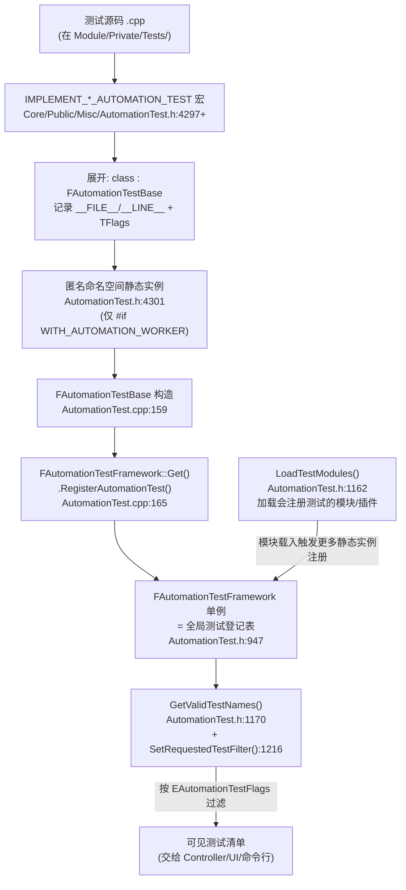
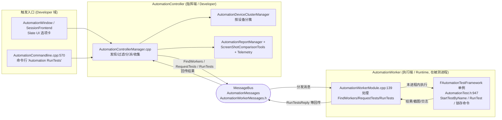
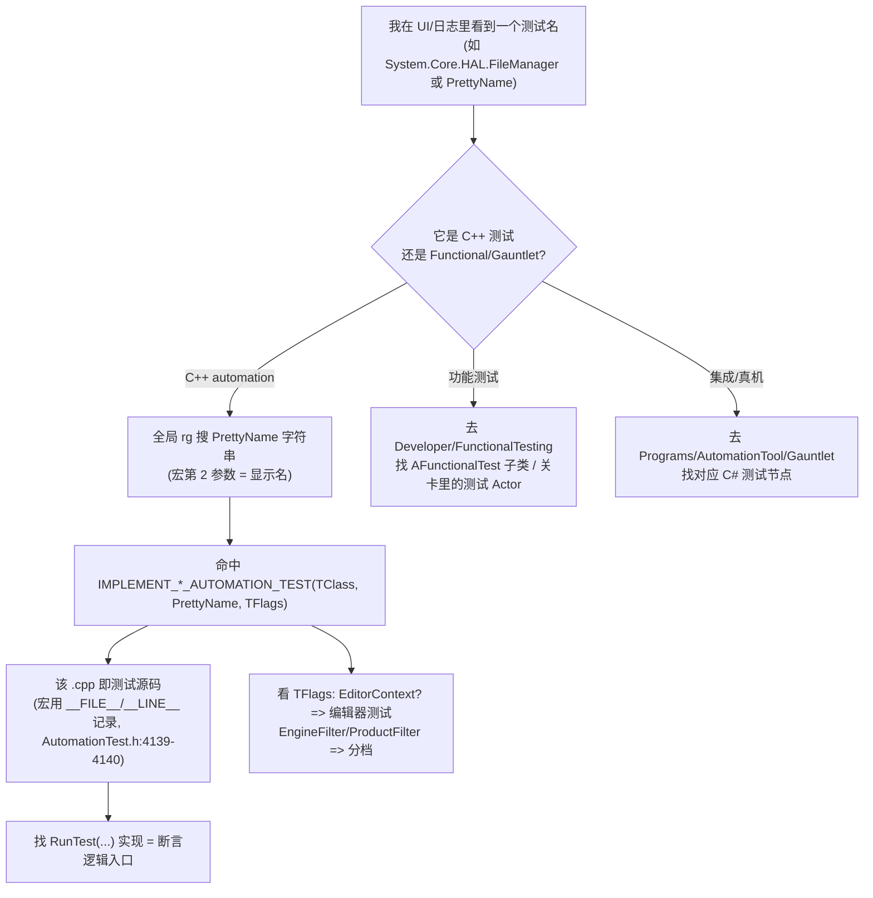

# UE5.8 编辑器自动化测试机制源码地图（Orientation Map · 任务 2/5）

> 本文档面向 thomas，目标只有一个：让你在 **不精读任何单个测试实现** 的前提下，先看清 Unreal Engine 5.8 的自动化测试机制——一个测试 **如何注册、被发现、被调度、被执行、被报告**，以及这五个环节分别落在哪些模块/类/文件。做到"在测试源码里不迷路"。
>
> 配套规格见 [`UE58_02_Editor_Automation_Testing_Orientation_ChangeSpec.md`](<D:/UE/Docs/UE58_02_Editor_Automation_Testing_Orientation_ChangeSpec.md>)。本文是上一份 [`UE58_Source_Hierarchy_Orientation.md`](<D:/UE/Docs/UE58_Source_Hierarchy_Orientation.md>)"源码层级认知"的应用：把那套"先定域→再定模块→后定边界"的方法用到自动化测试这一条链路上。
>
> **证据约定**：标 `【事实】` 的内容由本机目录/文件名/`.Build.cs`/`rg` 行号直接验证（给出 `file:line`）；标 `逻辑分析推理(无事实依据)` 的内容未通读完整实现，是基于 UE 通用约定的推断，需后续读代码确认。
>
> **路径表述约定**：正文与 ASCII 图中提及目录/文件一律用 **完整绝对路径**（Windows 原生反斜杠，反引号包裹）；mermaid 节点为避免过长，使用 **以 `D:\UE\5.8.0r\Engine\Source` 为根的模块相对简写**（正斜杠风格），不代表磁盘真实分隔符。

---

## 1. thomas 先读这段：这张地图怎么帮你不迷路

自动化测试链路最容易让人迷路的，是 **"代码、UI、命令行、设备、报告"分散在 4 个源码域里**，找一个环节经常找错地方。这张地图给你一条 **机械可执行的定位顺序**：

1. **先认链路五环**：任何自动化测试问题都先归到 `注册 → 发现 → 调度 → 执行 → 报告` 五环之一，再去找对应模块。
2. **再认两条进程角色**：`Controller`（指挥端，决定跑哪些、收结果）与 `Worker`（执行端，在被测进程里真正跑测试），两者 **通过 MessageBus 消息通信**，不是直接函数调用。【事实，见 §5】
3. **后认四类测试**：单元 / 编辑器 / 功能 / 集成，判据是"在哪个进程、需不需要世界(World)、需不需要真机"。【见 §8】

> 速记：**先问"这是注册/发现/调度/执行/报告哪一环"→ 再问"是 Controller 还是 Worker 侧"→ 最后问"是单元/编辑器/功能/集成哪类测试"。** 三问之后你就知道该打开哪个目录。逻辑分析推理(无事实依据)：基于本文给出的结构事实归纳。

> 纠偏（重要）：任务建议里把 `AutomationWorker` 放在 `Developer\` 下，但本机实测它在 `D:\UE\5.8.0r\Engine\Source\Runtime\AutomationWorker`【事实】；`FunctionalTesting` 实测在 `D:\UE\5.8.0r\Engine\Source\Developer\FunctionalTesting`【事实】。找错域会原地打转，这里先纠正。

---

## 2. 一句话总览：自动化测试机制是什么

Unreal Engine 5.8 的自动化测试机制，是一套 **"宏声明测试 → Core 单例框架登记 → Worker 在被测进程执行 → Controller 在指挥端发现/调度/收集 → 通过 UI 或命令行触发 → 汇成报告"** 的分布式测试系统。它的 **框架内核在 `Core` 模块**（永远存在），**调度/UI/报告在 `Developer` 域**，**真机/外层集成在 `Programs\AutomationTool`（C#）**。逻辑分析推理(无事实依据)：基于各模块 `.Build.cs` 依赖与命名归纳。

最关键的一个事实：**测试本身是普通 C++ 类（`F` 前缀，非 UObject），靠一个"文件作用域静态实例"在程序启动时自动把自己登记进 Core 的全局框架单例**。这就是"注册"环节的全部魔法。【事实，见 §4】

---

## 3. ASCII 总览图：测试机制全链路

下图画出 thomas 当前需要的全链路核心分支，省略大量同级文件（用 `...` 表示）。所有落点为本机实测。【事实】

```text
[测试作者写的代码]
  IMPLEMENT_SIMPLE/COMPLEX_AUTOMATION_TEST(...)   宏在:
  D:\UE\5.8.0r\Engine\Source\Runtime\Core\Public\Misc\AutomationTest.h
        |  宏展开 = 定义 FAutomationTestBase 子类 + 在匿名命名空间放一个静态实例
        v
[注册 Register]  静态实例构造 -> FAutomationTestBase::FAutomationTestBase()
  D:\UE\5.8.0r\Engine\Source\Runtime\Core\Private\Misc\AutomationTest.cpp:165
        |  调用 FAutomationTestFramework::Get().RegisterAutomationTest(name, this)
        v
[框架内核]  FAutomationTestFramework  (Core 单例, 测试总登记表 + 调度器)
  D:\UE\5.8.0r\Engine\Source\Runtime\Core\Public\Misc\AutomationTest.h:947
        ^                                              |
        | (4) 本进程内执行 RunTest / ExecuteLatentCommands
        |                                              v
[执行 Worker]  FAutomationWorkerModule  (跑在"被测进程"里: 编辑器/游戏/Commandlet)
  D:\UE\5.8.0r\Engine\Source\Runtime\AutomationWorker\Private\AutomationWorkerModule.cpp
        ^   |   MessageBus 消息: FAutomationWorkerRunTests / RequestTests / ...
        |   |   消息结构定义在:
        |   |   D:\UE\5.8.0r\Engine\Source\Runtime\AutomationMessages\Public\AutomationWorkerMessages.h
   (3)  |   v  (5) 回传结果
[调度 Controller]  IAutomationControllerManager  (指挥端: 发现/过滤/分派/收集)
  D:\UE\5.8.0r\Engine\Source\Developer\AutomationController\
        ^                          ^                         |
        | (2a) 编辑器 UI 触发       | (2b) 命令行/Commandlet   v
[UI 入口]                      [命令行入口]              [报告 Report]
 AutomationWindow /            AutomationCommandline.cpp   AutomationReport*.cpp +
 SessionFrontend (Slate)       :570 "Automation RunTests"  ScreenShotComparisonTools
  D:\UE\5.8.0r\Engine\Source\Developer\AutomationWindow      + AutomationTelemetry

[外层/真机集成 - 另一套, C#]
  D:\UE\5.8.0r\Engine\Source\Programs\AutomationTool\Gauntlet   (启动构建/真机会话, 外层驱动)
  D:\UE\5.8.0r\Engine\Source\Programs\AutomationTool\LowLevelTests (Catch2 低层/单元测试)
```

> 读图要点：**(1) 注册在 Core；(2) 触发有 UI 与命令行两条；(3)(5) Controller↔Worker 走 MessageBus 消息；(4) 真正执行在 Worker 所在的被测进程内的 Core 框架。** Gauntlet 是独立的 C# **外层** 框架，不在这条 C++ 进程内链路上。逻辑分析推理(无事实依据)：时序方向基于依赖与消息处理器命名归纳。

---

## 4. `AutomationTest.h`：宏与核心类（注册环节的全部秘密）

文件：`D:\UE\5.8.0r\Engine\Source\Runtime\Core\Public\Misc\AutomationTest.h`。它属于 **`Core` 模块**——这意味着 **测试框架内核在最底层，任何配置都带着它**，不需要单独的模块开关。【事实：路径在 `Runtime\Core`】

### 4.1 核心类（两个）

| 类 | 角色 | 证据 |
| --- | --- | --- |
| `FAutomationTestFramework` | **全局单例**：测试总登记表 + 发现 + 调度 + 锁存命令队列 + 结果汇集。通过 `FAutomationTestFramework::Get()` 取单例 | 【事实：`AutomationTest.h:947` 类定义；`:998` `static ... Get()`】 |
| `FAutomationTestBase` | **所有 C++ 测试的基类**（注意是 `F` 前缀的普通类，**非 UObject**）。子类重写 `RunTest()` 写断言 | 【事实：`AutomationTest.h:1594` 类定义；`:1602` 构造函数声明】 |

`FAutomationTestFramework` 的关键 API（都带 `CORE_API` 导出，跨模块可见）【事实，行号实测】：

- 注册：`RegisterAutomationTest()`（`:1019`）、`UnregisterAutomationTest()`（`:1026`）
- 发现：`LoadTestModules()`（`:1162`）、`GetValidTestNames()`（`:1170`）、`SetRequestedTestFilter()`（`:1216`）
- 执行：`StartTestByName()`（`:1123`）、`ExecuteLatentCommands()`（`:1137`）、`EnqueueLatentCommand()`（`:1086`）、`RunSmokeTests()`（`:1109`）
- 收尾/报告：`StopTest()`（`:1130`）、一组 `On*` 多播委托（如 `OnTestStartEvent`/`OnTestEndEvent`/`OnScreenshotCompared`，`:957` 起）

### 4.2 测试宏（声明环节）

公开宏（`#if WITH_AUTOMATION_WORKER` 分支，`AutomationTest.h:4296` 起）【事实，行号实测】：

| 宏 | 用途 | 行号 |
| --- | --- | --- |
| `IMPLEMENT_SIMPLE_AUTOMATION_TEST` | 单个简单测试 | `:4297` |
| `IMPLEMENT_COMPLEX_AUTOMATION_TEST` | 复杂/参数化测试（`GetTests()` 展开多条子用例） | `:4303` |
| `IMPLEMENT_NETWORKED_AUTOMATION_TEST` | 多参与者网络测试 | `:4311` |
| `IMPLEMENT_CUSTOM_SIMPLE/COMPLEX_AUTOMATION_TEST` | 自定义基类 | `:4318` / `:4325` |
| `DEFINE_SPEC` / `BEGIN_DEFINE_SPEC` / `END_DEFINE_SPEC` | BDD 风格 spec 测试 | `:4339` / `:4346` / `:4349` |

### 4.3 自动注册机制（核心魔法）

以 `IMPLEMENT_SIMPLE_AUTOMATION_TEST(TClass, PrettyName, TFlags)` 为例，宏展开做两件事【事实：`AutomationTest.h:4297-4302`】：

1. `IMPLEMENT_SIMPLE_AUTOMATION_TEST_PRIVATE(...)`（`:4121`）：定义 `class TClass : public FAutomationTestBase`，重写 `RunTest()`、`GetTests()`、`GetTestFlags()`，并用 `__FILE__`/`__LINE__` 记录 **测试的源码文件与行号**（这就是"从测试名跳回源码"的事实基础，见 §9）。
2. 在 **匿名命名空间** 里放一个 **文件作用域静态实例**：`namespace { TClass TClass##AutomationTestInstance( TEXT(#TClass) ); }`（`:4301`）。

程序加载该编译单元时，这个静态实例被构造 → 进入 `FAutomationTestBase::FAutomationTestBase()`（`AutomationTest.cpp:159`）→ 在 `:165` 调用 `FAutomationTestFramework::Get().RegisterAutomationTest(TestName, this)`。**测试就这样"自己把自己登记"进了全局框架**。【事实：`AutomationTest.cpp:165` 命中 `RegisterAutomationTest(`】

> 关键边界：整个自动注册 **被 `#if WITH_AUTOMATION_WORKER` 包裹**（`AutomationTest.h:4296`）。在不支持自动化的构建里（`#else`，`:4366`），宏 **只声明类、不创建静态实例、不注册**。所以"为什么 Shipping 包里没有测试"——因为这个编译开关把静态实例整个去掉了。逻辑分析推理(无事实依据)：基于宏分支结构推断，未读 `WITH_AUTOMATION_WORKER` 的 target 定义。

### 4.4 `EAutomationTestFlags`：测试的"身份证"（区分四类测试的位）

每个测试在宏里传入 `TFlags`，分两组位【事实，`AutomationTest.h` 行号实测】：

- **应用上下文位（在哪个进程能跑）**：`EditorContext`（`:93`）、`ClientContext`（`:95`）、`ServerContext`（`:97`）、`CommandletContext`（`:99`）、`ProgramContext`；合集 `EAutomationTestFlags_ApplicationContextMask`（`:144`）。
- **过滤/分级位（属于哪一档）**：`SmokeFilter`（`:129`）、`EngineFilter`（`:131`）、`ProductFilter`（`:133`）、`PerfFilter`（`:135`）、`StressFilter`（`:137`）、`NegativeFilter`；合集 `EAutomationTestFlags_FilterMask`（`:149`）。

宏里有 `static_assert` **强制每个测试恰好带 1 个上下文位和 1 个过滤位**（`AutomationTest.h:4127-4134`）【事实】。Controller 的过滤、UI 的分组就是按这些位来的。所以 **"这是不是编辑器测试"= 看它带不带 `EditorContext`**。逻辑分析推理(无事实依据)：过滤语义基于位命名推断。

---

## 5. Mermaid 1：测试注册与发现图



> 读图要点：**注册是"被动发生"的**——只要含测试的编译单元/模块被加载，静态实例构造即注册；`LoadTestModules()` 的作用是把更多模块（含插件）加载进来，让它们的测试也注册上。发现 = 遍历框架登记表 + 按 flags 过滤。【事实支撑：行号均实测；"模块加载触发注册"为逻辑分析推理(无事实依据)】

---

## 6. Controller 与 Worker：指挥端与执行端

这是 thomas 最该建立的心智模型：**自动化测试是"两个角色 + 一条消息总线"**。【事实，依据两模块 `.Build.cs` 与消息处理器】

### 6.1 AutomationWorker（执行端，运行时模块）

- 路径：`D:\UE\5.8.0r\Engine\Source\Runtime\AutomationWorker`（**在 `Runtime\`，会进被测进程**）。【事实】
- 公开接口：`D:\UE\5.8.0r\Engine\Source\Runtime\AutomationWorker\Public\IAutomationWorkerModule.h`；实现：`...\Private\AutomationWorkerModule.cpp`。【事实】
- 它建一个 MessageBus 端点，**订阅并处理 Controller 发来的消息**【事实：`AutomationWorkerModule.cpp:139-154`】：`FAutomationWorkerFindWorkers`（发现 worker）、`FAutomationWorkerRequestTests`（要测试清单）、`FAutomationWorkerRunTests`（跑测试）、`FAutomationWorkerStopTests`、`FAutomationWorkerPing` 等。
- 收到 `RunTests` 后，它在 **本进程内** 调用 `FAutomationTestFramework`（§4 的 Core 单例）真正执行测试，再把结果用 reply 消息回传。逻辑分析推理(无事实依据)：基于 worker 依赖 `AutomationTest`/`Engine` 且持有消息端点推断。
- 依赖（`AutomationWorker.Build.cs`）【事实】：Public `Core`；Private `AutomationMessages`、`AutomationTest`、`CoreUObject`、`Analytics`、`Json`；`bCompileAgainstEngine` 时加 `Engine`、`RHI`。

### 6.2 AutomationController（指挥端，开发者域模块）

- 路径：`D:\UE\5.8.0r\Engine\Source\Developer\AutomationController`。【事实】
- 公开接口：`IAutomationControllerManager.h`、`IAutomationControllerModule.h`、`IAutomationReport.h`、`AutomationFilter.h`、`AutomationGroupFilter.h`、`AutomationControllerSettings.h`。【事实，Public 清单实测】
- 私有实现：`AutomationControllerManager.cpp`（核心调度）、`AutomationCommandline.cpp`（命令行入口）、`AutomationReport.cpp` / `AutomationReportManager.cpp`（报告）、`AutomationDeviceClusterManager.cpp`（按设备分簇分派）、`AutomationTelemetry.cpp`（遥测）。【事实，Private 清单实测】
- 依赖（`AutomationController.Build.cs`）【事实】：Public `Core`、`CoreUObject`、`AutomationTest`；Private `AutomationMessages`、`Json`、`ScreenShotComparisonTools`、`HTTP`；**仅编辑器构建** 才加 `UnrealEd`、`Engine`、`MessageLog`、`UnrealEdMessages`、`EditorFramework`。

### 6.3 通信通道：AutomationMessages + MessageBus

- 消息结构定义在 `D:\UE\5.8.0r\Engine\Source\Runtime\AutomationMessages\Public\AutomationWorkerMessages.h`。【事实】
- 两侧 `.Build.cs` 都 `PrivateIncludePathModuleNames` 了 `MessagingCommon`，且都依赖 `AutomationMessages`。【事实】这佐证：**Controller 与 Worker 解耦，靠 MessageBus 异步消息通信，可以跨进程/跨设备**。逻辑分析推理(无事实依据)：跨进程能力基于 MessageBus 通用语义推断。

### 6.4 两条触发入口

1. **编辑器 UI**：`D:\UE\5.8.0r\Engine\Source\Developer\AutomationWindow`（Slate 自动化窗口）嵌在 `D:\UE\5.8.0r\Engine\Source\Developer\SessionFrontend`（Session Frontend 工具）的 Automation 选项卡。【事实：两模块目录存在】
2. **命令行 / Commandlet**：`AutomationCommandline.cpp` 注册控制台命令 `Automation`【事实：`:570` `FParse::Command(&Cmd, TEXT("Automation"))`、`:610` `RunTests`/`RunTest`】，把请求排进队列（`:627` `RunCommandLineTests`），最终 `:418` 调 `AutomationController->RunTests()`。这就是 CI 里 `-ExecCmds="Automation RunTests ..."` 的落点。【事实 + 用法为逻辑分析推理(无事实依据)】

---

## 7. Mermaid 2：Controller / Worker 调度图（含 MessageBus）



> 读图要点：**指挥端不直接调用测试**，它只发消息；执行端 Worker 收到消息后调用 **同进程内的 Core 框架** 跑测试。截图比对、遥测、报告聚合都在 Controller 侧（`ScreenShotComparisonTools`、`AutomationTelemetry`）。逻辑分析推理(无事实依据)：节点间时序基于消息处理器命名与依赖归纳，未通读 manager 实现。

---

## 8. 四类测试怎么分 + 在哪里找测试

### 8.1 四类测试的判据

| 类别 | 本质 | 关键标识 / 落点 | 证据 |
| --- | --- | --- | --- |
| **单元 / 引擎测试** | C++ 进程内断言测试，无需世界 | `IMPLEMENT_*_AUTOMATION_TEST` + `EngineFilter`/`ProductFilter`；放在 `<Module>\Private\Tests` | 【事实：宏 + Tests 目录，见 §8.2】 |
| **编辑器测试** | 需要编辑器进程/编辑器子系统 | 同上宏 + **`EditorContext`** 上下文位 | 【事实：`EditorContext` flag `AutomationTest.h:93`；判据为逻辑分析推理(无事实依据)】 |
| **功能测试 (Functional)** | 在关卡里放测试 Actor，跑地图、走世界逻辑、比截图 | `D:\UE\5.8.0r\Engine\Source\Developer\FunctionalTesting`，UObject/Actor 测试类 | 【事实，见 §8.3】 |
| **集成 / 真机测试 (Gauntlet)** | 启动整套构建、在真机/会话上端到端跑 | `D:\UE\5.8.0r\Engine\Source\Programs\AutomationTool\Gauntlet`（C#） | 【事实，见 §8.4】 |

补充：`D:\UE\5.8.0r\Engine\Source\Programs\AutomationTool\LowLevelTests`（含 `LowLevelTests.Automation.csproj`、`RunLowLevelTests.cs`）是 **Catch2 风格的低层测试** 调度，独立于 `FAutomationTestFramework`。【事实：目录与文件存在】

### 8.2 单元/引擎/编辑器测试在哪里找

它们 **不集中在一个目录**，而是 **就近放在各模块的 `Private\Tests`**。本机取样【事实】：

- `D:\UE\5.8.0r\Engine\Source\Runtime\Core\Private\Tests`（如 `HAL\FileManagerTest.cpp`、`Serialization\CompactBinaryTest.cpp` 命中 `IMPLEMENT_SIMPLE_AUTOMATION_TEST`）
- `D:\UE\5.8.0r\Engine\Source\Runtime\Engine\Private\Tests`、`...\Engine\Private\GameFramework\Tests`、`...\Engine\Private\Net\Tests`、`...\Engine\Private\PhysicsEngine\Tests`

> 找测试口诀：**搜宏不搜目录**——全局 `rg "IMPLEMENT_SIMPLE_AUTOMATION_TEST|DEFINE_SPEC"` 比翻目录更快定位测试。逻辑分析推理(无事实依据)：基于测试分散在各模块 Tests 的事实归纳。

### 8.3 功能测试（FunctionalTesting）的特殊性

路径 `D:\UE\5.8.0r\Engine\Source\Developer\FunctionalTesting`，与前三类最大不同：**它的测试是 UObject/Actor，要放进关卡**。【事实，`Classes\` 清单】

- `Classes\FunctionalTest.h`（`AFunctionalTest` 测试 Actor）、`FunctionalTestBase.h`、`FunctionalAITest.h`、`ScreenshotFunctionalTest.h`、`FunctionalTestingManager.h`。
- `Public\AutomationBlueprintFunctionLibrary.h`（蓝图可调）、`AutomationScreenshotOptions.h`（截图选项）。
- `FunctionalTesting.Build.cs` 依赖 `Core`、`CoreUObject`、`Engine`、`RenderCore`、`Slate`、`NavigationSystem`、`AIModule`、`UMG`、`ImageWrapper`，并 **依赖 `AutomationController`**；编辑器构建追加 `UnrealEd`、`LevelEditor`、`SessionFrontend`。【事实】

含义：**功能测试是"在世界里跑的测试"，通过依赖 `AutomationController` 桥接进同一套自动化框架**，所以它也能在 Automation 窗口/命令行里被发现和调度。逻辑分析推理(无事实依据)：桥接关系基于依赖 `AutomationController` 推断。

### 8.4 Gauntlet / AutomationTool 的边界（另一套，C#）

`D:\UE\5.8.0r\Engine\Source\Programs\AutomationTool` 是 **C# 写的构建/测试自动化工具（UAT）**【事实：`AutomationTool.csproj`、`Program.cs`、`Gauntlet`、`BuildGraph`、`AutomationUtils` 等】。其中：

- `...\AutomationTool\Gauntlet`（`Gauntlet.Automation.csproj` + `Editor/Framework/Platform/Unreal/SelfTest`）是 **外层端到端测试框架**：负责"拿一个构建、部署到目标设备、启动应用、驱动一次测试会话、收集结果"。【事实：目录结构 + `.csproj`】

边界一句话：**`FAutomationTestFramework`（C++）管"一个进程内怎么跑一个个测试"；Gauntlet（C#）管"怎么把整套构建放到真机上端到端地跑起来并观测"**。两者可以协作（Gauntlet 启动的进程内仍可跑 C++ automation 测试），但 **不是同一层**。逻辑分析推理(无事实依据)：协作关系基于两者职责命名推断，未读 Gauntlet 实现。

---

## 9. Mermaid 3：从测试名定位源码流程图



> 这条流程把 §4–§8 的判据串成 **可机械执行** 的"测试名→源码"路径：搜显示名 → 命中宏 → 宏所在 `.cpp` 就是源码（因为宏把 `__FILE__/__LINE__` 编进了测试，`AutomationTest.h:4139`）→ 进 `RunTest()` 看断言。逻辑分析推理(无事实依据)：基于宏结构事实归纳。

---

## 10. 与插件机制、UBT/UHT、编辑器框架的衔接点

| 衔接对象 | 衔接方式 | 证据 / 性质 |
| --- | --- | --- |
| **插件机制** | 插件模块的 `Private\Tests` 里写 `IMPLEMENT_*_AUTOMATION_TEST`，模块被加载时静态实例自动注册；`LoadTestModules()`（`AutomationTest.h:1162`）促使更多模块（含插件）载入，其测试随之进框架 | 【机制事实：宏自注册 + `LoadTestModules`】；"插件测试自动出现在 UI" 为逻辑分析推理(无事实依据) |
| **UBT** | `WITH_AUTOMATION_WORKER` 这个编译开关决定 §4.3 的静态实例是否生成（`AutomationTest.h:4296`）；`AutomationWorker.Build.cs` 用 `bCompileAgainstEngine`、`AutomationController.Build.cs` 用 `bBuildEditor` 决定依赖哪些模块 | 【事实：`.Build.cs` 条件分支】 |
| **UHT** | C++ automation 测试是 `F` 类（非 UObject），**不经 UHT 反射**；但 **功能测试是 `AFunctionalTest` 等 UObject/Actor**，要走 UHT 生成反射样板 | 【事实：`FAutomationTestBase` 为 `F` 类；`FunctionalTest.h` 在 `Classes\` 为 UObject】 |
| **编辑器框架** | `AutomationController` 与 `FunctionalTesting` 在编辑器构建才依赖 `UnrealEd`/`EditorFramework`/`LevelEditor`；UI 入口 `AutomationWindow` 是 Slate 控件，挂在 `SessionFrontend` | 【事实：两份 `.Build.cs` 的 `bBuildEditor` 分支 + UI 模块存在】 |

> 与上一份层级认知文档的口径一致性：`Runtime`=进游戏包、`Developer`=工具链、`Programs`=独立程序的判据，在这里得到印证——**测试框架内核在 `Core`(Runtime)，调度/UI 在 `Developer`，外层真机框架在 `Programs`**。这与 [`UE58_Source_Hierarchy_Orientation.md`](<D:/UE/Docs/UE58_Source_Hierarchy_Orientation.md>) §5 完全一致。【事实：路径域归属实测】

---

## 11. 阿卡姆剃刀检查

- **是否必须跨项目完成？** 否。只读 `D:\UE\5.8.0r\Engine\Source` 下测试相关结构，未触碰 `AnimationSamples`/`ProjectTitan`/`tutorial`。
- **是否能删掉而不影响目标？** 本文聚焦"注册/发现/调度/执行/报告"五环与四类测试边界，已剔除任何单个测试的断言精读；宏只列公开宏，不展开全部 `_PRIVATE` 变体。
- **抽象是否被真实需求证明？** 三张 mermaid（注册发现 / 调度 / 定位）+ 一张 ASCII（全链路）各对应一个真实困惑点，无冗余图。
- **是否在复述代码？** 否。只给"在哪、谁连谁、怎么找"的结构判据与 `file:line` 锚点，不解释断言算法。

---

## 12. 局限性与潜在风险提示

- **本研究只看目录名、文件名、`.Build.cs` 与少量 `rg` 行，未通读任何测试或框架完整实现**。"调度/执行/报告"的运行时时序（如 Controller 如何分簇分派、Worker 如何回传部分结果）多为 **逻辑分析推理(无事实依据)**，需后续读 `D:\UE\5.8.0r\Engine\Source\Developer\AutomationController\Private\AutomationControllerManager.cpp` 与 `D:\UE\5.8.0r\Engine\Source\Runtime\AutomationWorker\Private\AutomationWorkerModule.cpp` 完整实现验证。
- **`WITH_AUTOMATION_WORKER` 的真实取值条件未读 target 规则**：本文只确认它 **门控了静态实例注册**（`AutomationTest.h:4296`），未确认它在各 `*.Target.cs`/配置下的具体开关条件。
- **组件职责描述部分基于模块名、目录结构与依赖表推断**，文件名与真实职责可能不完全一致（例如把 `AutomationTelemetry` 判为"遥测上报"仅按命名推测）。
- **任务建议路径有两处与实测不符已纠偏**：`AutomationWorker` 在 `Runtime\` 非 `Developer\`；`FunctionalTesting` 在 `Developer\`（建议中也列了 `Runtime`/`Editor` 候选，实测仅 `Developer` 存在）。
- **绝对路径绑定本机 `D:\UE\5.8.0r` 布局**：换机或换引擎版本即失效。文档里的机器绝对路径 **只是"本机定位路径"，不是可复用配置**；在引擎/项目 **代码内** 引用其它模块时，应使用 **模块相对包含路径**（如 `#include "Misc/AutomationTest.h"`，由 `.Build.cs` 依赖解析）或 **Unreal 路径 API**（如 `FPaths`、`IPluginManager`），不得硬编码 `D:\UE\...`。这是为满足 thomas"完整绝对路径"硬性要求与"不硬编码绝对路径"通用准则之间的取舍，特此声明。
- **未触达** 凭据、会话、个人配置、压缩包（`D:\UE\UnrealEngine-5.8.0-release.zip`）与生成产物（`Binaries`、`Intermediate`、`DerivedDataCache`、`Saved`、`Generated`、`obj`、`bin`）；范围外文件未读取，未修改任何引擎源码，未覆盖 `D:\UE\Docs` 下已有任何文档。
