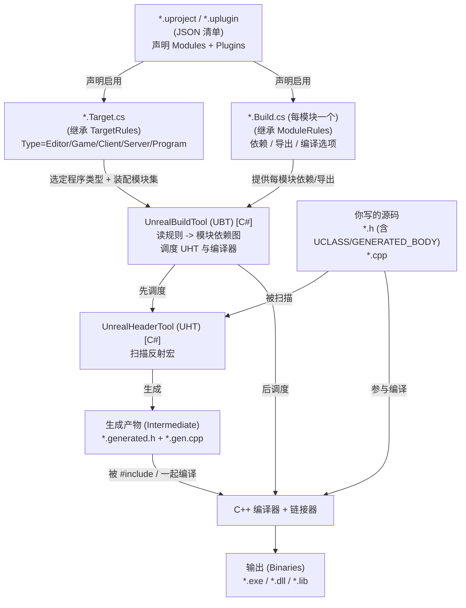
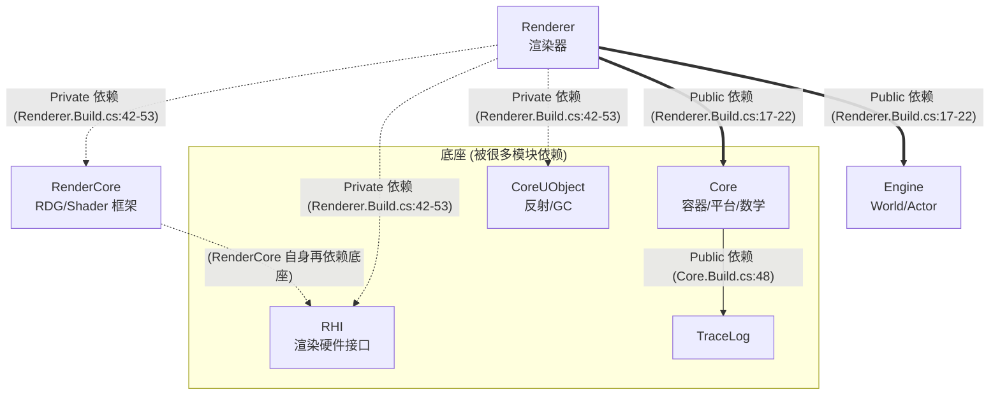
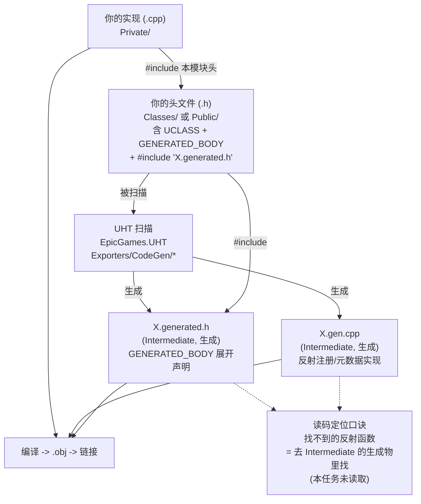

# UE5.8 UBT/UHT/Build.cs/Target.cs 构建机制源码地图（Orientation Map）

> 本文档面向 thomas，目标只有一个：让你在 **不通读 UnrealBuildTool / UnrealHeaderTool 实现** 的前提下，先看清 Unreal Engine 5.8 的 **构建机制主链**——从一个 `.uproject` 出发，经过 `*.Target.cs`、`*.Build.cs`、UBT、UHT，最终走到编译与链接，并理解 `GENERATED_BODY()` / `*.generated.h` 与 `Public/Private` include 边界。这样你 **改 / 读构建相关源码时不迷路**。本文 **不** 做 UBT/UHT 实现精读。
>
> 配套规格见 [`UE58_03_UBT_UHT_Build_System_Orientation_ChangeSpec.md`](<D:/UE/Docs/UE58_03_UBT_UHT_Build_System_Orientation_ChangeSpec.md>)。
>
> 这是 5 个文档任务中的第 3 个。它衔接源码层级文档 [`UE58_Source_Hierarchy_Orientation.md`](<D:/UE/Docs/UE58_Source_Hierarchy_Orientation.md>)：那份讲"源码长什么样、模块边界在哪"，本份讲"这些源码 **怎么被构建出来**"。
>
> **证据约定**：标 `【事实】` 的内容由本机目录条目、文件名、`file:line` 或轻量 `rg` 直接验证；标 `逻辑分析推理(无事实依据)` 的内容基于 UBT/UE 通用约定推断，未通读实现，需后续读代码或官方构建文档确认。
>
> **路径表述约定**：正文与 ASCII 图中提及目录/文件一律用 **完整绝对路径**（Windows 原生反斜杠形式，反引号包裹）；mermaid 图节点为避免过长，使用 **短名或以 `D:\UE\5.8.0r\Engine\Source` 为根的相对简写**（正斜杠风格），不代表磁盘真实分隔符。

---

## 1. thomas 先读这段：构建机制如何帮助读源码不迷路

读引擎源码最容易卡住的不是"看不懂某行 C++"，而是 **三类"它从哪来 / 它归谁管"的结构问题**，而这三类问题的答案 **全部写在构建脚本里**：

1. **"这个 `.cpp` 会被编进哪个程序？"** → 看它所属模块被哪个 `*.Target.cs` 装配进去（编辑器？游戏？服务器？工具？）。
2. **"这个模块能不能 `#include` 那个模块的头？"** → 看本模块 `*.Build.cs` 的 `Public/PrivateDependencyModuleNames`，依赖没声明就 include 不到。
3. **"这个 `UCLASS` 的 `StaticClass()`、反射注册、`Cast<>` 样板代码在哪？我没写它却能用？"** → 那是 **UHT 生成的** `*.generated.h` / `*.gen.cpp`，不在你写的源码里。

> 速记：**先问"哪个 Target 装配它"（进什么程序）→ 再问"哪个 Build.cs 管它、它依赖谁"（能 include 谁）→ 最后问"哪些代码是 UHT 替我生成的"（GENERATED_BODY 展开物）。** 三问之后，构建相关的源码就不会让你迷路。逻辑分析推理(无事实依据)：此归纳基于下文的结构事实推导，非通读 UBT 所得。

构建机制还解释了一个高频困惑：**为什么改了 `*.Build.cs` 或加了 `UPROPERTY` 后，必须"重新生成项目文件 / 重新编译"才生效**——因为依赖关系与反射样板代码是 UBT/UHT 在 **构建期** 算出来并生成的，不是运行期动态发现的（详见第 9 节）。

---

## 2. 一句话总览：四个角色各管什么

| 角色 | 它是什么 | 一句话职责 | 本机证据 |
| --- | --- | --- | --- |
| `.uproject` / `.uplugin` | JSON 工程/插件清单 | 声明"我有哪些模块、启用哪些插件" | `D:\UE\tutorial\tutorial.uproject` 等【事实】 |
| `*.Target.cs` | C# 构建目标脚本（继承 `TargetRules`） | 定义"最终构建出哪种程序"（编辑器/游戏/客户端/服务器/工具） | `D:\UE\5.8.0r\Engine\Source` 下 4 个【事实】 |
| `*.Build.cs` | C# 模块规则脚本（继承 `ModuleRules`） | 定义"本模块依赖谁、暴露什么、编译选项" | `Core.Build.cs`、`Renderer.Build.cs`【事实】 |
| UBT（UnrealBuildTool） | C# 程序 | 读 `*.Target.cs`/`*.Build.cs`，规划编译/链接，驱动编译器 | `D:\UE\5.8.0r\Engine\Source\Programs\UnrealBuildTool`【事实】 |
| UHT（UnrealHeaderTool） | C# 程序 | 扫描带反射宏的头，**生成** `*.generated.h`/`*.gen.cpp` | `D:\UE\5.8.0r\Engine\Source\Programs\Shared\EpicGames.UHT`【事实】 |

> 关键澄清【事实】：在 UE5.8 里 **UBT 和 UHT 都是 C# 程序**，不是 C++。UBT 在 `D:\UE\5.8.0r\Engine\Source\Programs\UnrealBuildTool\UnrealBuildTool.csproj`；UHT 已被重写为 `D:\UE\5.8.0r\Engine\Source\Programs\Shared\EpicGames.UHT\EpicGames.UHT.csproj`（旧版独立 `Programs\UnrealHeaderTool` 目录在本机 **不存在**，已确认）。

---

## 3. ASCII 总览图：构建主链

下图是本文的"脊柱"，把五个角色串成一条从工程清单到可执行文件的主链。`...` 表示省略的同级内容。【事实：节点路径均本机实测存在；箭头语义见各节】

```text
[输入: 工程/插件清单]                          [构建规则脚本 (C#)]
D:\UE\tutorial\tutorial.uproject     ---->     *.Target.cs  (继承 TargetRules)
  "Modules": [{tutorial, Runtime}]               D:\UE\5.8.0r\Engine\Source\UnrealEditor.Target.cs
  "Plugins": [StateTree, ...]                    Type = Editor / Game / Client / Server / Program
        |                                              |
        | 声明启用的模块/插件                            | 选定"构建哪种程序 + 装配哪些模块"
        v                                              v
   *.uplugin (插件清单)  ------>  *.Build.cs  (每个模块一个, 继承 ModuleRules)
                                   D:\UE\5.8.0r\Engine\Source\Runtime\Renderer\Renderer.Build.cs
                                   PublicDependencyModuleNames  = { Core, Engine }
                                   PrivateDependencyModuleNames = { CoreUObject, RenderCore, RHI, ... }
                                              |
                                              | UBT 读取全部规则, 解析模块依赖图
                                              v
                            +-------------------------------------+
                            |  UnrealBuildTool (UBT)  [C#]        |
                            |  Programs\UnrealBuildTool           |
                            |  - 编译规则脚本 -> 依赖图            |
                            |  - 决定 include 路径 / 链接关系      |
                            |  - 调度 UHT, 再调度 C++ 编译器       |
                            +-------------------------------------+
                                 |                         |
            先扫描反射宏          v                         v   后编译/链接
            +----------------------------------+      [C++ 编译器 + 链接器]
            | UnrealHeaderTool (UHT)  [C#]     |      .cpp + 生成的 .gen.cpp
            | Programs\Shared\EpicGames.UHT    |   -> .obj -> .lib/.dll/.exe
            | 扫描 UCLASS/USTRUCT/GENERATED_BODY|              |
            | 生成 *.generated.h + *.gen.cpp   | -------------+ (生成物喂回编译)
            | (落到 Intermediate, 非手写源码)   |
            +----------------------------------+
                                              |
                                              v
                          [输出: 可执行文件 / 动态库]
                  UnrealEditor.exe / 游戏 exe / *.dll  (落到 Binaries)
```

> 读图要点：**UBT 是总指挥**——它先读规则脚本算出依赖图，**先**派 UHT 生成反射样板代码，**再**把"你写的 `.cpp` + UHT 生成的 `.gen.cpp`"一起交给 C++ 编译器，最后链接成 `Binaries` 里的 exe/dll。逻辑分析推理(无事实依据)："先 UHT 后编译"的先后次序是 UE 通用构建约定，本文未读 UBT 调度实现，仅由"`.cpp` 需 `#include` 到 `*.generated.h`"这一事实倒推。

---

## 4. Mermaid 1：构建输入输出图（谁吃谁、产出什么）



> 证据支撑：节点 `UPROJ/TGT/BUILD/UBT/UHT/SRC` 均为本机实测文件或目录【事实】；`GEN`（`*.generated.h`/`*.gen.cpp`）落在 `Intermediate` 生成产物目录，本任务 **未读取其内容**，其存在与位置为 **逻辑分析推理(无事实依据)**（基于头文件 `#include "*.generated.h"` 这一事实倒推，见第 8 节）；"UBT 先 UHT 后编译器"的调度顺序为 **逻辑分析推理(无事实依据)**。

---

## 5. `*.Target.cs` 角色：定义"构建出哪种程序"

### 5.1 `TargetType` 五类（构建入口的本质）

`*.Target.cs` 继承 `TargetRules`，核心是设置 `Type`。`TargetType` 枚举有 5 个值【事实：`D:\UE\5.8.0r\Engine\Source\Programs\UnrealBuildTool\Configuration\Rules\TargetRules.cs:21`，注释为源码原文】：

| `TargetType` | 含义（源码注释原文转述） | 行号 |
| --- | --- | --- |
| `Game` | Cooked 单体游戏可执行（`GameName.exe`），也用于引擎无关的 `UnrealGame.exe` | `TargetRules.cs:26` |
| `Editor` | 模块化的编辑器可执行 + DLL（`UnrealEditor.exe`、`UnrealEditor*.dll`） | `TargetRules.cs:31` |
| `Client` | Cooked 单体客户端（`GameNameClient.exe`，不含服务器代码） | `TargetRules.cs:36` |
| `Server` | Cooked 单体服务器（`GameNameServer.exe`，不含客户端代码） | `TargetRules.cs:41` |
| `Program` | 独立程序（如 `ShaderCompileWorker.exe`，可模块化或单体） | `TargetRules.cs:46` |

引擎自带的 4 个目标脚本（都在 `D:\UE\5.8.0r\Engine\Source`）正好对上前四类【事实】：

- `D:\UE\5.8.0r\Engine\Source\UnrealGame.Target.cs:11` → `Type = TargetType.Game;`，且 `[SupportedPlatforms(UnrealPlatformClass.All)]`
- `D:\UE\5.8.0r\Engine\Source\UnrealEditor.Target.cs:10` → `Type = TargetType.Editor;`，并 `bBuildAllModules = true;`（`:13`）
- `D:\UE\5.8.0r\Engine\Source\UnrealClient.Target.cs:10` → `Type = TargetType.Client;`
- `D:\UE\5.8.0r\Engine\Source\UnrealServer.Target.cs:11` → `Type = TargetType.Server;`，且 `[SupportedPlatforms(UnrealPlatformClass.Server)]`

### 5.2 Target 的其它关键字段

四个脚本都设置了这些字段【事实，见各文件】：

- `BuildEnvironment = TargetBuildEnvironment.Shared;` —— 共享引擎二进制/中间产物（编辑器目标默认共享）。逻辑分析推理(无事实依据)：`Shared` 表示复用 `Engine/Binaries`，避免每个项目重编引擎，语义来自 `TargetRules.cs` 注释段。
- `ExtraModuleNames.Add("UnrealGame");` —— 额外要装配的模块。字段声明在 `TargetRules.cs:2819`【事实】。
- `IncludeOrderVersion = EngineIncludeOrderVersion.Latest;` —— 控制头文件包含顺序的兼容性版本。

还有一个与"程序入口"相关的字段：`LaunchModuleName`（`TargetRules.cs:2800`），非 `Program` 类型时默认是 `"Launch"`【事实：`:2802` 的 getter 逻辑】。

> Target 与项目的关系：项目的 `*.Target.cs`（如 `D:\UE\ProjectTitan\Source\` 下的项目目标脚本，本任务未逐个读取）会指定 `LaunchModuleName` 或 `ExtraModuleNames` 指向项目主模块，从而把项目模块 **装配进** 这次构建。逻辑分析推理(无事实依据)：基于 `ExtraModuleNames`/`LaunchModuleName` 字段语义推断，未读项目 Target 脚本。

---

## 6. `*.Build.cs` 字段解释：定义"模块依赖谁、暴露什么"

每个模块（一个带 `*.Build.cs` 的目录）用一个继承 `ModuleRules` 的 C# 类描述自己。最小骨架【事实：`D:\UE\5.8.0r\Engine\Source\Runtime\Renderer\Renderer.Build.cs:5-7`】：

```csharp
public class Renderer : ModuleRules
{
    public Renderer(ReadOnlyTargetRules Target) : base(Target)
    {
        // ... 在构造函数里填依赖列表与编译选项
    }
}
```

注意构造函数参数是 `ReadOnlyTargetRules Target`【事实】：**模块规则能读到 Target 信息（平台、配置、是否编辑器等），据此条件化地改依赖**。例如 `Core.Build.cs:62` 用 `if (Target.bBuildEditor == true)` 在编辑器构建时才加 `DirectoryWatcher`，`Core.Build.cs:68` 用 `if (Target.Platform == UnrealTargetPlatform.Win64)` 做平台分支【事实】。

### 6.1 五类依赖/包含列表（最核心字段）

字段都声明在 `D:\UE\5.8.0r\Engine\Source\Programs\UnrealBuildTool\Configuration\Rules\ModuleRules.cs`【事实，行号实测】：

| 字段 | 声明行号 | 含义 | 是否向上游传播 |
| --- | --- | --- | --- |
| `PublicDependencyModuleNames` | `ModuleRules.cs:1259` | **公有依赖**：本模块和"依赖本模块的模块"都能用其头并链接它 | 传播 |
| `PrivateDependencyModuleNames` | `ModuleRules.cs:1270` | **私有依赖**：只本模块编译/链接时可见 | 不传播 |
| `PublicIncludePathModuleNames` | `ModuleRules.cs:1254` | 公有"只借头不链接"：把对方头的包含路径传给上游，不产生链接 | 传播(仅 include 路径) |
| `PrivateIncludePathModuleNames` | `ModuleRules.cs:1264` | 私有"只借头不链接"：仅本模块能借对方头路径 | 不传播 |
| `DynamicallyLoadedModuleNames` | `ModuleRules.cs:1419` | 运行时按需 `LoadModule` 动态加载，不在编译期硬链接 | 运行期 |

实测样本（`Renderer.Build.cs`，与源码层级文档行号复核一致）【事实】：

- `Renderer.Build.cs:17-22` → `PublicDependencyModuleNames = { "Core", "Engine" }`
- `Renderer.Build.cs:42-53` → `PrivateDependencyModuleNames = { "CoreUObject", "ApplicationCore", "RenderCore", "ImageWriteQueue", "RHI", "MaterialShaderQualitySettings", "StateStream", "TraceLog" }`

`Core.Build.cs` 则展示了 `PublicDependencyModuleNames.Add("TraceLog")`（`:48`）、`PrivateDependencyModuleNames`（`:20`、`:39-45`）、`PrivateIncludePathModuleNames`（`:51-56`）、`PublicIncludePathModuleNames`（`:58-60`）的混用【事实】。

### 6.2 其它常见字段（在 `Core.Build.cs` 实测出现）

| 字段 | 样本行号 | 作用 |
| --- | --- | --- |
| `Type`（`ModuleType`） | 声明在 `ModuleRules.cs:679`（默认 `ModuleType.CPlusPlus`） | 模块类型：C++ 模块还是外部库封装 |
| `PrivatePCHHeaderFile` / `SharedPCHHeaderFile` | `Core.Build.cs:16` / `:18` | 预编译头（PCH）配置，影响编译速度 |
| `PublicDefinitions` / `PrivateDefinitions` | `Core.Build.cs:37`、`:115` 等 | 注入预处理宏（如 `UE_ENABLE_ICU=1`） |
| `PublicFrameworks` / `PublicSystemLibraries` | `Core.Build.cs:130`、`:210` | 平台系统库/框架链接 |

> 阅读规律【逻辑分析推理(无事实依据)，基于上述字段语义】：想知道"模块 A 能不能直接 `#include` 模块 B 的公有头"，去 A 的 `*.Build.cs` 看 B 是否在 A 的 `Public/PrivateDependencyModuleNames` 里。**没声明依赖就 include 不到**，这是 UE 跨模块边界的硬约束（第 8 节展开）。

---

## 7. Mermaid 2：模块依赖图（`Public/Private` 依赖方向）

下图用 `Renderer` 与 `Core` 的 **实测依赖**（第 6.1 节）展示传播差异：实线=公有依赖（向上游传播），虚线=私有依赖（不传播）。【事实：箭头来自 `Renderer.Build.cs` 与 `Core.Build.cs` 实测；"传播/不传播"语义为通用约定，标注见下】



> 读图要点：
> - **实线（Public）会传播**：依赖 `Renderer` 的模块自动获得 `Core`、`Engine` 的可见性与链接；逻辑分析推理(无事实依据)：传播语义为 UBT 通用约定。
> - **虚线（Private）不传播**：`Renderer` 私有依赖的 `RenderCore`、`RHI`、`CoreUObject` 不会暴露给 `Renderer` 的上游，从而 **收窄跨模块耦合**。
> - 与源码层级文档一致：底座是 `Core/CoreUObject/RHI/RenderCore`，`Engine` 居中，`Renderer` 在最上。【事实方向 + 推理分层】

---

## 8. UHT 与 `GENERATED_BODY()` / `*.generated.h`：你没写却能用的代码

### 8.1 反射宏是 UHT 的"扫描入口"

UE 的反射/GC/蓝图/序列化能力，靠你在头文件里写的宏来标记。实测样本（`D:\UE\5.8.0r\Engine\Source\Runtime\Engine\Classes\GameFramework\Actor.h`）【事实】：

- `Actor.h:32` → `#include "Actor.generated.h"`（**必须是该头最后一个 include**，UE 约定）
- `Actor.h:281` → `UCLASS(BlueprintType, Blueprintable, config=Engine, ..., MinimalAPI)`
- `Actor.h:284` → `GENERATED_BODY()`

`GENERATED_BODY()` / `GENERATED_UCLASS_BODY()` 在引擎里极其普遍：仅 `GameFramework` 一个目录就大量命中，如 `Character.h:340 GENERATED_BODY()`、`GameModeBase.h:49 GENERATED_UCLASS_BODY()`【事实，`rg` 命中】。

### 8.2 UHT 做什么、生成到哪

UHT（`D:\UE\5.8.0r\Engine\Source\Programs\Shared\EpicGames.UHT`）在编译 **之前** 扫描所有带这些宏的头，生成两类样板代码【事实：UHT 目录与代码生成器文件名实测；"生成两类文件"为推理】：

- `*.generated.h` —— 被你的 `.h` 用 `#include "X.generated.h"` 引入，里面是 `GENERATED_BODY()` **宏展开后** 的声明（如 `StaticClass()`、构造样板、反射注册声明）。
- `*.gen.cpp` —— 反射注册、属性元数据等的实现，和你的 `.cpp` 一起编译。

UHT 的代码生成器源码可定位到【事实，目录 `D:\UE\5.8.0r\Engine\Source\Programs\Shared\EpicGames.UHT\Exporters\CodeGen`】：

- `UhtHeaderCodeGeneratorHFile.cs` → 逻辑分析推理(无事实依据)：生成 `*.generated.h` 的 H 文件部分。
- `UhtHeaderCodeGeneratorCppFile.cs` → 逻辑分析推理(无事实依据)：生成 `*.gen.cpp` 的 C++ 部分。
- `UhtCodeGenerator.cs`、`UhtPackageCodeGenerator*.cs`、`UhtStaticsEmitter.cs` 等为配套生成器【事实：文件名存在；具体职责为推理】。

> 关键认知【逻辑分析推理(无事实依据)，基于 `#include "*.generated.h"` 事实倒推】：真实的 `Actor.generated.h` **不在你看到的 `Classes/` 目录里**，而在 `Intermediate` 生成产物目录（本任务按规则未读取）。所以当你"全局搜索某个反射函数找不到定义"时，多半是它在 UHT 生成物里——**这不是 bug，是构建期生成的代码**。

### 8.3 Mermaid 3：UHT 生成代码定位图



> 读图要点：`HSRC`、`UHT`、`CSRC` 为本机实测【事实】；`GENH`/`GENCPP` 位于 `Intermediate`，本任务未读取，其存在/位置为 **逻辑分析推理(无事实依据)**；箭头方向基于 UE 反射构建通用约定。

---

## 9. `Public`/`Private` 依赖如何影响 `#include`，以及为什么改 `Build.cs` 要重编译

### 9.1 依赖声明 = include 许可证

把第 6 节（`Build.cs` 依赖字段）与源码层级文档第 7 节（`Public/`/`Private/` 目录边界）合起来，得到一条 **可机械执行** 的规则【逻辑分析推理(无事实依据)，基于两类事实组合】：

```text
模块 A 想 #include 模块 B 的头 X.h，需要同时满足两件事：
  (1) X.h 在 B 的 Public/ (或 Classes/) 目录       —— B 把它当对外契约 (目录边界)
  (2) A 的 *.Build.cs 把 B 写进 Public/PrivateDependencyModuleNames —— A 声明了依赖 (Build.cs)
缺 (1): X.h 在 B 的 Private/, A 根本看不到 (除非 B 显式授权 Internal)。
缺 (2): include 路径没加进 A 的编译命令, 编译器报"找不到头文件"。
```

- 用 `PublicDependencyModuleNames` 声明 B：A 的上游也能顺带用到 B（传播）。
- 用 `PrivateDependencyModuleNames` 声明 B：只有 A 自己能用 B，A 的上游用不到（不传播）。

### 9.2 为什么改 `*.Build.cs` / 加 `UPROPERTY` 后必须重新生成 + 重新编译

逻辑分析推理(无事实依据)（基于 UBT/UHT 是 **构建期** 工具这一事实）：

1. **依赖图是 UBT 在构建期算出来的，不是运行期发现的。** 你在 `*.Build.cs` 改了 `DependencyModuleNames`，相当于改了"哪些 include 路径进编译命令、哪些库参与链接"。这些只有 **重新让 UBT 解析规则脚本**（即"Generate Project Files"/重新构建）后才会更新；不重生成，IDE 里的 include 路径与实际编译命令就对不上。
2. **反射样板代码是 UHT 在构建期生成的。** 你新增/修改 `UCLASS`/`UPROPERTY`/`UFUNCTION`，对应的 `*.generated.h`/`*.gen.cpp` 必须由 UHT **重新生成**，否则 `GENERATED_BODY()` 展开物与你的声明不一致，会出现"反射信息缺失/链接错误"。
3. **C# 规则脚本本身要先被编译。** `*.Target.cs`/`*.Build.cs` 是 C# 代码，UBT 端有 `RulesCompiler.cs`/`RulesAssembly.cs`（`D:\UE\5.8.0r\Engine\Source\Programs\UnrealBuildTool\Configuration\Rules`）负责把规则脚本编译成程序集再执行【事实：文件存在；编译规则脚本职责为推理】。改了规则脚本，UBT 要 **重新编译规则程序集** 才能拿到新依赖。

> 一句话：**`*.Build.cs` 改的是"构建计划"，UHT 生成的是"反射代码"，两者都在编译前算好。不重新生成/编译，旧计划与旧生成物就会和你的新源码不一致。** 这正是"改了 Build.cs 一定要 Regenerate + Rebuild"的根因。

---

## 10. UBT / UHT 目录速览（要深入实现时的入口）

本节只给"要进一步读实现时从哪个文件起步"的路标，**不**精读实现。

### 10.1 UBT：`D:\UE\5.8.0r\Engine\Source\Programs\UnrealBuildTool`【事实，目录条目】

| 子项 | 作用（按命名/通用约定） | 证据级别 |
| --- | --- | --- |
| `UnrealBuildTool.cs` / `UnrealBuildTool.csproj` | UBT 程序入口与 C# 工程 | 【事实：文件存在】 |
| `Configuration\Rules\TargetRules.cs` / `ModuleRules.cs` | `*.Target.cs`/`*.Build.cs` 的 **基类定义**（你写的脚本继承它们） | 【事实：第 5、6 节已引用行号】 |
| `Configuration\Rules\RulesCompiler.cs` / `RulesAssembly.cs` | 把规则脚本编译/装配成可执行程序集 | 【事实：文件存在；职责为推理】 |
| `Configuration\UEBuildTarget.cs` / `UEBuildModule.cs` / `UEBuildModuleCPP.cs` / `UEBuildBinary.cs` / `UEBuildPlugin.cs` | Target/模块/二进制/插件在 UBT 内部的 **构建期对象模型** | 【事实：文件存在；职责为推理】 |
| `Modes\` / `Executors\` / `Actions\` / `ToolChain\` | 命令模式、并行执行、动作图、各平台工具链 | 【事实：目录存在；职责为推理】 |

### 10.2 UHT：`D:\UE\5.8.0r\Engine\Source\Programs\Shared\EpicGames.UHT`【事实，目录条目】

| 子项 | 作用（按命名/通用约定） | 证据级别 |
| --- | --- | --- |
| `EpicGames.UHT.csproj` | UHT 的 C# 工程 | 【事实：文件存在】 |
| `Tokenizer\` / `Parsers\` | 头文件分词与解析 | 【事实：目录存在；职责为推理】 |
| `Specifiers\` / `Tables\` | `UCLASS/UPROPERTY` 等说明符与符号表 | 【事实：目录存在；职责为推理】 |
| `Types\` | UHT 内部的类型模型（UClass/UStruct 等的 C# 表示） | 【事实：目录存在；职责为推理】 |
| `Exporters\CodeGen\` | **代码生成器**：`UhtHeaderCodeGeneratorHFile.cs`、`UhtHeaderCodeGeneratorCppFile.cs`、`UhtCodeGenerator.cs` 等 | 【事实：文件存在；具体产物为推理】 |

---

## 11. 与插件、测试、源码层级文档的衔接

### 11.1 与插件（`.uplugin`）的衔接

三个本机项目展示了 **从纯内容到多模块** 的 `.uproject` 谱系【事实】：

- `D:\UE\AnimationSamples\AnimationSamples.uproject` —— **纯内容项目**：没有 `"Modules"` 段，只有 `"Plugins"`（如 `AnimationWarping`、`Mover`、`PoseSearch`、`Chooser`、`NetworkPrediction`、`SmartObjects`、`Locomotor`、`GameplayInteractions`）。逻辑分析推理(无事实依据)：无自有 C++ 模块，构建主要装配引擎/插件模块。
- `D:\UE\tutorial\tutorial.uproject` —— **单模块项目**：`"Modules": [{ "Name": "tutorial", "Type": "Runtime", "LoadingPhase": "Default", "AdditionalDependencies": ["Engine","AIModule","UMG"] }]`，插件启用 `StateTree`、`GameplayStateTree`。
- `D:\UE\ProjectTitan\ProjectTitan.uproject` —— **运行时+编辑器双模块项目**：`"Modules"` 含 `Titan`（`Runtime`，`AdditionalDependencies` 有 `Mover`/`GameplayAbilities`/`SampleFramework`/`CommonUI` 等）与 `TitanEditor`（`Editor`）；还有 `"AdditionalPluginDirectories": ["../external/Unreal_mcp/plugins"]` 与大量插件（`PCG`、`Water`、`GameplayAbilities`、`Mover`、`GameplayStateTree` 等）。

> 衔接点：每个 **插件** 自带 `*.uplugin`（清单）+ 其模块各自的 `*.Build.cs`，构建机制对插件模块和引擎模块 **一视同仁**——都靠 `ModuleRules` 声明依赖、由 UBT 装配、由 UHT 处理反射。逻辑分析推理(无事实依据)：基于 `.uproject` 的 `Modules`/`Plugins` 结构与 `ModuleRules` 通用性推断。`.uproject` 里 `"Type"`（`Runtime`/`Editor`）与 Target 的 `TargetType` 共同决定该模块进不进某次构建。

> 注意【事实】：`D:\UE\ProjectTitan` 有独立的 [`AGENTS.md`](<D:/UE/ProjectTitan/AGENTS.md>)，处理该项目内任务前须先读它；本文只读取了其 `.uproject` 的模块/插件声明片段，未改动任何项目源码。

### 11.2 与测试的衔接

UBT 规则层有专门的测试规则基类【事实，目录 `D:\UE\5.8.0r\Engine\Source\Programs\UnrealBuildTool\Configuration\Rules`】：`TestModuleRules.cs`、`TestTargetRules.cs`。`TestTargetRules.cs:148` 出现 `LaunchModuleName = Name + "Tests"`【事实】。逻辑分析推理(无事实依据)：测试目标复用同一套 Target/Module 规则机制，只是把"被测模块名 + Tests"作为启动模块，本文未深入测试框架实现。

### 11.3 与源码层级文档的衔接

- 源码层级文档 [`UE58_Source_Hierarchy_Orientation.md`](<D:/UE/Docs/UE58_Source_Hierarchy_Orientation.md>) 讲 **"源码长什么样"**（四类域、`Public/Private/Classes` 目录边界、命名与宏）；本文讲 **"这些源码怎么被构建"**（Target/Build.cs/UBT/UHT）。
- 口径一致性（已核对）：两文对 `Renderer.Build.cs:17-22` 公有依赖 `{Core, Engine}`、`:42-53` 私有依赖、`Public`=对外契约/`Private`=内部实现、`GENERATED_BODY` 是反射锚点的描述 **完全一致**。
- 推荐顺序：**先读源码层级文档建立"在哪"的空间感 → 再读本文建立"怎么造出来"的因果链 → 需要具体子系统时进 Nanite/WorldPartition/HLOD 与 Rendering/Animation 两组文档**。

---

## 12. 阿卡姆剃刀检查

- **是否必须跨项目完成？** 否。引擎构建机制只读 `D:\UE\5.8.0r`；三个项目仅只读其 `.uproject` 的模块/插件声明片段作为"输入端"佐证，未改动。
- **是否能删掉而不影响目标？** 本文聚焦"编译入口→模块规则→Target→UHT→include 边界"主链，已剔除 UBT/UHT 内部算法、各平台工具链细节（只给入口路标）。
- **抽象是否被真实需求证明？** 三张 mermaid + 一张 ASCII 各自对应"输入输出/依赖方向/反射生成定位"三个真实困惑点，无冗余图。
- **是否在复述代码？** 否。本文只给"谁吃谁、谁生成谁、能不能 include、为何要重编"的构建结构判据，不解释 UBT/UHT 实现算法。

---

## 13. 局限性与潜在风险提示

- **本研究只看目录条目、`*.Target.cs`/`*.Build.cs` 字段、`ModuleRules.cs`/`TargetRules.cs` 字段声明行与少量反射宏 `rg` 命中，未通读 UBT/UHT 任何 C# 实现**。"UBT 如何调度编译/链接"、"UHT 如何生成具体代码"、"`PublicDependency` 如何向上游传播"、"先 UHT 后编译器的次序"等 **构建期行为均为逻辑分析推理(无事实依据)**，需后续读 UBT/UHT 源码或官方构建文档验证。
- **真实的 `*.generated.h` / `*.gen.cpp` 位于 `Intermediate` 生成产物目录，本任务按规则未读取**；文中对其内容、落盘位置与"H/Cpp 生成器分工"的描述基于 UE 通用约定与生成器文件名推断，可能与实际产物结构有差异。
- **UBT/UHT 子目录职责多由命名推断**：如把 `Programs\UnrealBuildTool\Configuration\UEBuild*.cs` 判为"构建期对象模型"、把 `Exporters\CodeGen\*` 判为"代码生成器"仅按文件名推测，未读实现。
- **绝对路径绑定本机 `D:\UE\5.8.0r` 布局**：换机或换引擎版本即失效。文档里的机器绝对路径 **只是"本机定位路径"，不是可复用配置**；在 **代码内** 引用其它模块时应使用 **模块名**（写进 `*.Build.cs` 的 `DependencyModuleNames`）与 **模块相对包含路径**（如 `#include "GPUScene.h"`），或 **Unreal 路径 API / 变量**（如 `$(EngineDir)`、`EngineDirectory`、`FPaths`），不得硬编码 `D:\UE\...`。这是为满足 thomas"完整绝对路径"硬性要求与"不硬编码绝对路径"通用准则之间的取舍，特此声明。
- **未触达** 凭据、会话、个人配置、压缩包（`D:\UE\UnrealEngine-5.8.0-release.zip`）与生成产物（`Binaries`、`Intermediate`、`DerivedDataCache`、`Saved`、真实 `*.generated.h`/`*.gen.cpp`）；`ThirdParty` 仅排除说明未进入内容；范围外文件未读取，未修改任何引擎源码或项目文件，未覆盖 `D:\UE\Docs` 下已有文档。
