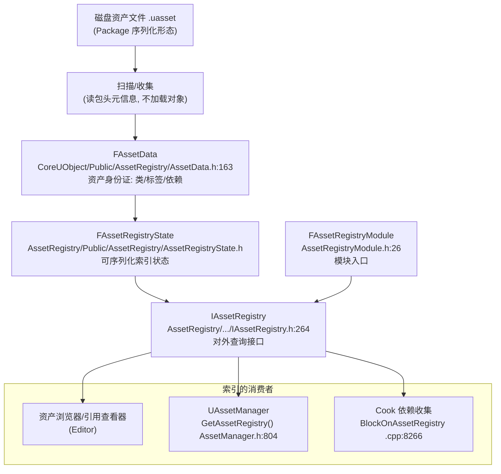
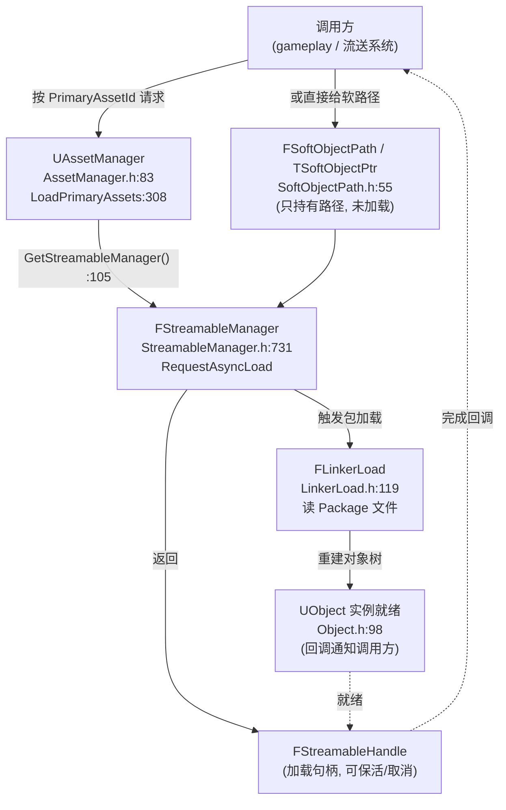
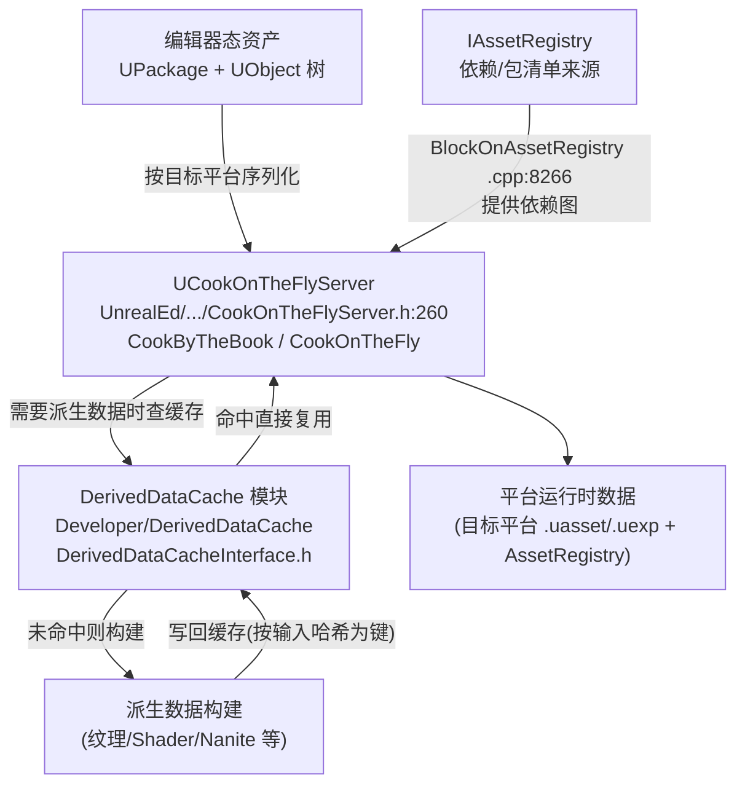

# UE5.8 资源与资产系统源码地图（Orientation Map）

> 本文档面向 thomas，目标只有一个：让你在 **不通读引擎全量代码、不精读资产序列化实现** 的前提下，看清 Unreal Engine 5.8 的 **资源与资产系统地图**——`UObject` / `UPackage` / `AssetRegistry` / 引用模型（Soft/Hard）/ 加载与流送 / Cook / DDC 各自在哪、谁连谁、怎么找。做到"在资产体系里不迷路"。
>
> 配套规格见 [`UE58_04_Asset_Package_Resource_System_Orientation_ChangeSpec.md`](<D:/UE/Docs/UE58_04_Asset_Package_Resource_System_Orientation_ChangeSpec.md>)。
>
> **证据约定**：标 `【事实】` 的内容由本机目录/文件名/`.Build.cs`/轻量 grep（含 `file:line`）直接验证；标 `【推理】` 的内容是 **逻辑分析推理(无事实依据)**，基于 UE 通用约定推断，未通读实现，需后续读代码确认。
>
> **路径表述约定**：正文与 ASCII 图中提及目录/文件一律用 **完整绝对路径**（Windows 原生反斜杠形式，反引号包裹）；mermaid 图节点为避免过长，使用 **以 `D:\UE\5.8.0r\Engine\Source` 为根的模块相对简写**（正斜杠风格），不代表磁盘真实分隔符。

---

## 1. thomas 先读这段：怎么用这张资源/资产地图不迷路

UE 的"资产"很容易把人绕晕，因为同一个东西在不同阶段有不同身份。用法是 **按"生命周期阶段"定位，不要按"文件类型"定位**：

1. **先分清"磁盘态"和"内存态"**：磁盘上是一个 `.uasset` 文件（**Package 的序列化形态**）；加载进内存后是一棵 `UObject` 树（根是一个 `UPackage`）。同一个资产，磁盘问 `UPackage`/`FLinkerLoad`，内存问 `UObject`。
2. **再分清"要不要把它加载进内存"**：只想知道"有哪些资产、它叫什么、依赖谁"——问 **AssetRegistry**（它存的是 `FAssetData` 元信息，不加载对象）；真要用对象——走 **加载/流送**（`FSoftObjectPath` → `FStreamableManager` → `UAssetManager`）。
3. **最后分清"运行时"和"打包时"**：游戏里跑的是加载链路；把编辑器资产变成平台可用数据，是 **Cook**；Cook/构建中间产物的缓存层是 **DDC**。

> 速记：**磁盘=Package，内存=UObject，目录=AssetRegistry，找得到=SoftObjectPath，搬进来=StreamableManager，打包=Cook，缓存=DDC。** 七个词对应七个边界对象（见 §4）。【推理：基于本文结构事实归纳】

---

## 2. 一句话总览：资源/资产系统是什么

Unreal Engine 5.8 的资产系统，**底座在 `CoreUObject` 模块**（对象、包、引用路径、加载器都在这里），**索引层在 `AssetRegistry` 模块**，**高层管理与流送在 `Runtime\Engine`**（`UAssetManager` / `FStreamableManager`），**打包（Cook）在编辑器侧 `UnrealEd`**，**缓存（DDC）在 `Developer\DerivedDataCache`**。【事实，见 §13 模块依赖】

一个关键认知：**资产 ≠ 单独文件格式，资产 = "一个 Package 里的一个或多个 UObject"**。磁盘 `.uasset` 是 Package 的序列化结果；`FAssetData` 是这个资产的"身份证"（不加载即可读元信息）。【推理：基于类名与目录结构】

---

## 3. ASCII 总览图：从磁盘到内存到打包的主链路

下图只画主干，省略大量旁支（用 `...` 表示）。模块/类落点为本机实测【事实】；阶段间的数据流时序为 **推理**【推理】。

```text
[磁盘态 / 打包态]                                  [内存态 / 运行时]
D:\UE\5.8.0r\...\CoreUObject (序列化/加载)          D:\UE\5.8.0r\...\CoreUObject (对象系统)
  .uasset 文件 = Package 的序列化形态                    UObject (Object.h:98, 反射/GC 一等公民)
        |                                                    ^
        |  FLinkerLoad 读包头/导入导出表                       | 根对象是 UPackage
        v  (LinkerLoad.h:119 / Linker.h:662)                  |
  UPackage (Package.h:215 : public UObject) =============> 一棵 UObject 树 (Outer 链)
        |                                                    ^
        |  扫描 .uasset 抽取元信息(不加载对象)                 |  按需加载/流送
        v                                                    |
  AssetRegistry 索引                                   FStreamableManager (StreamableManager.h:731)
  FAssetData (AssetData.h:163, 身份证)  <--查询--      UAssetManager (AssetManager.h:83 : public UObject)
  IAssetRegistry (IAssetRegistry.h:264)                     ^  持有 StreamableManager(AssetManager.h:1177)
        |                                                    |  解析 FSoftObjectPath(SoftObjectPath.h:55)
        |  引用模型                                          |
        +--> Hard Reference: TObjectPtr / 直接 import (随包加载)
        +--> Soft Reference : FSoftObjectPath / TSoftObjectPtr (按需加载) ---^
        |
        v  [打包时 / Cook]
  UCookOnTheFlyServer (CookOnTheFlyServer.h:260 : public UObject)
        |  CookByTheBook / CookOnTheFly (ECookMode, .h:130)
        |  读 AssetRegistry 收集依赖(BlockOnAssetRegistry, .cpp:8266)
        v
  平台可用数据(.uasset/.uexp 等) + DDC 缓存
  DerivedDataCache (D:\UE\5.8.0r\Engine\Source\Developer\DerivedDataCache)
```

> 读图要点：**横向是"同一资产的两种身份"（左磁盘/右内存），纵向是"生命周期阶段"（发现→加载→打包）。** AssetRegistry 横跨两侧：它读磁盘元信息，又服务运行时与 Cook 的查询。【推理：基于类名与依赖关系归纳】

---

## 4. 七个边界对象速查表（路径 → 职责 → 事实锚点）

| 边界对象 | 完整绝对路径 | 一句话职责 | 事实锚点（`file:line`） |
| --- | --- | --- | --- |
| `UObject` | `D:\UE\5.8.0r\Engine\Source\Runtime\CoreUObject\Public\UObject\Object.h` | 引擎对象系统根：参与反射/GC/序列化的一等公民 | `Object.h:98`（`class UObject : public UObjectBaseUtility`）【事实】 |
| `UPackage` | `D:\UE\5.8.0r\Engine\Source\Runtime\CoreUObject\Public\UObject\Package.h` | 资产的"容器/磁盘单元"：一个 `.uasset` 对应一个 Package | `Package.h:215`（`class UPackage : public UObject`）、`Package.h:580`（`GetLinker()`）【事实】 |
| `IAssetRegistry` + `FAssetData` | `...\Runtime\AssetRegistry\Public\AssetRegistry\IAssetRegistry.h` + `...\Runtime\CoreUObject\Public\AssetRegistry\AssetData.h` | 资产"目录与身份证"：不加载对象即可查元信息/依赖 | `IAssetRegistry.h:264`、`AssetData.h:163`（`struct FAssetData`）【事实】 |
| `UAssetManager` | `D:\UE\5.8.0r\Engine\Source\Runtime\Engine\Classes\Engine\AssetManager.h` | 高层资产管理：主资产(PrimaryAsset)、Bundle、统一加载入口 | `AssetManager.h:83`（`class UAssetManager : public UObject`）、`AssetManager.h:804`（`GetAssetRegistry()`）【事实】 |
| `FSoftObjectPath` | `...\Runtime\CoreUObject\Public\UObject\SoftObjectPath.h` | 软引用路径：用"字符串路径"指向资产，可不加载先持有 | `SoftObjectPath.h:55`（`struct FSoftObjectPath`）【事实】 |
| `FStreamableManager` | `...\Runtime\Engine\Classes\Engine\StreamableManager.h` | 异步流式加载器：把软引用真正搬进内存 | `StreamableManager.h:731`（`struct FStreamableManager : public FGCObject`）【事实】 |
| Cook（`UCookOnTheFlyServer`）/ DDC | `...\Editor\UnrealEd\Classes\CookOnTheSide\CookOnTheFlyServer.h` / `...\Developer\DerivedDataCache` | Cook：把编辑器资产转平台数据；DDC：缓存派生/构建数据 | `CookOnTheFlyServer.h:260`（`class UCookOnTheFlyServer : public UObject`）【事实】 |

> 关键易错点：**`FAssetData`、`FARFilter`、`FAssetIdentifier` 不在 `AssetRegistry` 模块，而在 `CoreUObject` 模块的 `D:\UE\5.8.0r\Engine\Source\Runtime\CoreUObject\Public\AssetRegistry` 目录下。** `AssetRegistry` 模块只放 `IAssetRegistry`、`FAssetRegistryState`、`FAssetRegistryModule` 这些"注册表本体与状态"。找数据结构去 CoreUObject，找注册表服务去 AssetRegistry。【事实，两处目录均已列举】

---

## 5. UObject 与 UPackage 的边界（内存态根基）

【事实】`UObject` 声明在 `D:\UE\5.8.0r\Engine\Source\Runtime\CoreUObject\Public\UObject\Object.h:98`（`class UObject : public UObjectBaseUtility`）。它是反射、垃圾回收（GC）、序列化的统一基类——前序文档讲的 `AActor`、`UPrimitiveComponent` 等都最终派生自它。

【事实】`UPackage` 声明在 `D:\UE\5.8.0r\Engine\Source\Runtime\CoreUObject\Public\UObject\Package.h:215`（`class UPackage : public UObject`）。注意：**Package 自己也是一个 UObject**，它是内存中一棵对象树的"根 Outer"，对应磁盘上一个 `.uasset` 文件。

两者关系（逻辑分析推理(无事实依据)）：

- 加载一个资产 = 把磁盘 Package 文件读进来，**创建一个 `UPackage`，并在其下重建 `UObject` 树**。`UPackage::GetLinker()`（`Package.h:580`，持有 `FLinkerLoad*`）是 Package 与磁盘加载器的连接点。【事实：成员与函数存在；时序为推理】
- 资产的"包含关系"靠 `Outer` 链表达：一个 `UStaticMesh` 的 `Outer` 通常是它所在的 `UPackage`。【推理：基于 UE 通用对象模型】

> 速记：**`UObject` 是"内存里的一个对象"，`UPackage` 是"装这些对象的内存容器 + 磁盘文件的内存代表"。** 序列化/加载细节（`FPackageFileSummary`、导入导出表）本文只定位不精读（见 §9）。

---

## 6. AssetRegistry 与 FAssetData：资产的目录与身份证

### 6.1 边界与落点

【事实】`AssetRegistry` 是一个独立运行时模块：`D:\UE\5.8.0r\Engine\Source\Runtime\AssetRegistry`，内部 `Public\AssetRegistry` 含 `IAssetRegistry.h`、`AssetRegistryState.h`、`AssetRegistryModule.h`、`AssetRegistryHelpers.h`、`PathTree.h` 等。

- `IAssetRegistry`（`IAssetRegistry.h:264`）是对外查询接口；其中有 `K2_GetAssetByObjectPath(const FSoftObjectPath& ObjectPath, ...)`（`IAssetRegistry.h:413`），说明 **可用软路径直接查到 `FAssetData`**。【事实】
- `FAssetRegistryModule`（`AssetRegistryModule.h:26`，`class FAssetRegistryModule : public IModuleInterface, public IAssetRegistryInterface`）是模块入口，外部通过它拿到 `IAssetRegistry`。【事实】
- `FAssetData`（`AssetData.h:163`）是资产元信息载体，位于 `CoreUObject` 模块（见 §4 易错点）。【事实】

### 6.2 它解决什么问题（推理）

逻辑分析推理(无事实依据)：编辑器/工具/Cook 经常需要"在不加载几万个资产对象的前提下，知道有哪些资产、它们的类、标签(tag)、依赖关系"。AssetRegistry 就是这张 **可序列化的索引表**（`FAssetRegistryState` 是其状态、`PathTree` 组织路径、`AssetDataMap` 做查找）。所以 **资产浏览器、引用查看器、Cook 依赖收集** 都建立在它之上。【推理：基于类名与目录结构；Cook 用它为事实，见 §10】

### 6.3 Mermaid 1：资产发现与注册图



> 图中"扫描→FAssetData→State"的数据流为 **推理**【推理】；`IAssetRegistry`/`FAssetData`/`FAssetRegistryModule` 的落点与 `GetAssetRegistry()`/`BlockOnAssetRegistry` 的存在为 **事实**【事实】。

---

## 7. 引用模型：Hard Reference vs Soft Reference

这是 thomas 最该建立的认知——**资产之间"怎么互相指"，直接决定"加载谁、什么时候加载"**：

| 引用类型 | 代表类型（落点） | 加载语义 | 事实/推理 |
| --- | --- | --- | --- |
| **硬引用 Hard** | `TObjectPtr<T>` / `UPROPERTY` 直接指针（`...\CoreUObject\Public\UObject\ObjectPtr.h`） | 拥有者被加载时，**被引用资产随之同步加载**（写进包的 import 表） | 【推理：基于 UE 通用引用语义；`ObjectPtr.h` 存在为事实】 |
| **软引用 Soft** | `FSoftObjectPath`（`SoftObjectPath.h:55`）、`TSoftObjectPtr<T>`（`SoftObjectPtr.h`） | 只持有"路径字符串"，**默认不加载**，需显式异步/同步加载 | 【事实：类型落点；加载语义为推理】 |
| **主资产 ID** | `FPrimaryAssetId`（`...\CoreUObject\Public\UObject\PrimaryAssetId.h`）、`FTopLevelAssetPath`（`TopLevelAssetPath.h`） | 给 `UAssetManager` 用的稳定标识，按"类型:名字"寻址 | 【事实：类型落点；用途为推理】 |

逻辑分析推理(无事实依据)：硬引用简单但容易"牵一发动全身"（加载一个就拖入一大串）；软引用解耦加载时机，是大世界/流送/按需内容的基础。**选择软引用还是硬引用，本质是在"易用性"和"内存/加载可控性"之间取舍。**【推理】

---

## 8. AssetManager + StreamableManager：把软引用搬进内存

### 8.1 边界与落点

【事实】`UAssetManager`（`AssetManager.h:83`，`class UAssetManager : public UObject`）是高层资产管理单例，由引擎持有：`UEngine` 有成员 `TObjectPtr<class UAssetManager> AssetManager`（`Engine.h:899`）。它对外暴露：

- `GetStreamableManager()`（`AssetManager.h:105`）→ 返回内部 `FStreamableManager StreamableManager`（成员在 `AssetManager.h:1177`）。【事实】
- `GetAssetRegistry()`（`AssetManager.h:804`）→ 拿到 `IAssetRegistry`。【事实】
- `LoadPrimaryAssets(...)`（`AssetManager.h:308`）、`ChangeBundleStateForPrimaryAssets(...)`（`AssetManager.h:390`）→ 按主资产/Bundle 批量加载。【事实】

【事实】`FStreamableManager`（`StreamableManager.h:731`，`struct FStreamableManager : public FGCObject`）是真正的 **异步流式加载器**，加载请求返回 `FStreamableHandle`（同文件中出现）。它继承 `FGCObject` 说明它参与 GC 保活——这是"加载进来的对象不会被立刻回收"的机制依据。【事实：继承关系；保活语义为推理】

### 8.2 三层关系（推理收敛）

逻辑分析推理(无事实依据)：`UAssetManager` 是"业务大脑"（懂主资产、Bundle、规则），`FStreamableManager` 是"搬运工"（只管异步加载某个 `FSoftObjectPath`），`AssetRegistry` 是"地址簿"（提供"有哪些、在哪"）。三者分工：**先查（Registry）→ 再决策（AssetManager）→ 后搬运（StreamableManager）。**【推理；三者持有/调用关系为事实】

### 8.3 Mermaid 2：软引用加载图



> 图中 `UAssetManager → StreamableManager`（`GetStreamableManager()`）、`StreamableManager` 异步加载、`FLinkerLoad` 读包为 **结构事实/类型事实**【事实】；"请求→加载→回调"的时序为 **推理**【推理】。

---

## 9. 加载机制定位：FLinkerLoad / PackageResourceManager（只定位不精读）

按 ChangeSpec 非目标，本节只说"加载到底在哪做"，不精读序列化格式：

- 【事实】`FLinkerLoad`（`D:\UE\5.8.0r\Engine\Source\Runtime\CoreUObject\Public\UObject\LinkerLoad.h:119`）是 Package 的 **加载器**：负责读包头、解析导入/导出表、把磁盘字节变成 `UObject`。创建入口 `FLinkerLoad::CreateLinker(...)`（`LinkerLoad.h:649`）。
- 【事实】`GetPackageLinker(UPackage* InOuter, const FPackagePath& PackagePath, ...)`（`...\UObject\Linker.h:662`）是"给一个 Package 找/建它的 Linker"的全局入口。
- 【事实】`UPackage::GetLinker()`（`Package.h:580`）让你从一个 Package 反查它的 `FLinkerLoad`。
- 【事实】`PackageResourceManager.h`（`...\CoreUObject\Public\UObject\PackageResourceManager.h`）存在，是 **包文件 IO 的抽象层**（磁盘/Pak/网络等不同来源）。保存路径对应 `SavePackage.h`。

逻辑分析推理(无事实依据)：加载链路大致为 `FSoftObjectPath/PackagePath → PackageResourceManager 打开字节流 → FLinkerLoad 解析 → 重建 UObject 树`。具体时序、异步分片、`FPackageFileSummary` 字段含义需读 `Private` 实现确认。【推理】

---

## 10. Cook 与 DDC：打包时的两个边界

### 10.1 Cook（烘焙）落点

【事实】Cook 的核心协调器是 `UCookOnTheFlyServer`：声明在 `D:\UE\5.8.0r\Engine\Source\Editor\UnrealEd\Classes\CookOnTheSide\CookOnTheFlyServer.h:260`（`class UCookOnTheFlyServer : public UObject`），实现在 `D:\UE\5.8.0r\Engine\Source\Editor\UnrealEd\Private\CookOnTheFlyServer.cpp`（超过一万行）。

- 它支持两种模式：`ECookMode` 含 `CookByTheBook`、`CookByTheBookFromTheEditor`、`CookOnTheFly...`（`CookOnTheFlyServer.h:130` 附近）。`StartCookByTheBook(...)` 声明在 `CookOnTheFlyServer.h:763`。【事实】
- 它 **依赖 AssetRegistry 收集依赖与包清单**：`BlockOnAssetRegistry(...)`（`CookOnTheFlyServer.cpp:8266`）、`RefreshPlatformAssetRegistries(...)`（`CookOnTheFlyServer.cpp:8350`）。【事实】
- 相关模块：运行时侧 `D:\UE\5.8.0r\Engine\Source\Runtime\CookOnTheFly`、网络侧 `D:\UE\5.8.0r\Engine\Source\Developer\CookOnTheFlyNetServer`。`CoreUObject` 还提供 `Public\Cooker` 子域（`CookDependency.h`、`MPCollector.h` 等）支撑多进程烘焙。【事实，目录/文件已列举】

逻辑分析推理(无事实依据)：Cook 干的事是"把编辑器态资产 + 平台目标 → 转换成目标平台运行时可直接 mmap/加载的数据"，并按引用图裁剪未引用资产。`CookByTheBook` = 全量按清单烘焙；`CookOnTheFly` = 编辑器边跑边按需供应。【推理：基于命名与函数名】

### 10.2 DDC（DerivedDataCache）落点

【事实】DDC 是独立 Developer 模块：`D:\UE\5.8.0r\Engine\Source\Developer\DerivedDataCache`，`Public` 含 `DerivedDataCacheInterface.h`、`DerivedDataCache.h`、`DerivedDataCacheModule.h`，以及 `DerivedDataBuild*.h` 一整套"构建作业"接口（`DerivedDataBuildDefinition.h`、`DerivedDataBuildJob.h`、`DerivedDataBuildFunction.h` 等）。

【事实】`CoreUObject` 在编辑器/桌面构建下 **私有依赖 DerivedDataCache**：`D:\UE\5.8.0r\Engine\Source\Runtime\CoreUObject\CoreUObject.Build.cs:63-66`（`if (Target.bBuildWithEditorOnlyData && ... Desktop) PrivateDependencyModuleNames.Add("DerivedDataCache");`）。

逻辑分析推理(无事实依据)：DDC 缓存的是 **"派生数据"**——由源资产 + 一组参数计算出的中间产物（如压缩纹理、Shader、Nanite/距离场数据）。键(Key)由输入哈希决定，命中就复用、不命中就构建并写回。它让 Cook/导入不必每次重算。**注意：DDC 模块代码（`Developer\DerivedDataCache`）和 DDC 磁盘缓存目录（各项目 `Saved`/全局缓存里的 `DerivedDataCache\`）是两回事——本文只定位前者代码，从不读取后者缓存数据。**【推理 + 排除声明】

### 10.3 Mermaid 3：Cook / DDC 高层关系图



> 图中 `UCookOnTheFlyServer` 落点、`BlockOnAssetRegistry`、`CoreUObject` 依赖 DDC 为 **事实**【事实】；"按哈希缓存派生数据、命中复用"的语义为 **推理**【推理】。

---

## 11. 与大世界、流送、插件、编辑器框架的衔接

| 衔接面 | 关系（落点/证据） | 事实/推理 |
| --- | --- | --- |
| **大世界 WorldPartition** | WP 用 `FWorldPartitionActorDesc` 在 **不加载 Actor** 时就知道其元信息（见衔接文档），这与 AssetRegistry"不加载对象读元信息"是同一思路；WP Cell 的按需加载最终走 `FStreamableManager` 流式加载 | 【推理：基于两套机制的同构性；ActorDesc 落点见衔接文档】 |
| **流送 Streaming** | 软引用（`FSoftObjectPath`）+ `FStreamableManager` 是流送的通用底座；关卡流送/资产流送/WP 流送都建立在异步加载之上 | 【推理；类型落点为事实】 |
| **插件 Plugins** | 资产用挂载点路径（如 `/PluginName/...`）寻址；`AssetRegistry.Build.cs` 私有依赖 `Projects` 模块（`AssetRegistry.Build.cs:16`），插件/项目的路径挂载由此参与扫描 | 【事实：依赖 `Projects`；挂载语义为推理】 |
| **编辑器框架 UnrealEd** | 资产导入/编辑器在 `D:\UE\5.8.0r\Engine\Source\Developer\AssetTools` 与 `D:\UE\5.8.0r\Engine\Source\Editor\UnrealEd`；Cook 协调器 `UCookOnTheFlyServer` 也住在 `UnrealEd`。这些是 **编辑器/工具态**，不进游戏运行时包 | 【事实：目录与 Cook 落点】 |

> 衔接口径一致性：本文与 [`UE58_Source_Hierarchy_Orientation.md`](<D:/UE/Docs/UE58_Source_Hierarchy_Orientation.md>) 一致——`Runtime` 才进游戏包，`Developer`/`Editor`（AssetTools/UnrealEd/Cook）不进包；找运行时加载去 `Runtime\Engine`、找打包/缓存去 `Developer`/`Editor`。【事实，与既有文档对照】

---

## 12. 与前三份文档的衔接

本文是资产系统的 **"整体认知层"**，与已有三份文档构成阶梯：

1. [`UE58_Source_Hierarchy_Orientation.md`](<D:/UE/Docs/UE58_Source_Hierarchy_Orientation.md>)：教你"四域/模块/`Public`-`Private`边界"的通用读码法。本文复用其方法定位 CoreUObject/AssetRegistry/Engine/UnrealEd/DDC。
2. [`UE58_Nanite_WorldPartition_HLOD_SourceMap.md`](<D:/UE/Docs/UE58_Nanite_WorldPartition_HLOD_SourceMap.md>)：大世界 `FWorldPartitionActorDesc`"不加载读元信息"与本文 AssetRegistry 同构；WP Cell 流送与本文 `FStreamableManager` 衔接。
3. [`UE58_Rendering_Animation_DeepDive.md`](<D:/UE/Docs/UE58_Rendering_Animation_DeepDive.md>)：渲染/动画的 `UStaticMesh`/`USkeletalMesh`/`UTexture` 等都是 `UObject` 资产，其 `GetAssetRegistryTags(...)`（如 `StaticMesh.h:2003`、`Texture.h:2067`）正是 §6 里"资产把元信息喂给 AssetRegistry"的具体实现点。【事实：grep 命中】

> 推荐顺序：**先读文档 1 建立读码法 → 读本文建立资产系统全局 → 按需切入文档 2/3 的具体子系统。**

---

## 13. 模块依赖底座（`.Build.cs` 事实）

资产系统的依赖方向（自底向上），由 `.Build.cs` 支撑【事实，行号实测】：

- `D:\UE\5.8.0r\Engine\Source\Runtime\CoreUObject\CoreUObject.Build.cs:26-34` → `PublicDependencyModuleNames = { "Core", "TraceLog", "CorePreciseFP", "Json" }`；`:38-44` 私有依赖 `{ "AutoRTFM", "Projects" }`；`:63-66` 仅编辑器/桌面构建私有依赖 `DerivedDataCache`。
- `D:\UE\5.8.0r\Engine\Source\Runtime\AssetRegistry\AssetRegistry.Build.cs:10-19` → `PrivateDependencyModuleNames = { "Core", "CoreUObject", "TraceLog", "ApplicationCore", "Projects", "TelemetryUtils", "PakFile" }`；`:22-25` 编辑器额外用 `DirectoryWatcher`、`TargetPlatform`。

由此可推依赖分层【事实支撑方向 + 推理收敛】：

```text
Core  →  CoreUObject(对象/包/加载/FAssetData)  →  AssetRegistry(索引)
                       |                                  |
                       +------>  Runtime\Engine ( UAssetManager / FStreamableManager )
                       |
                (编辑器构建) →  DerivedDataCache(缓存)
                                Editor\UnrealEd ( UCookOnTheFlyServer / AssetTools 等 )
```

> 关键推论：**`CoreUObject` 是整个资产系统的地基**（连 `FAssetData` 都放在它的 `Public\AssetRegistry` 里）；`AssetRegistry` 依赖 `CoreUObject` 而非反向；`UAssetManager` 在更上层的 `Engine` 模块。底层不认识上层，方向单向向下。【事实方向 + 推理收敛】

---

## 14. 阿卡姆剃刀检查

- **是否必须跨项目完成？** 否。本文只读 `D:\UE\5.8.0r\Engine\Source` 结构，未触碰 `D:\UE\AnimationSamples`、`D:\UE\ProjectTitan`、`D:\UE\tutorial`。
- **是否能删掉而不影响目标？** 本文聚焦"七边界对象 + 主链路"，剔除了序列化格式精读、GC 算法、DDC 命中算法等实现细节（标为非目标/推理）。
- **抽象是否被真实需求证明？** 三张 mermaid 各对应"发现/加载/打包"三个真实困惑点，一张 ASCII 串起磁盘↔内存↔打包，无冗余图。
- **是否在复述代码？** 否。本文只给"在哪、谁连谁、怎么找"的结构判据与 `file:line` 锚点，不解释任何序列化/GC 算法。

---

## 15. 局限性与潜在风险提示

- **本研究只看目录名、文件名、`.Build.cs` 与少量声明/函数 grep 行，未通读任何实现**。"加载时序、Cook 阶段流转、DDC 命中与构建逻辑、GC 保活细节"等运行时结论 **均为 逻辑分析推理(无事实依据)**，需后续读 `Private` 实现或 Epic 官方文档验证。
- **类型职责描述部分基于类名/头文件名/目录结构推断**，文件名与真实职责可能不完全一致（例如把 `Public\Cooker` 判为"多进程烘焙支撑"仅按文件名推测，未读码）。
- **`Hard/Soft Reference`、`PrimaryAsset`、DDC"按哈希缓存派生数据"等语义是 UE 通用约定**，本文已用真实 `file:line` 证明相关类型/函数 **存在**，但其 **加载/缓存语义** 标注为【推理】。
- **DDC 代码模块 ≠ DDC 磁盘缓存目录**：本文只定位 `D:\UE\5.8.0r\Engine\Source\Developer\DerivedDataCache` 源码模块，**从未读取** 任何项目下的 `DerivedDataCache\` 缓存数据目录，也未读取任何 `.uasset` 二进制内容、`Binaries`、`Intermediate`、`Saved`、压缩包（`D:\UE\UnrealEngine-5.8.0-release.zip`）。
- **绝对路径绑定本机 `D:\UE\5.8.0r` 布局**，换机或换引擎版本即失效。文档里的机器绝对路径 **只是"本机定位路径"，不是可复用配置**；在引擎/项目 **代码内** 引用资产时应使用 **Unreal 路径 API**（`FSoftObjectPath`、`FPackagePath`、`FPaths`、`FTopLevelAssetPath`）或 **模块相对包含路径**（由 `.Build.cs` 依赖解析），不得硬编码 `D:\UE\...` 绝对路径。这是为满足 thomas"完整绝对路径"硬性要求与"不硬编码绝对路径"通用准则之间的取舍，特此声明。
- **未修改任何引擎源码、项目文件、生成产物或压缩包；未覆盖已有六份 `D:\UE\Docs\UE58_*.md` 文档。**
