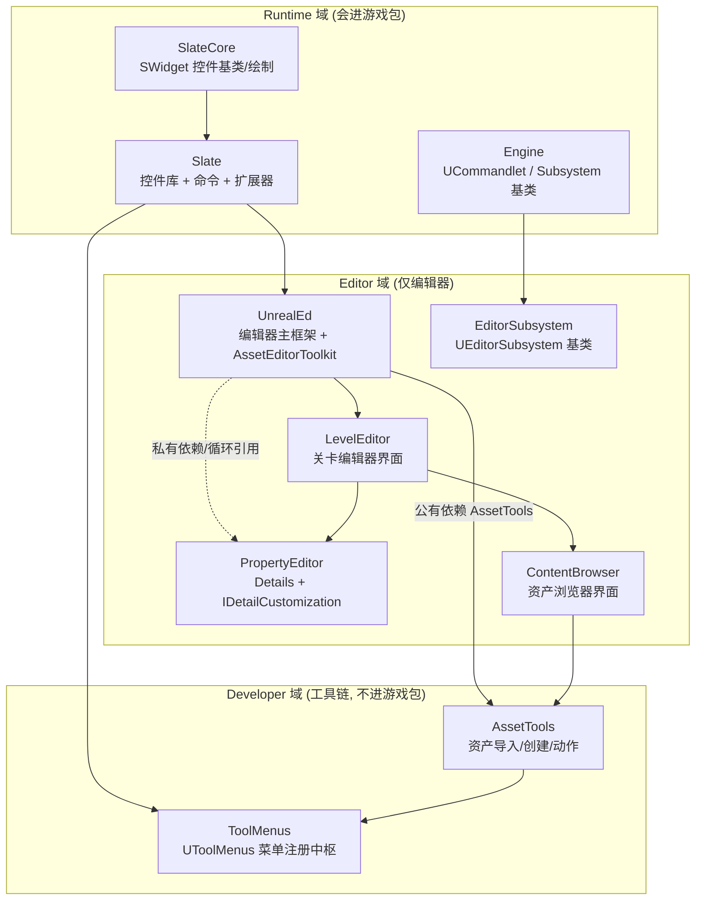
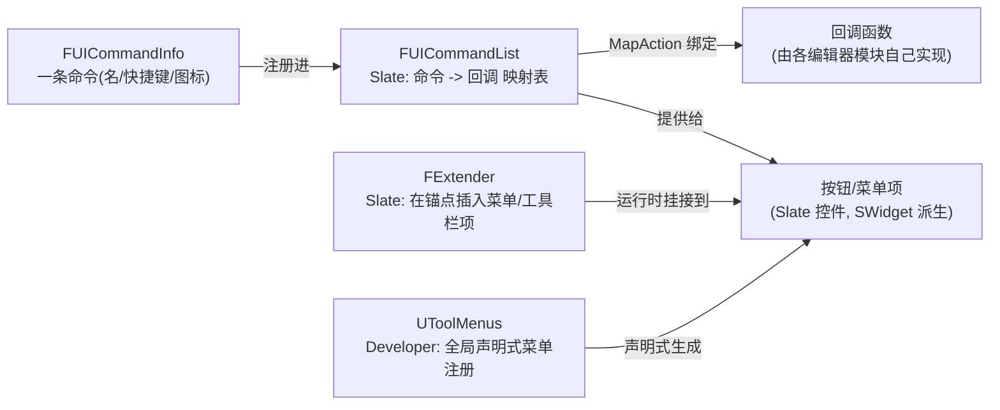
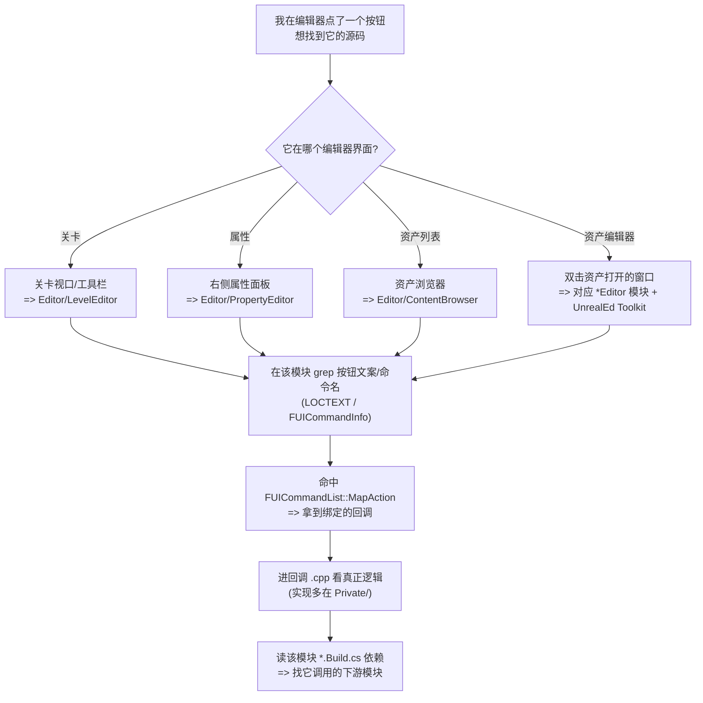

# UE5.8 编辑器框架源码地图（Editor Framework Orientation）

> 本文档面向 thomas，目标只有一个：让你在 **不通读编辑器全量代码** 的前提下，先看清 Unreal Engine 5.8 **编辑器框架** 的源码地图——知道每一块代码在哪、谁连谁、**从一个编辑器按钮怎么反查回源码**。本文档 **不** 做任何编辑器 UI 控件的实现精读。
>
> 配套规格见 [`UE58_05_Editor_Framework_Orientation_ChangeSpec.md`](<D:/UE/Docs/UE58_05_Editor_Framework_Orientation_ChangeSpec.md>)。
>
> 本文是系列文档 **第 5 篇**，前序为 [`UE58_01_Plugin_Mechanism_Orientation.md`](<D:/UE/Docs/UE58_01_Plugin_Mechanism_Orientation.md>)（插件机制）、[`UE58_02_Editor_Automation_Testing_Orientation.md`](<D:/UE/Docs/UE58_02_Editor_Automation_Testing_Orientation.md>)（自动化测试）、[`UE58_03_UBT_UHT_Build_System_Orientation.md`](<D:/UE/Docs/UE58_03_UBT_UHT_Build_System_Orientation.md>)（UBT/UHT 构建系统）、[`UE58_04_Asset_Package_Resource_System_Orientation.md`](<D:/UE/Docs/UE58_04_Asset_Package_Resource_System_Orientation.md>)（资产/包/资源系统）。更早的全局地图见 [`UE58_Source_Hierarchy_Orientation.md`](<D:/UE/Docs/UE58_Source_Hierarchy_Orientation.md>)。
>
> **证据约定**：标 `【事实】` 的内容由本机目录条目、文件名、`.Build.cs` 内容或轻量 `rg` 命中（含 `file:line`）直接验证；标 `【推理】` 的内容是 **逻辑分析推理(无事实依据)**，基于 UE 通用约定推断，未通读实现，需后续读代码确认。
>
> **路径表述约定**：正文与 ASCII 图中提及目录/文件一律用 **完整绝对路径**（Windows 原生反斜杠形式，反引号包裹）；mermaid 图节点为避免过长，使用 **以 `D:\UE\5.8.0r\Engine\Source` 为根的模块简写**，不代表磁盘真实分隔符。

---

## 1. thomas 先读这段：编辑器框架地图如何帮助不迷路

编辑器代码量巨大（`D:\UE\5.8.0r\Engine\Source\Editor` 下有 145 个模块目录【事实】），但 thomas 不需要全读。这张地图的用法是 **顺着"一个按钮的生命"看五层**：

1. **谁画的**——按钮是一个 **Slate 控件**（`SWidget` 派生），Slate 框架在 `Runtime` 域。
2. **谁管它的菜单位置**——菜单/工具栏由 **`FExtender` / `UToolMenus`** 这套扩展机制拼装。
3. **点了它发生什么**——按钮通过 **`FUICommandList`** 绑定到一个回调函数。
4. **回调常常做两件事**——要么 **打开一个资产编辑器**（`FAssetEditorToolkit`），要么 **定制一块属性面板**（`IDetailCustomization`）。
5. **背后谁长期持有状态**——编辑器级服务由 **`UEditorSubsystem`** 承载；无界面的批处理由 **`UCommandlet`** 承载。

> 速记：**先问"哪个编辑器模块画的"→ 再问"Slate 还是 ToolMenus 装的"→ 再问"哪条 FUICommandList 绑的回调"→ 最后落到 Toolkit / Details / Subsystem / Commandlet。** 五问之后，任何编辑器功能你都能顺藤摸到源码。【推理：基于本文给出的结构事实归纳】

---

## 2. ASCII 总览图：从按钮到子系统的五层链路

下图把"编辑器一个按钮被点击"拆成五层，每层标出 **代表类型** 和 **所属模块完整绝对路径根**。链路即 `Editor Module -> Slate UI -> Commands/ToolMenus -> Details/AssetEditor -> Subsystems/Commandlets`。【事实：各类型 file:line 见第 8 节】

```text
            [ 编辑器里一个按钮 / 菜单项被点击 ]
                          |
                          v
 (1) Editor Module 域 ........ D:\UE\5.8.0r\Engine\Source\Editor
     UnrealEd / LevelEditor / PropertyEditor / ContentBrowser / Kismet ...
     语义: 仅编辑器, 不进游戏包 (145 个模块)
                          |  用 Slate 搭出界面
                          v
 (2) Slate UI 框架 ........... D:\UE\5.8.0r\Engine\Source\Runtime\Slate
     SWidget (在 SlateCore) = 一切控件的基类
     事实: Slate 公有依赖 SlateCore (Slate.Build.cs:24)
                          |  按钮要绑命令 / 菜单要找位置
                          v
 (3) Commands + ToolMenus
     FUICommandList (Slate)   : 命令 -> 回调 的映射表
     FExtender     (Slate)    : 在已有菜单/工具栏锚点插入项
     UToolMenus    (Developer): 全局声明式菜单注册中枢
                          |  回调通常打开窗口 / 操作属性
                          v
 (4) Details + AssetEditor
     IDetailCustomization (PropertyEditor): 定制右侧属性面板
     FAssetEditorToolkit  (UnrealEd)      : 资产编辑器窗口的工具包基类
                          |  背后由长生命周期服务 / 批处理承载
                          v
 (5) Subsystems + Commandlets
     UEditorSubsystem (EditorSubsystem)   : 与编辑器同生命周期的单例服务
     UCommandlet      (Runtime\Engine)    : 无界面、可命令行触发的批处理入口
```

> 读图要点：**(1) 在 `Editor` 域，(2)(3) 大部分在 `Runtime` 域，(3) 的 `UToolMenus` 与第 6 节的 `AssetTools` 在 `Developer` 域，(5) 的 `UCommandlet` 在 `Runtime\Engine`**。"编辑器框架"在物理上 **横跨三个源码域**，这是最容易迷路的地方。【事实：各模块所在域见第 3、8 节】

---

## 3. Editor / Developer / Runtime 边界：编辑器横跨三域

前一份层级文档已讲过四类源码域；这里只聚焦"编辑器框架实际用到哪三域"，并给出 **本任务实测的代表模块**：【事实，目录条目与 `.Build.cs` 实测】

| 源码域（完整绝对路径） | 在编辑器框架中的角色 | 是否进游戏包 | 本任务实测代表模块 |
| --- | --- | --- | --- |
| `D:\UE\5.8.0r\Engine\Source\Runtime` | 提供 **UI 底座与基类**：Slate 控件、命令、`USubsystem`/`UCommandlet` 基类 | 是（Slate 也用于游戏内 UI） | `Slate`、`SlateCore`、`Engine` |
| `D:\UE\5.8.0r\Engine\Source\Developer` | 提供 **跨"编辑器+工具进程"的支撑件**：菜单注册、资产工具、设置 | 否（编辑器/工具进程加载） | `ToolMenus`、`AssetTools`、`Settings`、`ToolWidgets` |
| `D:\UE\5.8.0r\Engine\Source\Editor` | **仅编辑器** 的主框架与各类界面：关卡编辑、属性面板、资产浏览器、蓝图 | 否 | `UnrealEd`、`LevelEditor`、`PropertyEditor`、`ContentBrowser`、`EditorSubsystem`、`Kismet`、`BlueprintGraph` |

> **关键易错点（务必记住）**：`UToolMenus` 与 `AssetTools` **不在 `Editor` 域，而在 `Developer` 域**——
> `D:\UE\5.8.0r\Engine\Source\Developer\ToolMenus`、`D:\UE\5.8.0r\Engine\Source\Developer\AssetTools`【事实，目录存在】。
> thomas 若按"它是编辑器功能"去 `Editor` 下翻会找不到。原因（推理）：菜单系统与资产工具被设计成可被编辑器之外的工具进程复用，故下沉到 `Developer`。【推理：基于域命名与 `.Build.cs` 依赖方向】

### 3.1 Slate 与 SlateCore 的上下层关系（有 `.Build.cs` 事实）

- `D:\UE\5.8.0r\Engine\Source\Runtime\SlateCore`：**最底层**。控件基类 `SWidget`、布局、绘制元素、样式在这里。其 `SlateCore.Build.cs:13-21` 的 `PublicDependencyModuleNames` 为 `Core` / `CoreUObject` / `DeveloperSettings` / `InputCore` / `Json` / `TraceLog`——**不依赖 `Slate`**。【事实】
- `D:\UE\5.8.0r\Engine\Source\Runtime\Slate`：**上层控件库**。按钮、菜单、停靠、命令系统在这里。其 `Slate.Build.cs:18-26` 的 `PublicDependencyModuleNames` **包含 `SlateCore`**（第 24 行）。【事实】
- 结论：**依赖方向是 `Slate → SlateCore`，底座是 `SlateCore`**。找控件 **基类/绘制原语** 去 `SlateCore`；找 **具体控件、命令、扩展器** 去 `Slate`。【事实支撑方向】

---

## 4. Mermaid 1：编辑器模块边界图

本图展示三域代表模块与 **有 `.Build.cs` 证据** 的依赖方向（实线=该 `.Build.cs` 实测依赖；虚线标注依赖类型）。【事实：依赖行号见第 7 节】



> 关键事实支撑：`UnrealEd.Build.cs:97` 公有依赖 `AssetTools`；`UnrealEd.Build.cs:134` 私有依赖 `PropertyEditor` 且二者在 `CircularlyReferencedDependentModules`（`UnrealEd.Build.cs:285`）；`LevelEditor.Build.cs:57/59/67` 私有依赖 `UnrealEd`/`ContentBrowser`/`PropertyEditor`；`ContentBrowser.Build.cs:33` 私有依赖 `AssetTools`；`AssetTools.Build.cs:42` 私有依赖 `ToolMenus`。**编辑器模块之间存在大量循环引用**，这是事实而非设计缺陷描述。【事实】

---

## 5. Mermaid 2：UI / 命令扩展链路图

本图回答"一个按钮怎么和命令、菜单扩展挂上"。`FUICommandList`、`FExtender` 在 `Slate`；`UToolMenus` 在 `Developer\ToolMenus`。【事实：file:line 见第 8 节】



> 读图要点：UE 有 **两套并存的菜单扩展路线**——老一套是 **命令式** 的 `FExtender`（运行时往锚点塞东西），新一套是 **声明式** 的 `UToolMenus`（注册到全局菜单树，可被数据驱动/蓝图扩展）。两者最终都产出 Slate 控件。`FExtender` 与 `UToolMenus` 的"新旧关系"为 **逻辑分析推理(无事实依据)**，仅依据二者并存与命名推断；`UToolMenus` 在 `Developer\ToolMenus`、`FExtender` 在 `Slate` 为事实。【事实 + 推理】

---

## 6. 五个 Editor 域核心模块的职责

| 模块（完整绝对路径） | 一句话职责 | 证据 |
| --- | --- | --- |
| `D:\UE\5.8.0r\Engine\Source\Editor\UnrealEd` | **编辑器主框架**：资产编辑器工具包基类、编辑器引导、最大依赖枢纽 | 【事实：含 `Classes/Internal/Private/Public/UnrealEd.Build.cs` 5 条目；`FAssetEditorToolkit` 在此】 |
| `D:\UE\5.8.0r\Engine\Source\Editor\LevelEditor` | **关卡编辑器界面**：主视口、世界编辑工具栏、关卡操作 | 【事实：`LevelEditor.Build.cs` 私有依赖 `UnrealEd`/`ContentBrowser`/`PropertyEditor`】 |
| `D:\UE\5.8.0r\Engine\Source\Editor\PropertyEditor` | **属性面板（Details）框架**：反射属性的可视化与 `IDetailCustomization` 定制点 | 【事实：`IDetailCustomization.h:18`；公有依赖 `UnrealEd`(`PropertyEditor.Build.cs:14`)】 |
| `D:\UE\5.8.0r\Engine\Source\Editor\ContentBrowser` | **资产浏览器界面**：浏览/筛选/拖放资产 | 【事实：`ContentBrowser.Build.cs:33-34` 依赖 `AssetTools`/`ContentBrowserData`】 |
| `D:\UE\5.8.0r\Engine\Source\Developer\AssetTools` | **资产工具（注意在 Developer 域）**：资产创建/导入/重命名/资产动作 | 【事实：`AssetTools.Build.cs:9-16` 公有依赖 `UnrealEd`；`:96-103` 与 `UnrealEd` 循环引用】 |

> `UnrealEd` 是 **编辑器的"万能枢纽"**：它的 `UnrealEd.Build.cs` 公有依赖多达数十个模块（`UnrealEd.Build.cs:52-103`），私有依赖再加数十个（`:105-197`），还有一大批 **按需动态加载** 的模块（`DynamicallyLoadedModuleNames`，`:199-253`，含 `ContentBrowser`/`DetailCustomizations`/`Persona`/`WorldPartitionEditor` 等）。这解释了为什么"几乎所有编辑器功能都能从 `UnrealEd` 摸到下游"。【事实】

---

## 7. Subsystem / Commandlet / AssetEditorToolkit 三个角色

这三者是"按钮回调之后"承载逻辑的三种典型容器，区别一句话讲清：

| 角色（类型 + 完整绝对路径） | 干什么 | 生命周期 / 触发方式 | 证据 |
| --- | --- | --- | --- |
| `UEditorSubsystem`（`D:\UE\5.8.0r\Engine\Source\Editor\EditorSubsystem\Public\EditorSubsystem.h`） | 编辑器级 **单例服务**：放"整个编辑器期间都要在的状态/管理器" | 与 **编辑器同生命周期**；模块加载时由 subsystem collection **自动实例化** | 【事实：`:20` `class UEditorSubsystem : public UDynamicSubsystem`，`:19` `UCLASS(MinimalAPI, Abstract)`，文件头注释明确生命周期】 |
| `FAssetEditorToolkit`（`D:\UE\5.8.0r\Engine\Source\Editor\UnrealEd\Public\Toolkits\AssetEditorToolkit.h`） | **资产编辑器窗口的工具包基类**：双击一个资产打开的那个编辑器，其 Tab 布局/工具栏/命令由它组织 | 打开资产时创建，关闭时销毁 | 【事实：`:115` `class FAssetEditorToolkit`；具体编辑器如 `FSimpleAssetEditor`/`FWorkflowCentricApplication` 继承它，见同目录头文件】 |
| `UCommandlet`（`D:\UE\5.8.0r\Engine\Source\Runtime\Engine\Classes\Commandlets\Commandlet.h`） | **无界面批处理入口**：烘焙、资产批改、数据导出等可命令行触发的任务 | 命令行/工具触发，跑完即退；**不依赖编辑器 UI** | 【事实：`:40` `class UCommandlet : public UObject`；同目录有 `USmokeTestCommandlet`/`UPluginCommandlet` 等派生】 |

> 关键边界（部分推理）：`UEditorSubsystem` 复用的是 **`Runtime\Engine` 的 Subsystem 框架**（其头文件 `#include "Subsystems/Subsystem.h"`，基类 `UDynamicSubsystem` 来自 `Runtime`）【事实：include 与基类名】——所以"Subsystem 机制本体在 Runtime，Editor 只是派生出编辑器味道的一支"。`UCommandlet` 也在 `Runtime\Engine` 而非 `Editor`，意味着 **commandlet 不是编辑器专属概念**，只是常被编辑器/烘焙流程使用。【事实：所在目录；用途为推理】

---

## 8. 关键类型 `file:line` 证据表（本任务实测）

下表每一行都可被 thomas 直接打开核对。【事实，均为本次 `rg`/`read` 命中】

| 关键类型 | 声明位置（完整绝对路径 : 行） | 所属模块 / 域 |
| --- | --- | --- |
| `SWidget` | `D:\UE\5.8.0r\Engine\Source\Runtime\SlateCore\Public\Widgets\SWidget.h:80` | `Runtime\SlateCore` |
| `FExtender` | `D:\UE\5.8.0r\Engine\Source\Runtime\Slate\Public\Framework\MultiBox\MultiBoxExtender.h:42` | `Runtime\Slate` |
| `FUICommandList` | `D:\UE\5.8.0r\Engine\Source\Runtime\Slate\Public\Framework\Commands\UICommandList.h:14` | `Runtime\Slate` |
| `UToolMenus` | `D:\UE\5.8.0r\Engine\Source\Developer\ToolMenus\Public\ToolMenus.h:625` | `Developer\ToolMenus` |
| `IDetailCustomization` | `D:\UE\5.8.0r\Engine\Source\Editor\PropertyEditor\Public\IDetailCustomization.h:18` | `Editor\PropertyEditor` |
| `FAssetEditorToolkit` | `D:\UE\5.8.0r\Engine\Source\Editor\UnrealEd\Public\Toolkits\AssetEditorToolkit.h:115` | `Editor\UnrealEd` |
| `UEditorSubsystem` | `D:\UE\5.8.0r\Engine\Source\Editor\EditorSubsystem\Public\EditorSubsystem.h:20` | `Editor\EditorSubsystem` |
| `UCommandlet` | `D:\UE\5.8.0r\Engine\Source\Runtime\Engine\Classes\Commandlets\Commandlet.h:40` | `Runtime\Engine` |

> 用这张表配合源码层级文档第 9 节的"宏路标"：命中声明后，看它在 `Public`（对外契约）还是 `Private`（内部实现），看它带不带 `<MODULE>_API` 宏判断是否跨模块可用。上表 8 个类型 **全部在 `Public`（或 `Classes`）**，即都是对外可用的框架契约点。【事实：路径含 `Public`/`Classes`】

---

## 9. Mermaid 3：从一个编辑器按钮反查源码的流程图

这是把第 1–8 节串成的 **可机械执行** 读码路径：先定界面 → 定模块 → grep 命令 → 找到回调 → 进实现 → 看依赖。



> 这条流程的可靠性来自一个事实：**编辑器按钮几乎都经由 `FUICommandList` 绑定回调**（`FUICommandList` 是 `Slate` 公开类型，第 8 节有 `file:line`）。所以"grep 命令名/文案 → 落到 `MapAction` → 找到回调"是稳定套路。**具体某按钮的回调实现内容** 未被本次调查通读，属 **逻辑分析推理(无事实依据)**。【事实支撑套路 + 推理收敛细节】

---

## 10. 与系列前 4 篇文档的衔接

本文是系列第 5 篇，正好把前 4 篇的主题在"编辑器框架"语境里串起来：

- **与插件机制（第 1 篇 [`UE58_01_Plugin_Mechanism_Orientation.md`](<D:/UE/Docs/UE58_01_Plugin_Mechanism_Orientation.md>)）**：编辑器扩展 **绝大多数以插件形式存在**。`UnrealEd.Build.cs` 的 `DynamicallyLoadedModuleNames`（`:199-253`）体现"模块按需动态加载"这一机制【事实：清单存在】；插件通常在其 `IModuleInterface::StartupModule()` 里调用 `UToolMenus` 注册菜单、注册 `IDetailCustomization`、注册资产动作——**插件如何注册** 的具体调用见第 1 篇，本文只给落点。【事实 + 推理】
- **与自动化测试（第 2 篇 [`UE58_02_Editor_Automation_Testing_Orientation.md`](<D:/UE/Docs/UE58_02_Editor_Automation_Testing_Orientation.md>)）**：测试支撑在 `Developer` 域——`UnrealEd.Build.cs:73-74` 公有依赖 `FunctionalTesting`、`AutomationController`【事实】；`PropertyEditor.Build.cs:57-63` 在开启自动化测试时还会依赖 `CQTest`【事实】。编辑器界面如何被测试驱动见第 2 篇。
- **与 UBT/UHT 构建系统（第 3 篇 [`UE58_03_UBT_UHT_Build_System_Orientation.md`](<D:/UE/Docs/UE58_03_UBT_UHT_Build_System_Orientation.md>)）**：本文反复引用的 `.Build.cs` 依赖、`PublicDependency`/`PrivateDependency`/`CircularlyReferencedDependentModules`、`MinimalAPI`/`<MODULE>_API` 宏，其 **驱动机制（UBT 读 `.Build.cs`、UHT 扫描反射宏）** 由第 3 篇讲清；本文只是这些机制在编辑器模块上的应用样本。
- **与资产/包/资源系统（第 4 篇 [`UE58_04_Asset_Package_Resource_System_Orientation.md`](<D:/UE/Docs/UE58_04_Asset_Package_Resource_System_Orientation.md>)）**：资产链路是 `ContentBrowser`（界面）→ `AssetTools`（动作）→ `AssetRegistry`/`ContentBrowserData`（数据）。证据：`ContentBrowser.Build.cs:33-34/44` 依赖 `AssetTools`/`ContentBrowserData`/`AssetRegistry`【事实】；`AssetTools.Build.cs:51` 私有依赖 `AssetRegistry`【事实】。资产的 **运行时对象与包/序列化机制** 见第 4 篇；本文只覆盖编辑器侧"可视化与编辑动作"的入口。【事实 + 推理】

---

## 11. 与源码层级文档的衔接

本文是 **"编辑器域专题地图"**；更早的 [`UE58_Source_Hierarchy_Orientation.md`](<D:/UE/Docs/UE58_Source_Hierarchy_Orientation.md>) 是 **"全引擎层级整体认知"**。两者衔接关系：

- **方法一致**：那份文档教的"先定域 → 再定模块（带 `*.Build.cs`）→ 后定边界（`Public`/`Private` + `_API` 宏）"在本文被 **原样应用到 Editor 域**。本文第 8 节 8 个类型全在 `Public`，正是那份文档"找契约去 `Public`"的实例。
- **口径一致（已核对）**：对 `Editor` = 仅编辑器/不进游戏包、`Developer` = 工具链、`Public` = 对外契约 / `Private` = 内部实现、`*.Build.cs` 表达依赖等描述，两文 **完全一致**。
- **推荐顺序**：**先读层级文档建立全局坐标 → 再读本文切入编辑器框架 → 需要时按本文第 9 节流程反查具体按钮**。例如那份文档告诉你"`Editor` 域有 145 个模块"，本文进一步告诉你"先看 `UnrealEd`/`LevelEditor`/`PropertyEditor`/`ContentBrowser` 四个枢纽就够入门"。

---

## 12. 阿卡姆剃刀检查

- **是否必须跨项目完成？** 否。本文只读 `D:\UE\5.8.0r\Engine\Source` 下 `Editor`/`Developer`/`Runtime` 结构，未触碰 `D:\UE\AnimationSamples`/`D:\UE\ProjectTitan`/`D:\UE\tutorial`。
- **是否能删掉而不影响目标？** 本文聚焦"编辑器框架地图"，已剔除所有 UI 控件实现细节；145 个 Editor 模块只展开 4–5 个枢纽，其余用代表名带过。
- **抽象是否被真实需求证明？** 三张 mermaid（模块边界 / 命令扩展链路 / 按钮反查流程）与一张 ASCII 五层图各自对应一个真实困惑点，无冗余图。
- **是否在复述代码？** 否。本文只给"在哪、谁连谁、怎么反查"的结构判据与 `file:line`，不解释任何控件绘制或事件实现算法。

---

## 13. 局限性与潜在风险提示

- **本研究只看目录名、文件名、`.Build.cs` 与少量 `rg` 声明命中行，未通读任何编辑器实现**。"按钮 → 命令 → 回调 → 子系统"的 **运行时协作行为** 多为 **逻辑分析推理(无事实依据)**，需后续读代码或读 UE 官方文档验证。
- **模块职责描述部分基于模块名、目录结构与 `.Build.cs` 依赖方向推断**，文件名与真实职责可能不完全一致。
- **`ToolMenus` 与 `AssetTools` 在 `Developer` 域、`UCommandlet` 在 `Runtime\Engine`**：这是"编辑器框架"语义与目录物理位置的张力，本文已在第 3、7 节显式标注，避免 thomas 在 `Editor\` 下空找。
- **`FExtender` 与 `UToolMenus` 的"新旧菜单路线"关系** 仅依据二者并存与命名推断，**未读实现确认**，标为推理。
- **绝对路径绑定本机 `D:\UE\5.8.0r` 布局**：换机或换引擎版本即失效。文档里的机器绝对路径 **只是"本机定位路径"，不是可复用配置**；在引擎/项目 **代码内** 引用其它模块时，应使用 **模块相对包含路径**（如 `#include "ToolMenus.h"`，由 `.Build.cs` 的依赖与包含路径解析）或 **Unreal 路径 API**（如 `FPaths`、`IPluginManager`、`$(EngineDir)`），不得硬编码 `D:\UE\...` 绝对路径。这是为满足 thomas"完整绝对路径"硬性要求与"不硬编码绝对路径"通用准则之间的取舍，特此声明。
- **未触达** 凭据、会话、个人配置、压缩包（`D:\UE\UnrealEngine-5.8.0-release.zip`）与生成产物（`Binaries`、`Intermediate`、`DerivedDataCache`、`Saved`、`Generated`）；`ThirdParty` 仅排除说明未进入内容；范围外文件未读取，未修改任何引擎源码，未覆盖 `D:\UE\Docs` 下任何已有 `UE58_*.md`。
