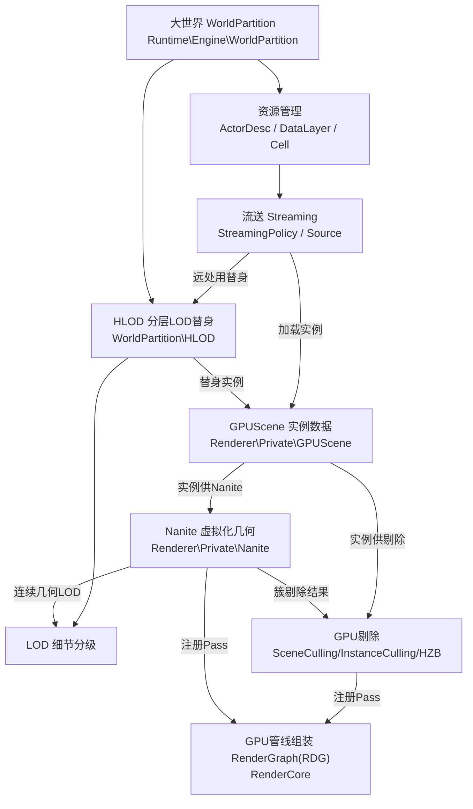
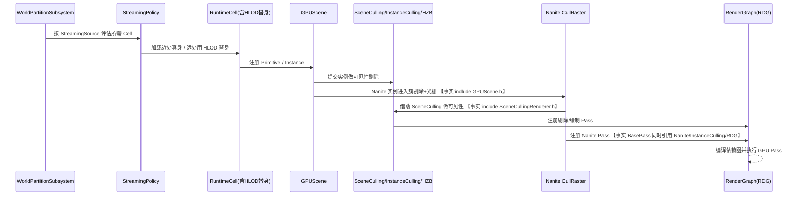

# UE5.8 Nanite × WorldPartition × HLOD 源码地图（SourceMap）

> 本文档面向 thomas，目标是让你在 **不通读引擎全量代码** 的前提下，快速建立 Unreal Engine 5.8 三大子系统的源码定位能力：Nanite、WorldPartition（大世界）、HLOD。
>
> 配套规格见 [`UE58_Nanite_WorldPartition_HLOD_ChangeSpec.md`](<D:/UE/Docs/UE58_Nanite_WorldPartition_HLOD_ChangeSpec.md>)。
>
> **证据约定**：标 `【事实】` 的内容由本机目录/文件名/轻量 grep 直接验证；标 `【推理】` 的内容是 **逻辑分析推理(无事实依据)**，未通读实现，需后续读代码确认。

---

## 0. 先读这段：UE 工程结构导读（关键词解释）

thomas 不熟悉 UE 目录习惯，这里先把六个关键词讲清，后文不再重复。

- **`Engine\Source\Runtime`**：引擎"运行时"C++ 源码根。`Runtime` 表示这些模块会被打包进游戏运行时（区别于 `Editor` 仅编辑器、`Developer` 工具、`ThirdParty` 第三方库）。完整路径 `D:\UE\5.8.0r\Engine\Source\Runtime`。【事实，目录存在】
- **`Runtime\Renderer`**：渲染器模块，负责"每帧怎么把场景画出来"——剔除、光栅、着色、Pass 组织。完整路径 `D:\UE\5.8.0r\Engine\Source\Runtime\Renderer`。【事实，目录存在】
- **`Runtime\Engine`**：引擎核心模块，负责"世界里有什么"——Actor、Component、World、关卡、流送、WorldPartition、HLOD 等 gameplay/世界层对象。完整路径 `D:\UE\5.8.0r\Engine\Source\Runtime\Engine`。【事实，目录存在】
- **`Public`**：模块对外暴露的头文件（`.h`），其它模块可 `#include`。是"对外 API 面"。
- **`Private`**：模块内部实现（`.cpp` 与内部 `.h`），原则上不被其它模块直接引用。是"实现细节面"。
- **`F` 前缀**：UE 命名习惯，`F` 表示 **普通 C++ struct/class（非 UObject）**，如 `FNaniteVisibility`、`FRasterResults`。对照：`U`=UObject 派生类、`A`=Actor 派生类、`I`=接口、`T`=模板、`E`=枚举。看到 `F` 就知道它是轻量值类型/运行时数据结构，不参与 UObject 反射与 GC。【推理：基于 UE 通用命名约定，非本次读码所得】

> 速记：**`Runtime\Engine` 管"世界里有什么"，`Runtime\Renderer` 管"这帧怎么画"；`Public` 是门面，`Private` 是厨房；`F` 是普通结构体。**

---

## 1. 快速定位表（路径 → 职责）

| 子系统 | 入口路径（完整绝对路径） | 一句话职责 | 证据 |
| --- | --- | --- | --- |
| 大世界框架 | `D:\UE\5.8.0r\Engine\Source\Runtime\Engine\Public\WorldPartition` / `...\Private\WorldPartition` | 把超大世界切成可流送单元 | 【事实】 |
| 流送策略 | `...\Private\WorldPartition\WorldPartitionStreamingPolicy.cpp` | 决定哪些 Cell 该加载/卸载 | 【事实】 |
| 流送来源 | `...\Public\WorldPartition\WorldPartitionStreamingSource.h` | 定义"以谁为中心"流送（玩家/相机） | 【事实】 |
| 空间划分 | `...\WorldPartition\RuntimeSpatialHash` / `RuntimeHashSet` | 网格/哈希方式组织 Cell | 【事实】 |
| 运行时单元 | `...\Public\WorldPartition\WorldPartitionRuntimeCell.h` | 一个可加载的世界块 | 【事实】 |
| 资源描述 | `...\Public\WorldPartition\WorldPartitionActorDesc.h` | 不加载 Actor 也能知道它的元信息 | 【事实】 |
| WP-HLOD | `...\Public\WorldPartition\HLOD` / `...\Private\WorldPartition\HLOD` | 大世界专用分层 LOD 替身 | 【事实】 |
| 传统 HLOD | `...\Public\HLOD` / `...\Private\HLOD` + `...\Private\HLODProxy.cpp` | 旧版（关卡级）HLOD 代理 | 【事实】 |
| HLOD 生成 | `...\Private\WorldPartition\RuntimeSpatialHash\RuntimeSpatialHashHLOD.cpp`、`...\RuntimeHashSet\WorldPartitionRuntimeHashSetHLODGeneration.cpp` | 烘焙时按空间结构生成 HLOD | 【事实】 |
| Nanite | `D:\UE\5.8.0r\Engine\Source\Runtime\Renderer\Private\Nanite` | GPU 驱动的虚拟化几何与连续 LOD | 【事实】 |
| GPUScene | `...\Renderer\Private\GPUScene.cpp` / `GPUScene.h` | 把场景实例数据上传到 GPU | 【事实】 |
| 实例剔除 | `...\Renderer\Private\InstanceCulling`（目录） | GPU 上对实例做可见性剔除 | 【事实】 |
| 场景剔除 | `...\Renderer\Private\SceneCulling`（目录） | 场景级可见性剔除 | 【事实】 |
| HZB | `...\Renderer\Private\HZB.cpp` / `HZB.h` | 层级 Z 缓冲，做遮挡剔除 | 【事实】 |
| GPU 管线组装 | `D:\UE\5.8.0r\Engine\Source\Runtime\RenderCore\Public\RenderGraphBuilder.h` 等 | RenderGraph(RDG) 组织 GPU Pass 依赖 | 【事实】 |

> 注意：**RenderGraph 不在 `Renderer\Private`，而在 `RenderCore` 模块。**【事实，见 §3.5】这是 thomas 容易找错的地方。

---

## 2. 七个概念怎么连起来（系统关系总览图）

下图把任务要求覆盖的七个概念（大世界、资源管理、LOD、Nanite、流送、GPU 剔除、GPU 管线组装）连成一张图。箭头方向表示"喂数据/触发"的大致流向。**箭头关系除标注外多为【推理】**。

**读图要点**：
- **大世界 → 资源管理 → 流送**：WorldPartition 把世界切块，用 ActorDesc 等元数据管理资源，再由流送策略按需加载。【推理，基于目录命名】
- **流送 ↔ HLOD**：近处加载真身，远处/未加载区域用 HLOD 替身顶上，避免空洞。【推理】
- **LOD 有两条线**：HLOD 是"分层/聚合"的粗粒度 LOD；Nanite 是"连续几何"的细粒度 LOD。两者都收敛到"LOD"这个目标。【推理】
- **GPUScene 是渲染侧总线**：加载进来的实例（含 HLOD 替身）注册到 GPUScene，再分别喂给 GPU 剔除与 Nanite。【部分事实：Nanite 引用 GPUScene，见 §4】
- **RenderGraph 是装配车间**：剔除与 Nanite 都把自己的 GPU Pass 注册进 RDG，由 RDG 编译依赖图并执行。【部分事实：BasePass 同时引用 Nanite/InstanceCulling/RDG，见 §4】

---

## 3. 源码目录职责（按子系统）

### 3.1 Nanite — `D:\UE\5.8.0r\Engine\Source\Runtime\Renderer\Private\Nanite`

该目录 38 个条目。【事实】关键文件（职责描述为【推理，基于文件名】）：

- [`Nanite.cpp / Nanite.h`](<D:/UE/5.8.0r/Engine/Source/Runtime/Renderer/Private/Nanite/Nanite.h>)：Nanite 总入口/共享定义。
- [`NaniteCullRaster.cpp / .h`](<D:/UE/5.8.0r/Engine/Source/Runtime/Renderer/Private/Nanite/NaniteCullRaster.cpp>)：**剔除 + 软件/硬件光栅**核心，Nanite 的心脏。
- `NaniteVisibility.cpp/.h`：Nanite 可见性查询（`FNaniteVisibility`）。
- `NaniteMaterials.cpp/.h`、`NaniteShading.cpp/.h`：材质/着色（延迟着色阶段）。
- `NaniteStreamOut.cpp/.h`：几何流出（与流送相关）。
- `NaniteDrawList.cpp/.h`、`NaniteComposition.cpp/.h`：绘制列表与合成。
- `NaniteRayTracing.cpp/.h`、`NaniteRayTracingASCache.cpp/.h`：光追适配。
- `Voxel.cpp/.h`、`TessellationTable.cpp`、`NaniteCurveRaster.inl`：体素/曲面细分/曲线光栅扩展。
- `NaniteVisualize.cpp/.h`、`NaniteEditor.cpp/.h`、`NaniteFeedback.cpp/.h`：可视化/编辑器/反馈。

### 3.2 WorldPartition（大世界）— Public 与 Private 成对

- Public 入口：`D:\UE\5.8.0r\Engine\Source\Runtime\Engine\Public\WorldPartition`（80 条目）【事实】
- Private 实现：`D:\UE\5.8.0r\Engine\Source\Runtime\Engine\Private\WorldPartition`（73 条目）【事实】

子目录（Public/Private 镜像）：`ActorPartition`、`ContentBundle`、`Cook`、`DataLayer`、`ErrorHandling`、`Filter`、`HLOD`、`Landscape`、`LevelInstance`、`LoaderAdapter`、`NavigationData`、`PackedLevelActor`、`RuntimeHashSet`、`RuntimeSpatialHash`、`StaticLightingData`。【事实】

关键文件（职责为【推理，基于文件名】）：
- [`WorldPartition.h`](<D:/UE/5.8.0r/Engine/Source/Runtime/Engine/Public/WorldPartition/WorldPartition.h>) / `WorldPartitionSubsystem.h`：大世界对象与子系统总入口。
- [`WorldPartitionStreamingPolicy.cpp`](<D:/UE/5.8.0r/Engine/Source/Runtime/Engine/Private/WorldPartition/WorldPartitionStreamingPolicy.cpp>)：**流送决策核心**。
- `WorldPartitionStreamingSource.h`：流送来源（通常是玩家/相机位置）。
- `WorldPartitionRuntimeSpatialHash.h` / `RuntimeHashSet`：两种 Cell 空间组织方案。
- `WorldPartitionRuntimeCell.h` / `WorldPartitionRuntimeLevelStreamingCell.h`：运行时可加载单元。
- `WorldPartitionActorDesc.h` / `ActorDescContainer.h`：**资源管理基石**——不加载 Actor 也能知道其元信息（边界、类型、数据层）。
- `WorldPartitionStreamingGeneration.h`：烘焙期流送数据生成。

### 3.3 HLOD — 三处落点，别混淆

HLOD（Hierarchical LOD，分层细节）在 UE5.8 有 **三个相关源码区**：【事实，路径均经 find 验证】

1. **大世界专用 WP-HLOD**
   - Public：`D:\UE\5.8.0r\Engine\Source\Runtime\Engine\Public\WorldPartition\HLOD`（33 条目）
   - Private：`D:\UE\5.8.0r\Engine\Source\Runtime\Engine\Private\WorldPartition\HLOD`
   - 关键：[`HLODActor.h`](<D:/UE/5.8.0r/Engine/Source/Runtime/Engine/Public/WorldPartition/HLOD/HLODActor.h>)、`HLODLayer.h`、`HLODBuilder.h`、`HLODSubsystem.h`、`HLODRuntimeSubsystem.h`、`StandaloneHLODSubsystem.h`、`HLODSourceActorsFromCell.h`、`HLODInstancedStaticMeshComponent.h`、`DestructibleHLODComponent.h`。
2. **传统/通用 HLOD（关卡级，旧体系）**
   - Public：`D:\UE\5.8.0r\Engine\Source\Runtime\Engine\Public\HLOD`（`HLODSetup.h`、`HLODProxyDesc.h`、`HLODProxyMesh.h`、`HLODBatchingPolicy.h`、`HLODEngineSubsystem.h`、`HLODLevelExclusion.h`）
   - Private：`D:\UE\5.8.0r\Engine\Source\Runtime\Engine\Private\HLOD` + [`HLODProxy.cpp`](<D:/UE/5.8.0r/Engine/Source/Runtime/Engine/Private/HLODProxy.cpp>)
3. **HLOD 生成（嵌在 WP 空间结构里）**
   - [`RuntimeSpatialHashHLOD.cpp`](<D:/UE/5.8.0r/Engine/Source/Runtime/Engine/Private/WorldPartition/RuntimeSpatialHash/RuntimeSpatialHashHLOD.cpp>)
   - [`WorldPartitionRuntimeHashSetHLODGeneration.cpp`](<D:/UE/5.8.0r/Engine/Source/Runtime/Engine/Private/WorldPartition/RuntimeHashSet/WorldPartitionRuntimeHashSetHLODGeneration.cpp>)

> 排错提示：当 thomas 看到"HLOD"时，先确认是 **大世界 WP-HLOD**（在 `WorldPartition\HLOD`）还是 **旧版关卡 HLOD**（在 `Engine\...\HLOD`）。两者职责重叠但不是同一套对象。【推理】

### 3.4 GPU 剔除 — `D:\UE\5.8.0r\Engine\Source\Runtime\Renderer\Private`

- [`GPUScene.cpp / GPUScene.h`](<D:/UE/5.8.0r/Engine/Source/Runtime/Renderer/Private/GPUScene.h>)：场景实例数据的 GPU 镜像（位置、变换、Primitive 数据）。【事实】
- `InstanceCulling`（目录，9 条目）：`InstanceCullingContext.cpp`、`InstanceCullingManager.cpp/.h`、`InstanceCullingMergedContext.cpp/.h`、`InstanceCullingOcclusionQuery.cpp/.h`、`InstanceCullingLoadBalancer.cpp/.h`。【事实】
- `SceneCulling`（目录）：场景级剔除（含 `SceneCullingRenderer.h`）。【事实】
- [`HZB.cpp / HZB.h`](<D:/UE/5.8.0r/Engine/Source/Runtime/Renderer/Private/HZB.h>)：Hierarchical Z-Buffer，遮挡剔除用。【事实】

### 3.5 GPU 管线组装 — RenderGraph 在 RenderCore 模块

**不在 Renderer\Private**，而在 `RenderCore`：【事实，见 §4 find 结果】
- Public：[`RenderGraphBuilder.h`](<D:/UE/5.8.0r/Engine/Source/Runtime/RenderCore/Public/RenderGraphBuilder.h>)、`RenderGraph.h`、`RenderGraphDefinitions.h`、`RenderGraphEvent.h` 等。
- Private：[`RenderGraphBuilder.cpp`](<D:/UE/5.8.0r/Engine/Source/Runtime/RenderCore/Private/RenderGraphBuilder.cpp>)、`RenderGraphPass.cpp`、`RenderGraphResources.cpp` 等。
- 核心类型 `FRDGBuilder`：声明 GPU 资源与 Pass，编译成依赖图后统一执行。【推理，基于命名】

---

## 4. 关键运行链路图（每帧大世界如何被画出来）

下图是 **逻辑分析推理(无事实依据)** 为主的运行链路，但其中三条连接有 `#include`/引用事实支撑（已标 `【事实】`）：

**支撑该链路的事实依据（轻量 grep 命中）**：
- `D:\UE\5.8.0r\Engine\Source\Runtime\Renderer\Private\Nanite\NaniteCullRaster.cpp:14` → `#include "GPUScene.h"`【事实】
- `...\Nanite\NaniteCullRaster.cpp:31` → `#include "SceneCulling/SceneCullingRenderer.h"`【事实】
- `...\Nanite\NaniteMaterials.cpp:20` → `#include "GPUScene.h"`【事实】
- `...\Renderer\Private\BasePassRendering.cpp:47-50` → `#include "Nanite/NaniteCullRaster.h"` 等；同文件使用 `InstanceCullingManager`、`Nanite::FRasterResults`、`FRDGBuilder`/`GraphBuilder`（RDG）【事实】

> 这意味着：**Nanite 依赖 GPUScene 取实例、依赖 SceneCulling 做可见性、并通过 BasePass/RDG 接入主渲染管线**——这一层是有 include 证据的；而"WorldPartition 流送 → GPUScene 注册"这一段本文 **未读码验证**，属【推理】。

---

## 5. 阅读路线（建议按此顺序切入，避免迷路）

1. **先建世界观**：读 `WorldPartition.h` + `WorldPartitionSubsystem.h`（Public），理解"世界=一堆 Cell"。
2. **再看流送**：`WorldPartitionStreamingPolicy.cpp` + `WorldPartitionStreamingSource.h`，理解"谁触发加载"。
3. **接 HLOD**：`WorldPartition\HLOD\HLODRuntimeSubsystem.h` + `HLODActor.h`，理解"远处替身"。
4. **进渲染侧总线**：`GPUScene.h`，理解"实例如何上 GPU"。
5. **看 GPU 剔除**：`InstanceCulling\InstanceCullingManager.h` + `HZB.h` + `SceneCulling`。
6. **攻 Nanite 心脏**：`Nanite\NaniteCullRaster.h/.cpp`（含剔除+光栅）。
7. **最后看装配**：`RenderCore\Public\RenderGraphBuilder.h`，理解 Pass 如何被组织执行。

> 阿卡姆剃刀提示：1→7 是一条够用的主线，**不必**先读 Editor/Visualize/RayTracing 等旁支文件。

---

## 6. 局限性与潜在风险提示

- **本研究只看目录名、文件名与少量 `#include` 行，未通读任何实现**。§2、§4 的多数数据流向（尤其"流送→GPUScene 注册"）为 **逻辑分析推理(无事实依据)**，需读 `.cpp` 验证后才能当结论用。
- **职责描述多基于文件名推断**。文件名与真实职责可能不完全一致（例如 `NaniteStreamOut` 是否与 WorldPartition 流送相关，本文未验证，仅按字面推测）。
- **HLOD 有三处落点（WP-HLOD / 传统 HLOD / HLOD 生成）**，三者关系本文按命名推断，未读码确认调用关系，存在混淆风险。
- **绝对路径绑定本机 `D:\UE\5.8.0r` 布局**。换机/换引擎版本即失效；这是为满足"完整绝对路径"硬性要求所做取舍，与"文档不硬编码绝对路径"的通用准则存在张力，特此声明。
- **F 前缀等命名约定为 UE 通用知识，非本次读码所得**，已标【推理】。
- 未触达凭据、会话、个人配置、压缩包与生成产物；范围外文件未读取。
