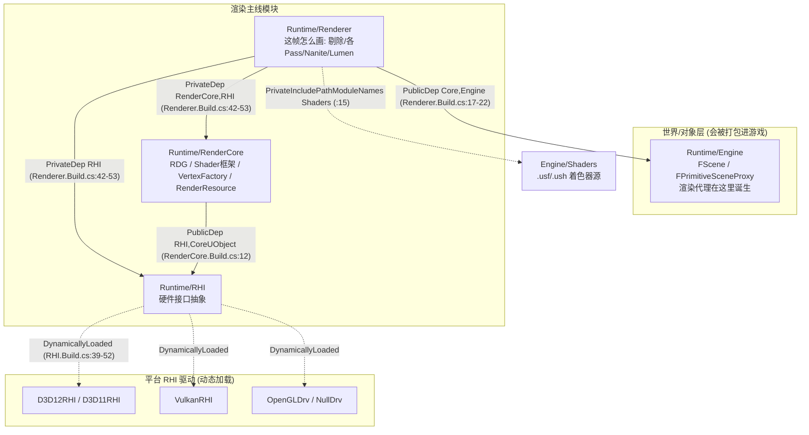
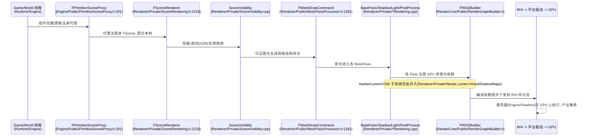
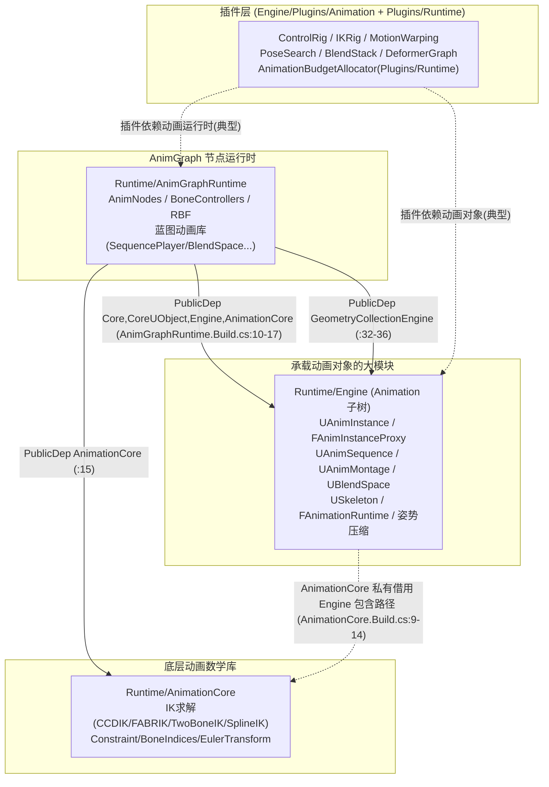
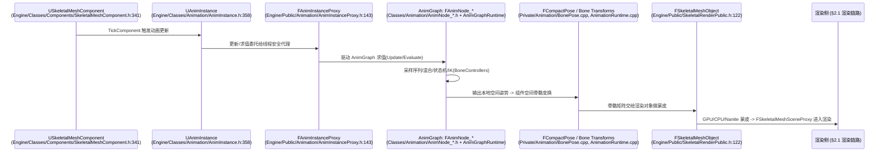

# UE5.8 渲染 × 动画 两条主线源码深入地图（DeepDive）

> 本文档面向 thomas，目标只有一个：在你已经建立"源码层级整体认知"之后，让你在 **渲染** 与 **动画** 两条主线的源码里 **不迷路**——看清模块边界、每帧高层路径、关键类落点，并能从一个具体对象（一个像素 / 一个 Mesh / 一个 Shader / 一个 Nanite 对象；一个 SkeletalMeshComponent / 一个 AnimBlueprint / 一个 AnimNode / 一个 Montage 或 BlendSpace）反查到源码。本文档 **不** 解释任何算法原理或数学推导。
>
> 配套规格见 [`UE58_Rendering_Animation_DeepDive_ChangeSpec.md`](<D:/UE/Docs/UE58_Rendering_Animation_DeepDive_ChangeSpec.md>)。
>
> **证据约定**：标 `【事实】` 的内容由本机目录/文件名/`.Build.cs`/轻量 grep（含 `file:line`）直接验证；标 `【推理】` 的内容是 **逻辑分析推理(无事实依据)**，基于 UE 通用约定推断，未通读实现，需后续读代码确认。
>
> **路径表述约定**：正文与 ASCII 图中提及目录/文件一律用 **完整绝对路径**（Windows 原生反斜杠形式，反引号包裹）；mermaid 图节点为避免节点过长，使用 **以 `D:\UE\5.8.0r\Engine\Source` 为根的模块相对简写**（正斜杠风格），不代表磁盘真实分隔符。

---

## 1. thomas 先读这段：如何用这份文档不迷路

这份文档把渲染与动画各自拆成 **三个尺度**，建议你 **从大到小、够用即止**，不要一上来就读某个 `.cpp`：

1. **先认边界**（§4 渲染边界图 / §6 动画边界图）：先知道这条主线由哪几个模块组成、谁依赖谁。判据来自 `.Build.cs`，是 **事实**。
2. **再走路径**（§5 渲染每帧路径 / §7 动画每帧路径）：知道"一帧里数据从哪流到哪"。这一层多为 **推理**，但每个节点都给了真实源码落点，方便你自己下钻验证。
3. **后查落点**（§8 渲染源码地图 / §9 动画源码地图 / §10、§11 读码路线）：从一个具体对象出发，按"模块 → 目录 → 声明 → 实现"四步定位。

> 速记：**渲染问"这帧怎么画"，动画问"这帧摆什么姿势"；两条线在 `USkeletalMeshComponent` 处交汇（§12）。** 先看边界图建立方向感，再用读码路线做精确跳转。【推理：基于本文结构事实归纳】
>
> 与前两份文档的关系：本文承接 [`UE58_Source_Hierarchy_Orientation.md`](<D:/UE/Docs/UE58_Source_Hierarchy_Orientation.md>) 的"四域/模块/`Public`-`Private`边界"方法论，并复用 [`UE58_Nanite_WorldPartition_HLOD_SourceMap.md`](<D:/UE/Docs/UE58_Nanite_WorldPartition_HLOD_SourceMap.md>) 已建立的 Nanite/GPUScene/RenderGraph 落点（详见 §13 衔接）。

---

## 2. 两条主线 ASCII 总览图

### 2.1 渲染链路（Game → Scene → Renderer → RenderCore → RHI → GPU）

下图只画主干，省略大量同级 Pass（用 `...` 表示）。模块依赖方向由 `.Build.cs` 支撑【事实，见 §4】；每帧数据流为 **推理**【推理】。

```text
[Game/World 线程]                                  [Render 线程 / RHI 线程 / GPU]
D:\UE\5.8.0r\Engine\Source\Runtime\Engine          D:\UE\5.8.0r\Engine\Source\Runtime\Renderer
  UWorld / AActor / UPrimitiveComponent                 FScene (场景的渲染侧镜像)
        |  创建渲染代理                                       |
        v                                                    v
  FPrimitiveSceneProxy  ==(注册进场景)==>            FSceneRenderer / FDeferredShadingSceneRenderer
  (Engine\Public\PrimitiveSceneProxy.h)                     |  剔除 -> 各 Pass
        |                                                    v
        |                                          SceneVisibility -> BasePass -> Shadow -> Light -> PostProcess
        |                                                    |  (Nanite / Lumen / VSM 等子系统在 Private\)
        |                                                    v
        |                                          RenderCore: FRDGBuilder 组装 GPU Pass 依赖图
        |                                          D:\UE\5.8.0r\Engine\Source\Runtime\RenderCore
        |                                                    |
        |                                                    v
        |                                          RHI: 抽象 D3D12 / Vulkan / Metal (动态加载平台驱动)
        |                                          D:\UE\5.8.0r\Engine\Source\Runtime\RHI
        |                                                    |
        +----------------- 着色器来自 --------------> D:\UE\5.8.0r\Engine\Shaders --> GPU 执行
```

### 2.2 动画链路（SkeletalMeshComponent → AnimInstance → AnimGraph → Pose → Evaluation → 交给渲染）

```text
D:\UE\5.8.0r\Engine\Source\Runtime\Engine\Classes\Components\SkeletalMeshComponent.h:341
  USkeletalMeshComponent  (拥有一个动画实例)
        |  TickComponent 触发动画更新
        v
  UAnimInstance  (Engine\Classes\Animation\AnimInstance.h:358, Within=SkeletalMeshComponent)
        |  把求值工作交给线程安全的代理
        v
  FAnimInstanceProxy  (Engine\Public\Animation\AnimInstanceProxy.h:143)
        |  驱动 AnimGraph (一棵 AnimNode 树)
        v
  FAnimNode_*  (Classes\Animation\AnimNode_*.h + AnimGraphRuntime\Public\AnimNodes / BoneControllers)
        |  采样/混合/状态机/IK
        v
  FCompactPose / Bone Transforms  (Private\Animation\BonePose.cpp, AnimationRuntime.cpp)
        |  得到一组骨骼变换 (本地空间 -> 组件空间)
        v
  FSkeletalMeshObject (Engine\Public\SkeletalRenderPublic.h:122)  <== 进入渲染侧 (§12)
  (GPU/CPU/Nanite 蒙皮: Engine\Private\SkeletalRender*.h)
        |
        v
  FSkeletalMeshSceneProxy (Engine\Public\SkeletalMeshSceneProxy.h:21) ==> 与 §2.1 渲染链路汇合
```

---

## 3. 两条主线一句话定位

| 主线 | 起点对象 | 终点 | 核心模块（完整绝对路径） | 证据 |
| --- | --- | --- | --- | --- |
| 渲染 | `FPrimitiveSceneProxy`（场景里一个可画的东西） | GPU 上一帧画面 | `D:\UE\5.8.0r\Engine\Source\Runtime\Renderer` + `...\RenderCore` + `...\RHI` | 【事实，三模块目录与 `.Build.cs` 存在】 |
| 动画 | `USkeletalMeshComponent`（世界里一个带骨架的东西） | 一组骨骼变换/姿势 | `...\Runtime\Engine`（Animation 子树）+ `...\AnimGraphRuntime` + `...\AnimationCore` | 【事实，目录与 `.Build.cs` 存在】 |
| 交界 | `USkeletalMeshComponent` 的姿势 | `FSkeletalMeshSceneProxy` 进入渲染 | `...\Runtime\Engine`（`SkeletalRender*`）+ `...\Renderer\Private\Skinning` | 【事实，类与目录存在；数据流为推理】 |

---

## 4. Mermaid 1：渲染模块边界与依赖图

下图箭头方向 = 依赖方向（A → B 读作"A 依赖 B"），全部由 `.Build.cs` 行号支撑【事实】。



> 读图要点（事实支撑）：
> - `Renderer` **公有** 依赖 `Core`、`Engine`（`D:\UE\5.8.0r\Engine\Source\Runtime\Renderer\Renderer.Build.cs:17-22`）；**私有** 依赖 `CoreUObject`、`ApplicationCore`、`RenderCore`、`ImageWriteQueue`、`RHI`、`MaterialShaderQualitySettings`、`StateStream`、`TraceLog`（`Renderer.Build.cs:42-53`）。【事实】
> - `Renderer` 通过 `PrivateIncludePathModuleNames` 借用 `Shaders` 模块包含路径（`Renderer.Build.cs:15`），并把引擎 `Shaders/Private` 加入私有包含路径（`Renderer.Build.cs:11`）。【事实】
> - `RenderCore` **公有** 依赖 `RHI`、`CoreUObject`（`D:\UE\5.8.0r\Engine\Source\Runtime\RenderCore\RenderCore.Build.cs:12`）。【事实】
> - `RHI` **动态加载** 平台驱动 `D3D11RHI`/`D3D12RHI`（`RHI.Build.cs:39-40`）、`VulkanRHI`（`:46`）、`OpenGLDrv`（`:52`）、`NullDrv`（`:27`）。【事实】
> - 故底座自下而上为 `RHI → RenderCore → Renderer`，而 `Renderer` 又向上挂到 `Engine`。**渲染心脏在 `Renderer`，但它要拿"世界里有什么"必须依赖 `Engine`。**【事实方向 + 推理收敛】

---

## 5. Mermaid 2：渲染每帧高层路径图

下图为 **每帧数据流**，多为 **逻辑分析推理(无事实依据)**【推理】，但每个节点都给了真实源码落点（`file` 或目录）便于验证；与上一份 SourceMap §4 的 Nanite/GPUScene/RDG 连接一致。



> 读图要点：
> - **入口对象是 `FPrimitiveSceneProxy`**，它住在 `Engine` 模块（`D:\UE\5.8.0r\Engine\Source\Runtime\Engine\Public\PrimitiveSceneProxy.h:291`），不是 `Renderer`。这解释了为什么 `Renderer` 必须公有依赖 `Engine`。【事实】
> - **本帧的总指挥是 `FSceneRenderer`**（`D:\UE\5.8.0r\Engine\Source\Runtime\Renderer\Private\SceneRendering.h:2218`），其延迟着色派生类是 `FDeferredShadingSceneRenderer`（`D:\UE\5.8.0r\Engine\Source\Runtime\Renderer\Private\DeferredShadingRenderer.h:260`），移动端是 `FMobileSceneRenderer`（`SceneRendering.h:2957`）。【事实】
> - **绘制的最小单位是 `FMeshDrawCommand`**（`D:\UE\5.8.0r\Engine\Source\Runtime\Renderer\Public\MeshPassProcessor.h:1281`）。【事实】
> - **GPU Pass 的装配仍在 `RenderCore` 的 `FRDGBuilder`**，不在 `Renderer`（与上一份文档 §3.5 一致）。【事实：`RenderGraphBuilder.h` 在 `D:\UE\5.8.0r\Engine\Source\Runtime\RenderCore\Public`】
> - 各节点之间的"喂数据/触发"顺序为 **推理**，需读 `.cpp` 验证。【推理】

---

## 6. Mermaid 3：动画模块边界与依赖图

下图箭头方向 = 依赖方向，由 `.Build.cs` 行号支撑【事实】。



> 读图要点（事实支撑）：
> - `AnimGraphRuntime` **公有** 依赖 `Core`、`CoreUObject`、`Engine`、`AnimationCore`（`D:\UE\5.8.0r\Engine\Source\Runtime\AnimGraphRuntime\AnimGraphRuntime.Build.cs:10-17`），并公有依赖 `GeometryCollectionEngine`（`:32-36`），私有依赖 `TraceLog`（`:19-23`），第三方私有依赖 `Eigen`（`:28-30`）。【事实】
> - `AnimationCore` **公有** 依赖只有 `Core`、`CoreUObject`（`D:\UE\5.8.0r\Engine\Source\Runtime\AnimationCore\AnimationCore.Build.cs:16-21`），并仅以 `PrivateIncludePathModuleNames` 借用 `Engine` 的包含路径（`:9-14`）——所以 `AnimationCore` 是 **不绑大 Engine 的底层数学库**。【事实】
> - 故底座自下而上为 `AnimationCore → Engine(Animation 子树) → AnimGraphRuntime → 插件`。**大量"动画对象"（UAnimInstance/UAnimSequence/UBlendSpace/USkeleton）住在 `Engine` 这个巨型模块里，而不是独立动画模块。**【事实：见 §9】
> - 插件层与下层的依赖为 **推理**（典型方向，未逐插件读 `.uplugin`/`.Build.cs`）。【推理】

---

## 7. Mermaid 4：动画每帧高层路径图

下图为 **每帧数据流**，多为 **逻辑分析推理(无事实依据)**【推理】，节点均给真实源码落点。



> 读图要点：
> - **入口是 `USkeletalMeshComponent`**（`D:\UE\5.8.0r\Engine\Source\Runtime\Engine\Classes\Components\SkeletalMeshComponent.h:341`，继承 `USkinnedMeshComponent`）。【事实】
> - **`UAnimInstance` 被声明为 `Within=SkeletalMeshComponent`**（`D:\UE\5.8.0r\Engine\Source\Runtime\Engine\Classes\Animation\AnimInstance.h:357-358`），即它在语义上"属于"某个骨骼网格组件。【事实】
> - **多线程求值的承担者是 `FAnimInstanceProxy`**（`D:\UE\5.8.0r\Engine\Source\Runtime\Engine\Public\Animation\AnimInstanceProxy.h:143`）。【事实：类型存在；"多线程安全"语义为推理】
> - **姿势/骨骼变换的工具类是 `FAnimationRuntime`**（`D:\UE\5.8.0r\Engine\Source\Runtime\Engine\Public\AnimationRuntime.h:195`，实现 `D:\UE\5.8.0r\Engine\Source\Runtime\Engine\Private\Animation\AnimationRuntime.cpp`）。【事实】
> - 节点间触发顺序（Update 先于 Evaluate、代理回写组件等）为 **推理**，需读 `.cpp` 验证。【推理】

---

## 8. 渲染源码地图：职责边界

### 8.1 模块级落点（事实）

| 模块（完整绝对路径） | 一句话职责 | 结构实测 | 证据 |
| --- | --- | --- | --- |
| `D:\UE\5.8.0r\Engine\Source\Runtime\Renderer` | "这帧怎么画"：剔除、各 Pass、Nanite/Lumen 等 | `Internal/`、`Private/`、`Public/`、`Renderer.Build.cs`（无 `Classes/`） | 【事实】 |
| `D:\UE\5.8.0r\Engine\Source\Runtime\RenderCore` | 渲染基础设施：RDG、Shader 框架、VertexFactory、RenderResource | `Internal/`、`Private/`、`Public/`、`RenderCore.Build.cs`、`RenderCore.natvis` | 【事实】 |
| `D:\UE\5.8.0r\Engine\Source\Runtime\RHI` | 渲染硬件接口：抽象 D3D12/Vulkan/Metal，动态加载平台驱动 | `Internal/`、`Private/`、`Public/`、`RHI.Build.cs` | 【事实】 |
| `D:\UE\5.8.0r\Engine\Source\Runtime\Engine`（渲染入口部分） | 渲染代理诞生地：`FPrimitiveSceneProxy`、`FMeshBatch`、`FSceneInterface` | 渲染相关头多在 `Engine\Public` | 【事实】 |
| `D:\UE\5.8.0r\Engine\Shaders` | 着色器源码根 | `Private/`、`Public/`、`Shared/`、`StandaloneRenderer/`、`Shaders.Build.cs` | 【事实】 |

> 体量对比（佐证"实现多在 `Private`"）：`D:\UE\5.8.0r\Engine\Source\Runtime\Renderer\Private` 实测 285 条目，`...\Renderer\Public` 实测 47 条目，`D:\UE\5.8.0r\Engine\Source\Runtime\RenderCore\Public` 实测 110 条目。【事实】

### 8.2 `Renderer\Private` 子系统目录/文件（事实存在，职责为推理）

落点根：`D:\UE\5.8.0r\Engine\Source\Runtime\Renderer\Private`。【事实，目录/文件名实测】

- **场景与剔除**：[`SceneRendering.cpp/.h`](<D:/UE/5.8.0r/Engine/Source/Runtime/Renderer/Private/SceneRendering.h>)（`FSceneRenderer`）、`SceneVisibility.cpp`、`SceneOcclusion.cpp`、`GPUScene.cpp/.h`、`SceneCulling/`、`InstanceCulling/`、[`HZB.cpp/.h`](<D:/UE/5.8.0r/Engine/Source/Runtime/Renderer/Private/HZB.h>)。
- **绘制命令**：[`MeshPassProcessor.cpp`](<D:/UE/5.8.0r/Engine/Source/Runtime/Renderer/Private/MeshPassProcessor.cpp>)、`MeshDrawCommands.cpp`、`StaticMeshBatch.cpp`、`SimpleMeshDrawCommandPass.cpp`。
- **延迟着色主管线**：[`DeferredShadingRenderer.cpp/.h`](<D:/UE/5.8.0r/Engine/Source/Runtime/Renderer/Private/DeferredShadingRenderer.h>)、`BasePassRendering.cpp`、`ClusteredDeferredShadingPass.cpp`、`MobileShadingRenderer.cpp`（移动端）。
- **光照/阴影**：`LightRendering.cpp`、`ShadowRendering.cpp`、`ShadowDepthRendering.cpp`、`ShadowSetup.cpp`、`Shadows/`、`VirtualShadowMaps/`、`CapsuleShadowRendering.cpp`。
- **GI/反射/大特性**：`Lumen/`、`MegaLights/`、`ReflectionEnvironment.cpp`、`ScreenSpaceRayTracing.cpp`、`Substrate/`（材质）、`HairStrands/`、`HeterogeneousVolumes/`、`VolumetricCloudRendering.cpp`。
- **Nanite 与光追**：`Nanite/`（与 SourceMap §3.1 同一目录）、`RayTracing/`、`PathTracing.cpp`。
- **后处理与其它**：`PostProcess/`、`TranslucentRendering.cpp`、`VelocityRendering.cpp`、`VT/`（虚拟纹理）、`VariableRateShading/`、`Skinning/`（渲染侧蒙皮计算，见 §12）。

### 8.3 `RenderCore\Public` 关键头（事实存在）

落点根：`D:\UE\5.8.0r\Engine\Source\Runtime\RenderCore\Public`。【事实】

- **RenderGraph(RDG)**：[`RenderGraphBuilder.h`](<D:/UE/5.8.0r/Engine/Source/Runtime/RenderCore/Public/RenderGraphBuilder.h>)、`RenderGraph.h`、`RenderGraphResources.h`、`RenderGraphPass.h`、`RenderGraphUtils.h`、`RenderGraphDefinitions.h`。
- **Shader 框架**：`Shader.h`、`GlobalShader.h`、`ShaderCore.h`、`ShaderParameterMacros.h`、`ShaderParameterStruct.h`、`ShaderPermutation.h`、`ShaderPipelineCache.h`。
- **资源与顶点**：`RenderResource.h`、`VertexFactory.h`、`VertexStreamComponent.h`、`UniformBuffer.h`、`PixelShaderUtils.h`、`CommonRenderResources.h`。
- **线程与接口**：`RenderingThread.h`、`RendererInterface.h`、`RenderCommandFence.h`。

> 易错点（与已有文档一致）：**RDG 的 `FRDGBuilder` 在 `RenderCore`，不在 `Renderer`。** 找它去 `D:\UE\5.8.0r\Engine\Source\Runtime\RenderCore\Public\RenderGraphBuilder.h`。【事实】

---

## 9. 动画源码地图：职责边界

### 9.1 模块/目录级落点（事实）

| 落点（完整绝对路径） | 一句话职责 | 结构实测 | 证据 |
| --- | --- | --- | --- |
| `D:\UE\5.8.0r\Engine\Source\Runtime\Engine\Classes\Animation` | 动画 **UObject 资产/对象** 头：`UAnimInstance`、`UAnimSequence`、`UAnimMontage`、`UBlendSpace`、`USkeleton`、`UAnimBlueprint` 等 | 99 条目（含 `AnimData/`、`AnimNotifies/`） | 【事实】 |
| `D:\UE\5.8.0r\Engine\Source\Runtime\Engine\Public\Animation` | 动画 **运行时数据/契约** 头：`FAnimInstanceProxy`、`AttributesRuntime`、`BoneReference`、`PoseSnapshot`、`AnimSubsystem*`、`MotionTrajectoryTypes` | 76 条目 | 【事实】 |
| `D:\UE\5.8.0r\Engine\Source\Runtime\Engine\Private\Animation` | 动画 **核心实现**：`AnimInstance.cpp`、`AnimInstanceProxy.cpp`、`AnimationRuntime.cpp`、`AnimNode_*.cpp`、姿势压缩 `AnimEncoding*.cpp` | 184 条目（含 `AnimData/`） | 【事实】 |
| `D:\UE\5.8.0r\Engine\Source\Runtime\AnimGraphRuntime` | **AnimNode 运行时**：`AnimNodes/`、`BoneControllers/`、`RBF/` 与蓝图动画库 | `Public/`、`Private/`、`AnimGraphRuntime.Build.cs` | 【事实】 |
| `D:\UE\5.8.0r\Engine\Source\Runtime\AnimationCore` | **底层动画数学库**：IK 求解、约束、骨骼索引/权重、变换类型 | `Public/`、`Private/`、`AnimationCore.Build.cs` | 【事实】 |
| `D:\UE\5.8.0r\Engine\Plugins\Runtime\AnimationBudgetAllocator` | **动画预算分配器**（运行时插件，非引擎源码模块） | `Source\AnimationBudgetAllocator\AnimationBudgetAllocator.Build.cs` | 【事实，路径实测】 |
| `D:\UE\5.8.0r\Engine\Plugins\Animation` | 动画 **插件群**：ControlRig、IKRig、MotionWarping、PoseSearch 等 | 34 个插件目录 | 【事实】 |

> **重要纠正（任务原假设）**：本任务清单把 AnimationBudgetAllocator 列在 `D:\UE\5.8.0r\Engine\Source\Runtime\AnimationBudgetAllocator`，但该路径 **实测不存在**。它实际是一个 **运行时插件**，落点为 `D:\UE\5.8.0r\Engine\Plugins\Runtime\AnimationBudgetAllocator\Source\AnimationBudgetAllocator\AnimationBudgetAllocator.Build.cs`。【事实，glob 命中】

### 9.2 `Engine\Classes\Animation` 关键资产头（事实存在）

落点根：`D:\UE\5.8.0r\Engine\Source\Runtime\Engine\Classes\Animation`。【事实】

- **动画实例/蓝图**：[`AnimInstance.h`](<D:/UE/5.8.0r/Engine/Source/Runtime/Engine/Classes/Animation/AnimInstance.h>)（`UAnimInstance:358`）、`AnimBlueprint.h`（`:80`）、`AnimBlueprintGeneratedClass.h`、`AnimClassInterface.h`、`AnimSingleNodeInstance.h`。
- **动画资产**：`AnimSequence.h`（`UAnimSequence:201`）、`AnimSequenceBase.h`、`AnimMontage.h`（`:634`）、`AnimComposite.h`、`PoseAsset.h`、`AnimStreamable.h`。
- **混合空间**：`BlendSpace.h`、`BlendSpace1D.h`、`AimOffsetBlendSpace.h`、`AimOffsetBlendSpace1D.h`、`BlendProfile.h`。
- **骨架/镜像**：`Skeleton.h`、`MirrorDataTable.h`、`MorphTarget.h`、`SmartName.h`。
- **AnimNode 头（声明）**：`AnimNodeBase.h`、`AnimNode_StateMachine.h`、`AnimNode_SequencePlayer.h`、`AnimNode_Inertialization.h`、`AnimNode_LinkedAnimGraph.h`、`AnimNode_LinkedAnimLayer.h`、`AnimNode_SaveCachedPose.h`。
- **姿势压缩配置**：`AnimCompress*.h`、`AnimBoneCompressionCodec.h`、`AnimCurveCompression*.h`。

### 9.3 `AnimGraphRuntime\Public` 与 `AnimationCore\Public`（事实存在）

- `D:\UE\5.8.0r\Engine\Source\Runtime\AnimGraphRuntime\Public`（29 条目）：`AnimNodes/`、`BoneControllers/`、`RBF/`、`AnimNotifies/`，以及蓝图动画库 `SequencePlayerLibrary.h`、`SequenceEvaluatorLibrary.h`、`BlendSpaceLibrary.h`、`SkeletalControlLibrary.h`、`KismetAnimationLibrary.h`、`MirrorAnimLibrary.h`、`LayeredBoneBlendLibrary.h`，以及 Sequencer 接入 `AnimSequencerInstance.h`、`PlayMontageCallbackProxy.h`。【事实】
- `D:\UE\5.8.0r\Engine\Source\Runtime\AnimationCore\Public`（17 条目）：IK 求解 `CCDIK.h`、`FABRIK.h`、`TwoBoneIK.h`、`SplineIK.h`、`SoftIK.h`，约束 `Constraint.h`、`AngularLimit.h`，骨骼 `BoneIndices.h`、`BoneWeights.h`，变换 `EulerTransform.h`、`TransformNoScale.h`，库入口 `AnimationCoreLibrary.h`。【事实】

> 读图要点：**"AnimNode 的声明"在 `Engine\Classes\Animation`（如 `AnimNode_StateMachine.h`），但"更多可复用 AnimNode 与骨骼控制器（IK 节点等）的实现"在 `AnimGraphRuntime`；最底层的 IK 数学求解在 `AnimationCore`。** 三层各司其职。【事实：目录归属；分层语义为推理】

### 9.4 `Engine\Plugins\Animation` 插件群（事实存在，34 个）

落点根：`D:\UE\5.8.0r\Engine\Plugins\Animation`。代表性插件【事实，目录名实测】：`ControlRig/`、`ControlRigModules/`、`ControlRigSpline/`、`IKRig/`、`MotionWarping/`、`PoseSearch/`、`BlendStack/`、`AnimationWarping/`、`AnimationLocomotionLibrary/`、`AnimationModifierLibrary/`、`DeformerGraph/`、`MLDeformer/`、`ACLPlugin/`、`RigLogic/`、`AudioDrivenAnimation/`、`PhysicsControl/`、`LiveLink/`（及 LiveLink* 家族）、`SkeletalMeshModelingTools/`、`AnimToTexture/`、`AnimatorKit/`。

> 与 `D:\UE\AnimationSamples` 的衔接（事实+推理）：该示例项目（见 `D:\UE\AGENTS.md`）启用的 AnimationWarping、MotionWarping、PoseSearch 等插件，与上述引擎插件目录 **同名对应**【事实：同名目录存在】；其使用的 Chooser、Mover 插件本次 **未在 `Engine\Plugins\Animation` 命中确切落点**，可能在 `Engine\Plugins` 其它子目录，故 **不声明其确切路径**【推理/未验证】。本文档只做"存在与衔接"提示，不修改 `D:\UE\AnimationSamples` 任何文件。

---

## 10. 渲染读码路线：从一个具体东西反查源码

> 通用四步（承接 `UE58_Source_Hierarchy_Orientation.md` §11）：**定模块 → 定声明（`Public`/`Classes`）→ 定实现（`Private`）→ 定依赖（`.Build.cs`）**。下面是四个起点的具体跳转。

1. **从"屏幕上的一个像素"**：
   - 先到本帧总指挥 `FSceneRenderer`：`D:\UE\5.8.0r\Engine\Source\Runtime\Renderer\Private\SceneRendering.h:2218`（延迟管线看 `DeferredShadingRenderer.h:260`）。【事实】
   - 像素由某个 Pass 写出 → 读 `D:\UE\5.8.0r\Engine\Source\Runtime\Renderer\Private` 下对应 `*Rendering.cpp`（`BasePassRendering.cpp`/`LightRendering.cpp`/`PostProcess/`）。【事实：文件存在】
   - 该 Pass 的 GPU 资源在哪组装 → 读 `D:\UE\5.8.0r\Engine\Source\Runtime\RenderCore\Public\RenderGraphBuilder.h`。【事实】

2. **从"一个 Mesh（可画图元）"**：
   - 它的渲染身份是 `FPrimitiveSceneProxy`：`D:\UE\5.8.0r\Engine\Source\Runtime\Engine\Public\PrimitiveSceneProxy.h:291`（注意在 `Engine` 模块）。【事实】
   - 它产出的绘制单位是 `FMeshDrawCommand`：`D:\UE\5.8.0r\Engine\Source\Runtime\Renderer\Public\MeshPassProcessor.h:1281`。【事实】
   - 命令如何被生成/排序 → 读 `D:\UE\5.8.0r\Engine\Source\Runtime\Renderer\Private\MeshPassProcessor.cpp`、`MeshDrawCommands.cpp`。【事实：文件存在】

3. **从"一个 Shader"**：
   - 框架类型 `FShader`/`FGlobalShader` → `D:\UE\5.8.0r\Engine\Source\Runtime\RenderCore\Public\Shader.h`、`GlobalShader.h`。【事实】
   - 参数绑定宏 → `D:\UE\5.8.0r\Engine\Source\Runtime\RenderCore\Public\ShaderParameterMacros.h`、`ShaderParameterStruct.h`。【事实】
   - 着色器源码 → `D:\UE\5.8.0r\Engine\Shaders`（`Private/`、`Public/`、`Shared/`）。【事实：顶层目录存在；不在本文展开】

4. **从"一个 Nanite 对象"**：
   - 直接到 `D:\UE\5.8.0r\Engine\Source\Runtime\Renderer\Private\Nanite`（与 `UE58_Nanite_WorldPartition_HLOD_SourceMap.md` §3.1 同一目录，心脏文件 `NaniteCullRaster.cpp/.h`）。【事实】
   - 实例数据来源 `GPUScene` → `D:\UE\5.8.0r\Engine\Source\Runtime\Renderer\Private\GPUScene.h`。【事实】
   - 不要在 `Renderer\Public` 找 Nanite 实现——它在 `Private`。【事实：体量对比 §8.1】

---

## 11. 动画读码路线：从一个具体东西反查源码

1. **从"一个 SkeletalMeshComponent"**：
   - 声明：`D:\UE\5.8.0r\Engine\Source\Runtime\Engine\Classes\Components\SkeletalMeshComponent.h:341`（继承 `USkinnedMeshComponent`）。【事实】
   - 它持有的动画实例是 `UAnimInstance`：`D:\UE\5.8.0r\Engine\Source\Runtime\Engine\Classes\Animation\AnimInstance.h:358`。【事实】
   - 实现去 `D:\UE\5.8.0r\Engine\Source\Runtime\Engine\Private\Animation\AnimInstance.cpp` 与组件实现（`SkeletalMeshComponent*.cpp` 在 `Engine\Private`）。【事实：`AnimInstance.cpp` 存在】

2. **从"一个 AnimBlueprint"**：
   - 资产/类：`D:\UE\5.8.0r\Engine\Source\Runtime\Engine\Classes\Animation\AnimBlueprint.h:80`、`AnimBlueprintGeneratedClass.h`、`AnimClassInterface.h`。【事实】
   - 运行时由 `UAnimInstance` + `FAnimInstanceProxy`（`D:\UE\5.8.0r\Engine\Source\Runtime\Engine\Public\Animation\AnimInstanceProxy.h:143`）驱动其 AnimGraph。【事实】
   - 注：AnimBlueprint 的 **编辑器编译** 不在本主线（属 `Editor` 域，参见 Orientation 文档 §5）。【推理：基于域划分】

3. **从"一个 AnimNode"**：
   - 节点基类声明 `D:\UE\5.8.0r\Engine\Source\Runtime\Engine\Classes\Animation\AnimNodeBase.h`；具体节点声明如 `AnimNode_StateMachine.h`、`AnimNode_SequencePlayer.h`（同目录）。【事实】
   - 实现去 `D:\UE\5.8.0r\Engine\Source\Runtime\Engine\Private\Animation\AnimNode_*.cpp`。【事实：文件存在】
   - 更多可复用节点与 **骨骼控制器/IK 节点** 在 `D:\UE\5.8.0r\Engine\Source\Runtime\AnimGraphRuntime\Public\BoneControllers`、`AnimNodes`、`RBF`；底层 IK 数学在 `D:\UE\5.8.0r\Engine\Source\Runtime\AnimationCore\Public`（`TwoBoneIK.h`/`FABRIK.h`/`CCDIK.h`）。【事实】

4. **从"一个 Montage 或 BlendSpace"**：
   - Montage：声明 `D:\UE\5.8.0r\Engine\Source\Runtime\Engine\Classes\Animation\AnimMontage.h:634`，实现 `D:\UE\5.8.0r\Engine\Source\Runtime\Engine\Private\Animation\AnimMontage.cpp`。【事实】
   - BlendSpace：声明 `D:\UE\5.8.0r\Engine\Source\Runtime\Engine\Classes\Animation\BlendSpace.h`，实现 `D:\UE\5.8.0r\Engine\Source\Runtime\Engine\Private\Animation\BlendSpace.cpp`（辅助 `BlendSpaceHelpers.cpp`/`BlendSpaceUtilities.cpp`）。【事实】
   - 姿势/骨骼变换工具统一看 `D:\UE\5.8.0r\Engine\Source\Runtime\Engine\Public\AnimationRuntime.h:195`（`FAnimationRuntime`）。【事实】

---

## 12. 渲染与动画的交界：SkeletalMesh 如何走向渲染侧

这是两条主线唯一必须打通的地方。下面 **分清事实与推理**。

**事实链（类型与落点已验证）**：

- `USkeletalMeshComponent`（`D:\UE\5.8.0r\Engine\Source\Runtime\Engine\Classes\Components\SkeletalMeshComponent.h:341`）继承 `USkinnedMeshComponent`。【事实】
- `UAnimInstance`（`...\Classes\Animation\AnimInstance.h:358`）的 `UCLASS` 标注 `Within=SkeletalMeshComponent`（`AnimInstance.h:357`）。【事实】
- 渲染侧的骨骼网格表示是 `FSkeletalMeshObject`（基类，`D:\UE\5.8.0r\Engine\Source\Runtime\Engine\Public\SkeletalRenderPublic.h:122`，继承 `FDeferredCleanupInterface`），三类蒙皮实现都在 `Engine\Private`：【事实】
  - GPU 蒙皮 `FSkeletalMeshObjectGPUSkin`：`D:\UE\5.8.0r\Engine\Source\Runtime\Engine\Private\SkeletalRenderGPUSkin.h:375`
  - CPU 蒙皮 `FSkeletalMeshObjectCPUSkin`：`D:\UE\5.8.0r\Engine\Source\Runtime\Engine\Private\SkeletalRenderCPUSkin.h:86`
  - Nanite 蒙皮 `FSkeletalMeshObjectNanite`：`D:\UE\5.8.0r\Engine\Source\Runtime\Engine\Private\SkeletalRenderNanite.h:86`
  - 静态 `FSkeletalMeshObjectStatic`：`D:\UE\5.8.0r\Engine\Source\Runtime\Engine\Private\SkeletalRenderStatic.h:22`
- 骨骼网格的渲染代理是 `FSkeletalMeshSceneProxy`（`D:\UE\5.8.0r\Engine\Source\Runtime\Engine\Public\SkeletalMeshSceneProxy.h:21`），它是 §10 所述 `FPrimitiveSceneProxy` 家族成员，被 `Renderer` 消费。【事实：类存在；"是 FPrimitiveSceneProxy 派生"为推理】
- GPU 蒙皮缓存在 `D:\UE\5.8.0r\Engine\Source\Runtime\Engine\Public\GPUSkinCache.h`（引用 `FSkeletalMeshObjectGPUSkin`）；渲染器侧另有 `D:\UE\5.8.0r\Engine\Source\Runtime\Renderer\Private\Skinning` 目录。【事实：文件/目录存在】

**推理链（数据流，未读 `.cpp` 验证）**：

- `USkeletalMeshComponent` 每帧 Tick 触发 `UAnimInstance`/`FAnimInstanceProxy` 求值 AnimGraph，得到一组骨骼变换（姿势）。【推理】
- 这组骨骼变换被交给 `FSkeletalMeshObject`，由其按 GPU/CPU/Nanite 路径完成蒙皮（顶点变形）。【推理】
- 蒙皮后的几何经 `FSkeletalMeshSceneProxy` 以 `FPrimitiveSceneProxy` 身份注册进 `FScene`，随后并入 §5 渲染每帧路径（剔除 → MeshDrawCommand → Pass → RDG → RHI → GPU）。【推理】

> 一句话总结：**动画主线产出"骨骼摆成什么姿势"，交界层（`FSkeletalMeshObject` 蒙皮 + `FSkeletalMeshSceneProxy` 代理）把它翻译成"渲染器能画的图元"，再进入渲染主线。** 类型与落点是事实；逐步触发顺序是推理。【事实+推理已分别标注】

```mermaid
flowchart LR
    AI["UAnimInstance / FAnimInstanceProxy<br/>(动画主线产出姿势)"]
    POSE["骨骼变换 / 姿势<br/>(Private/Animation)"]
    SKO["FSkeletalMeshObject 家族<br/>(Engine/Public/SkeletalRenderPublic.h:122<br/>+ Private/SkeletalRender*.h 蒙皮)"]
    PROXY["FSkeletalMeshSceneProxy<br/>(Engine/Public/SkeletalMeshSceneProxy.h:21)"]
    SCENE["FScene / FSceneRenderer<br/>(渲染主线 §5)"]

    AI -->|"Update/Evaluate (推理)"| POSE
    POSE -->|"骨骼矩阵交付 (推理)"| SKO
    SKO -->|"产出可渲染几何 (推理)"| PROXY
    PROXY -->|"作为 FPrimitiveSceneProxy 注册 (推理)"| SCENE
```



---

## 13. 与已有文档的衔接

本文是渲染/动画两条主线的"中等深度地图层"，处在已有两份文档之间并向两侧挂接：

- 承接 [`UE58_Source_Hierarchy_Orientation.md`](<D:/UE/Docs/UE58_Source_Hierarchy_Orientation.md>)（整体认知层）：
  - 复用其"四域 → 模块 → `Public`/`Private`/`Classes` 边界 → `.Build.cs` 依赖"的定位方法论（其 §5–§11）。
  - 口径一致性（已核对）：`Runtime\Engine`="世界里有什么"、`Runtime\Renderer`="这帧怎么画"、`Public`=门面/`Private`=厨房、`RDG` 在 `RenderCore`、`F` 前缀=普通结构体——本文与其 **完全一致**。
- 承接 [`UE58_Nanite_WorldPartition_HLOD_SourceMap.md`](<D:/UE/Docs/UE58_Nanite_WorldPartition_HLOD_SourceMap.md>)（子系统层）：
  - 本文 §5、§8.2、§10 提到的 `Nanite/`、`GPUScene`、`SceneCulling/`、`InstanceCulling/`、`HZB`、`RenderGraph` 落点，与该文档 §3、§4 完全相同；本文不重复其内部链路，只把它们放回"渲染每帧路径"的位置。
- 推荐阅读顺序：**Orientation（建立层级认知）→ 本文（建立渲染/动画两条主线认知）→ SourceMap（切入 Nanite/大世界具体链路）**。

---

## 14. 阿卡姆剃刀检查：哪些故意不展开，为什么

- **是否必须跨项目完成？** 否。本文只读 `D:\UE\5.8.0r\Engine\Source` 与 `D:\UE\5.8.0r\Engine\Plugins` 结构，未触碰 `D:\UE\AnimationSamples`/`D:\UE\ProjectTitan`/`D:\UE\tutorial` 任何文件。
- **故意不展开 `Engine\Shaders` 内部**：着色器源码量极大且不是"在源码里不迷路"的主干，只给顶层四目录说明。
- **故意不展开 `Engine\Plugins\Animation` 各插件内部**：34 个插件各自是独立子系统，本文只给"存在与代表名"，避免膨胀成百科。
- **故意不重复 Nanite/WorldPartition/HLOD 内部链路**：已由 SourceMap 覆盖，本文只做落点引用。
- **故意不解释算法**：如 Nanite 簇剔除、姿势压缩编码、IK 求解推导，均超出"地图与读码路线"目标。
- **抽象是否被真实需求证明？** 4 张 mermaid（渲染边界/渲染路径/动画边界/动画路径）+ 2 张 ASCII（两条链路）+ 1 张交界图，各自对应一个真实困惑点，无冗余。

---

## 15. 局限性与潜在风险提示

- **本研究只看目录名、文件名、`.Build.cs` 与少量 `file:line` grep，未通读任何实现**。§5、§7、§12 的每帧数据流与触发顺序多为 **逻辑分析推理(无事实依据)**，需读 `.cpp` 验证后才能当结论用。
- **模块/目录/文件职责描述部分基于命名与目录结构推断**，文件名与真实职责可能不完全一致（例如把 `Renderer\Private\Skinning` 直接判为"渲染侧蒙皮计算"仅按命名推测，未读码确认其与 `FSkeletalMeshObjectGPUSkin` 的调用关系）。
- **AnimationBudgetAllocator 的落点已纠正为插件**（`D:\UE\5.8.0r\Engine\Plugins\Runtime\AnimationBudgetAllocator`），任务清单原假设的 `Runtime\AnimationBudgetAllocator` 路径不存在；其 `.Build.cs` 内部依赖本文未展开。
- **Chooser、Mover 在引擎插件树内的确切落点未验证**：`D:\UE\AnimationSamples` 使用它们，但本文只在 `Engine\Plugins\Animation` 命中了 AnimationWarping/MotionWarping/PoseSearch 等同名目录，未确认 Chooser/Mover 路径，故不声明。
- **`FSkeletalMeshSceneProxy` 是否直接派生自 `FPrimitiveSceneProxy`、各 `FSkeletalMeshObject` 子类的具体职责分工** 等继承/调用关系本文按命名与同目录关系推断，未逐一读码。
- **绝对路径绑定本机 `D:\UE\5.8.0r` 布局**：换机或换引擎版本即失效。文档里的机器绝对路径 **只是"本机定位路径"，不是可复用配置**；在引擎/项目 **代码内** 引用其它模块时，应使用 **模块相对包含路径**（如 `#include "MeshPassProcessor.h"`、`#include "Animation/AnimInstanceProxy.h"`，由 `.Build.cs` 的依赖与包含路径解析）或 **Unreal 路径 API**（如 `FPaths`、`IPluginManager`、`$(EngineDir)`），不得硬编码 `D:\UE\...` 绝对路径。这是为满足 thomas"完整绝对路径"硬性要求与"不硬编码绝对路径"通用准则之间的取舍，特此声明。
- **未触达** 凭据、会话、个人配置、压缩包（`D:\UE\UnrealEngine-5.8.0-release.zip`）与生成产物（`Binaries`、`Intermediate`、`DerivedDataCache`、`Saved`、`Generated`）；范围外文件未读取，未修改任何引擎源码，未覆盖已有四份文档。
