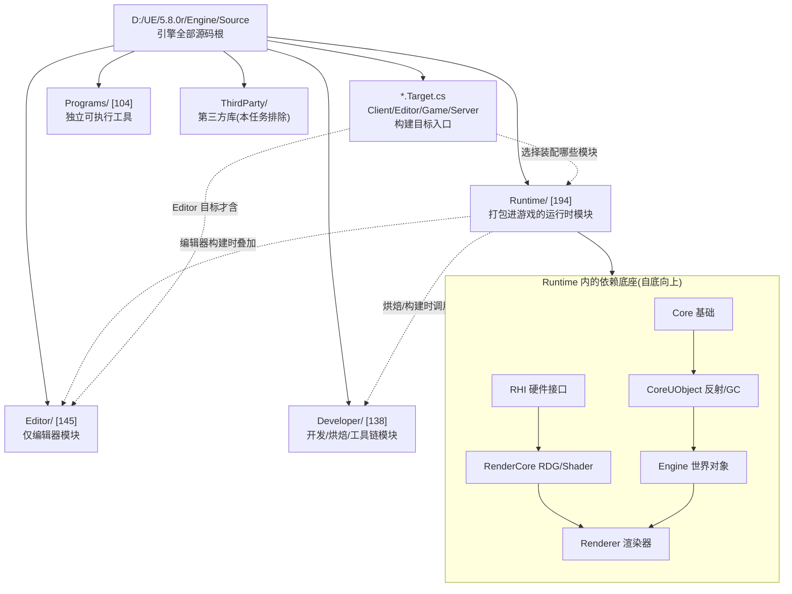
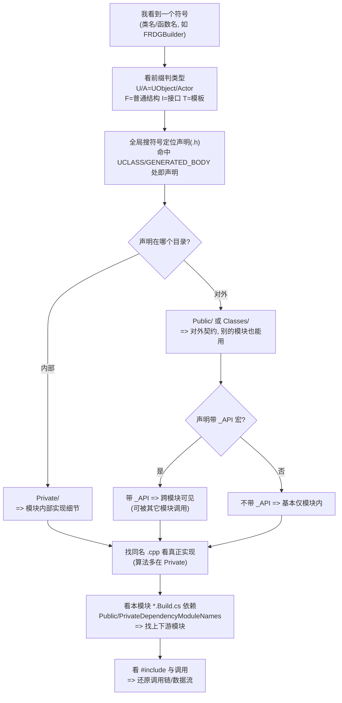

# UE5.8 源码层级结构整体认知（Orientation Map）

> 本文档面向 thomas，目标只有一个：让你在 **不通读引擎全量代码** 的前提下，先看清 Unreal Engine 5.8 源码的 **层级结构整体认知**，做到"在源码里不迷路"。本文档 **不** 深入任何一条 Nanite / WorldPartition / HLOD 实现链路——那部分见衔接文档（见第 12 节）。
>
> 配套规格见 [`UE58_Source_Hierarchy_Orientation_ChangeSpec.md`](<D:/UE/Docs/UE58_Source_Hierarchy_Orientation_ChangeSpec.md>)。
>
> **证据约定**：标 `【事实】` 的内容由本机目录/文件名/`.Build.cs`/轻量 grep 直接验证；标 `【推理】` 的内容是 **逻辑分析推理(无事实依据)**，基于 UE 通用约定推断，未通读实现，需后续读代码确认。
>
> **路径表述约定**：正文与 ASCII 图中提及目录/文件一律用 **完整绝对路径**（Windows 原生反斜杠形式，反引号包裹）；mermaid 图节点为避免节点过长，使用 **以 `D:\UE\5.8.0r\Engine\Source` 为根的模块相对简写**（正斜杠风格），不代表磁盘真实分隔符。

---

## 1. thomas 先读这段：怎么使用这张地图

这张地图的用法，是 **从外向内三步收敛**，不要一上来就读 `.cpp`：

1. **先定域**：任何源码先归到四类源码域之一——`Runtime`（进游戏）、`Developer`（工具链）、`Editor`（仅编辑器）、`Programs`（独立程序）。判断你关心的代码"会不会被打进游戏包"，方向就不会错。
2. **再定模块**：在域里找到模块（一个带 `*.Build.cs` 的目录就是一个模块）。模块是 UE 的编译与依赖单元。
3. **后定边界**：在模块里用 `Public` / `Private` / `Classes` 区分"对外契约"与"内部实现"，用 `.Build.cs` 看它依赖谁。

> 速记：**先问"进不进游戏包"（域）→ 再问"哪个 `.Build.cs` 管它"（模块）→ 最后问"在 Public 还是 Private"（边界）。** 三问之后你就不会迷路。【推理：基于本文给出的结构事实归纳】

---

## 2. 一句话总览：`Engine\Source` 是什么

`D:\UE\5.8.0r\Engine\Source` 是 **Unreal Engine 5.8 引擎本体的全部 C++/C# 源码根**。它的直接下属只有 5 个目录加 4 个构建目标文件：【事实，目录已列举】

- `D:\UE\5.8.0r\Engine\Source\Runtime`、`...\Developer`、`...\Editor`、`...\Programs`、`...\ThirdParty`
- `UnrealClient.Target.cs`、`UnrealEditor.Target.cs`、`UnrealGame.Target.cs`、`UnrealServer.Target.cs`

其中 `*.Target.cs` 定义"最终要构建出哪种程序"（客户端/编辑器/游戏/服务器），是 **构建入口**；四个域目录装的是 **构成这些程序的模块**。【推理：基于 UBT 通用约定，`*.Target.cs` 名称即目标类型】

---

## 3. ASCII 顶层地图（核心分支）

下图只画 thomas 当前需要的核心分支，省略大量同级模块（用 `...` 表示）。条目数为本机实测。【事实】

```text
D:\UE\5.8.0r\Engine\Source
|
+-- Runtime\        运行时模块: 会被打包进游戏          [194 条目]  <== 主战场
|     +-- Core\            最底层: 容器/数学/字符串/平台抽象
|     +-- CoreUObject\     UObject 系统: 反射/GC/序列化/类型
|     +-- Engine\          "世界里有什么": Actor/World/关卡/WorldPartition/HLOD  (含 Classes\)
|     +-- RenderCore\      渲染基础设施: RenderGraph(RDG)/Shader 框架
|     +-- Renderer\        "这帧怎么画": 剔除/光栅/各种 Pass   (实现几乎全在 Private\)
|     +-- RHI\             渲染硬件接口: 抽象 D3D12/Vulkan/Metal
|     +-- SlateCore\ Slate\ UMG\   UI 框架(C++ 与控件)
|     +-- ... (Net\ AudioMixer\ PhysicsCore\ NavigationSystem\ MovieScene\ 等)
|
+-- Developer\      开发/烘焙/工具链模块                 [138 条目]
|     +-- NaniteBuilder\ MeshUtilities\ TargetPlatform\ ShaderCompilerCommon\
|     +-- HierarchicalLODUtilities\ TraceServices\ DerivedDataCache\ ...
|
+-- Editor\         仅编辑器模块: 不进游戏运行时          [145 条目]
|     +-- UnrealEd\ LevelEditor\ MaterialEditor\ WorldPartitionEditor\
|     +-- DataLayerEditor\ Kismet\ BlueprintGraph\ Persona\ Sequencer\ ...
|
+-- Programs\       独立可执行工具: 各自带 .Target.cs     [104 条目]
|     +-- UnrealBuildTool\ ShaderCompileWorker\ UnrealPak\ UnrealLightmass\
|     +-- UnrealInsights\ CrashReportClient\ AutomationTool\ LiveLinkHub\ ...
|
+-- ThirdParty\     第三方库(本任务只排除说明, 不进入内容)
|
+-- UnrealClient.Target.cs   UnrealEditor.Target.cs
+-- UnrealGame.Target.cs     UnrealServer.Target.cs   <== .Target.cs 定义"构建出什么程序"
```

> 读图要点：**真正"引擎运行时"的代码集中在 `Runtime\`，这是 thomas 90% 时间会待的地方**；`Developer\` 是给工具/烘焙用的，`Editor\` 只在编辑器里活，`Programs\` 是一个个独立 exe。【推理：基于域命名与 UBT 约定】

---

## 4. Mermaid 1：`Engine\Source` 分层图



> 关键事实支撑：`Renderer` 公有依赖 `Core`、`Engine`，私有依赖 `RenderCore`、`RHI` 等（见第 7 节 `.Build.cs` 证据）。所以图中 `Engine → Renderer`、`RenderCore → Renderer` 的箭头是 **有 `.Build.cs` 证据的**【事实】；`Runtime` 与 `Editor`/`Developer` 的虚线叠加关系是 **逻辑分析推理(无事实依据)**【推理】。

---

## 5. 四类源码域：`Runtime` / `Developer` / `Editor` / `Programs`

| 源码域（完整绝对路径） | 一句话职责 | 是否进游戏包 | 代表性模块（实测存在） | 证据 |
| --- | --- | --- | --- | --- |
| `D:\UE\5.8.0r\Engine\Source\Runtime` | 引擎 **运行时** C++ 模块：游戏跑起来要用的一切 | 是 | `Core`、`CoreUObject`、`Engine`、`Renderer`、`RenderCore`、`RHI`、`Slate`、`UMG` | 【事实，194 条目】 |
| `D:\UE\5.8.0r\Engine\Source\Developer` | **开发/烘焙/工具链** 模块：构建、烘焙、网格/纹理处理、性能分析 | 否（编辑器/工具进程加载） | `NaniteBuilder`、`MeshUtilities`、`TargetPlatform`、`ShaderCompilerCommon`、`HierarchicalLODUtilities`、`TraceServices` | 【事实，138 条目】 |
| `D:\UE\5.8.0r\Engine\Source\Editor` | **仅编辑器** 模块：编辑器 UI、各类资产编辑器、关卡编辑 | 否 | `UnrealEd`、`LevelEditor`、`MaterialEditor`、`WorldPartitionEditor`、`DataLayerEditor`、`Kismet`、`Persona` | 【事实，145 条目】 |
| `D:\UE\5.8.0r\Engine\Source\Programs` | **独立可执行程序**：各自有 `*.Target.cs`，单独编译成 exe | 否（独立进程） | `UnrealBuildTool`、`ShaderCompileWorker`、`UnrealPak`、`UnrealLightmass`、`UnrealInsights`、`CrashReportClient` | 【事实，104 条目】 |

> 四域区分的核心判据：**"这段代码会不会被打进玩家拿到的游戏包？"** 只有 `Runtime` 是"是"。【推理：基于 UE 域命名约定，"Runtime"字面即运行时】
>
> 排错提示：很多 thomas 以为"在引擎里"的功能其实在 `Developer`/`Editor`。例如 **HLOD 的烘焙/简化工具** 在 `D:\UE\5.8.0r\Engine\Source\Developer\HierarchicalLODUtilities`，而 **HLOD 的运行时对象** 在 `Runtime\Engine` 里（见衔接文档）。找错域会原地打转。【事实：目录存在；职责为推理】

---

## 6. 三个常见 Runtime 模块：`Engine` / `Renderer` / `RenderCore`

这三个是 thomas 最常打交道、也最容易混的模块，区别一句话讲清：

| 模块（完整绝对路径） | 管什么 | 类比 | 证据 |
| --- | --- | --- | --- |
| `D:\UE\5.8.0r\Engine\Source\Runtime\Engine` | **"世界里有什么"**：Actor、Component、World、关卡、流送、WorldPartition、HLOD 等 gameplay/世界层对象 | 舞台与演员 | 【事实】 |
| `D:\UE\5.8.0r\Engine\Source\Runtime\Renderer` | **"这一帧怎么画"**：可见性剔除、光栅、着色、各种渲染 Pass 的组织 | 摄影与灯光 | 【事实】 |
| `D:\UE\5.8.0r\Engine\Source\Runtime\RenderCore` | **渲染"基础设施"**：RenderGraph(RDG)、Shader 框架等被 `Renderer` 复用的底层件 | 摄影棚的轨道与电路 | 【事实】 |

三者的边界差异（实测）：

- `Runtime\Engine` 同时有 `Classes\`、`Public\`、`Private\`、`Internal\`、`Engine.Build.cs`【事实，5 条目】——`Classes\` 是它的历史包袱（见第 7 节）。
- `Runtime\Renderer` 只有 `Internal\`、`Private\`、`Public\`、`Renderer.Build.cs`【事实，4 条目】，**没有 `Classes\`**。
- `Runtime\RenderCore` 有 `Internal\`、`Private\`、`Public\`、`RenderCore.Build.cs`、`RenderCore.natvis`【事实，5 条目】。

> 易错点（与衔接文档一致）：**RenderGraph 不在 `Renderer`，而在 `RenderCore`**。要找 `FRDGBuilder` 这类装配 GPU Pass 的类型，去 `D:\UE\5.8.0r\Engine\Source\Runtime\RenderCore\Public`，别在 `Renderer` 里翻。【事实，见衔接文档 §3.5】

---

## 7. 单模块结构：`Public` / `Private` / `Classes` / `.Build.cs`

一个 UE 模块（带 `*.Build.cs` 的目录）内部，按"对外暴露程度"分层：

| 子目录/文件 | 含什么 | 谁能用 | 证据 |
| --- | --- | --- | --- |
| `Public\` | 对外 **契约头文件**（`.h`），其它模块 `#include` 的入口 | 任何依赖本模块的模块 | 【事实，`Renderer\Public` 47 条目】 |
| `Private\` | **内部实现**（`.cpp` 与内部 `.h`），原则上不被外部引用 | 仅本模块 | 【事实，`Renderer\Private` 285 条目】 |
| `Internal\` | **受限对外**：少数被"内部圈子"模块依赖、但不算正式公开 API 的头 | 显式声明的少数模块 | 【事实，三模块均有 `Internal\`】 |
| `Classes\` | 旧式存放 **UObject 派生类头文件** 的目录（历史遗留，新模块多已并入 `Public\`） | 视为对外头 | 【事实，仅 `Runtime\Engine` 有 `Classes\`，37 个子目录】 |
| `*.Build.cs` | 模块的 **构建与依赖声明**（C#），告诉 UnrealBuildTool 本模块依赖谁 | UnrealBuildTool | 【事实】 |

### 7.1 为什么很多关键实现在 `Private` 而非 `Public`

**实测对比**：`D:\UE\5.8.0r\Engine\Source\Runtime\Renderer\Public` 只有 47 个条目，而 `...\Renderer\Private` 有 285 个条目；Nanite（`Nanite\`）、Lumen（`Lumen\`）、`GPUScene`、`HZB` 这些"心脏"全在 `Private\`。【事实】

逻辑分析推理(无事实依据)：把实现关进 `Private` 的三个好处——(1) 缩小跨模块导出面与编译依赖；(2) Epic 可以自由重写实现而不破坏外部模块；(3) 加快增量编译。所以读码规律是：**"找接口、找类型去 `Public`；找真正算法、找实现去 `Private`"**。【推理：基于 UE 模块化通用设计意图】

### 7.2 `.Build.cs` 如何表达模块依赖（实测）

以 `D:\UE\5.8.0r\Engine\Source\Runtime\Renderer\Renderer.Build.cs` 为例【事实，行号实测】：

- `Renderer.Build.cs:17-22` → `PublicDependencyModuleNames.AddRange(new string[] { "Core", "Engine" });`
- `Renderer.Build.cs:42-53` → `PrivateDependencyModuleNames.AddRange(new string[] { "CoreUObject", "ApplicationCore", "RenderCore", "ImageWriteQueue", "RHI", "MaterialShaderQualitySettings", "StateStream", "TraceLog" });`

再看 `D:\UE\5.8.0r\Engine\Source\Runtime\RenderCore\RenderCore.Build.cs`【事实】：

- `RenderCore.Build.cs:12` → `PublicDependencyModuleNames.AddRange(new string[] { "RHI", "CoreUObject" });`

两类依赖的差异（语义为 UBT 通用约定）：

- **`PublicDependencyModuleNames`**：公有依赖，会 **传递** 给依赖你的模块（包含路径与链接都向上游传播）。
- **`PrivateDependencyModuleNames`**：私有依赖，只在本模块编译时可见，不向上游传播。
- **`PrivateIncludePathModuleNames`**：只借用对方头文件的包含路径，不产生链接依赖。【推理：基于 UBT 文档通用语义】

由上述事实可推：**依赖方向是 `Renderer → Engine`（公有）、`Renderer → RenderCore → RHI`（逐层向下）**，底座是 `Core / CoreUObject / RHI / RenderCore`，上层才是 `Engine`，最上是 `Renderer`。【事实支撑方向 + 推理收敛分层】

---

## 8. Mermaid 2：单模块 `Public` / `Private` / `Classes` / `.Build.cs` 边界图

```mermaid
flowchart LR
    OTHER["其它模块<br/>(如 Renderer 依赖 Engine)"]
    UHT["UnrealHeaderTool(UHT)<br/>扫描反射宏生成样板代码"]
    UBT["UnrealBuildTool(UBT)<br/>读 .Build.cs 决定编译/链接"]

    subgraph MOD["一个模块 = 一个带 *.Build.cs 的目录"]
        direction TB
        BUILD["*.Build.cs<br/>Public/Private 依赖声明"]
        PUB["Public/<br/>对外契约头 (.h)<br/>带 _API 导出宏"]
        CLS["Classes/<br/>旧式 UObject 头(视为对外)"]
        INT["Internal/<br/>受限对外头"]
        PRIV["Private/<br/>实现 .cpp + 内部 .h<br/>(Nanite/Lumen/GPUScene...)"]
    end

    OTHER -->|"只能 #include"| PUB
    OTHER -->|"可 #include"| CLS
    OTHER -. "需显式授权" .-> INT
    OTHER -x|"禁止直接引用"| PRIV

    PRIV -->|"内部可 #include"| PUB
    PRIV -->|"内部可 #include"| INT

    UHT -->|"扫描 UCLASS/USTRUCT 等"| PUB
    UHT -->|"扫描 UObject 头"| CLS
    UBT -->|"解析依赖"| BUILD
    BUILD -->|"PublicDependency 向上游传播"| OTHER
```

> 读图要点：外部模块的可见性 **递减**：`Public` 完全可用 → `Classes` 视为对外 → `Internal` 需授权 → `Private` 禁止直接引用。`Private` 自己可以反向 `#include` 本模块的 `Public`。`*.Build.cs` 是 UBT 的输入，`Public/Classes` 里的反射宏是 UHT 的输入。【推理：基于 UE 模块可见性通用规则；`Private` 体量远大于 `Public` 为事实】

---

## 9. UE 命名与宏：`U/A/F/I/T`、API 宏、`GENERATED_BODY`

> **重要前提**：以下 `U/A/F/I/T/E` 前缀是 **UE/C++ 编码规范的命名习惯（coding standard），不是编译器强制规则**。改掉前缀代码仍可编译，但会破坏团队约定、反射工具的人类可读性与代码检索习惯。【推理：基于 UE 编码规范通识】

### 9.1 类型名前缀（看名字就知道它是什么）

| 前缀 | 含义 | 实测例子（文件:行 为事实，语义为约定） |
| --- | --- | --- |
| `U` | **UObject 派生**（参与反射/GC，非 Actor） | `UCharacterMovementComponent`（`...\Classes\GameFramework\CharacterMovementComponent.h:135 UCLASS`）、`UActorFolder` |
| `A` | **Actor 派生**（可放进世界/可 spawn） | `AActor`（`...\Classes\GameFramework\Actor.h:281 UCLASS(...,MinimalAPI)`）、`ACharacter`、`APawn`、`APlayerController` |
| `F` | **普通 C++ struct/class**（非 UObject，不参与 GC） | `FActiveSound`（`...\Engine\Public\ActiveSound.h`）、`FActorFolderDesc` |
| `I` | **接口**（与 `UINTERFACE` 配对） | `MovementInterface.h:15 UINTERFACE(MinimalAPI, ...)` → 接口类 `IMovementInterface` |
| `T` | **模板**（template） | `TObjectPtr<>`、`TArray<>`（见 `ActiveSound.h` 函数签名） |
| `E` | **枚举**（enum） | `EBusSendType`（见 `ActiveSound.h` 函数签名） |

完整绝对路径示例：`D:\UE\5.8.0r\Engine\Source\Runtime\Engine\Classes\GameFramework\Actor.h`。【事实，grep 命中 `UCLASS` 与 `GENERATED_BODY`】

### 9.2 反射宏与 API 宏（"找定义和边界"的路标）

| 宏 | 作用（在阅读源码时的意义） | 证据 |
| --- | --- | --- |
| `UCLASS()` / `USTRUCT()` / `UINTERFACE()` / `UENUM()` | 标记该类型 **参与 UHT 反射**（编辑器可见、蓝图可用、可序列化、可被 GC 管理等）。看到它="引擎对象系统的一等公民" | 【事实：`Actor.h:281 UCLASS`、`MovementInterface.h:15 UINTERFACE`】 |
| `GENERATED_BODY()` | UHT 在此 **插入反射样板代码**（构造/反射注册等）。是 **定位类体起点** 的锚点，全局搜类名常落到它上一行 | 【事实：`Actor.h:284 GENERATED_BODY()`】 |
| `<MODULE>_API`（如 `ENGINE_API`） | DLL **导出/导入宏**。声明上带它=该符号 **跨模块可见**（属于对外 API 面）；不带它=大概率只在模块内用 | 【事实：`ENGINE_API` 在 `...\Engine\Public\ActiveSound.h` 等大量出现】 |
| `MinimalAPI` | `UCLASS` 选项：**只导出最小类型/反射信息**，而非全部成员。看到它="别指望从外部直接调用它的所有成员，跨模块耦合被刻意收窄" | 【事实：`Actor.h:281 ... MinimalAPI`；语义为推理】 |
| `UE_INTERNAL` | 标记成员/接口为 **内部使用**，不作为稳定对外 API | 【事实：`...\Engine\Public\ActorFolder.h` 多处 `UE_INTERNAL`】 |

> 用法口诀：**全局搜类名 → 命中 `UCLASS`/`GENERATED_BODY` 那处就是声明 → 看它带不带 `_API` 判断是否跨模块可用 → 看它在 `Public` 还是 `Private`/`Classes` 判断模块边界。** 【推理：基于上述宏的事实存在 + UE 通用语义】

---

## 10. Mermaid 3：读码定位流程图（类名/函数名 → 模块 → 声明 → 实现 → 依赖）



> 这条流程把第 5–9 节的判据串成一条 **可机械执行** 的读码路径：定类型 → 定声明 → 定边界 → 定实现 → 定依赖 → 定调用链。【推理：基于本文结构事实归纳】

---

## 11. 读码路线：从目录到模块到声明到实现到调用链

建议 thomas 按此顺序建立"源码肌肉记忆"，每步都够用即止，**不必**深入实现：

1. **定域**：在 `D:\UE\5.8.0r\Engine\Source` 下先判断你关心的功能属于 `Runtime`/`Developer`/`Editor`/`Programs` 哪一域（判据：进不进游戏包）。
2. **定模块**：在域里找带 `*.Build.cs` 的目录。例如世界对象 → `Runtime\Engine`；渲染 → `Runtime\Renderer`；RDG → `Runtime\RenderCore`。
3. **定声明**：在模块 `Public\`（或 `Classes\`）找 `.h`，命中 `UCLASS`/`GENERATED_BODY` 即类声明。
4. **定边界**：看声明是否带 `<MODULE>_API`，判断能否跨模块调用；看它在 `Public` 还是 `Private`，判断是契约还是实现。
5. **定实现**：去 `Private\` 找同名 `.cpp`（渲染算法、剔除、光栅等"心脏"几乎都在这里）。
6. **定依赖与调用链**：读该模块 `*.Build.cs` 的 `PublicDependencyModuleNames`/`PrivateDependencyModuleNames` 找上下游；读 `#include` 还原调用关系。

> 阿卡姆剃刀提示：建立"整体认知"阶段，**1→4 步就够用**；只有当你真的要改/调某功能时，再进入第 5、6 步深读实现。不要一开始就钻进某个 `.cpp`。【推理：基于"先建认知不迷路"的任务目标】

---

## 12. 与前一份 Nanite / WorldPartition / HLOD 文档的衔接

本文档是 **"整体认知层"**；上一阶段的 [`UE58_Nanite_WorldPartition_HLOD_SourceMap.md`](<D:/UE/Docs/UE58_Nanite_WorldPartition_HLOD_SourceMap.md>) 是 **"具体子系统层"**。两者衔接关系：

- 本文教你 **怎么定位任意模块**；那份文档是把这套方法 **应用到三个具体子系统** 后的成果（已落到具体 `.h/.cpp`）。
- 口径一致性（已核对）：本文与那份文档对 `Runtime\Engine`="世界里有什么"、`Runtime\Renderer`="这帧怎么画"、`Public`=门面/`Private`=厨房、RenderGraph 在 `RenderCore` 的描述 **完全一致**。
- 推荐顺序：**先读本文建立层级认知 → 再读 SourceMap 切入具体链路**。例如本文第 6 节告诉你"渲染心脏在 `Renderer\Private`"，SourceMap §3.1 就把你带到 `D:\UE\5.8.0r\Engine\Source\Runtime\Renderer\Private\Nanite`。

---

## 13. 阿卡姆剃刀检查

- **是否必须跨项目完成？** 否。本文档只读 `D:\UE\5.8.0r\Engine\Source` 结构，未触碰 `AnimationSamples`/`ProjectTitan`/`tutorial`。
- **是否能删掉而不影响目标？** 本文聚焦"层级认知"，已剔除所有子系统实现细节（交由衔接文档）；四域只给代表性模块名而非全量 194/138/145/104 条目清单。
- **抽象是否被真实需求证明？** 三张 mermaid 与一张 ASCII 各自对应"分层/边界/读码路径"三个真实困惑点，无冗余图。
- **是否在复述代码？** 否。本文只给"在哪、谁连谁、怎么找"的结构判据，不解释任何算法。

---

## 14. 局限性与潜在风险提示

- **本研究只看目录名、文件名、`.Build.cs` 与少量宏 grep 行，未通读任何实现**。四类源码域的"打包/加载语义"、模块"是否进游戏包"等运行时结论多为 **逻辑分析推理(无事实依据)**，需后续读 UBT 文档或代码验证。
- **模块职责描述部分基于模块名与目录结构推断**，文件名与真实职责可能不完全一致（例如把 `Developer\NaniteBuilder` 判为"Nanite 烘焙工具"仅按命名推测，未读码）。
- **`U/A/F/I/T/E` 前缀与各宏的"语义"是 UE 通用约定，非本次读码所得**；本文已用真实 `file:line` 证明这些前缀/宏 **存在**，但其 **设计意图** 标注为【推理】。
- **绝对路径绑定本机 `D:\UE\5.8.0r` 布局**：换机或换引擎版本即失效。文档里的机器绝对路径 **只是"本机定位路径"，不是可复用配置**；在引擎/项目 **代码内** 引用其它模块时，应使用 **模块相对包含路径**（如 `#include "GPUScene.h"`，由 `.Build.cs` 的依赖与包含路径解析）或 **Unreal 路径 API**（如 `FPaths`、`IPluginManager`、`$(EngineDir)`），不得硬编码 `D:\UE\...` 绝对路径。这是为满足 thomas"完整绝对路径"硬性要求与"不硬编码绝对路径"通用准则之间的取舍，特此声明。
- **未触达** 凭据、会话、个人配置、压缩包（`D:\UE\UnrealEngine-5.8.0-release.zip`）与生成产物（`Binaries`、`Intermediate`、`DerivedDataCache`、`Saved`、`Generated`）；`ThirdParty` 仅排除说明未进入内容；范围外文件未读取，未修改任何引擎源码，未覆盖已有两份文档。
